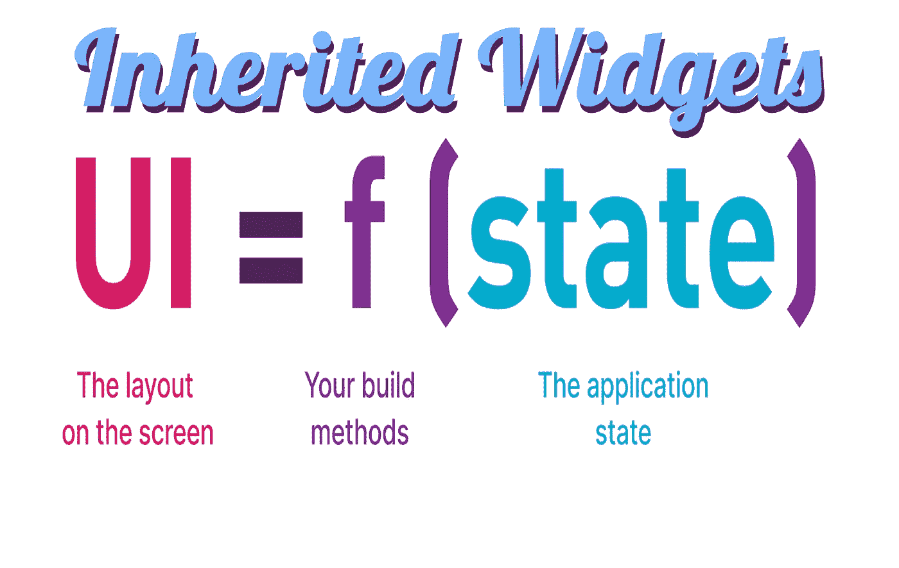

# 开始状态，继承的小部件

> 原文：<https://itnext.io/beginning-state-inherited-widgets-d4dab36211e6?source=collection_archive---------3----------------------->



超过一半的 Flutter 状态管理解决方案是基于继承的小部件的。让我展示继承的小部件状态管理解决方案的基础。

# **背景**

**问题是，你对旋舞没有那样新的了解。背景来自于 Flutter 团队从州内和架构开始的工作，以及他们随后发展到州内和架构的工作。因此，我正在构建我的状态和架构示例来阐明这种背景。作为一名前 android 原生 java 和原生 kotlin 开发人员，我知道我必须向您展示这一背景。**

我用不同的方式展示事物。ddi flutter repo 中完善的东西有一个完整的样板库，包括测试、应用程序异常捕获、日志记录、完整的基本开发操作以获得代码质量反馈，以及 flutter 平台小部件插件的基本应用，实现完整的跨平台 Flutter 应用程序的方法。回购位于:

[https://github.com/fredgrott/ddi_flutter](https://github.com/fredgrott/ddi_flutter)

如果你按照我给你展示的全部内容去做，你将会掌握颤振和飞镖。而且，混合在其中的是一种先进的方法，以先进的跨平台方式来做 Flutter UIs。

这个例子在

```
**arc=>state=>small-app**
```

子文件夹。

# **启动用例**

**我将通过重复使用基本的颤振计数器应用程序来展示这一点。用例，域实体，是这个接口:**

**您可以使用 Mixin 或抽象类，因为这两个构造在 Dart 和 Flutter 中都是接口。此外，我们利用这一点来确保在大型 Flutter 应用程序项目中，应用程序团队和测试团队在理解应用程序的行为时保持一致。**

这些接口通过确保测试团队在他们的模拟中对应用组件的行为实现相同的属性和方法来做到这一点，以便他们测试应用的实际行为。

现在我们有了实体的用例，我们可以实现模型了。

# **型号**

**计数器型号为:**

**我在这方面的创新是使用我的单例记录器来记录计数器模型的变化。当然，我们可以通过使用 OOP 命令模式来进一步形式化，然后将日志记录作为命令流过应用程序的一部分来实现。**

所有小部件依赖注入方案都使用 provider 这个词。提供商只是意味着我们提供的视图模型将被注入到应用程序屏幕的窗口小部件树中。现在让我向您展示柜台提供商。

# **柜台提供商**

这是一个基本计数器提供程序:

我扩展了继承的小部件，然后必须覆盖 updateShouldNotify 来设置它返回旧的小部件。现在，这是一个简单的小部件 DI，没有提供商的花哨东西。这意味着它不会被复制到应用程序的所有屏幕上，就像我们对提供商所做的那样。

现在，让我向你展示它是如何被注射的。

# **注射它**

**我是这样注射的:**

这就是它如何被插入 myapp 的。现在让我在主页上展示一下我们是如何抓取的。

# **我的主页**

这是我的主页状态:

**基本上，这只是建立对提供者的引用，然后在正确的位置调用 myCounter increment 方法。注意到处添加的小部件键。这将在测试方面派上用场。**

# **测试**

**下面是我如何使用 mocktail 来模拟测试计数器:**

**我们从未测试过具体的实现！您通过 mock 获取用户案例的接口，然后实现属性和方法来匹配模型行为。然后，您存根模拟并验证交互，然后验证视图模型与 UI 和应用程序用户的交互。**

测试样板是标准的小部件测试设置，包括 goldens 以及使用 mocktail 而不是 mockito，因为与 mock tail 相比，使用具有空安全性的 mockito 是一种痛苦。

# **结论**

这是使用继承的小部件将视图模型依赖注入小部件的基础。

# **关于我，弗雷德·格罗特**

我是一个改过自新的 Android、Java、Kotlin 和前端开发人员。我是一个改过自新的多动症患者，编码和设计牛仔。

我贡献的 Flutter 插件有:

颤振平台部件

[https://pub.dev/packages/flutter_platform_widgets](https://pub.dev/packages/flutter_platform_widgets)

捕手

[https://pub.dev/packages/catcher](https://pub.dev/packages/catcher)

一些有用的指南是:

选择颤振状态管理解决方案[https://medium . com/p/choosing-A-Flutter-State-Management-Solution-cccf 1 B2 AC F10](https://medium.com/p/choosing-a-flutter-state-management-solution-cccf1b2acf10)

我如何学会信任我的多动症

[https://medium . com/p/how-I-learn-to-trust-my-ADHD-DBF 4f 80518 cc](https://medium.com/p/how-i-learned-to-trust-my-adhd-dbf4f80518cc)

颤振完美设置

[https://medium.com/codex/flutter-perfect-setup-c5462b412f78](https://medium.com/codex/flutter-perfect-setup-c5462b412f78)

颤振专家 IDE 设置

[https://medium . com/geek culture/flutter-expert-ide-set-up-25791 ce 690 c](https://medium.com/geekculture/flutter-expert-ide-set-up-25791ce690c)

全局 Dart 文件是反模式

[https://medium . com/p/globals-dart-file-is-an-anti pattern-92975320 e30c](https://medium.com/p/globals-dart-file-is-an-antipattern-92975320e30c)

在 Flutter 中的函数式编程，用沙箱保护你的函数

[https://medium . com/p/functional-programming-in-flutter-sandbox-your-functions-ee 679d 3 db 7d 5](https://medium.com/p/functional-programming-in-flutter-sandbox-your-functions-ee679d3db7d5)

颤振应用的专家捕捉器设置

[https://medium . com/p/expert-catcher-setup-for-flutter-apps-a9ee 3a 6a 9 e 08](https://medium.com/p/expert-catcher-setup-for-flutter-apps-a9ee3a6a9e08)

我是在大学期间开始写 Flutter Dev 系列丛书的疯子。不仅如此，我还通过中等文章写作有机地创建了我的 Flutter 开发者书籍章节。

更正式的“即将出版”代码位于:

[https://github.com/fredgrott/ddi_flutter](https://github.com/fredgrott/ddi_flutter)

我的写作方法有些不同。一起掌握旋舞和飞镖的唯一方法就是做不舒服的工作。也就是说，每周我都要掌握新的日常事物，拓展我的思维模式工具集。

了解状态管理意味着我必须用完全裸的基准来构建状态管理演示，然后用所有样板文件来构建它们，包括 Flutter 平台小部件和完整测试。

对于 UI 本身，这意味着为顶级应用程序中的 col 屏幕布局案例建立一个完整的 UI 解决方案目录。这意味着为模型工具生成图形化的分层屏幕。

在 CS-wise 级别上，这意味着成为 reactive 方面的专家，包括高级库。这与状态管理相互交叉，因为特定的反应方法在语句管理中起作用。

如果你和我一起建造我所说的东西，在建造完所有这些东西之后，你将会是一个颤振专家。