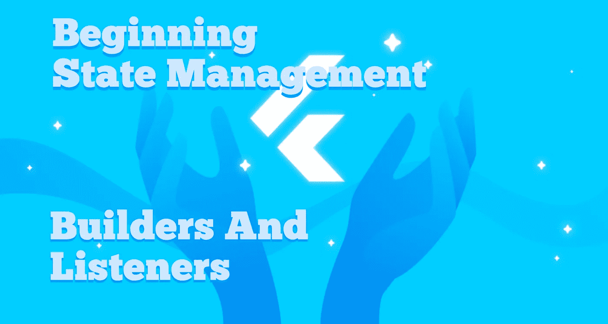

# 开始状态管理、构建器和监听器

> 原文：<https://itnext.io/beginning-state-management-builders-and-listeners-c5db6ba6b653?source=collection_archive---------2----------------------->

有两个小模式可以用来开始管理状态和开始控制所有 UI 小部件的任务。我将向你们展示这两种方法。第一个，在本文中，是同步的；它是构建者和收听者的结合。

在第二篇文章中，我将介绍涉及流和侦听器的反应式异步。这两种方法都非常适合小型模型，这正是开始构建小型 flutter 应用程序以掌握所有 UI 小部件的确切用例。

# **背景**

**让我来说明我所说的开始国家管理是什么意思。我们从这里开始，业务逻辑和行为在用户界面中是正确的:**

[我的主页，默认的 Flutter App]

通过观察状态-有状态小部件组合中的 increment 函数内的 set state 方法，您可以看到这一点。状态管理的第一部分，也就是开始，是从 UI 小部件中提取 setState 内容。因此，昵称提升状态。

我借用和修改的代码和模式是 Crizant Lai 的，来自更改通知生成器插件。让我们来看看这个构建器和监听器模式是如何工作的。

# **构建者和收听者**

**第一，而其他听者都有以听者命名的建设者；ChangeNotifier 构建器实际上被命名为动画小部件。基本上，动画部件将与更改通知器的更改同步。当我们有多个模型时，我们需要使用定制的有状态的和状态的组合作为构建器。**

因此，我们的构建器和监听器解决方案有两个部分，下面是修改后的代码:

**我们需要记住的是，它在某些领域仍然有些不成熟。例如，在我们的模型中，我们仍然必须手动设置日志状态，以便进行调试:**

**然后在 UI 屏幕中挂钩到计数器模型是:**

**注意，就模型的业务逻辑和行为而言，我们在 UI 中不再有 setState。**

# **结论**

**这不仅是学习整个 Flutter UI-widget 目录时使用的一个小的状态管理解决方案，它也是一个必须快速原型化应用程序的不错的解决方案。你不会在原型应用程序中长期保留状态解决方案，它的用途是节省获取应用程序和运行的时间，以便利益相关者使用应用程序。**

接下来，是流和监听器状态解决方案模式。

# 关于我，弗雷德·格罗特

我是一个改过自新的 Android、Java、Kotlin 和前端开发人员；一个改过自新的多动症患者，设计师和制造者。

我贡献了几个社区 Flutter 插件，包括:

颤振平台部件

[https://pub.dev/packages/flutter_platform_widgets](https://pub.dev/packages/flutter_platform_widgets)

捕手

https://pub.dev/packages/catcher

我的一些有用的文章和指南:

深入状态

[https://medium . com/geek culture/deep-dive-into-state-34b 443 da 3573](https://medium.com/geekculture/deep-dive-into-state-34b443da3573)

选择颤振状态管理解决方案[https://medium . com/p/choosing-A-Flutter-State-Management-Solution-cccf 1 B2 AC F10](https://medium.com/p/choosing-a-flutter-state-management-solution-cccf1b2acf10)

我如何学会信任我的多动症

[https://medium . com/p/how-I-learn-to-trust-my-ADHD-DBF 4f 80518 cc](https://medium.com/p/how-i-learned-to-trust-my-adhd-dbf4f80518cc)

颤振完美设置

[https://medium.com/codex/flutter-perfect-setup-c5462b412f78](https://medium.com/codex/flutter-perfect-setup-c5462b412f78)

颤振专家 IDE 设置

[https://medium . com/geek culture/flutter-expert-ide-set-up-25791 ce 690 c](https://medium.com/geekculture/flutter-expert-ide-set-up-25791ce690c)

全局 Dart 文件是反模式

[https://medium . com/p/globals-dart-file-is-an-anti pattern-92975320 e30c](https://medium.com/p/globals-dart-file-is-an-antipattern-92975320e30c)

在 Flutter 中的函数式编程，用沙箱保护你的函数

[https://medium . com/p/functional-programming-in-flutter-sandbox-your-functions-ee 679d 3 db 7d 5](https://medium.com/p/functional-programming-in-flutter-sandbox-your-functions-ee679d3db7d5)

颤振应用的专家捕捉器设置

[https://medium . com/p/expert-catcher-setup-for-flutter-apps-a9ee 3a 6a 9 e 08](https://medium.com/p/expert-catcher-setup-for-flutter-apps-a9ee3a6a9e08)

我正在为图书开发和设计系列构建 Flutter 应用程序代码，网址为:

[https://github.com/fredgrott/ddi_flutter](https://github.com/fredgrott/ddi_flutter)

关注我的一些地方:

[https://keybase.io/fredgrott](https://keybase.io/fredgrott)

[https://twitter.com/fredgrott](https://twitter.com/fredgrott)

[https://github.com/fredgrott](https://github.com/fredgrott)

[https://www.xing.com/profile/Fred_Grott/cv](https://www.xing.com/profile/Fred_Grott/cv)

[https://www . LinkedIn . com/in/fredgrottstartupfluttermobileappdesigner/](https://www.linkedin.com/in/fredgrottstartupfluttermobileappdesigner/)

为生活制造和创造…