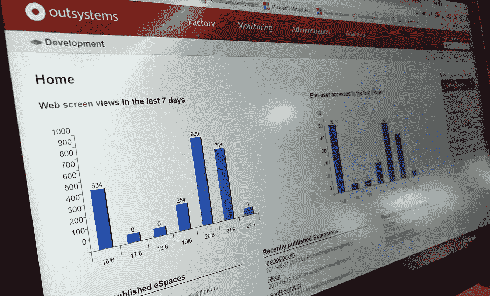
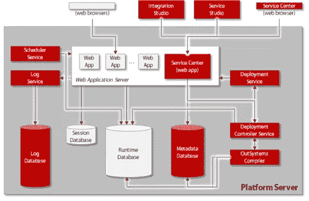
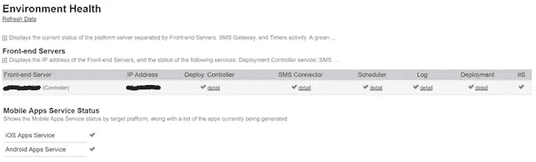
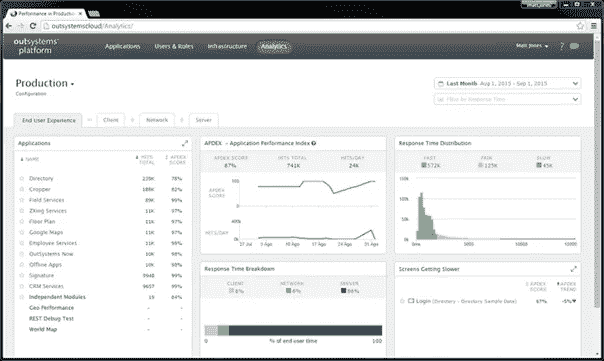

# 外部系统管理:有用或必要？

> 原文：<https://itnext.io/beheer-outsystems-nuttig-of-noodzakelijk-e92d8347a90f?source=collection_archive---------4----------------------->

开发平台的外包系统越来越多。该平台提供了在短时间内[创建和生产业务应用程序](/de-toegevoegde-waarde-van-rapid-application-development-platformen-binnen-organisaties-aa81f9816cbb)的功能。除了能够快速创建移动设备应用程序外，它还能够使用当今技术快速释放“旧”数据源。这些开发尤其是应用程序开发。这通常会降低对环境的管理。本文说明了是否需要管理 OS 平台。

该开发平台在现有基础架构的顶部作为层运行。这些服务器可以在自己的数据中心中运行，也可以在 Azure 和 AWS 等虚拟环境中运行。为. Net 或 Java 生成的应用程序。. Net 平台的基础是 IIS 的 windows，Java 可从 RedHat、CentOS 或 Oracle Linux(使用 Wildfly 或 WebLogic)中进行选择。该平台使用最常用的 SQL 和 Oracle 数据库服务器。

除了管理基础架构之外，还需要管理平台。现在，这种管理经常发生在海洋和船只之间。基础架构管理员将平台视为应用程序，而应用程序开发人员将它视为基础架构管理员的任务。这两组人都错了。但你必须采取必要的步骤。否则，环境将缓慢但肯定地充满，并最终导致应用程序变慢或出现错误。

外包平台管理分为以下几个部分:

*   在服务中心监控各种日志和环境运行状况
*   将应用程式分散到不同的应用程式集区
*   跟踪和删除旧应用程序(版本)
*   跟踪 analytics(生命周期)

管理这四个案例如何提供更稳定的平台？然后，您可以:

# **在服务中心进行检查**

服务中心的“监控”选项卡显示平台的整体状态。

您可以找到(视版本而定)的记录，包括:

*   【T4 级警报】T5 级警报系统或应用程序中出现的错误
*   **将军**系统中发生的常见问题，包括丢弃的问题和较慢的查询
*   **集成**的实现调用所有入站和出站 API
*   **移动应用程序**所有进出手机应用程序的流量
*   **环境卫生**提供平台主要功能的状态
*   **安全**指示发生了哪些安全问题。

所有的记录都是由开发人员自己来决定记录内容的方式。创建代码时，可以指定错误或信号。此处通常不会偏离指示系统本身的标准。通过仔细查看这些信息，可以防止大量的消息泄漏。瞰ㄛ蜡褫眕辇蚚苏表狟蚚腔“肾翘”髡夔懂怅隐茼蚚最唗﹝。

*环境卫生*中显示如下内容:

您可以看到平台上最重要的服务的状态。若服务发生任何问题，请以`!`或`X`表示。单击“详细信息”将显示一个详细信息屏幕，其中显示了有关该情况的更多信息。

应用这些动作的好处包括:

*   你很快就能看到周围的环境。
*   对信号采取行动可以避免严重的问题。

# 将应用程式分散到不同的应用程式集区

只有 1 个应用程序池是标准平台安装:外部系统应用程序。安装指南建议为服务中心和生命周期创建单独的应用程序池。所有其他的应用程式都会自动安装在外部系统应用程式中。因此，如果某个应用程序因任何原因导致池冻结或回收所有应用程序，则会发生这种情况。

这也适用于在应用程式中使用计时器(位元组机制)；如果计时器对池容量要求过高，则可能导致其它应用程序超时。将多个应用程序划分为多个池不会导致一个应用程序出现故障。因此，该问题最多可隔离 1 个或有限的应用程序。

应用多个应用程序池的好处包括:

*   应用程序之间的负载更少。
*   环境更稳定了。

## **跟踪和删除旧应用程序(版本)**

该平台提供了一种快速测试的方法。这可能会导致各种不再使用的应用程式(不再使用)激增。由于概览和所用的空间，建议您定期浏览应用程序，并重新整理任何创建为测试的内容。

此外，开发人员的任何自定义都会导致存储在数据库中的软件的新版本。如此一来，您可以快速还原已套用的变更。版本数量可能会降低作业系统资料库的速度。清除旧版本会重新整理资料库，让您的工作更顺畅。

定期清理的好处是

*   **开发人员环境的性能将保持良好**
*   **已使用的应用程序概述**

# ****跟踪应用分析(寿命)****

**在生命周期中，有机会对应用程序进行更深入的分析。显示每个应用程序的应用程序性能指数(APDEX)分数。此外，还可以查看显示请求所需的时间如何划分为客户端、网络和服务器时间。放大可以看到应用程序的哪些部分只是得分。这样，开发人员就可以专注于工作以提高组件的性能。当然，该工具也可用于验证客户体验。**

****

**随着时间的推移，性能会随着时间的推移而下降或提高。例如，效能变更可与发生的变更相关联。**

**根据上述步骤，环境将保持整洁，并保持性能的控制。当然，随着环境的持续增长，可能需要对服务器进行更改。**

**使用 Analytics 的好处包括:**

*   **了解性能较低的应用程序。**
*   **了解应用程序的哪一部分降低了性能。**

**以上各点说明了设置和跟踪 OS 平台管理是必不可少的。它为最终用户和开发人员提供了一个更稳定的环境。这样可以更好地利用平台，并使(最终)用户满意。**

**刚开始安装外接平台并不足以确保平台稳定运行。然后维护平台也是必要的。否则，它会慢慢地关闭，并且会慢慢地产生问题，最终导致整个平台崩溃。**