# 贝拉·路高西的线

> 原文：<https://itnext.io/bela-lugosis-thread-c3e8d1a5090e?source=collection_archive---------5----------------------->

## 或者为什么上下文是 golang 中的吸血鬼

*(本博客由 https://creativecommons.org/licenses/by/4.0/*[授权，](https://creativecommons.org/licenses/by/4.0/)*所有代码由 https://www.apache.org/licenses/LICENSE-2.0***授权)**

**

## *介绍*

*继续我上一篇关于 actor 模式的文章，深入了解该实现的一个侧面细节是很重要的。在这两个解决方案中，我都利用了 go 上下文。这个在 2014 年引入的对象是处理 goroutine 取消和请求处理程序协调的惯用方法。参见([https://blog.golang.org/context](https://blog.golang.org/context))。*

*考虑以下代码:*

*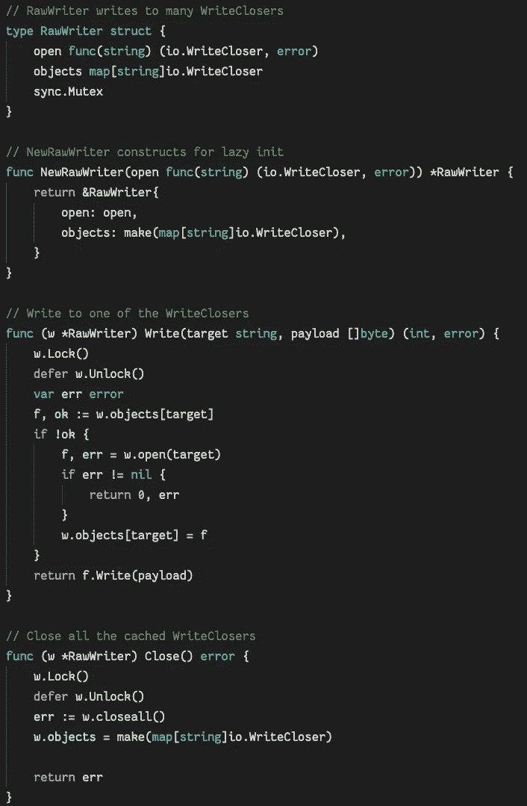*

*最直接的解决方案*

*这种抽象将延迟加载 io。write closes 具有提供的 open 函数，允许线程写入。到目前为止，没有使用上下文，互斥体提供同步。现在考虑这段代码被用在必须在截止日期内处理数据的代码中。*

*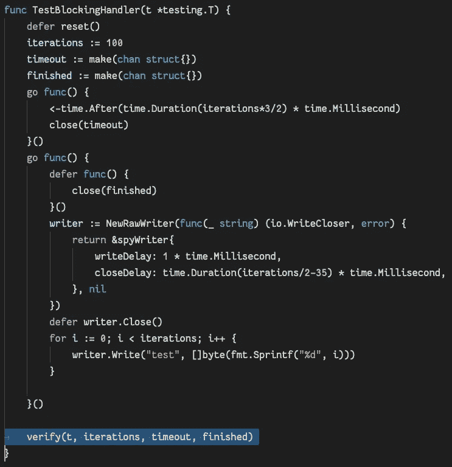*

*应该没问题*

**verify()* 函数看起来是这样的，并在整个示例中使用:*

*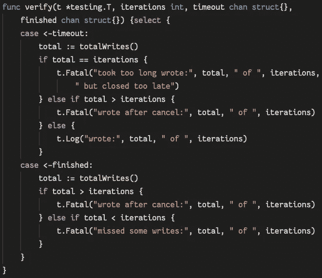*

*剧透:完工街区的条件在以后变得很重要*

*我们有一个测试编写器，它以某种方式计算对 *Write* 的调用次数，并为 Write 和 Close 提供可调延迟。我们设置的最后期限是 1.5 *次迭代(以毫秒为单位)，每次写入花费 1 毫秒，关闭花费不到一半的迭代(以毫秒为单位)(想象正在发生刷新)。我们运行测试，一切都通过了:*

**

*工作一次并被缓存，就像任何好的测试一样*

*一切正常，所以我签入我的代码。几天后，我所有的同事都开始抱怨单元测试管道失败，说我的测试不可靠。为了找出我的测试出了什么问题，我试着以 50 为计数运行，并发现了以下情况:*

*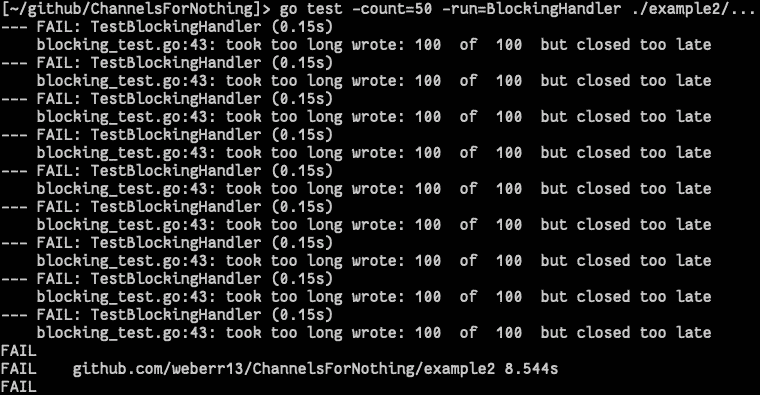*

*签入这样做的代码会减少您的实际寿命*

*9/50 的测试运行失败。它们不仅会失败，而且会在写入之后、关闭方法理论上将数据同步到磁盘之前失败。*

## *古怪的测试还是古怪的代码？*

*怎么会这样呢？测试似乎“大部分时间”都能通过。有两个因素在起作用:*

1.  *调度程序不保证 goroutines 按照代码中的顺序运行。*
2.  *延迟按堆栈顺序运行，因此*关闭*功能在测试结束前运行。*

*一种选择是放宽最后期限，但我可以想象 15%的缓冲是我所能期待的极限。我必须 *Close()* 否则我可能会丢失所有数据，但最后一次写入可能会在下一个时间间隔重试。为了解决这个问题，我首先向我的 API 引入一个上下文。*

*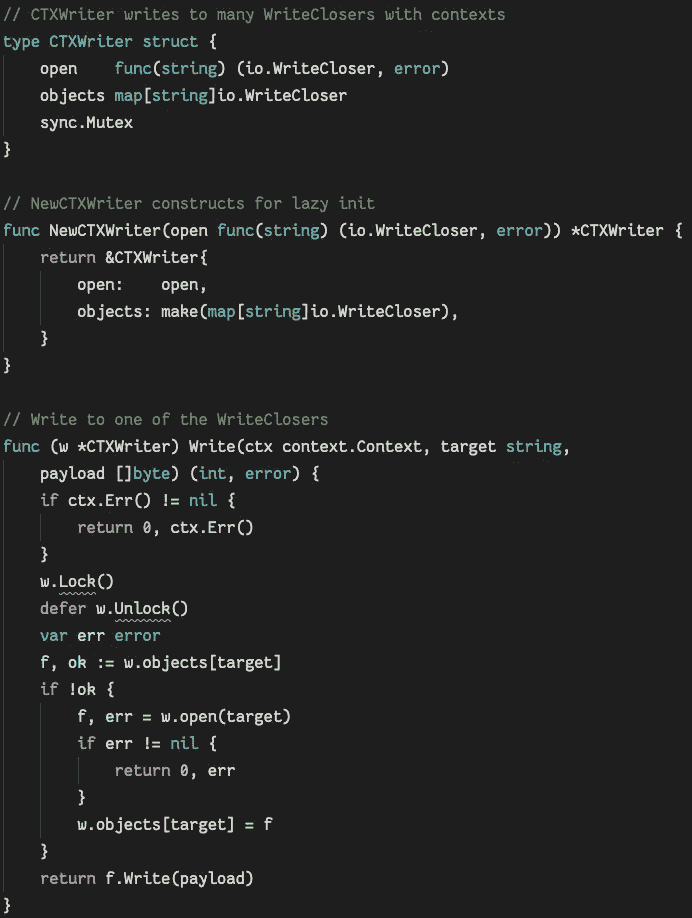*

*我的 IDE 不理解嵌入式结构*

**Close* 方法没有改变，所以即使上下文过期，我们写的所有东西都会被刷新到磁盘。为了模拟这种情况，我引入了一个“最坏情况”的上下文，它将给予 *Close()* 方法足够长的时间来刷新，即使一些写操作会失败:*

*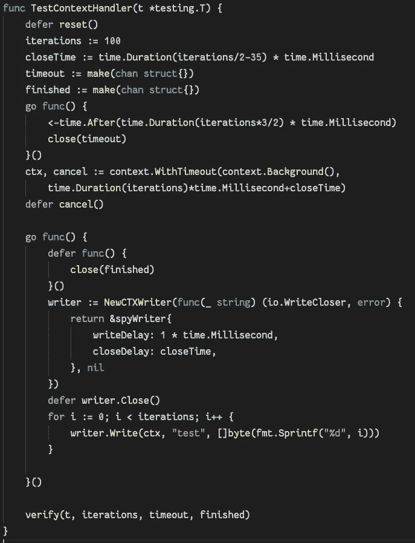*

*写操作会立即取消，对吗？*

*测试失败了，而且现在看起来更糟。不再有迟到的*结束*电话，但是我们经常不能把所有事情都写下来。*

*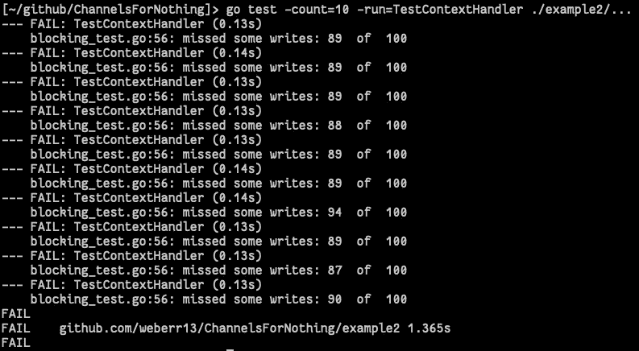*

*比晚冲水好？*

*尽管时间应该允许我们完成所有写入，但仍有 10%的数据丢失。面对这一现实，我们希望为写入引入更多的 goroutines，以保证尽可能多的写入操作得以完成。*

## *穿线很容易(也很天真)*

*修改后的主循环是一个标准的 fork/join 模式，我也决定尝试一下并收紧时间。如果每次写入都是并行的，那么最坏的情况应该是上下文截止时间:*

*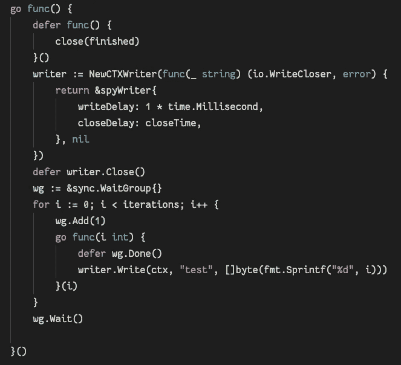*

*啊，就像以前一样*

*因为这是显式线程化的，所以测试运行时使用了竞争检测器来检查我们的工作，我们得到了以下奇怪的结果:*

**

*我能因为额外的写作得到额外的学分吗？*

*我们对性能进行了如此大的改进，以至于在某些情况下，我们传递的信息超出了预期。种族探测器显示没有种族存在，但我们显然没有得到额外的学分。我们可以容忍写入丢失，但这种溢出是值得关注的。*

*这一问题的原因是由埃德格·迪克斯特拉在 1965 年提出的“沉睡的理发师问题”。引用[https://en.wikipedia.org/wiki/Sleeping_barber_problem](https://en.wikipedia.org/wiki/Sleeping_barber_problem)*

> *这个类比是基于一个假设的理发店，只有一个理发师。理发师在理发室有一把理发椅，在等候室里有许多椅子。当理发师剪完一个顾客的头发后，他把顾客打发走，然后去等候室看看是否还有其他人在等着。如果有的话，他会把其中一个带到椅子上，给他们剪头发。如果没有，他就回到椅子上，睡在里面。*
> 
> *每位顾客到达时，都想看看理发师在做什么。如果理发师在睡觉，顾客叫醒他，然后坐在理发室的椅子上。如果理发师在理发，顾客就呆在等候室。如果候诊室里有一把空椅子，顾客就坐在上面等待轮到他们。如果没有空椅子，顾客就会离开。*

*在这种情况下,“客户”就是上下文。虽然这种天真的方法看似可行，但存在一个关键问题。调度器在每次上下文切换时引入不确定的等待周期。这里有一个这样的开关:*

*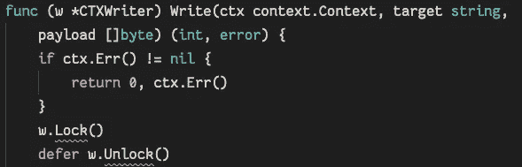*

*每次调用锁或与通道交互都会创建上下文切换，但这不是必须的*

*在*锁定*。执行*写*的线程可以在检查上下文和获取*锁*之间等待无限长的时间。由于这个原因，一个写入器可以写入到 *io。在上下文关闭后很久，write closer*；这是在重复测试中观察到的。显然，这种并行性的尝试并没有像预期的那样工作。*

*我能想象你在问自己:吸血鬼在哪里？理发师和顾客都不是夜间的动物。*

## *从不同的角度思考语境*

*把上面的错误放在一边，让我们看看 golang 中上下文的特征:*

*   *所有上下文都来自后台()。*
*   *所有上下文都是线程安全的。*
*   *Background()永远不会消失，但是从 Background()创建的上下文有一个生命周期(取消、超时、截止日期)。*
*   *新上下文可以来自其他上下文，它们继承父生命周期以及自己的生命周期。*
*   *当父母去世时，所有的孩子/孙子/后代都会死去。*
*   *孩子可能会死，但对父母没有任何影响。*
*   *子上下文从父上下文继承值。*
*   *一旦你的产品中有了上下文，它们就会迅速传播开来。*

*这里是吸血鬼类比的开始。有一个“不可杀死的”上下文叫做*背景*，所有其他上下文都从它们那里获得力量。*背景*没有价值，没有期限，但却是层级的根，不可知但不可杀死。随着上下文的创建，它们已经设置了生存期。孩子的死亡对父母(或祖父母)没有影响。然而，父母(或祖父母)的死亡会结束所有的后代。*

*当它们被视为管理线程生存期的工具时，这一切都是有意义的。如果线程的生命可以与上下文的生命联系在一起，那么我们就可以精确地控制线程的层次结构。但是它们为什么会传播呢？为此，我们回到例子。*

## *习惯性地使用上下文*

*在我们的第一次尝试中，我们将对我们的界面做一些小的改动:*

*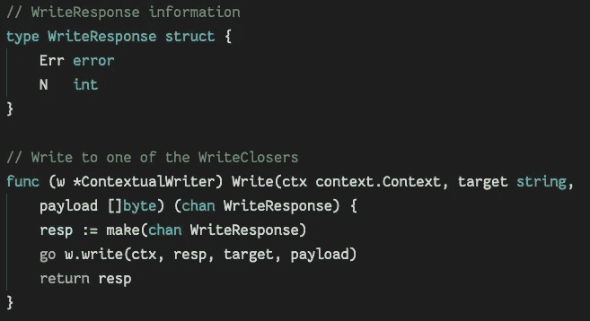*

*结果可以被延迟，它们在返回信道上被传送*

*新函数有一个 goroutine 来处理 IO(锁现在在私有成员函数内部),这个例程看起来非常不同:*

*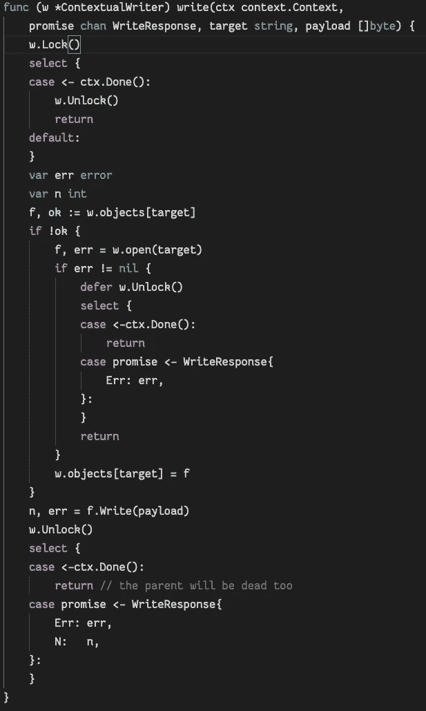*

*ctx。Err()仅在我们知道上下文已经完成()时使用*

*注意，对上下文的检查是通过“done”完成的，并且是在临界区(不再是整个函数)内完成的。通过在获得锁之后检查，理发师可以睡得更安稳一点。 *ctx* 也在测试代码中扩散:*

**

*这就够了吗？*

*结果呢？异步写入程序是否修复了“丢失的时间”,同时防止在取消后发生写入？*

*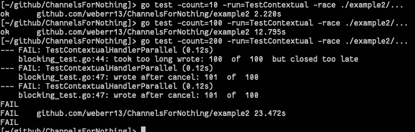*

*总是推动你的测试直到它们崩溃*

*我们肯定离解决方案更近了。早期的方法在 10 或 50 次尝试后都失败了，但是 200 次尝试还是不够的。应该可以连续运行几个小时而不出错。*

## *背景和行为者*

*像我以前的工作一样，我们转向 actor 模式来减少线程和上下文切换，以努力获得目标性能。在这里，潜在的“吸血鬼”性质的背景正在显示。上下文并不直接存储在对象中(这是不好的)，但是现在甚至构造函数也接受上下文。*

*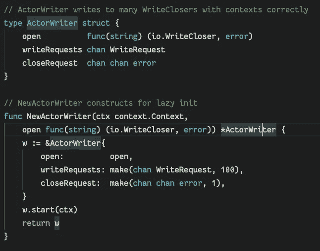*

*一点也不像原作*

*请求现在是成熟的承诺，因此 *Then()* 函数也可以接受上下文:*

*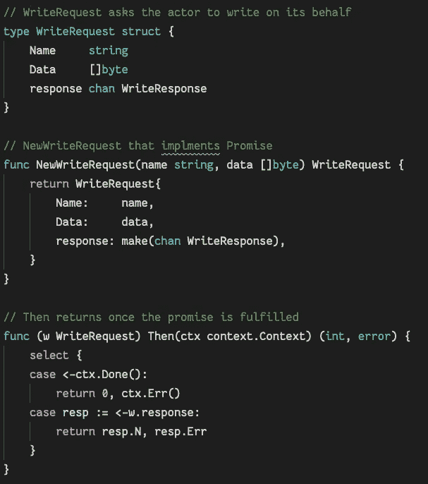*

*这个承诺没有遵循接受 lambda 函数的 javascript 模式*

**写*和*关*方法现在都接受一个上下文。私有的“closeall”函数现在已经很纯粹了(技术上来说，它甚至不需要接收器)。没有一个方法是指针接收器，因为互斥体也消失了:*

*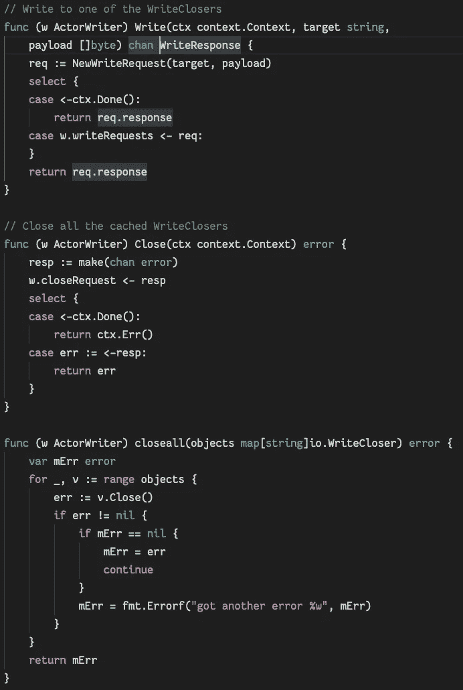*

*拿一个背景来说，所有酷的孩子都在这么做*

*最后，actor 的私有资源和主循环在 *start* 中:*

*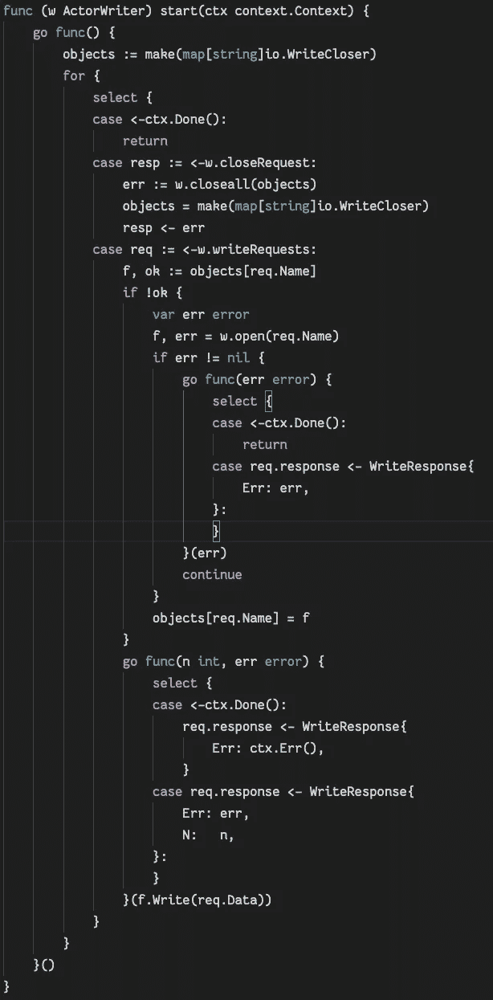*

*对象映射不再是编写器的成员，而是存在于堆栈中*

*演员确实有缺点。演员有更多的“启动成本”。在测试场景中，这可能会被放大。单例模式可以用于许多这样的解决方案(特别是*context writer*)，它是最适合参与者的模式。一旦参与者处于全局状态，就可以向其写入数据并关闭资源，而无需担心消费者之间的竞争和引入瓶颈。虽然这个实现没有演示下一个级别，即每个命名资源都被隔离到它们自己的 goroutines 中，但是上一篇文章已经对此进行了更详细的介绍。因此，非单例解决方案不如*context writer*(后者的启动成本低得多):*

*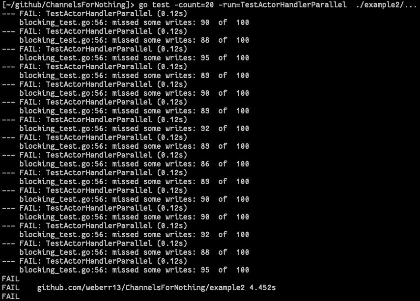*

*为什么又要麻烦演员呢？*

## *“不是所有的全局变量都是单例变量，也不是所有的单例变量都是全局变量”*

*在这种情况下，采用 *ActorWriter* 的隐式 singleton，并冒险使其成为 singleton 会有所收获:*

*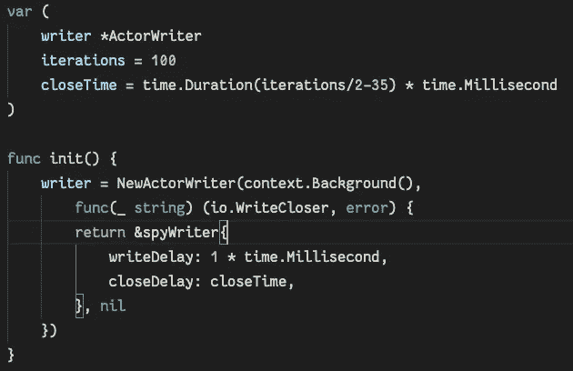*

*向我的大学数据结构老师道歉*

*有了它，我们可以运行无数次迭代，知道契约不会被破坏，我们将有效地利用资源:*

*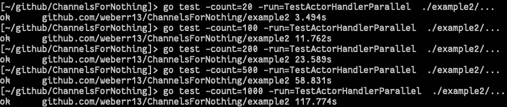*

*1000 够了吧？*

## *结论*

*虽然最初可能会觉得繁琐，但上下文——以及使用它们的模式——将成为 golang 中线程管理的关键。gRPC 等服务已经广泛使用它们。当你选择吸血鬼的时候，他们会扩散，如果当你使用的 API 已经被激活的时候，他们被忽略了，你会受到伤害。单纯依靠 *ctx。Err()* 会在没有考虑上下文的代码中引入错误。拥抱上下文，同时用 goroutine/channel 模式重构代码，将解决许多这样的问题。*

*golang 的最终目的是让线程化和线程间消息传递成为程序的核心机制，这样，随着内核数量的增加，代码的性能也会提高(通常无需重新编译)。用这些模式编写的更强、更快、更通用的程序需要一个系统来管理线程，而线程的线程和上下文就是根据这一点专门设计的。在他们的帮助下，程序员不需要关心底层库如何处理线程安全性和并行性。*

*例子都是在 Apache 2.0 许可下授权的，可以在 https://github.com/weberr13/ChannelsForNothing/的[获得](https://github.com/weberr13/ChannelsForNothing/)*