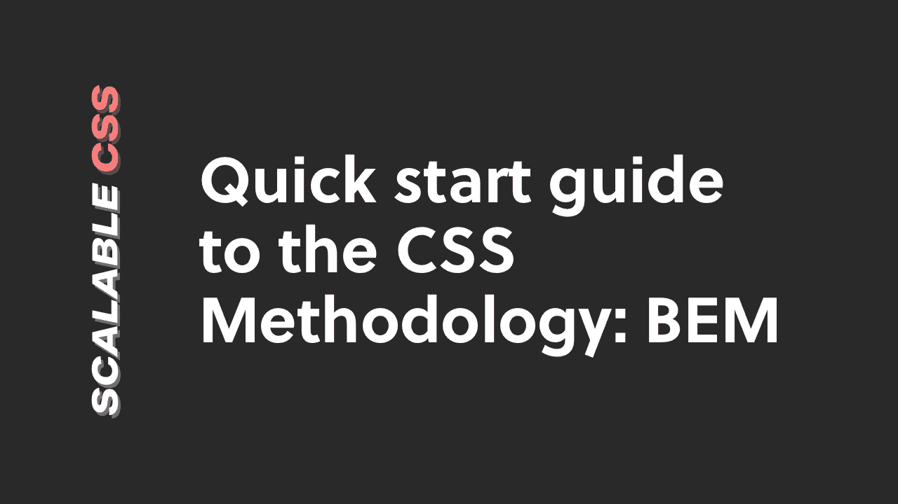

# CSS 中的边界元方法:快速入门指南

> 原文：<https://itnext.io/bem-quickstart-guide-bb53d349bea1?source=collection_archive---------4----------------------->

这是一个学习 [BEM](https://en.bem.info/methodology/) 的快速入门指南，组件驱动的 CSS 方法。

如果你想在你的项目中实践和应用边界元法，这个指南将帮助你开始。

**奖励:** [下载一份免费的备忘单](https://scalablecss.com/resource/bem-cheat-sheet/)，它将向您展示如何快速入门 BEM。

# BEM 概述

BEM (Block-Element-Modifier)是一个 CSS 命名约定，由 Yandex 的团队开发，用于提高 web 开发中的可伸缩性和可维护性。

简而言之，BEM 的思想是通过用下面的方法命名 CSS 类来“将用户界面分成独立的块”:

1.**块:**可重用的独立组件(如类名`.nav`)

2.**元素:**一个块中不能与该块分开使用的子元素(例如，类名为`.nav__item`)

3.**修饰符:**块或修饰符的风格变化(例如，用类名`.nav — dark`)

让我们深入一些真实的 CSS 例子来掌握这一点。

# 阻碍

块是可重用的组件。如按钮、卡片或表单域。

给你的模块命名时，重点描述它的用途(即它是什么)而不是它的状态(即它看起来像什么)。

例如，`.btn`或`.nav`遵循块的正确命名惯例。

`.big`或`.bright-pink`描述了它的外观，所以当你以后想改变设计的时候，它不能很好地缩放。

如果你想知道如何在块中放置块(例如，导航中的按钮)，这里有一篇短文可以帮助你。

# 元素

内部块是元素存在的地方。元素依赖于它们的父块，因此没有它们就不能使用。

元素还有一个独特的 CSS 类命名约定，其工作方式如下:

`.block__element`

例如，使用`.card`组件，卡组件中的元素(比如图像)将具有类似`.card__img`的类名。

元素名总是附加在块名后面，由双下划线`__`分隔。

注意第一个代码片段是如何使用不止一个选择器来定位样式的(例如`.card img {}`)。

使用 BEM 元素类并直接使用它(例如`.card__img {}`)被认为是最佳实践，因为它具有较低的特异性。

遵循这种方法减少了[级联问题](https://www.smashingmagazine.com/2016/06/battling-bem-extended-edition-common-problems-and-how-to-avoid-them/)的几率。

# 修饰语

当您在块(或元素)中有不同的样式时，这就是修改器的用武之地。

例如，你的“卡”块可能有一个明亮和黑暗的版本。或者你可能有主要和次要按钮。

修饰符有一个独特的 CSS 命名约定，其工作方式如下:

`block — modifier`或`block__element — modifier`。

没错——BEM 修改器可以应用于块和元素。

让我们深入了解一些好的和不好的做法:

孤立地使用修饰符类(即没有块或元素类)被认为是不好的做法。

这是因为修改器的目的是给块添加增量样式更改。

因此，无论何时使用修饰符，都要确保它与基类一起使用:

就是这样！

这些是让您开始使用 BEM 的基础。

如果你有兴趣了解更多关于 BEM 背后的“为什么”,我推荐你看看这篇 CSS 技巧文章。

像学习任何新东西一样，练习是关键。在你的下一个项目中给 BEM 一个机会，看看它会把你带到哪里！

# 下载免费的 BEM 备忘单

想开始练习 BEM 并寻找一本实用的快速行动指南吗？

[下载一份涵盖 BEM 基础知识的免费备忘单](https://scalablecss.com/resource/bem-cheat-sheet)，这样您就可以立即开始练习。