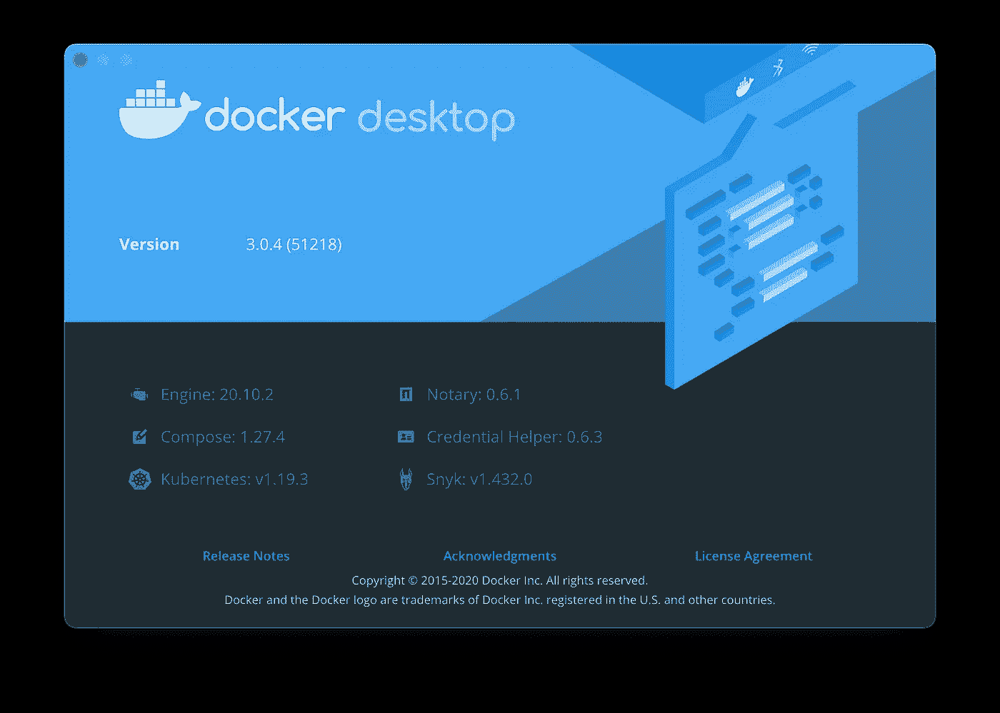
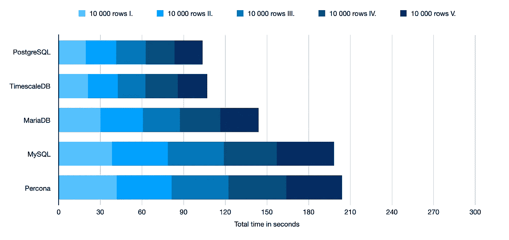
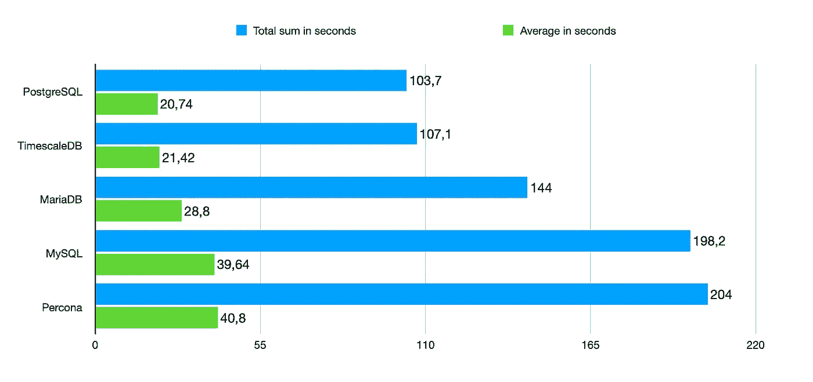
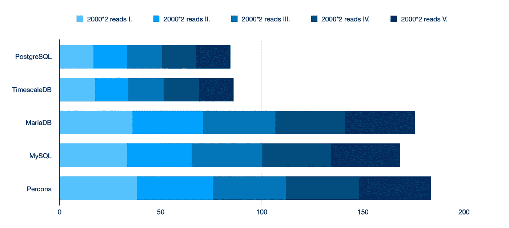
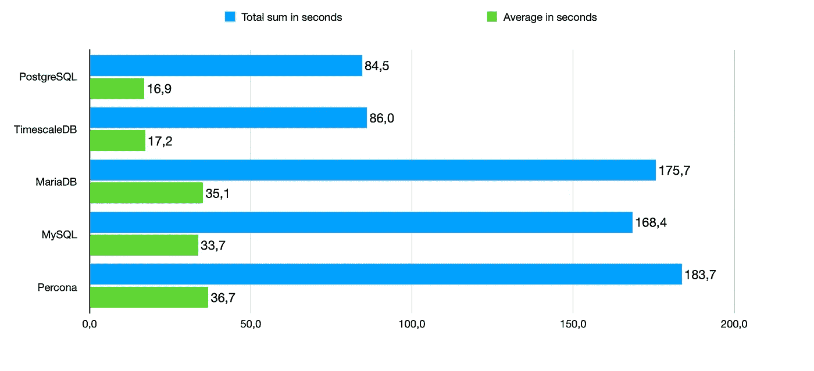

# Docker 中的基准数据库:MySQL、PostgreSQL、SQL Server

> 原文：<https://itnext.io/benchmark-databases-in-docker-mysql-postgresql-sql-server-7b129368eed7?source=collection_archive---------1----------------------->

## 加上 MariaDB、Percona 和 TimescaleDB


# 为什么要进行数据库基准测试？

我是 SQL Server 的长期用户。但是使用 SQL Server 不是我的决定。我年轻，不得不听年长的同事。如果他们说，SQL Server 是最好的，那么它就是最好的。

那时我是 MySQL 的长期用户。但使用 MySQL 并不是我的决定。我年纪较大，但我的其他同事更有经验。如果他们说，MySQL 是最好的，那么它就是最好的。

我从来没有搜索过其他观点，因为那个时候，我正在学习。我怎么能和比我更有经验的同事争论呢？

然后我找到了 MariaDB。后来我找到了珀科纳。我问我更有经验的同事:“嘿，他们是什么？为什么是他们？”。答案几乎总是这样:“MySQL 是最好的，我知道 MySQL。你想用别的东西吗？要不要砸东西？”

当然，我不想打破东西。

但是好奇心是我的第二个名字，所以我决定找出哪个数据库最适合我们的应用程序。我碰到了完美的时间，因为码头工人到达现场，所以看起来，这将很容易开始我的工作。

所以，要回答问题"**为什么要做数据库基准测试？**”就是说:“**因为它把你变成了更有经验的同事**”。

# 我是如何进行数据库基准测试的？

对数据库进行基准测试可能是一件棘手的事情。上网随便看看就知道了。有不同的基准，测量不同的东西，有时是参数，它们不会告诉你任何有意义的东西。

从我的角度来看，我认为数据库是一个名副其实的东西。一个**基**用于一个**数据**。仅此而已。所以数据库中没有应用程序逻辑。数据库应该保存数据并尽可能快地进行两个主要操作:**读**和**写**。

我认为读不会改变数据库，写会改变数据库。对我来说，删除和更新都是写的子集。

此外，当我从数据库中读取数据时，我倾向于使我的`selects`尽可能简单。我不在连接上使用连接。我喜欢尽可能快地读取多个不同的表，然后在数据库之外处理数据。但是我经常使用`max`、`avg`、`min`和`sum`。我大量使用简单的东西，尽量少用复杂的东西。

从我的角度来看，我理想的数据库应该一直平静地运行，尽可能快地提供读写服务。仅此而已。

**当我决定制定基准时，我在寻找三样东西:**

1.  哪个数据库的写入速度最快
2.  哪个数据库的读取速度最快
3.  哪个数据库的内存和 CPU 使用率最低

# 准备

正如我两年前在 2019 年所做的基准测试(结果切换到 PostgreSQL)，现在，也就是 2021 年，重复一次将是明智的。

首先，我们需要运行所有数据库，我们希望进行基准测试。我们可以使用本文中的命令(以及更多信息)运行 Docker 中的所有主要数据库，但是您可以在下面找到所有这些命令。

[](https://petrjahoda.medium.com/how-and-why-run-different-databases-in-docker-8b320fea6884) [## 如何以及为什么在 Docker 中运行不同的数据库

### MySQL，MariaDB，PostgreSQL，SQL Server

petrjahoda.medium.com](https://petrjahoda.medium.com/how-and-why-run-different-databases-in-docker-8b320fea6884) 

我添加了一些来自所有三大*引擎家族*的流行叉子。

**Postgres 引擎系列:** PostgreSQL，TimescaleDB

**MySQL 引擎家族:** MySQL，MariaDB，Percona

**SQL Server 引擎家族:** SQL Server

下面是运行我们需要测试的每个数据库的 Docker 命令。

## 一种数据库系统

```
docker run --name postgres -e POSTGRES_PASSWORD=password -p 5433:5432 -v postgres_data:/var/lib/postgresql/data -d postgres:alpine
```

## 时标 b

```
docker run --name timescale -e POSTGRES_PASSWORD=password -p 5434:5432 -v timescale_data:/var/lib/postgresql/data -d timescale/timescaledb:latest-pg12
```

## 关系型数据库

```
docker run --name mysql -e MYSQL_ROOT_PASSWORD=password -p 3306:3306 -v mysql_data:/var/lib/mysql -d mysql:latest
```

## MariaDB

```
docker run --name mariadb -e MYSQL_ROOT_PASSWORD=password -p 3307:3306 -v mariadb_data:/var/lib/mysql -d mariadb:latest
```

## 佩尔科纳

```
docker run --name percona -e MYSQL_ROOT_PASSWORD=password -p 3308:3306 -v percona_data:/var/lib/mysql -d percona:ps-8
```

## SQL Server

```
docker run --name sqlserver -e 'ACCEPT_EULA=Y' -e 'MSSQL_SA_PASSWORD=passw0rd.' -p 1433:1433 -v sqlserver_data:/var/opt/mssql -d mcr.microsoft.com/mssql/server:2019-latest
```

不幸的是，由于微软针对 SQL Server 2019 的 [EULA](https://go.microsoft.com/fwlink/?LinkId=746388) ,不可能展示 SQL Server 的基准测试，但我可以告诉你，这很遗憾。你必须自己做你的基准。

# 首次比较

现在，您应该已经运行了所有六个数据库。所有六个都处于默认状态。没有微调。

我们可以进行第一次比较。我们可以比较数据库映像大小、Docker 中的初始内存使用和初始 CPU 使用。


越少越好

根据这些结果，看起来 PostgreSQL 是赢家，而 SQL Server 是输家。但是我们还没有制定任何读取和/或写入基准。

# 编写基准

为了进行编写基准测试，我开发了一个简单的 Go 程序(本文末尾的 github 库)。这个程序创建了一个名为`benchmark_data`的表，有 6 列。您需要使用`create database benchmark`手动创建数据库`benchmark`。

这个程序将 10 000 行一行一行地插入到这个表中。没有批量插入，只是简单插入。

基准测试将在 Macbook Pro 2019 上进行，运行 Docker 桌面，所有不必要的应用程序都被关闭。



基准测试的第一部分将测量时间，它将花费这些插入来完成。从我的角度来看，时间相对于某些操作是唯一合理的衡量标准。最后你总是想知道，**花了**多长时间，或者**在规定时间内完成了多少**。

在这个基准测试中，我连续插入了 5 批数据，每批 10 000 行。显然，PostgreSQL 是赢家，Percona 是输家。



越少越好

让我们从总持续时间和平均持续时间两方面进行比较。

在插入的情况下，PostgreSQL 的速度大约是 Percona 的两倍。这里让我印象深刻的是 MariaDB 和 MySQL 的区别，因为它们都来自*一个引擎家族*。看来 MariaDB 背后的人施了些魔法。

**一个简单的结论:** Postgres 引擎家族比 MySQL 引擎家族快*约*倍，除了 MariaDB。



越少越好

# 读取基准

这个读取基准测试是这样完成的:2 000 个循环，每个循环中有两个读取:`data`列的`average`和`sum`。同样，每件事我都做了 5 次。

下面是结果。PostgreSQL 是赢家，Percona 是输家。MariaDB 第二差。



越少越好

比较总持续时间和平均持续时间，以便有一个更好的画面。Postgres 引擎家族的*大约是 MySQL 引擎家族的*两倍。



越少越好

# 结论

显然，这里的**赢家是 PostgreSQL** 。最小的尺寸，最小的 CPU 和内存使用，最快的写入速度和最快的读取速度。

第二名由**时标 DB** 获得。TimescaleDB 属于同一发动机系列。感谢来自[这篇 reddit 帖子](https://www.reddit.com/r/programming/comments/ksbhsm/i_benchmarked_databases_running_in_docker_using_go/)的信息，TimescaleDB 应该在更大的基于时间序列的数据上表现得更好，这不是该基准的目的。

第三名是 MariaDB，因为它的阅读速度很快。

令我惊讶的是，第四个是 MySQL，最后一个是 T21，珀科纳。

关于 **SQL Server** ，其结果没有在这里展示(见上面的解释):我不得不说，他们在微软做了一些很好的工作，因为 SQL Server 会被放在第三位。

这是我用于基准测试的一个工具的链接。

[](https://github.com/petrjahoda/medium_database_benchmark) [## petrjahoda/medium _ database _ benchmark

### 通过在 GitHub 上创建一个帐户，为 petrjahoda/medium _ database _ benchmark 开发做出贡献。

github.com](https://github.com/petrjahoda/medium_database_benchmark) 

# 2019 年和 2021 年的区别

当我两年前做这些测试时，PostgreSQL 是赢家，Percona 第二，MariaDB 第三，MySQL 第四，SQL Server 最后。我在 2019 年测试了他们的最新版本，今天我测试的当然是不同的最新版本。2019 年我没有测试 TimescaleDB。

看起来他们在珀科纳做了一些非常糟糕的工作，在码头运行。而且他们还在 PostgreSQL 做着最好的工作，运行在 Docker 中。

两年前，我们从 MySQL 转换到 PostgreSQL，看起来我们做了正确的事情——对于我们的应用程序来说。

两年前，我们在考虑(和测试)MariaDB 和 Percona。明智的决定，我们没有换成珀科纳。

# 奖金信息

你们中的一些人可能会说，一个人可以微调他/她选择的数据库，使其性能更好。你将是绝对正确的。但是请记住，您可以微调每个数据库。所以，如果你微调 MySQL 来捕捉 PostgreSQL，你肯定也能微调 PostgreSQL。

说到这个，PostgreSQL 有一个非常好的微调数据库的工具。我不知道 MySQL 家族或 SQL Server 有任何类似的工具。如果你知道，请在评论中告诉我。

 [## PGTune -根据给定的最高性能计算 PostgreSQL 的配置…

### PgTune -根据硬件调整 PostgreSQL 配置

pgtune.leopard.in.ua](https://pgtune.leopard.in.ua/#/) 

# 仅 PostgreSQL 基准测试

在阅读评论时，我做了一个额外的基准测试，这次比较了在 Docker 中运行 PostgreSQL 和在所有三个主要系统上本地运行 PostgreSQL。在 MacOS 上，使用不同的 PGTune 设置。

[](https://petrjahoda.medium.com/benchmark-postgresql-docker-versus-native-2dde6b5a8552) [## 基准 PostgreSQL: Docker 与 native

### 使用所有 PGTune 设置

petrjahoda.medium.com](https://petrjahoda.medium.com/benchmark-postgresql-docker-versus-native-2dde6b5a8552)