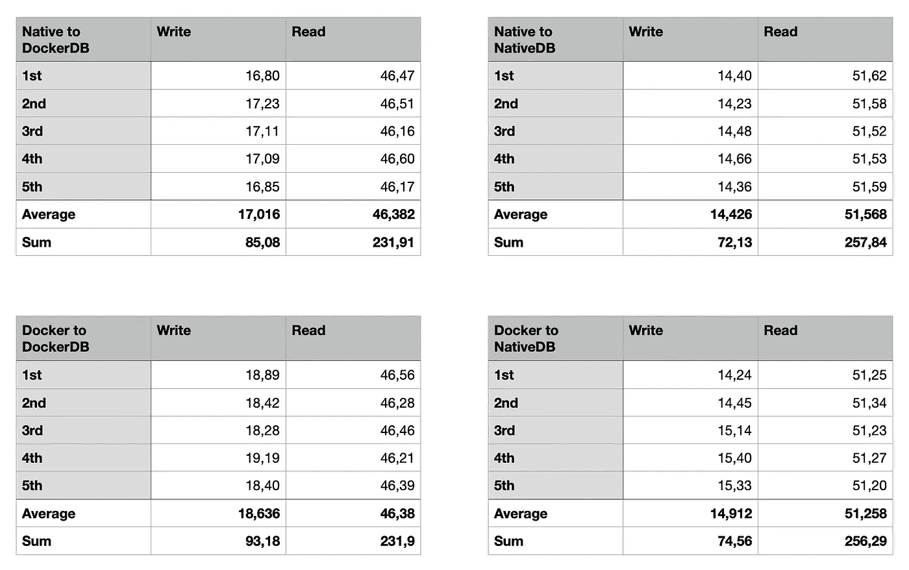
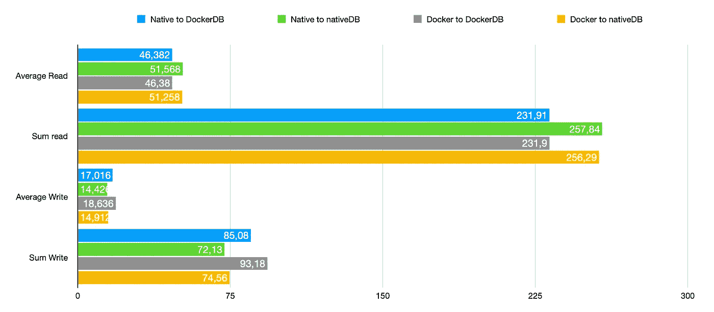
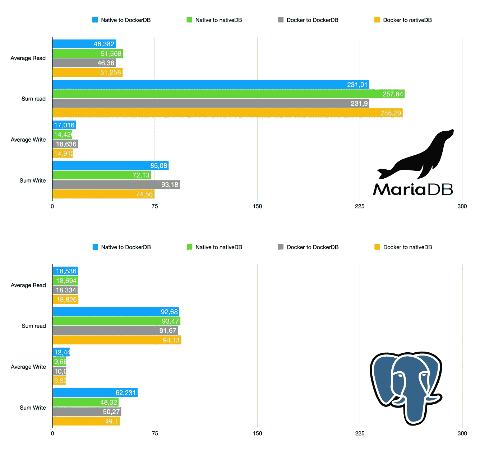

# 基准 MariaDB:本地与码头工人的交叉

> 原文：<https://itnext.io/benchmark-mariadb-cross-between-native-versus-docker-6d90967fe721?source=collection_archive---------0----------------------->

几个月前，我做了两个基准测试。第一个测试了三个数据库引擎，第二个只测试了 PostgreSQL。

您可以在下面的两个链接中找到这些基准。两篇文章都是彼得·贾霍达写的。

 [## Docker 中的基准数据库:MySQL、PostgreSQL、SQL Server

### 加上 MariaDB、Percona 和 TimescaleDB

itnext.io](/benchmark-databases-in-docker-mysql-postgresql-sql-server-7b129368eed7)  [## 在所有三个系统上测试 PostgreSQL:Docker 与 native

### 使用所有 PGTune 设置

itnext.io](/benchmark-postgresql-docker-versus-native-2dde6b5a8552) 

因为有一些关于这个基准的想法，我决定只在 PostgreSQL 上再做一个。你可以在下面链接中找到这篇文章。

 [## 基准 PostgreSQL:native 与 Docker 的交叉

### 几个月前，我做了两个基准测试。第一个测试了三个数据库引擎，第二个只测试了 PostgreSQL。

itnext.io](/benchmark-postgresql-cross-between-native-versus-docker-a96df9a45014) 

在阅读对这篇最新的 PostgreSQL 文章(和 Reddit 上)的回复时，有许多人要求对基于 MySQL 的数据库做同样的事情。因为之前的基准测试显示 MariaDB 性能稍好，所以在这个测试中使用了 MariaDB。

**我们将有四个测试:**

*   数据库本机运行，程序本机运行
*   数据库在 Docker 中运行，程序在本地运行
*   数据库运行在 Docker 中，程序运行在 Docker 中
*   数据库在本地运行，程序在 Docker 中运行

我们将使用上面文章中描述的相同技术，所以不需要在这里添加关于设置 AWS 和数据库的信息，我们可以直接查看结果。

# 输入条件

1.  使用了 AWS t2.micro linux
2.  所有数据(Docker 数据库和本地数据库)都在同一个分区上
3.  两者都使用默认的 MariaDB 设置
4.  两个数据库使用相同的 10.6.x 版本
5.  使用了主机 docker 网络

# 结果

测试套件测试两件事:*尽可能快地写*(一个接一个地插入)和*尽可能快地读*。两个数据库都使用默认值，因为它们是新安装的。数字是以秒为单位的。数字越小越好(测试运行得越快)。

这是连续五排测试的结果。

所有结果都以秒为单位

这是图表中的结果。

所有结果都以秒为单位。数字越低，越快(越好)。

这里发生了一些非常有趣的事情。

在 Docker 中运行数据库时，写操作明显变慢。更糟糕的是，当您在 Docker 中运行应用程序时。
相反，当您在 Docker 中运行数据库时，**读取明显更快**。

这是我没有预料到的。因为我得到了很多好的回答(之前的 PostgreSQL 测试)，我用不同的 docker 网络覆盖重新进行了这些 MariaDB 测试，但结果是正负相同的。

在设计应用程序和使用 Docker 时，请记住这些结果。

# 比较 MariaDB 和 PostgreSQL

为了完整起见，这里是 MariaDB 和 PostgreSQL 之间的比较(测试结果，上面的链接)。

所有结果都以秒为单位。数字越低，越快(越好)。