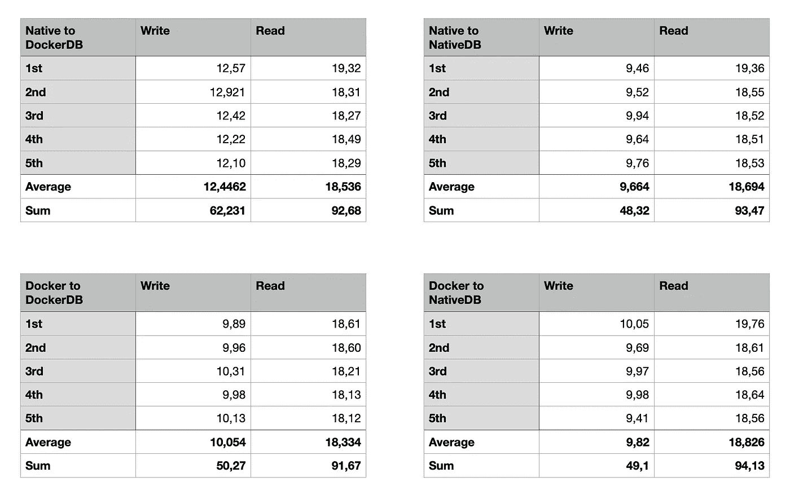
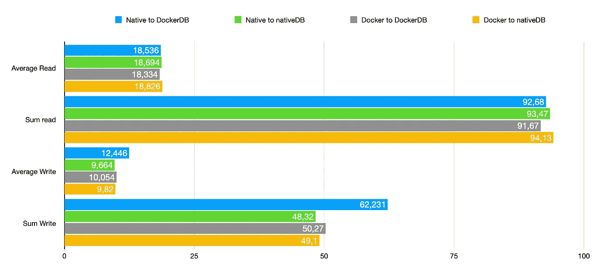

# 基准 PostgreSQL:native 与 Docker 的交叉

> 原文：<https://itnext.io/benchmark-postgresql-cross-between-native-versus-docker-a96df9a45014?source=collection_archive---------0----------------------->


几个月前，我做了两个基准测试。第一个测试了三个数据库引擎，第二个只测试了 PostgreSQL。

您可以在下面的两个链接中找到这些基准。两篇文章都是彼得·贾霍达写的。

[](/benchmark-databases-in-docker-mysql-postgresql-sql-server-7b129368eed7) [## Docker 中的基准数据库:MySQL、PostgreSQL、SQL Server

### 加上 MariaDB、Percona 和 TimescaleDB

itnext.io](/benchmark-databases-in-docker-mysql-postgresql-sql-server-7b129368eed7) [](/benchmark-postgresql-docker-versus-native-2dde6b5a8552) [## 在所有三个系统上测试 PostgreSQL:Docker 与 native

### 使用所有 PGTune 设置

itnext.io](/benchmark-postgresql-docker-versus-native-2dde6b5a8552) 

因为有一些关于这个基准的想法，我决定再做一个。这一次，我们将只在 linux 机器上使用 AWS 测试 PostgreSQL 13，测试将使用与以前相同的代码。

**我们将进行四项测试:**

*   数据库本机运行，程序本机运行
*   数据库在 Docker 中运行，程序在本地运行
*   数据库运行在 Docker 中，程序运行在 Docker 中
*   数据库在本地运行，程序在 Docker 中运行

我预计不会有重大差异，但数字会告诉我们更多。

# 在 AWS 中准备 linux 机器

对于这个特定的测试，选择了 T2 . micro:1x CPU 和 1GB RAM，符合自由层的条件。连接到正在运行的机器后，我们可以查看信息，看看运行的是什么。


**第一步，你的云机器运行后，就是安装 Docker:**

*   更新机器运行`sudo yum update -y`
*   使用`sudo yum install docker -y`安装 Docker
*   使用`sudo systemctl enable docker`启用 Docker
*   使用`sudo systemctl start docker`启动 Docker
*   使用`sudo usermod -a -G docker ec2-user`将您的用户添加到 docker 组

运行`sudo docker`命令检查 Docker 是否正在运行(应该是)。然后注销并再次连接，使用户组更改生效。

**第二步是在 Docker 中运行 Postgres**

现在使用 Docker 真的很简单。只需使用这个命令(注意 Docker 中的 Postgres 将运行在端口 5433 上，从外面看是这样的) :

```
docker run — name postgres -e POSTGRES_PASSWORD=password -p 5433:5432 -v postgres_data:/var/lib/postgresql/data -d postgres:alpine
```

使用`docker ps -a`检查 Docker 运行中的 Postgres 13。

然后使用`CREATE DATABASE benchmark`连接并创建新的数据库。

**第三步是本地运行 Postgres 13**

使用`sudo amazon-linux-extras install epel`启用 EPL 库

添加存储库使用

```
sudo tee /etc/yum.repos.d/pgdg.repo<<EOF [pgdg13] name=PostgreSQL 13 for RHEL/CentOS 7 - x86_64 baseurl=https://download.postgresql.org/pub/repos/yum/13/redhat/rhel-7-x86_64 enabled=1 gpgcheck=0
```

使用`sudo yum install postgresql13 postgresql13-server -y`安装 postgres

初始化数据库`using sudo /usr/pgsql-13/bin/postgresql-13-setup initdb`

使用`sudo systemctl enable — now postgresql-13`启动服务

使用`systemctl status postgresql-13`检查其运行情况

创建数据库基准并将 postgres 用户密码更改为`password`

# 运行基准程序

我们将再次使用相同的程序，但我们将为所有四种配置进行更改。

数据库原生程序将使用此连接字符串(127.0.0.1 和 5432):

```
user=postgres password=password dbname=benchmark host=127.0.0.1 port=5432 sslmode=disable
```

Docker 中的数据库原生程序将使用此连接字符串(127.0.0.1，但 5433):

```
user=postgres password=password dbname=benchmark host=127.0.0.1 port=5433 sslmode=disable
```

docker 中的程序到 Docker 中的数据库将使用这个连接字符串(从 Docker 内部使用`docker inspect postgres`和 5432 找到 databaseIpAddress):

```
user=postgres password=password dbname=benchmark host={databaseIpAddress} port=5432 sslmode=disable
```

docker 到数据库本地的程序将使用这个连接字符串(127.0.0.1 和 5432)并使用`--network=”host”`运行 Docker 镜像:

```
user=postgres password=password dbname=benchmark host=127.0.0.1 port=5432 sslmode=disable
```

# 结果

这是这四项测试的结果。



所有结果都以秒为单位

所有的结果都在一个图表里。



所有结果都是以秒为单位的，越长越糟

如您所见，无论数据库是否运行在 Docker 中，从数据库中读取数据几乎没有区别。程序是否在 Docker 中运行也没有区别。

然而**有一些问题**，如果你在 Docker 中运行一个数据库，而程序在 Docker 之外运行。

我又进行了几次特定的测试，结果还是一样。当在 Docker 中运行数据库，而程序(与该数据库通信的程序)在 Docker 之外运行时，写入速度会明显变慢。

# 摘要

在 Docker 中运行数据库没有问题，从速度上来说。但是，如果你这样做，请考虑运行所有的程序(服务，网络服务器等。)，它们与这个数据库通信，在 Docker 中运行它们。

# 更新

一些人在 reddit 上对这篇文章做出了回应，并对有问题的事情做出了一些可能的解释。

第一个解释是，我没有正确使用 postgres 容器上的卷。我应该把它映射到某个合适的目录。但我认为这没有意义，因为 postgres_data 默认情况下自动映射到/var/lib/docker/volumes/{ something }，所以我看不出有必要将其映射到(如建议的)/var/lib/postgres/data。这两个目录都在同一个挂载卷上，我不认为改变会影响这个问题。

第二个解释是，使用 alpine 版本的 Postgres 是使用不同的编译器编译的，Postgres 在 Linux 上本地运行。这可能是真(我打赌这是真的)，但同样，这也应该影响 docker 程序 docker 数据库的行为。但事实并非如此。

我对此的解释是:Docker 和世界其他地方之间的网络接口是导致这种轻微开销的原因，因为这个问题只出现在本地程序 Docker 数据库之间，并且只在编写时出现。因为这些写入是通过连续和独立的 10 000 次插入来完成的，所以我认为 Docker 和世界其他地方之间的网络接口在这种情况下是一个瓶颈。