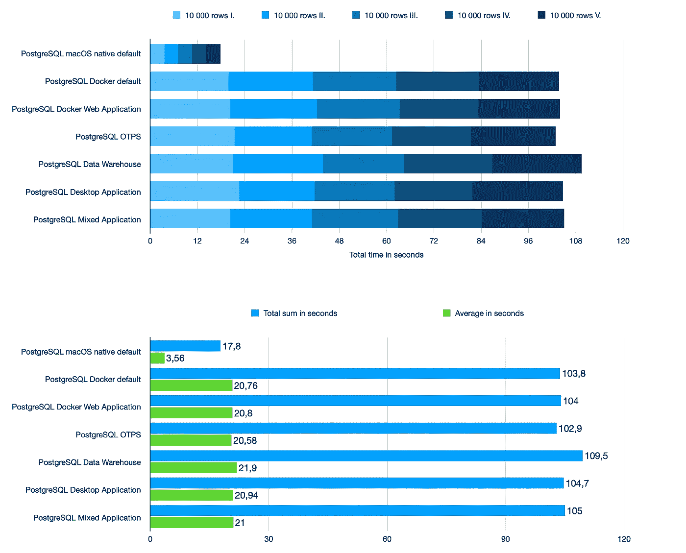
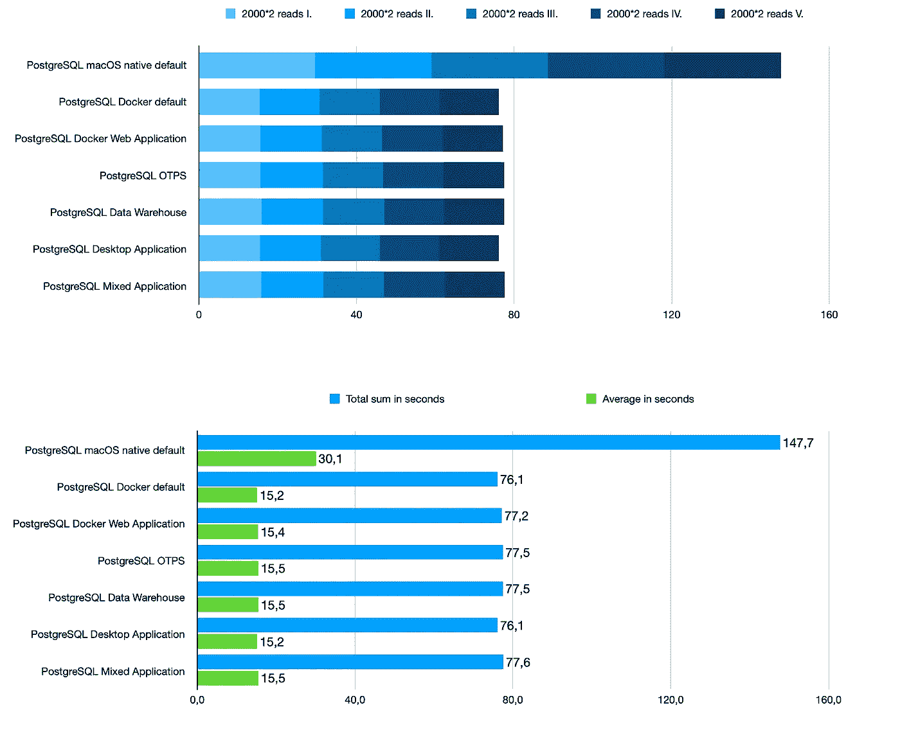
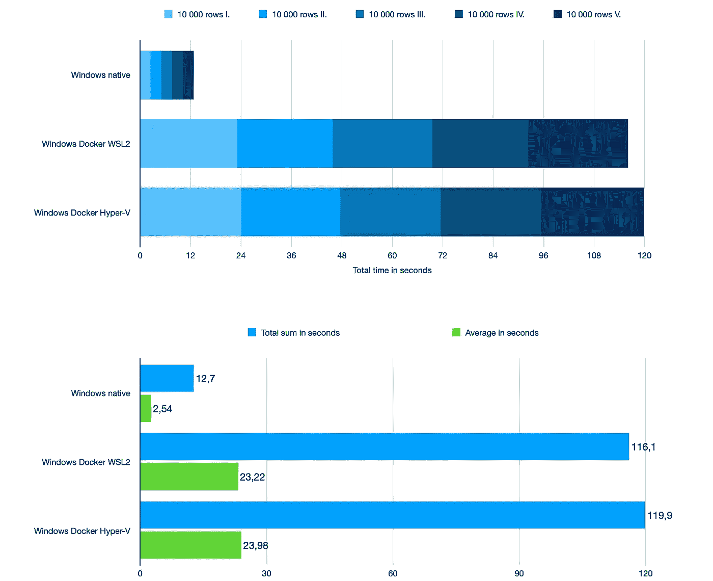
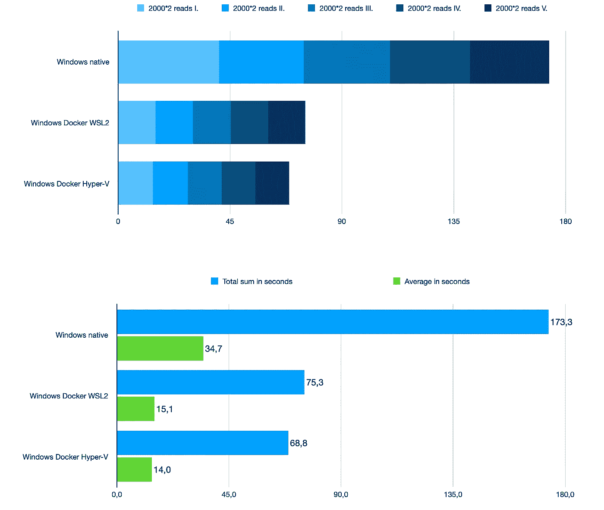
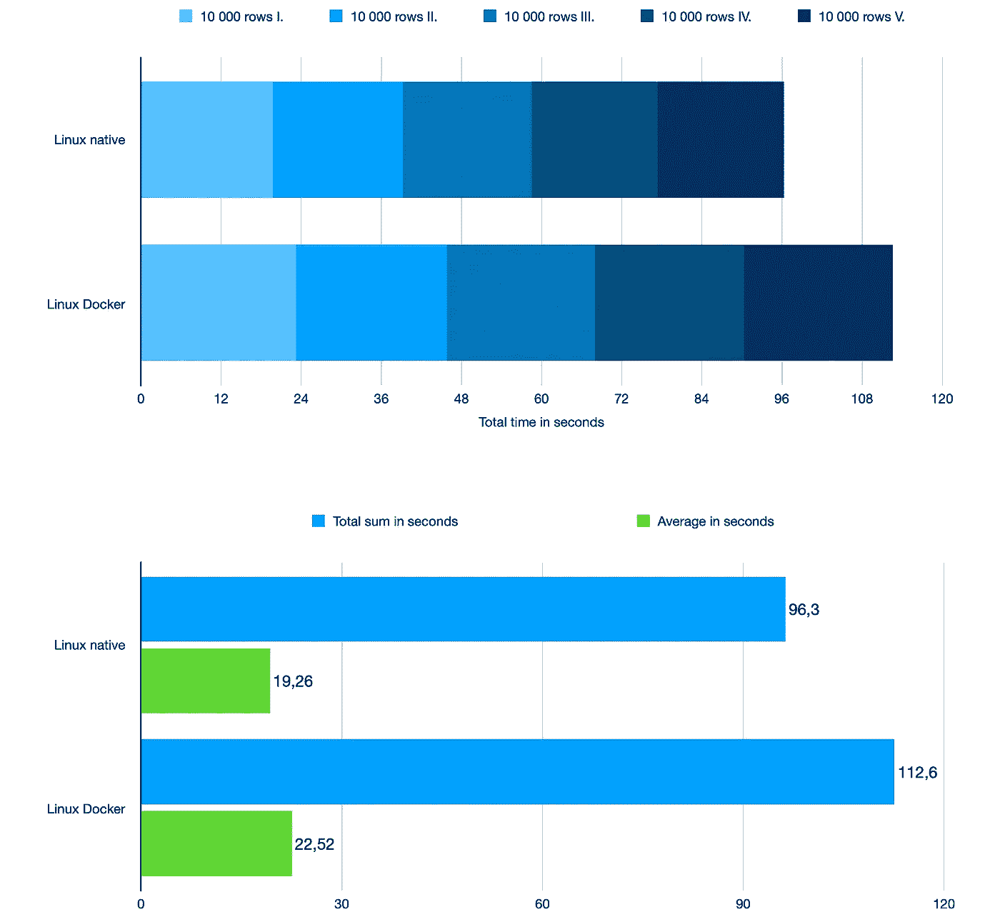
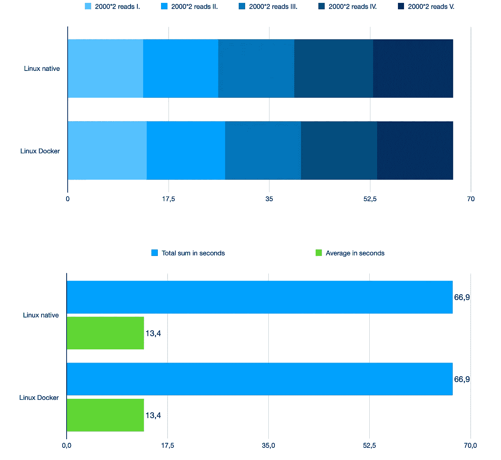
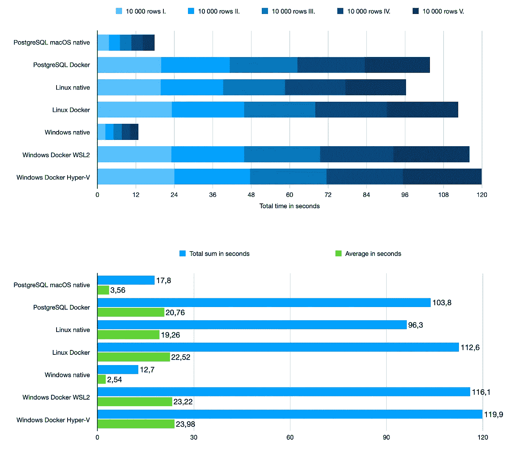
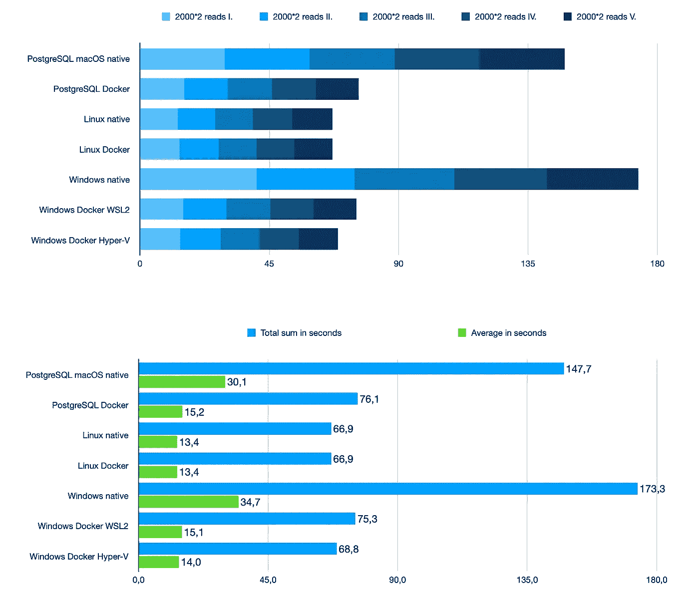

# 在所有三个系统上测试 PostgreSQL:Docker 与 native

> 原文：<https://itnext.io/benchmark-postgresql-docker-versus-native-2dde6b5a8552?source=collection_archive---------1----------------------->

## 使用所有 PGTune 设置

这篇文章可以看作是对以前的大型数据库基准测试的扩展。

 [## Docker 中的基准数据库:MySQL、PostgreSQL、SQL Server

### 加上 MariaDB、Percona 和 TimescaleDB

petrjahoda.medium.com](https://petrjahoda.medium.com/benchmark-databases-in-docker-mysql-postgresql-sql-server-7b129368eed7) 

因为 PostgreSQL 是赢家，所以比较一下在 Docker 中运行 PostgreSQL 和在本地运行 PostgreSQL 会很有意思。如果使用 [PGTune](https://pgtune.leopard.in.ua/#/) 进行微调的数据库设置之间存在差异，也很有意思。

该基准测试在所有三个主要系统上完成，本机运行 PostgreSQL。在所有这些服务器上，在 Docker 中运行 PostgreSQL。

该基准测试的目标不是比较 Linux、Windows 和 Mac(但是您将会得到结果)。目标是比较在 Docker 中运行的 PostgreSQL 和在本地运行的 PostgreSQL。

# 使用 PGTune 微调 Docker 中的数据库

PGTune 是一个在线工具，可以为您的 PostgreSQL 数据库生成稍微好一点的配置。我测试了它们在 Docker 中运行的数据库。以下是参数，符合我的 Docker 设置:2 GB 的内存和 2 个 CPU 的。

# MacOS 写性能指标评测(MacOS 11.1 Big Sur)

我使用了和以前一样的基准工具。

 [## petrjahoda/medium _ database _ benchmark

### 通过在 GitHub 上创建一个帐户，为 petrjahoda/medium _ database _ benchmark 开发做出贡献。

github.com](https://github.com/petrjahoda/medium_database_benchmark) 

这是结果。

原生运行 PostgreSQL 确实对写速度**有很大影响**。这是意料之中的，因为在 macOS 上的 Docker 中运行的 PostgreSQL 使用的是*虚拟硬盘*。

优化数据库设置不会对这个特定的写基准产生太大影响。另一方面:如果你调整这些设置，你不会做错任何事。

越低越好

# MacOS 读取性能指标评测(MacOS 11.1 Big Sur)

当我第一次在本机运行于 macOS 上的 PostgreSQL 上运行这个基准测试时，我觉得有些不对劲。但是我做了 10 次基准测试，每次都有相似的结果。

看到这个结果，**对我来说有点震惊**，因为我确实没有预料到这一点。本机 macOS PostgreSQL 上的读取速度比在 macOS 上的 Docker 中运行的 PostgreSQL 慢。

同样，使用 PGTune 修改设置不会对这个特定的 read 基准产生太大影响，所以在即将到来的测试中不会使用它。

越低越好

# Windows 写入性能指标评测(Windows 10 Pro 20H2)

原生运行 PostgreSQL 确实对写速度有很大影响**，就像在 MacOS 上一样。写入速度提高了 1 度。**

**使用 WSL2 比使用 Hyper-V 产生的结果稍好一些。**

****

**越低越好**

# **Windows 读取性能指标评测(Windows 10 Pro 20H2)**

**这几乎反映了 MacOS 上的行为。在 Docker 中运行 PostgreSQL 时，读取速度会更快。**

**这里，使用 Hyper-V 给出的结果比使用 WSL2 稍好。**

****

**越低越好**

# **Linux 写基准测试(Fedora 33)**

**如您所见，在 Docker 中运行 PostgreSQL 会稍微影响写入速度。**

****

**越低越好**

# **Linux 读取基准测试(Fedora 33)**

**读取速度是相同的。因此，从 read 的角度来看，无论您选择在 Docker 中运行 PostgreSQL 还是在 Linux 上本地运行 PostgreSQL，都没有关系。**

****

**越低越好**

# **有趣的信息**

*   **MacOS 测试在 macbook 上运行:16GB 内存，固态硬盘，2.3Ghz 8 核**
*   **Windows 测试在定制 pc 上运行:16GB 内存、固态硬盘、2.3Ghz 8 核**
*   **Linux 测试在定制 pc 上运行:16GB 内存、固态硬盘、2.3Ghz 8 核**

**我在这篇文章的开头写道，我们的目标不是比较这些系统，但是我认为，这种比较会给你一个更清晰的概述。**

## **写入基准**

**Linux 出乎意料地慢，几乎完全一样，因为它在 MacOS 上的 Docker 和 Windows 上的 Docker 都很慢。**

**我的猜测是，Windows 和 MacOS 文件系统更适合写数据，因为这两个系统上的 Docker 在虚拟机中使用 Linux 文件系统，这与其缓慢的速度相匹配。**

****

**越低越好**

## **读取基准**

**这里正好相反。Linux 很快，装有 MacOS 的 Windows 要慢得多。**

**但是当在这两个系统上使用 Docker 时，速度几乎赶上了 Linux。**

**我的猜测和之前一模一样。MacOS 和 Windows 的 Docker 匹配 Linux 文件系统的读取速度，因为它使用 Linux 文件系统。**

****

**越低越好**

# **在 Docker 中运行 PostgreSQL 的结论**

****对于开发:**不要害怕在 Docker 中运行 PostgreSQL，无论是在 Linux、Windows 还是 MacOS 上。在 macOS 和 Windows 的情况下，你可以获得更好的读取速度，但写入速度要差得多。**

****对于生产:**视情况而定……在原生 Windows、原生 MacOS 上写入速度更快。一般来说，在原生 Linux 和使用 Docker 的情况下，读取速度更快。所以在这里，我真的不知道，如何做出结论。你得自己决定，把这些结果作为一个信息。**

****关于微调:**在这个特定的基准测试中，我对 PGTune 不抱太大希望，但是我建议您在准备生产时，使用 PGTune 用不同的设置测试您的数据库。**