# Kubernetes 网络插件(CNI)在 10Gbit/s 网络上的基准测试结果

> 原文：<https://itnext.io/benchmark-results-of-kubernetes-network-plugins-cni-over-10gbit-s-network-36475925a560?source=collection_archive---------0----------------------->

# 新版本上市时间:2020 年

这篇文章现在有点旧了，已经更新了。看看吧！

[https://it next . io/benchmark-results-of-kubernetes-network-plugins-CNI-over-10g bit-s-network-updated-August-2020-6 E1 b 757 B9 e 49](/benchmark-results-of-kubernetes-network-plugins-cni-over-10gbit-s-network-updated-august-2020-6e1b757b9e49)

Kubernetes 是一个很棒的集装箱装配工。但是它不管理点对点通信网络。这是容器网络接口(CNI)插件的使命，它是实现容器集群工具(Kubernetes、Mesos、OpenShift 等)的网络抽象的标准化方法。)

但关键是:这些 CNI 之间有什么区别？哪个性能最好？哪一个最瘦？

本文展示了我在 10Gbit/s 网络上进行的基准测试的结果。这些结果也在 2018 年 11 月 15 日在马赛(法国)举行的 2018 年 Devops D-DAY 会议上发表。

# 基准上下文

基准测试在三台通过 Supermicro 10Gbit 交换机连接的 Supermicro 裸机服务器上进行。服务器通过 DAC SFP+无源电缆直接连接到交换机，并设置在激活巨型帧(MTU 9000)的同一 VLAN 中。

Kubernetes 1.12.2 安装在 Ubuntu 18.04 LTS 上，运行 Docker 17.12(此版本的默认 Docker 版本)。

为了提高可重复性，我们选择总是在第一个节点上设置主节点，在第二个服务器上托管基准的服务器部分，在第三个服务器上托管客户端部分。这是通过 Kubernetes 部署中的 NodeSelector 实现的。

下面是我们将用来描述基准测试结果和解释的尺度:

结果解释的尺度

# 为基准选择 CNI

该基准测试只关注文档中“用 kube ADM**引导集群”部分的 CNI 列表。在提到的 8 个 CNI 中，我们不会测试“JuniperContrail/wuthenfabric”CNI，因为它需要 3.10 内核(ubuntu 18.04 运行的是 4.15 内核)。**

以下是我们将比较的 CNI 列表:

*   Calico v3.3
*   Canal v3.3(实际上是网络的法兰绒+防火墙的印花棉布)
*   纤毛
*   法兰绒
*   kube-路由器 0.2.1
*   罗马纳 2.0.2
*   编织网

# 装置

CNI 越容易建立，我们的第一印象就越好。即使所有的 CNI 都被描述为非常容易设置，按照文档来安装 Cilium 和 Romana 也是不够的。Cilium 需要 ETCD 数据存储才能正常工作，我们不得不搜索他们文档的 minikube 部分，以找到一种单行部署方法。Romana 严重缺乏维护，因此不能处理 Kubernetes 1.11 引入的对“未准备好的”节点(在 CNI 设置之前)的容错。因此，Romana 不会部署，并使您的节点在很长一段时间内处于“未就绪”状态！这需要修复 Romana setup Yaml 文件中存在的所有部署/守护进程。

如前所述，服务器和交换机都配置了激活的巨型帧(通过将 MTU 设置为 9000)。我们非常希望 CNI 能够根据适配器自动发现要使用的 MTU。事实上，只有 Cilium、法兰绒和 Romana 能够正确地自动检测 MTU。大多数其他 CNI 都在 github 中提出了启用 MTU 自动检测的问题，但目前，我们需要通过修改 Calico、Canal 和 Kube-router 的 ConfigMap 或通过 WeaveNet 的 ENV var 来手动修复它。

也许您想知道不正确的 MTU 会有什么影响？下面的图表显示了带有默认 MTU 的 WeaveNet 与带有巨型帧的 WeaveNet 之间的差异:

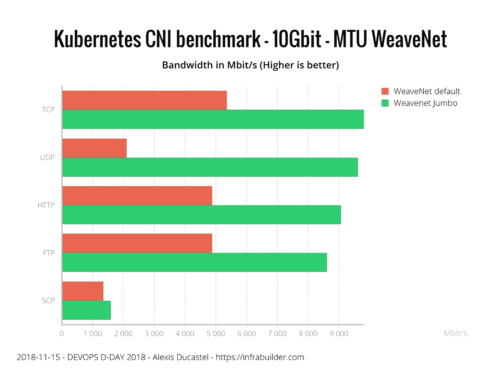

MTU 设置对带宽性能的影响

以下是设置结果的摘要:

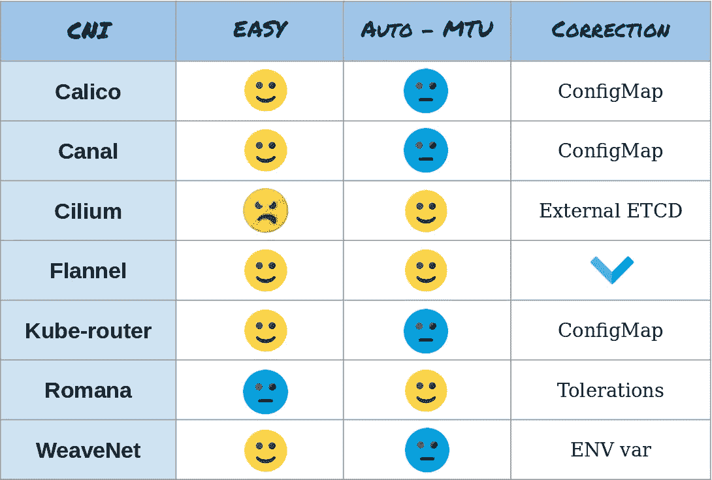

设置基准测试结果摘要

# 安全性

在比较这些 CNI 的安全性时，我们谈论的是两件事:它们加密通信的能力，以及它们对 Kubernetes 网络策略的实施(根据真实的测试，而不是来自它们的文档)。

面板中唯一可以加密通信的 CNI 是 **WeaveNet** 。这是通过将加密密码设置为 CNI 的 ENV 变量来实现的，这很容易做到。

当谈到网络策略实施时，Calico、Canal 和 Cilium 是面板中最好的，它们实施了入口和出口规则。Kube-router 和 WeaveNet 实际上只实现了入口规则。法兰绒和罗马纳不执行网络政策。(注意:Romana 的文档提到了网络策略的实现，但这是通过定制 Romana 资源而不是 Kubernetes 网络策略实现的)

以下是结果摘要:

安全基准测试结果摘要

# 表演

该基准测试显示了每次测试(至少)三次运行的平均带宽。我们正在测试 TCP 和 UDP 性能(使用 iperf3)，像 HTTP(使用 nginx 和 curl)或 FTP(使用 vsftpd 和 curl)这样的真实应用程序，最后是使用 SCP 协议的应用程序加密的行为(使用 OpenSSH 服务器和客户端)。

对于所有测试，我们还在裸机节点(绿色条)上运行基准测试，以比较 CNI 与本地网络性能的有效性。为了与我们的基准标度保持一致，我们在图表上使用以下颜色:

*   黄色=非常好
*   橙色=好
*   蓝色=公平
*   红色=贫穷

结果如下:

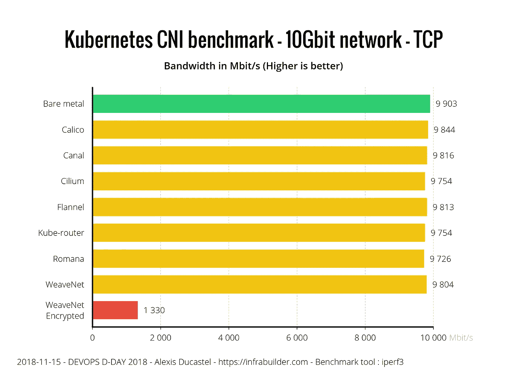

TCP 性能

我们可以在 TCP 结果上看到，所有的 CNI 都非常好，除了 WeaveNet encrypted，因为加密过程大大降低了性能。

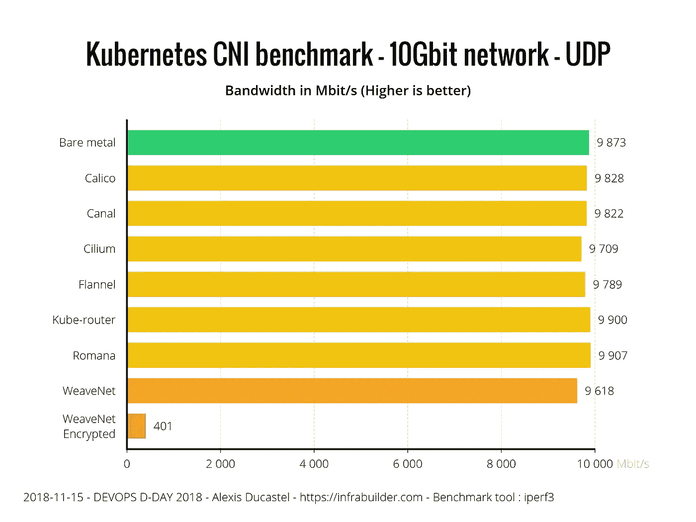

UDP 性能

在 UDP 基准测试中，WeaveNet encrypted 得到的结果甚至比 TCP 更差(大约 1/3 的因子)。未加密的 WeaveNet 虽然稍逊于其他产品，但仍是合理的(裸机性能的 97%)。我们可以注意到 Kube-router 和 Romana 比裸机快一点(不到 1%):测试已经重新运行了多次，结果是稳定的。

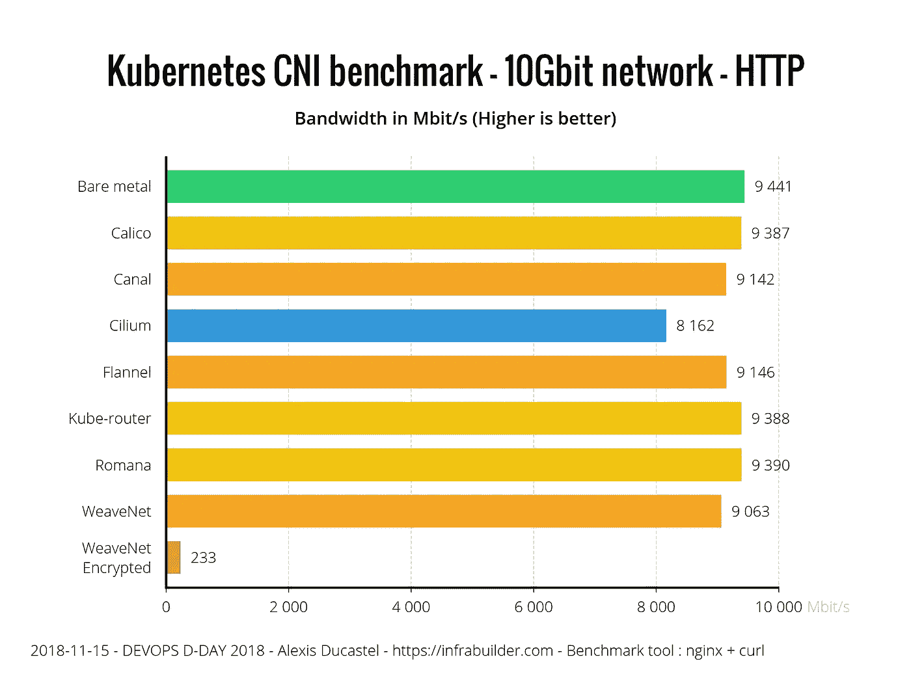

HTTP 性能

即使 HTTP 是基于 TCP 的协议，现实生活中的应用程序似乎也会对性能产生影响。该测试基本上是一个 10GB 随机字节的文件(以避免可能的压缩副作用)，由 nginx 提供，并从 curl 客户端下载。WeaveNet Encrypted 现在以 TCP 性能的 17%运行，Cilium 似乎也处理了一些问题。没有加密的 WeaveNet，法兰绒和 Canal 也有点落后人家 CNIs。

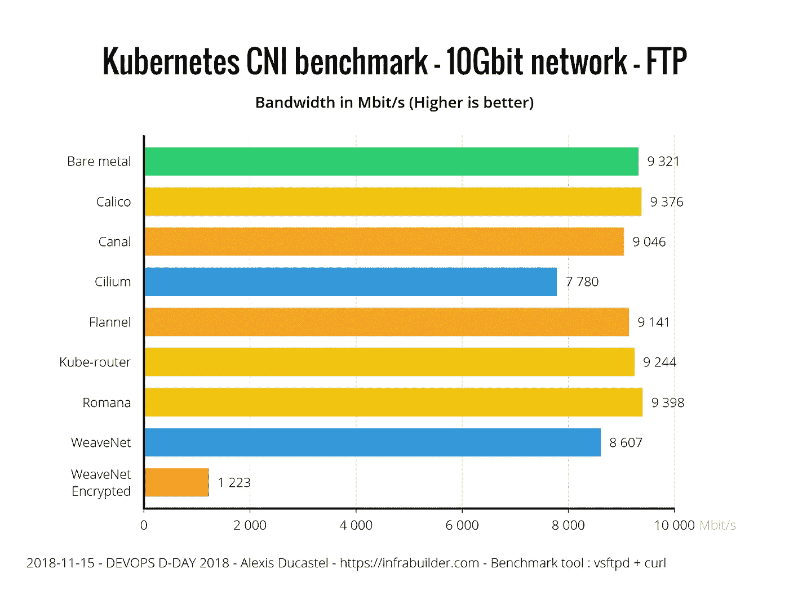

FTP 性能

使用 FTP 测试，结果与 HTTP 非常相似，只是 WeaveNet unencrypted 的行为类似于纤毛，并且都在其他 CNI 之后。WeaveNet encrypted 还是老样子，性能很低。这个测试与 HTTP 的场景相同，只是我们在匿名模式下用 VSFTPD 替换了 nginx。

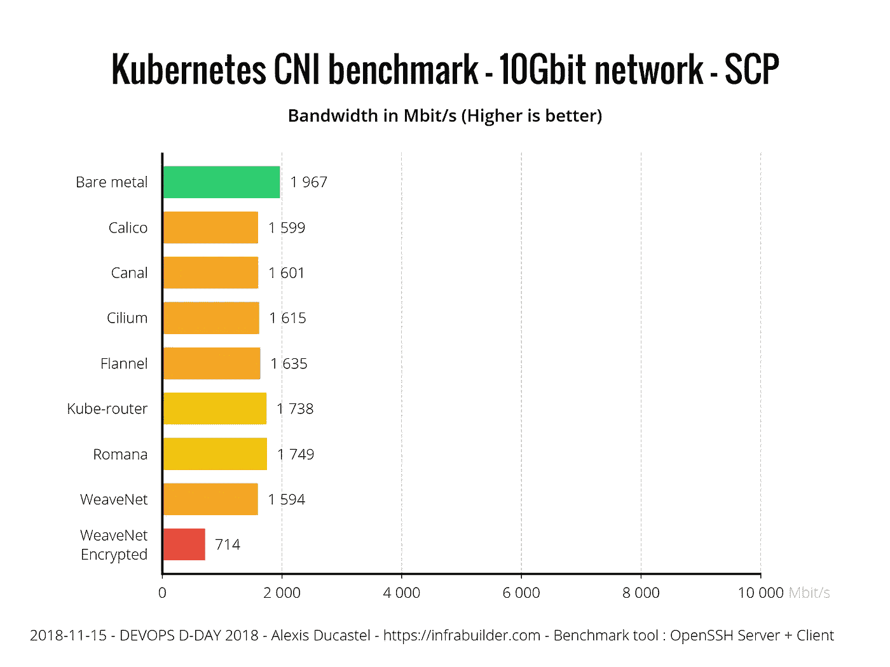

SCP 性能

对于 scp，我们使用 OpenSSH 服务器和客户端通过 SCP 传输 10GB 随机文件。我们可以清楚地看到，即使是裸机性能也比以前低得多。所有的 CNI 都是相当平等的，除了 WeaveNet Encrypted 是遭受双重加密(SCP +网络加密)。

以下是 CNIs 的绩效总结:

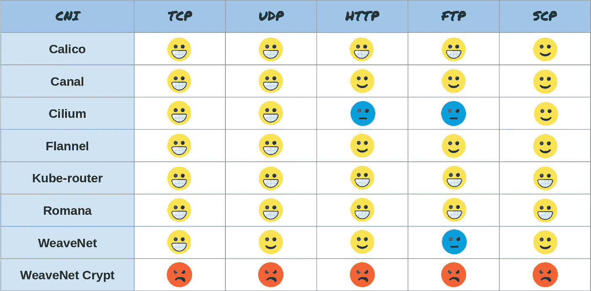

性能指标评测结果摘要

# 资源消耗

现在让我们比较一下这些 CNI 在高负载下(在 TCP 10Gbit 传输期间)如何处理资源消耗。在性能测试中，我们将 CNIs 与裸机进行比较(绿色条)。对于资源消耗测试，我们还显示了没有任何 CNI 设置的新鲜 Kubernetes 在空闲时的消耗(紫色条)。然后我们可以算出一个 CNI 到底消耗了多少。

让我们从记忆方面开始。这是传输期间的平均节点 RAM 使用量(不包括缓冲区/缓存),以 MB 为单位。

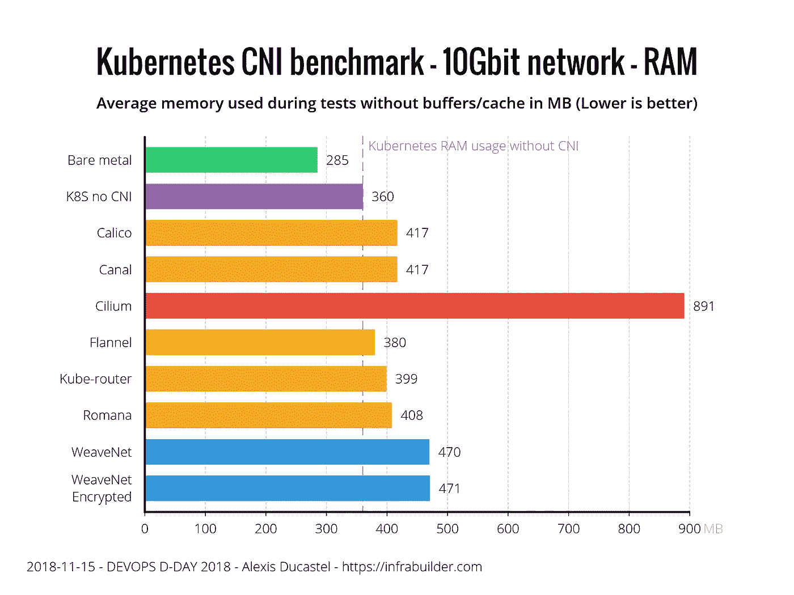

平均节点 RAM 使用率(不含缓冲区/缓存)

我们可以清楚地看到，法兰绒是最瘦的，只比没有 CNI 的 Kubernetes 多 20MB 内存。Calico，Canal，Kube-router，Romana 接近法兰绒，稍落后我们有 WeaveNet，说明加密对内存消耗没有影响。纤毛比其他的消耗更多的内存。

现在，让我们看看 CPU 的消耗。警告:图形单位不是百分比而是百分比。所以裸机每百万分之一实际上是 0.1%。结果如下:

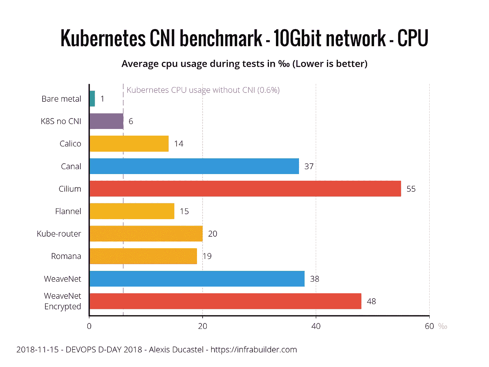

每分钟的平均 CPU 使用率(不是百分比)

Calico 和法兰绒比没有 CNI 的 kubernetes 节点多消耗不到 1%的 CPU 来实现 10Gbit 的 TCP 传输，这是非常好的。Kube-router 和 Romana 以 1.5%稍微落后。WeaveNet uncrypted 和 Canal 的开销都很高，为 3%,但不如 WeaveNet encrypted 和 Cilium 高，它们都超过了 4%。对于 WeaveNet encrypted 来说，这是非常符合逻辑的，因为完整的 10Gbit 流是加密的，因此使用 CPU 来实现这一点。然而，纤毛不在这种情况下，甚至比加密的 CNI 消耗更多。

下面是资源消耗部分的汇总:

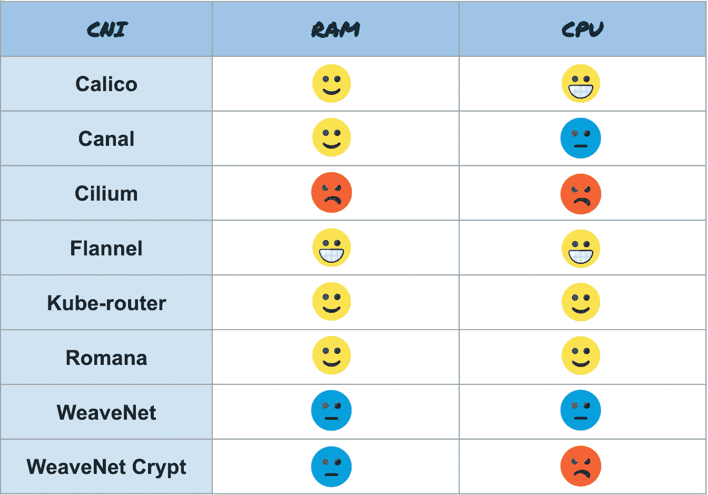

资源消耗汇总

# 摘要

以下是所有汇总结果的概述:

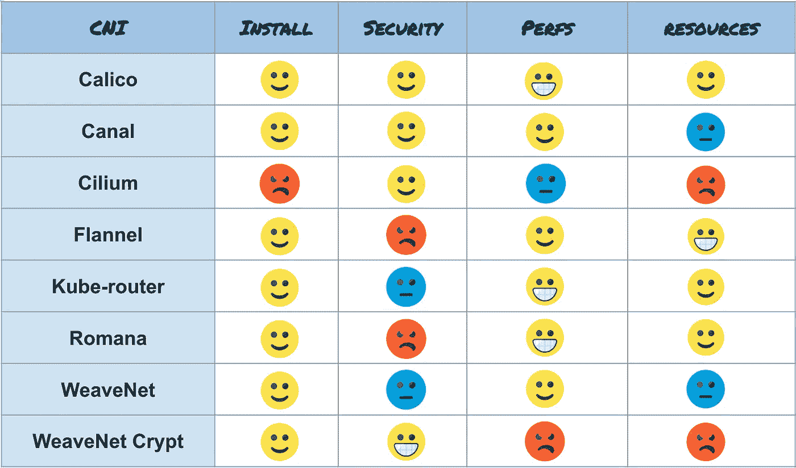

所有结果的快速汇总

# 结论

最后一部分是主观的，传达了我自己对结果的理解。如果您处于相应的场景中，我建议使用以下 CNI:

*   您的集群中有**个低资源节点**(只有几 GB 的 RAM，几个核心)，并且您不需要安全特性，请使用**法兰绒**。这是我们测试过的最瘦的 CNI。而且兼容很多架构(amd64，arm 等。).
*   出于安全原因，你需要**加密你的网络**，使用 **WeaveNet。**如果您使用巨型帧，不要忘记设置您的 MTU 大小，并通过在环境变量中给出密码来激活加密。但是话说回来，忘掉性能吧，这是加密的代价。
*   对于**其他常用用法**，我会推荐**印花布**。就像 WeaveNet 一样，如果您使用巨型帧，不要忘记在 ConfigMap 中设置 MTU。在资源消耗、性能和安全性方面，它已被证明是多用途和高效的。Calico 已经在非常大的集群上工作，并且具有非常有趣的 BGP 特性。

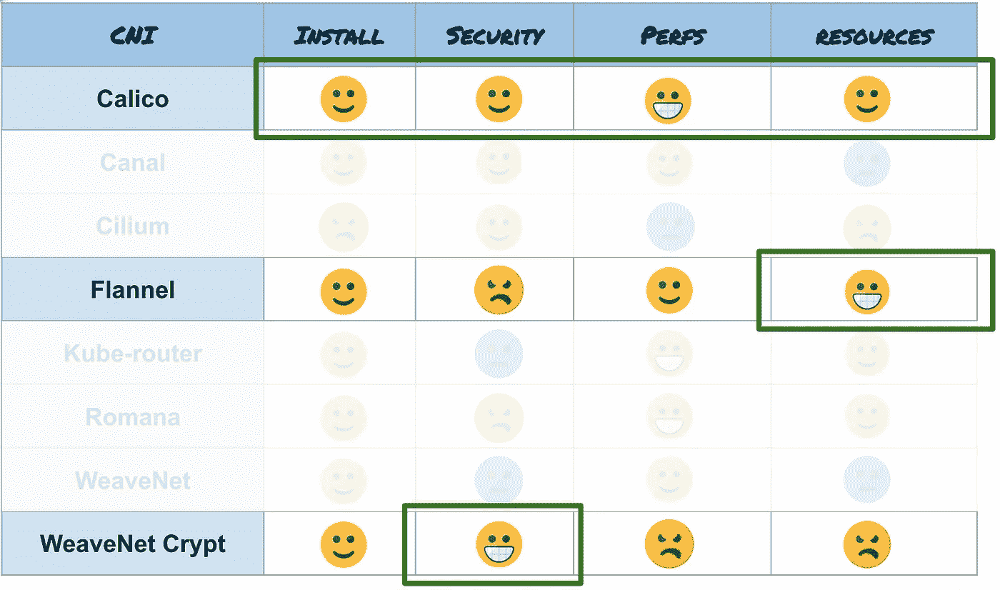