# Kubernetes 网络插件(CNI)在 10Gbit/s 网络上的性能指标评测结果(更新时间:2019 年 4 月)

> 原文：<https://itnext.io/benchmark-results-of-kubernetes-network-plugins-cni-over-10gbit-s-network-updated-april-2019-4a9886efe9c4?source=collection_archive---------1----------------------->

# **新版本可用时间:2020 年**

这篇文章现在有点旧了，已经更新了。看看吧！

[https://it next . io/benchmark-results-of-kubernetes-network-plugins-CNI-over-10g bit-s-network-updated-August-2020-6 E1 b 757 B9 e 49](/benchmark-results-of-kubernetes-network-plugins-cni-over-10gbit-s-network-updated-august-2020-6e1b757b9e49)

这篇文章是我的[之前的基准](/benchmark-results-of-kubernetes-network-plugins-cni-over-10gbit-s-network-36475925a560)的更新，现在运行在 Kubernetes 1.14 上，CNI 版本在 2019 年 4 月更新。

首先，非常感谢 Cilium 团队，他们帮助我检查和纠正了我的指标监控脚本。

# 2018 年 11 月以来有什么新消息

如果你只是想知道自上次以来发生了什么变化，这里有一个快速总结:

法兰绒仍然是 CNI 竞争中最快和最瘦的，但仍然不支持网络策略，也不支持加密。

Romana 不再维护了，所以我们决定把它从基准测试中去掉。

WeaveNet 现在支持入口和出口网络策略！但是性能比以前低。

如果想要获得最佳性能，Calico 仍然需要手动定制 MTU。Calico 为安装他们的 CNI 提供了两种新的选择，无需专门的 ETCD 商店:

*   将 Kubernetes API 中的状态存储为数据存储(集群< 50 nodes)
*   storing state in Kubernetes API as datastore with Typha proxy to reduce the pressure on the K8S API (cluster > 50 个节点)

Calico 宣布在 Istio 之上支持[应用层策略](https://docs.projectcalico.org/v3.6/getting-started/kubernetes/installation/app-layer-policy)，为应用层带来安全性。

Cilium 现在支持加密！Cilium 通过 IPSec 隧道提供加密，并为加密网络提供了 WeaveNet 的替代方案。然而，在启用加密的情况下，WeaveNet 比 Cilium 快。这是由于 Cilium 1.4.2 仅支持 CBC 加密，GCM 会更好，因为它可以是网络适配器卸载的硬件，但它将是 Cilium 1.5 版本的一部分。

由于嵌入了 ETCD 算子，Cilium 现在更容易部署。

Cilium 团队还努力通过减少内存消耗和 CPU 成本来减少 CNI 占用空间。但还是比其他选手重。

# 基准上下文

基准测试在三台通过 Supermicro 10Gbit 交换机连接的 Supermicro 裸机服务器上进行。服务器通过 DAC SFP+无源电缆直接连接到交换机，并设置在激活巨型帧(MTU 9000)的同一 VLAN 中。

Kubernetes 1.14.0 安装在 Ubuntu 18.04 LTS 上，运行 Docker 18.09.2(本版本默认 Docker 版本)。

为了提高可再现性，我们选择总是在第一个节点上设置主节点，在第二台服务器上托管基准的服务器部分，在第三台服务器上托管客户端部分。这是通过 Kubernetes 部署中的 NodeSelector 实现的。

下面是我们将用来描述基准测试结果和解释的尺度:

结果解释的尺度

# 为基准选择 CNI

该基准测试只关注集成到官方 kubernetes 文档的“[create a single master cluster with kube ADM](https://kubernetes.io/docs/setup/independent/create-cluster-kubeadm/)”**部分的 CNI 列表。在提到的 9 个 CNI 中，我们将只测试其中的 6 个，排除那些我们不容易安装和/或不能按照文档开箱即用的(罗马纳、康蒂夫-VPP 和 JuniperContrail/钨制造)**

**以下是我们将比较的 CNI 列表:**

*   **Calico v3.6**
*   **Canal v3.6(实际上是网络的法兰绒+防火墙的印花棉布)**
*   **纤毛**
*   **法兰绒**
*   **kube-路由器 0.2.5**
*   **编织网 2.5.1**

# **装置**

**CNI 越容易建立，我们的第一印象就越好。所有基准 CNI 都非常容易设置(一两个命令行)。**

**如前所述，服务器和交换机都配置了激活的巨型帧(通过将 MTU 设置为 9000)。我们非常希望 CNI 能够根据适配器自动发现要使用的 MTU。事实上，纤毛和法兰绒是唯一正确自动检测 MTU 的。大多数其他 CNI 在 GitHub 中出现了启用 MTU 自动检测的问题，但目前，我们需要通过修改 Calico、Canal 和 Kube-router 的配置图或通过 WeaveNet 的 ENV var 来手动修复它。**

**也许您想知道不正确的 MTU 会有什么影响？下面的图表显示了带有默认 MTU 的 WeaveNet 与带有巨型帧的 WeaveNet 之间的差异:**

**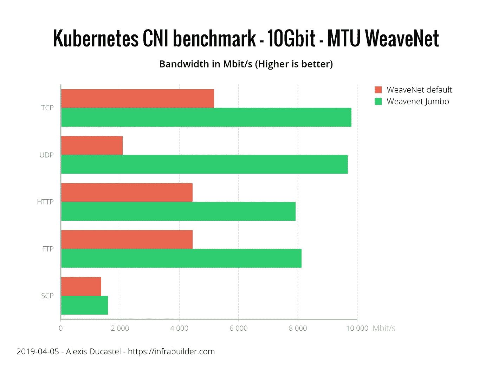**

**MTU 设置对带宽性能的影响**

**既然我们知道 MTU 对性能非常重要，那么这些 CNI 如何自动检测 MTU:**

**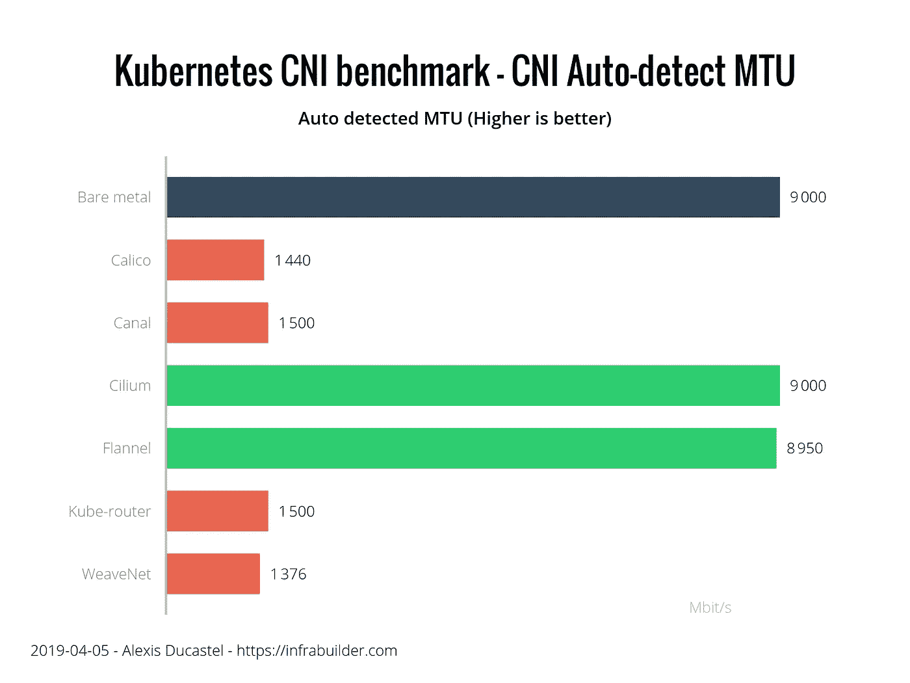**

**CNIs 自动检测的 MTU**

**正如我们在上图中看到的，我们必须对 Calico、Canal、Kube-router 和 WeaveNet 进行一些 MTU 调优，以获得最佳性能。Cilium 和法兰绒能够自行正确地自动检测 MTU，确保开箱即用的最佳性能。**

# **安全性**

**在比较这些 CNI 的安全性时，我们谈论的是两件事:它们对通信进行加密的能力，以及它们对 Kubernetes 网络策略的实施(根据真实的测试，而不是来自它们的文档)。**

**只有两个 CNI 可以加密通信:Cilium 和 WeaveNet。 **WeaveNet** 通过将加密密码设置为 CNI 的 ENV 变量来启用加密。织网[文档](https://www.weave.works/docs/net/latest/tasks/manage/security-untrusted-networks/)有点混乱，但这很容易做到。 **Cilium** 使用创建 Kubernetes 秘密的命令并通过 daemonSet 修改来设置加密(比 WeaveNet 稍微复杂一点，但 Cilium 已经[很好地记录了它](http://docs.cilium.io/en/v1.4/gettingstarted/encryption/))。**

**说到网络策略实现， **Calico** 、 **Canal** 、 **Cilium** 和 **WeaveNet** 是面板中最好的，它们实现了入口和出口规则。Kube 路由器实际上只执行入口规则。**

****法兰绒**不实现网络策略。**

**以下是结果摘要:**

**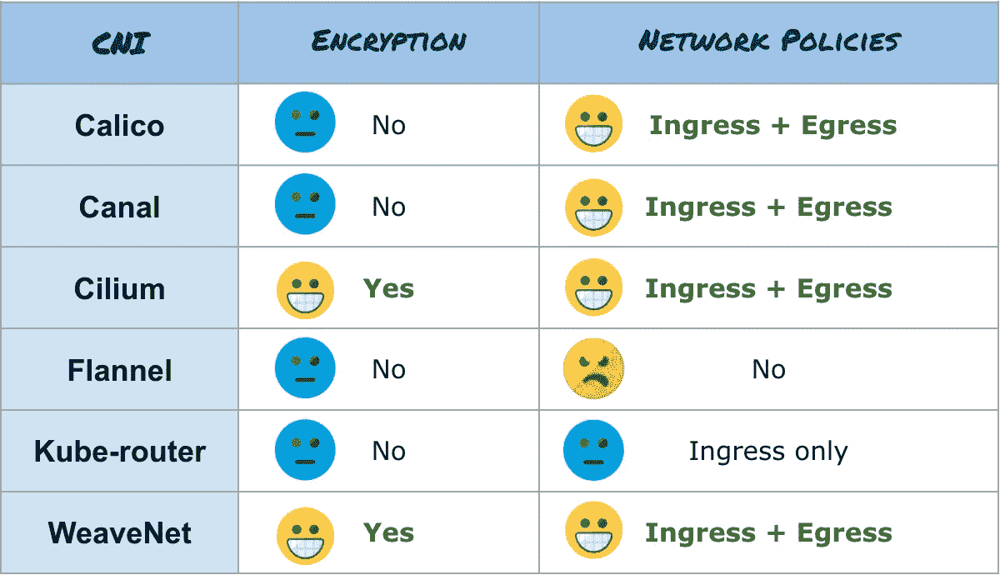**

**安全基准测试结果摘要**

# **表演**

**该基准测试显示了每次测试(至少)三次运行的平均带宽。我们正在测试 TCP 和 UDP 性能(使用 iperf3)，像 HTTP(使用 Nginx 和 curl)或 FTP(使用 vsftpd 和 curl)这样的真实应用程序，最后是使用 SCP 协议的应用程序加密的行为(使用 OpenSSH 服务器和客户端)。**

**对于所有测试，我们还在裸机节点(绿色条)上运行基准测试，以比较 CNI 与本地网络性能的有效性。为了与我们的基准标度保持一致，我们在图表上使用以下颜色:**

*   **黄色=非常好**
*   **橙色=好**
*   **蓝色=公平**
*   **红色=贫穷**

**因为我们在这里不关注错误配置的 CNI 的性能，所以我们将只显示 MTU 调优的 CNI 基准测试结果。(注意:如果您激活加密，Cilium 不会正确计算 MTU，因此您必须在 1.4 版中手动将 MTU 减少到 8900。下一个版本 1.5 将自动适应。)**

**结果如下:**

**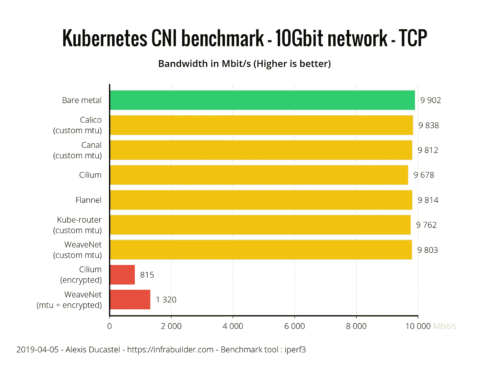**

**TCP 性能**

**每个 CNI 在 TCP 基准测试中都表现良好。由于加密的成本，启用加密的 CNI 远远落后于其他 CNI。**

**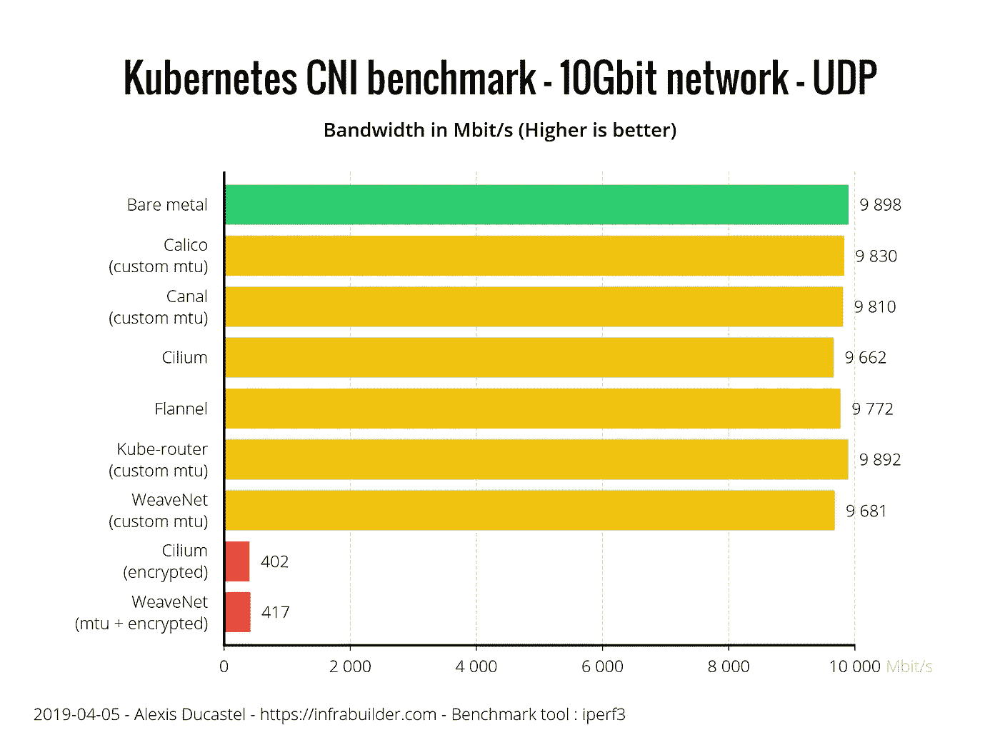**

**UDP 性能**

**同样，在 UDP 基准测试中，所有 CNI 都表现良好。加密的 CNI 现在彼此非常接近。Cilium 稍微落后于竞争对手，但事实上，它仅落后裸机结果 2.3%，这很公平。我们应该记住的是，纤毛和法兰绒是唯一正确自动检测 MTU 的 CNI，因此提供了开箱即用的结果。**

**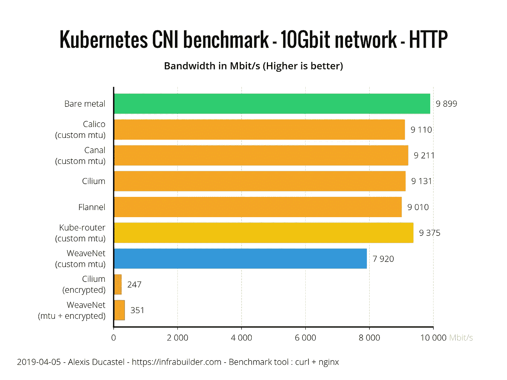**

**现实世界的应用呢？使用 HTTP 基准测试，我们可以看到全局性能比使用 TCP 测试要低一些。即使 HTTP 由 TCP 支持，在 TCP 基准中 iperf3 被配置为避免任何“TCP 慢启动”副作用，这可以有效地影响 HTTP 基准。这里大家都挺好的，Kube-router 优势明显，WeaveNet 在这个测试上表现相当差，比裸机少 20%左右。Cilium encrypted 和 WeaveNet encrypted 现在都离裸机性能很远了。**

**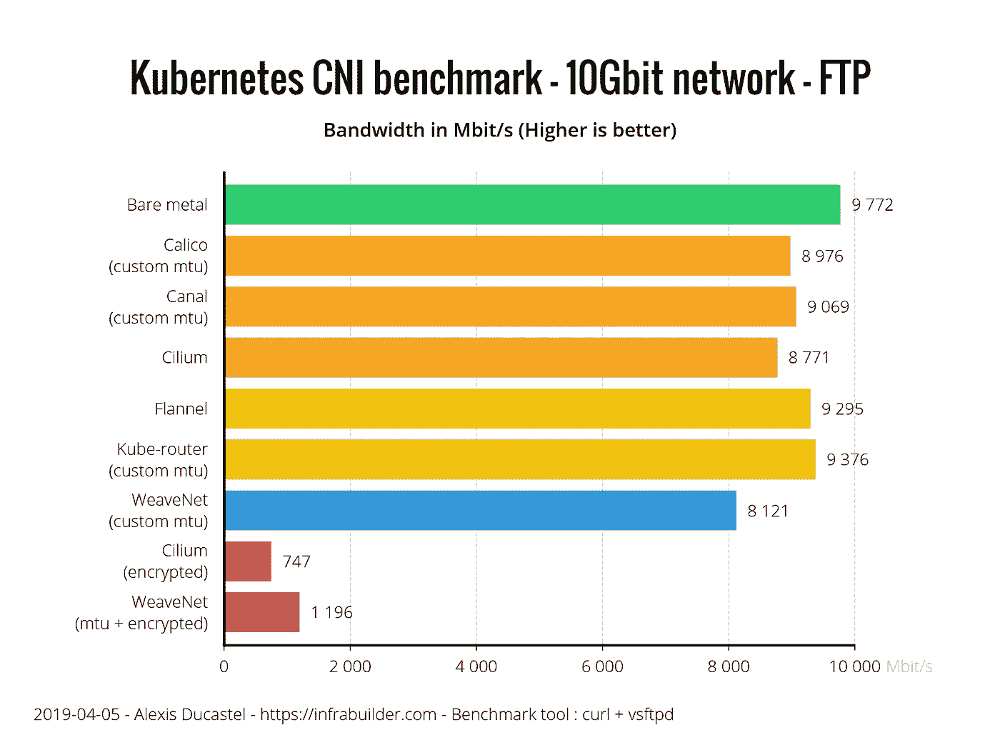**

**对于 FTP，另一个 TCP 支持的协议，结果更加复杂。虽然法兰绒和 Kube-router 表现非常好，但 Calico、Canal 和 Cilium 稍显落后，在裸机速度下落后约 10%。WeaveNet 离裸机性能真的有 17%的差距。无论如何，加密版本的 WeaveNet 比 Cilium encrypted 的性能高 40%左右。**

**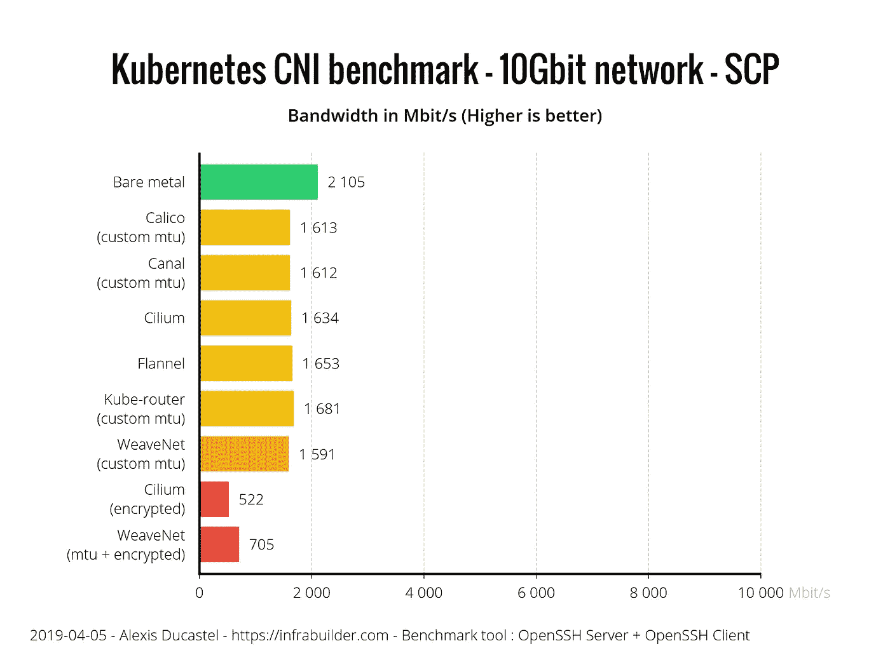**

**通过 SCP，我们可以清楚地看到 SSH 协议的加密成本。大多数 CNI 表现良好，但 WeaveNet 再次有点落后于其他公司。Cilium encrypted 和 WeaveNet encrypted 当然是因为双倍加密成本(SSH 加密+ CNI 加密)而落后。**

**以下是表演总结:**

**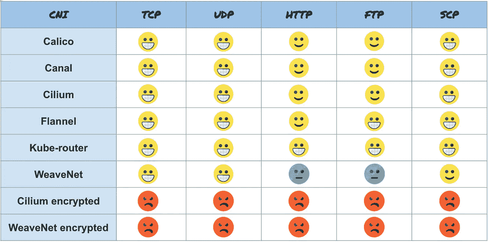**

**CNI 绩效总结**

# **资源消耗**

**现在让我们比较一下这些 CNI 在高负载下(在 TCP 10Gbit 传输期间)如何处理资源消耗。在性能测试中，我们将 CNIs 与裸机进行比较(绿色条)。对于资源消耗测试，我们还显示了没有任何 CNI 设置的新空闲 Kubernetes(紫色条)的消耗。然后我们可以计算出 CNI 真正消耗了多少开销。**

**让我们从记忆方面开始。这是传输期间的平均节点 RAM 使用量(不包括缓冲区/缓存),以 MB 为单位。**

**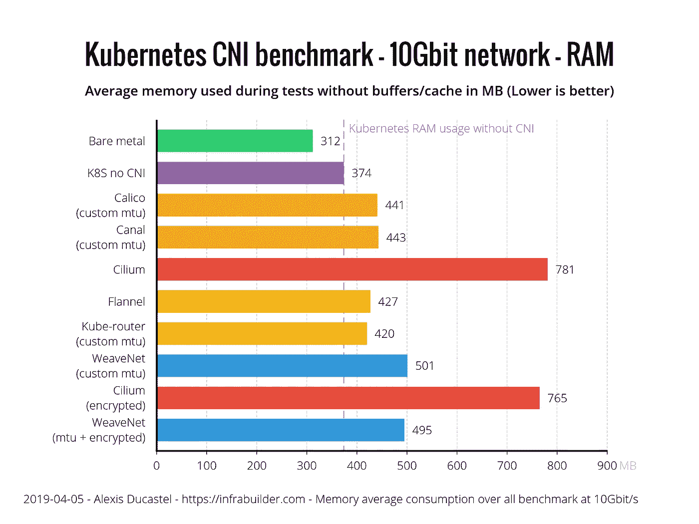**

**内存消耗**

**法兰绒和 Kube-router 的表现都非常好，只有大约 50MB 的内存占用，其次是 Calico 和 Canal，有 70MB。WeaveNet 的消耗量明显高于其竞争对手，约为 130MB。Cilium 拥有 400MB 的内存，是基准测试中内存消耗最高的。**

**现在，让我们检查一下 CPU 消耗。**警告**:图形单位不是百分数而是 permil。所以裸机 38 permil 其实是 3.8%。结果如下:**

**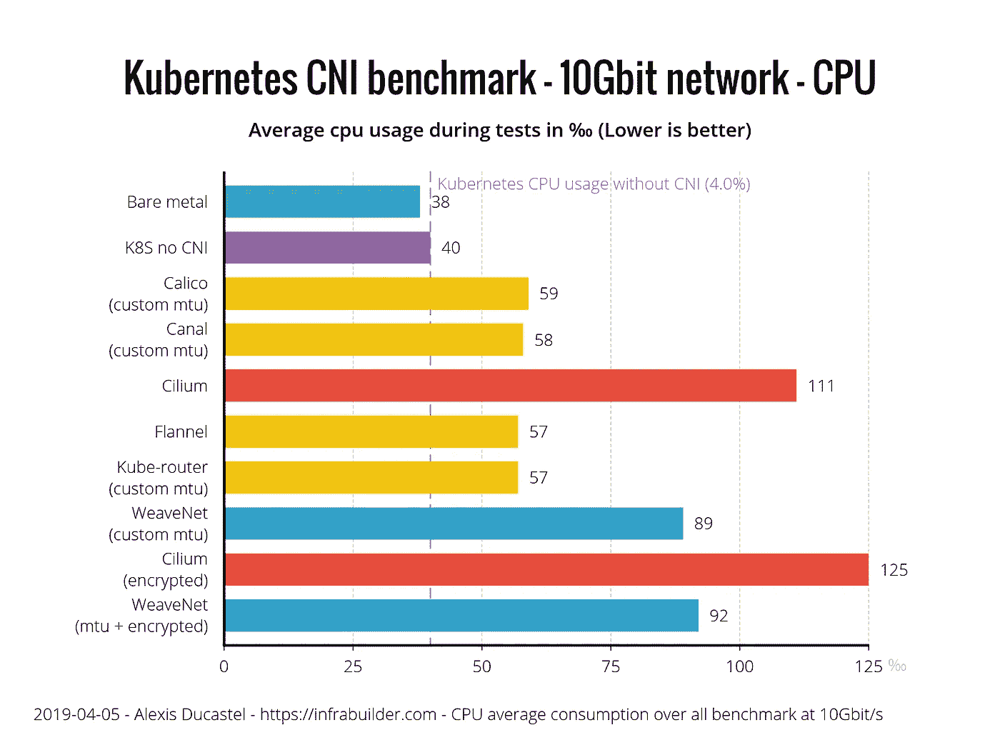**

**CPU 消耗**

**Calico、Canal、法兰绒和 Kube-router 的 CPU 效率都很高，与没有 CNI 的 kubernetes 相比，开销只有 2%。远远落后的是开销在 5%左右的 WeaveNet，然后是 CPU 开销超过 7%的 Cilium。**

**以下是资源消耗的摘要:**

**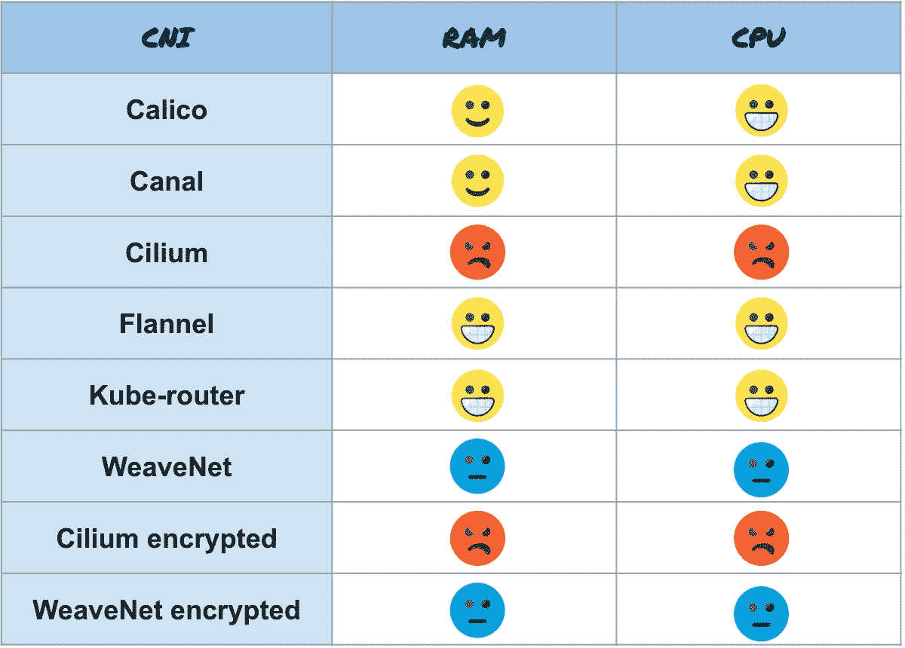**

# **摘要**

**以下是所有结果的汇总概述:**

**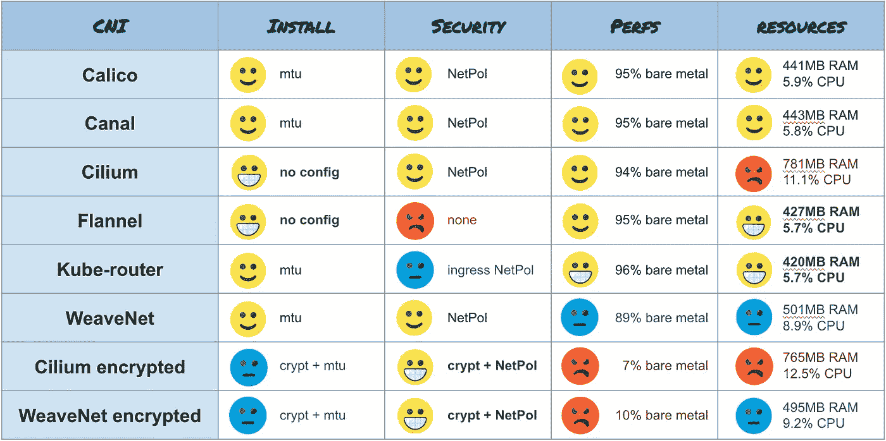**

**基准测试结果概述**

# **结论**

**这最后一部分是主观的，传达了我自己对结果的解释。请记住，该基准测试只是在一个非常小的集群(3 个节点)上测试单个连接的吞吐速度。它不反映大型集群(> 50 个节点)的网络行为，也不反映许多连接的并发性。**

**如果您处于相应的场景中，我建议使用以下 CNI:**

*   **您的集群中有**个低资源节点**(只有几 GB 的 RAM，几个内核)，并且您不需要安全特性，那么就使用**法兰绒**。这是我们测试过的最瘦的 CNI 之一。此外，它还兼容大量架构(amd64、arm、arm64 等。).这是唯一一个，连同纤毛，能够正确地自动检测你的 MTU，所以你不必配置任何东西让它工作。Kube-router 也不错，但是不太标准，需要您手动设置 MTU。**
*   **出于安全原因，你需要**加密你的网络**，使用 **WeaveNet。**如果您使用巨型帧，不要忘记设置您的 MTU 大小，并通过在环境变量中给出密码来激活加密。但是话说回来，忘掉性能吧，这是加密的代价。**
*   **对于**其他常用用法**，我会推荐**印花布**。这个 CNI 被广泛应用于很多 kubernetes 部署工具(Kops，Kubespray，Rancher 等。).就像 WeaveNet 一样，如果您使用巨型帧，不要忘记在 ConfigMap 中设置 MTU。在资源消耗、性能和安全性方面，它已被证明是多用途和高效的。**

**最后但同样重要的是，我会推荐你跟随**纤毛**工作。他们的团队非常活跃，他们正在努力提高他们的 CNI(功能、资源节约、性能、安全性、多集群跨越等)，他们的路线图听起来非常有趣。**

**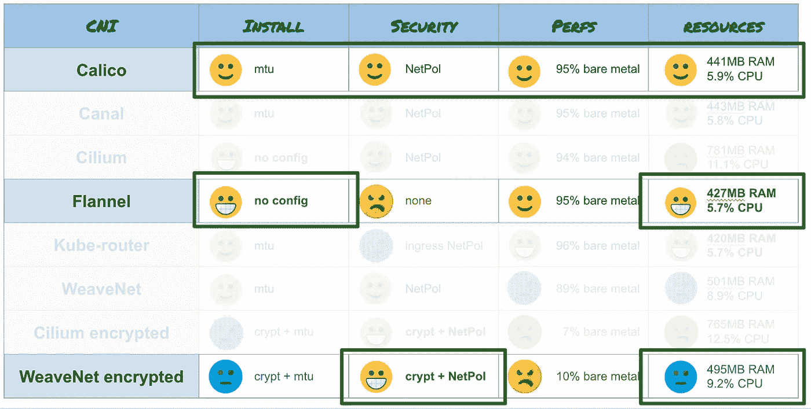**

**放大 CNI 选区**

**编辑:摘要视图已经更新，以显示原始的 CPU 和 RAM 值，而不是计算出来的值，因为计算没有明显的解释。**