# 10Gbit/s 网络上 Kubernetes 网络插件(CNI)的基准测试结果(更新时间:2020 年 8 月)

> 原文：<https://itnext.io/benchmark-results-of-kubernetes-network-plugins-cni-over-10gbit-s-network-updated-august-2020-6e1b757b9e49?source=collection_archive---------0----------------------->

本文是我之前的基准测试( [2018](/benchmark-results-of-kubernetes-network-plugins-cni-over-10gbit-s-network-36475925a560) 和 [2019](/benchmark-results-of-kubernetes-network-plugins-cni-over-10gbit-s-network-updated-april-2019-4a9886efe9c4) )的更新，现在运行的是 2020 年 8 月 CNI 版本最新的 Kubernetes 1.19 和 Ubuntu 18.04。

**内容:**

1.  在我们深入研究指标之前
2.  CNI MTU 调谐
3.  CNI 基准:原始数据
4.  CNI 加密
5.  摘要
6.  结论-我的评论

**TL；对于那些赶时间的人，请查看第 3 节和第 4 节中的图表，或者第 5 节和第 6 节中我对基准测试结果及其解释的看法。**

# 1)在我们深入研究指标之前…

## 1.1)2019 年 4 月以来有什么新消息？

*   **测试您自己的集群:**现在，您可以使用我们发布的“Kubernetes 网络基准测试”工具 knb([https://github.com/InfraBuilder/k8s-bench-suite](https://github.com/InfraBuilder/k8s-bench-suite))在您自己的集群上运行基准测试。
*   **欢迎来到 CNI 战役中的新挑战者**:来自 VMware Tanzu
    -[Kube-OVN](https://github.com/alauda/kube-ovn)的
    -[Antrea](https://antrea.io/docs/master/getting-started/)
*   **新场景:**该基准测试涵盖了“Pod 到 Pod”的网络性能，同时也涵盖了一个新的“Pod 到服务”场景，这是一个真实的测试案例。实际上，您的 API pod 将通过服务使用数据库，而不是来自 pod IP(当然，我们对这两种场景都测试了 TCP 和 UDP)
*   **资源消耗:**现在每个测试都有自己的资源对比。
*   **应用测试被删除:**我们不再运行 HTTP、FTP 和 SCP 测试。我们与社区和 CNI 维护人员卓有成效的合作强调了 iperf TCP 结果和 curl 结果之间的差距，这是由于 CNI 启动的延迟(pod 启动的最初几秒钟，与真实世界的用例无关)。
*   **开源:**所有的基准源(脚本、cni yml 和原始结果)都可以在 github 上获得:[https://github.com/InfraBuilder/benchmark-k8s-cni-2020-08](https://github.com/InfraBuilder/benchmark-k8s-cni-2020-08)

## 1.2)基准协议

整个协议详见[https://github . com/infra builder/benchmark-k8s-CNI-2020-08/blob/master/protocol . MD](https://github.com/InfraBuilder/benchmark-k8s-cni-2020-08/blob/master/PROTOCOL.md)

请注意，目前的文章只关注 Ubuntu 18.04，默认内核。

## 1.3)基准的 CNI 选择

该基准旨在比较可以用单个 yaml 文件设置的 CNI(因此排除了所有基于脚本的安装，如基于 VPP 的 CNI 等)。)

我们将比较的 CNI 如下所列:

*   Antrea v.0.9.1
*   Calico v3.16
*   Canal v3.16(法兰绒网络+印花布网络政策)
*   纤毛
*   法兰绒
*   kube-路由器最新(2020 年 8 月 25 日)
*   编织网 2.7.0

# 2) CNI MTU 调谐

首先，我们将检查 MTU 检测对 TCP 性能的影响:

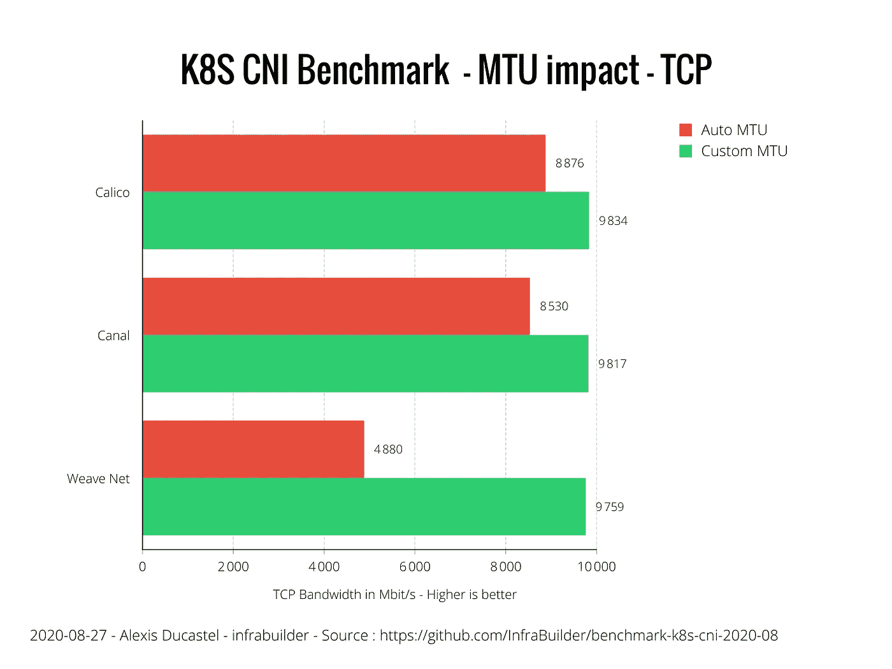

MTU 对 TCP 性能的影响

UDP 暴露了一个更明显的差距:

MTU 对 UDP 性能的影响

考虑到这里揭示的对性能的巨大影响，我们想向所有 CNI 维护者发出一个希望的信息:请在 CNIs 中实现 MTU 自动检测。你将拯救小猫，独角兽，甚至是最可爱的一只:小 devops 家伙！

然而，如果您真的必须选择一个没有实现 auto-MTU 的 CNI，您将需要自己调整它以保持性能。请注意，适用于印花布，运河和编织网。

我给 CNI 维护者的一点信息…

# 3) CNI 基准:原始数据

在本节中，我们将比较 CNI 和正确的 MTU(自动检测或手动调整)。这里的主要目标是以图表的形式呈现原始数据。

**颜色代码:**

*   灰色:参考(又名裸机)
*   绿色:带宽> 9 500 兆比特/秒
*   黄色:带宽> 9 000 兆比特/秒
*   橙色:带宽> 8 000 兆比特/秒
*   红色:带宽< 8 000 Mbit/s
*   Blue : neutral (not-bandwidth related)

## 3.1) Idle

First thing is to establish the CNI consumption when the whole cluster… is taking a little nap ?

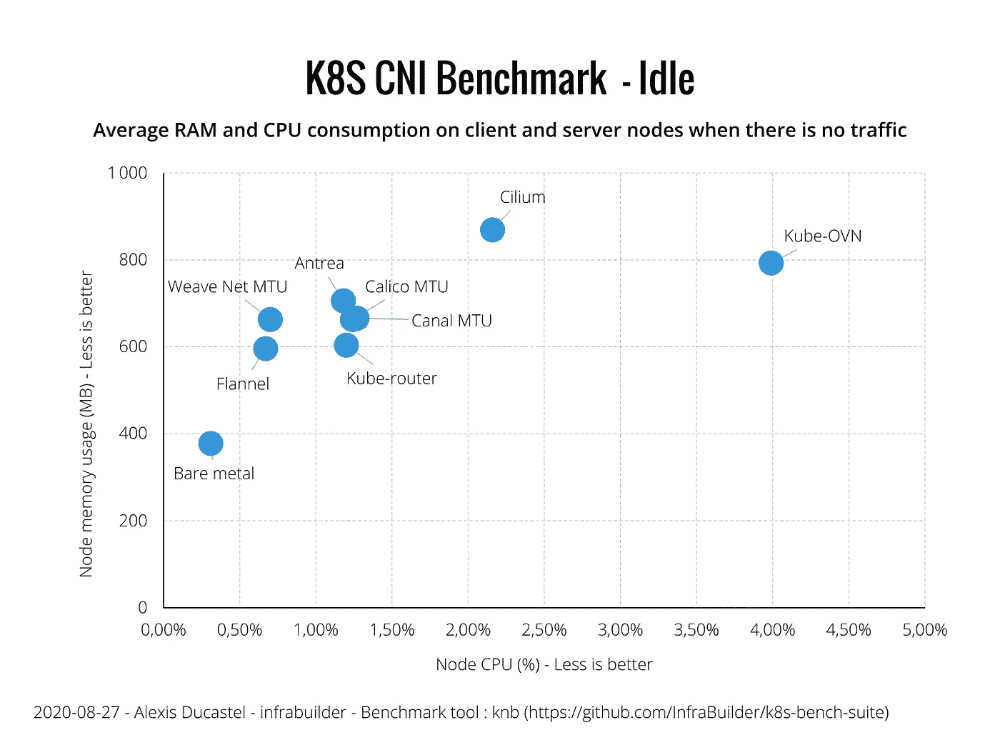

Idle resource consumption

## 3.2) Pod-to-Pod

In this scenario, the client Pod connects directly to the server pod on its IP address.

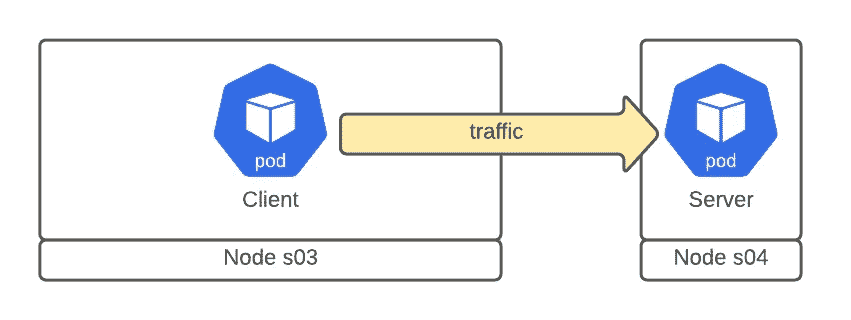

Pod-to-Pod scenario

**3.2.1) TCP**

“ **Pod 到 Pod**”**TCP**和相关资源消耗的结果如下:

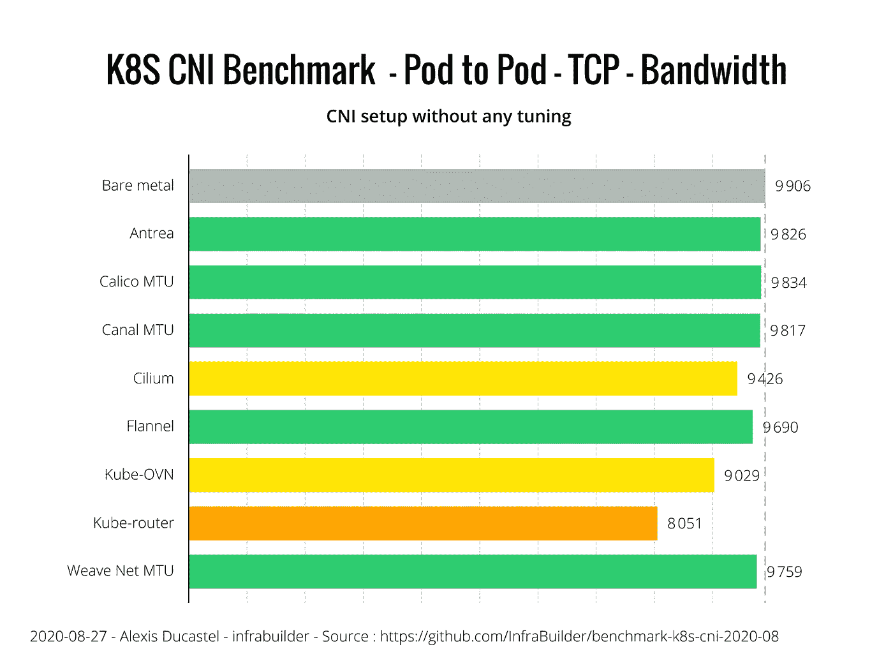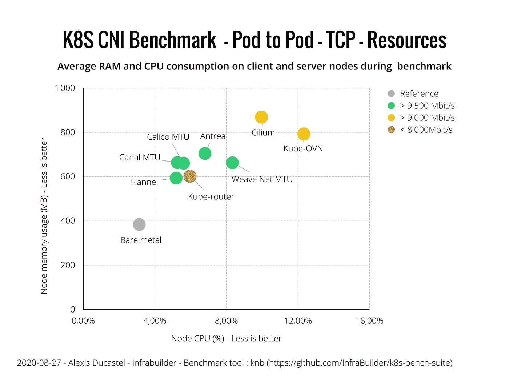

**3.2.2) UDP**

“ **Pod 到 Pod**”**UDP**和相关资源消耗的结果如下:

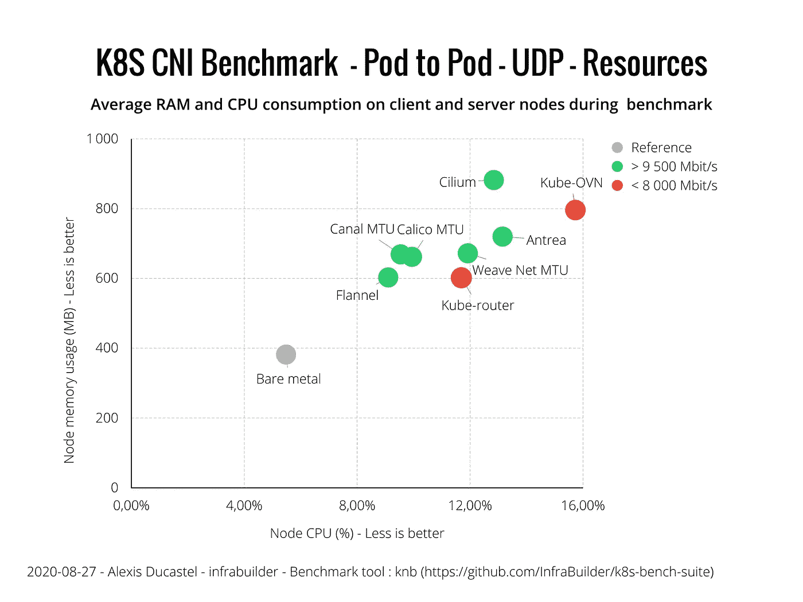

## 3.3) Pod 到服务

在本节中，客户机单元通过 ClusterIP 服务连接到服务器单元。这与真实世界的用例更相关。

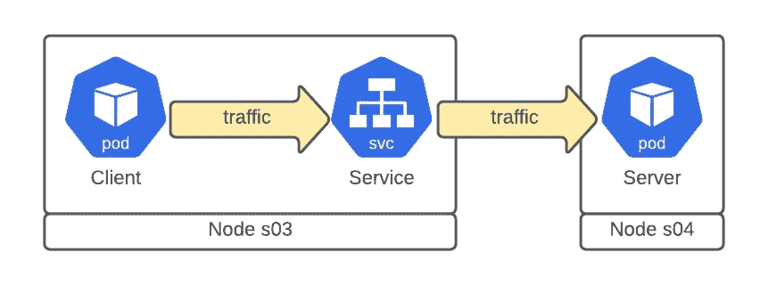

Pod 到服务场景

**3.3.1) TCP**

“**Pod-to-Service**”**TCP**和相关资源消耗的结果如下:

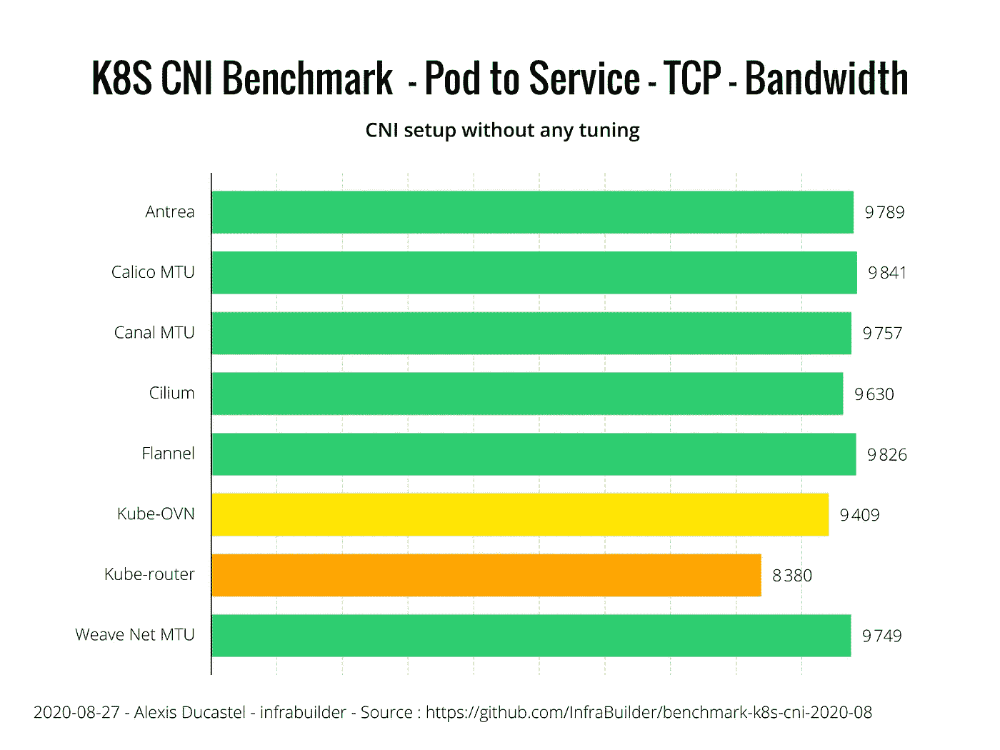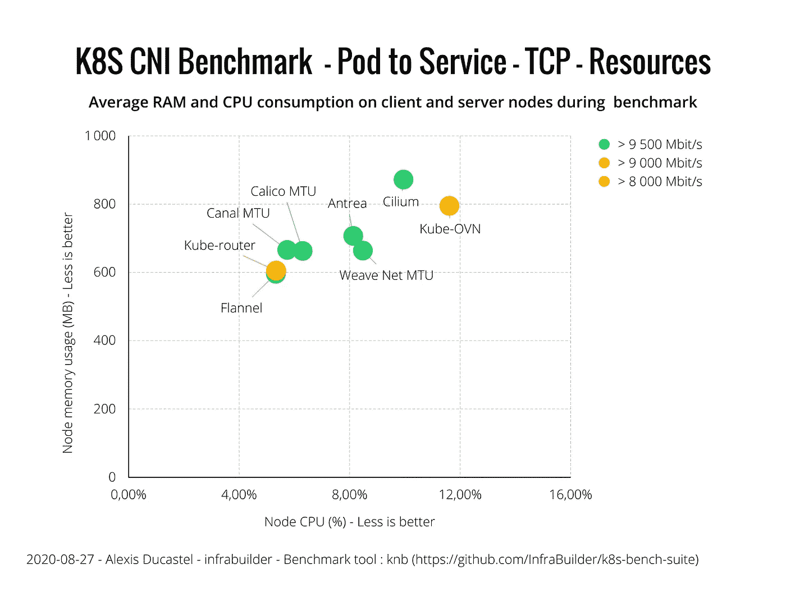

**3.3.2) UDP**

“**Pod-to-Service**”**UDP**和相关资源消耗的结果如下:

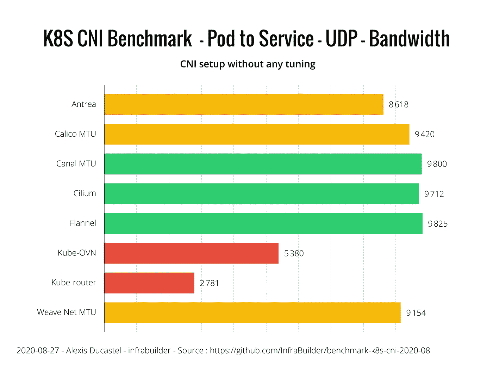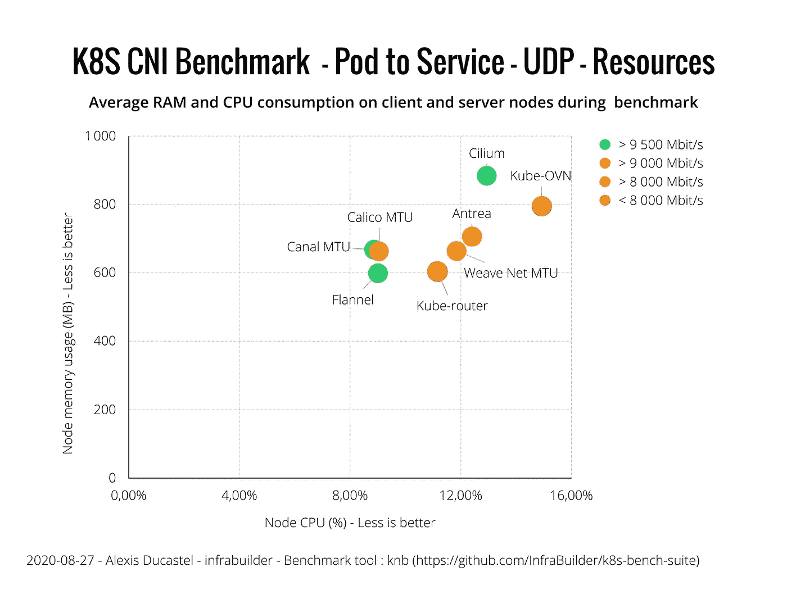

**3.4)网络政策**

在该基准中列出的所有 CNI 中，唯一不完全支持网络策略的是法兰绒。所有其他设备都在正确实施网络策略，包括入口和出口。干得好！

# 4) CNI 加密

在我们测试的所有 CNI 中，下列 CNI 能够加密 pod 间的通信:

*   带有 IPsec 的 Antrea
*   带铁丝网的印花棉布
*   带有 IPsec 的纤毛
*   带 IPsec 的 WeaveNet

## 4.1)带宽

由于这场战斗中的 CNI 较少，让我们在一张图中概括所有场景:

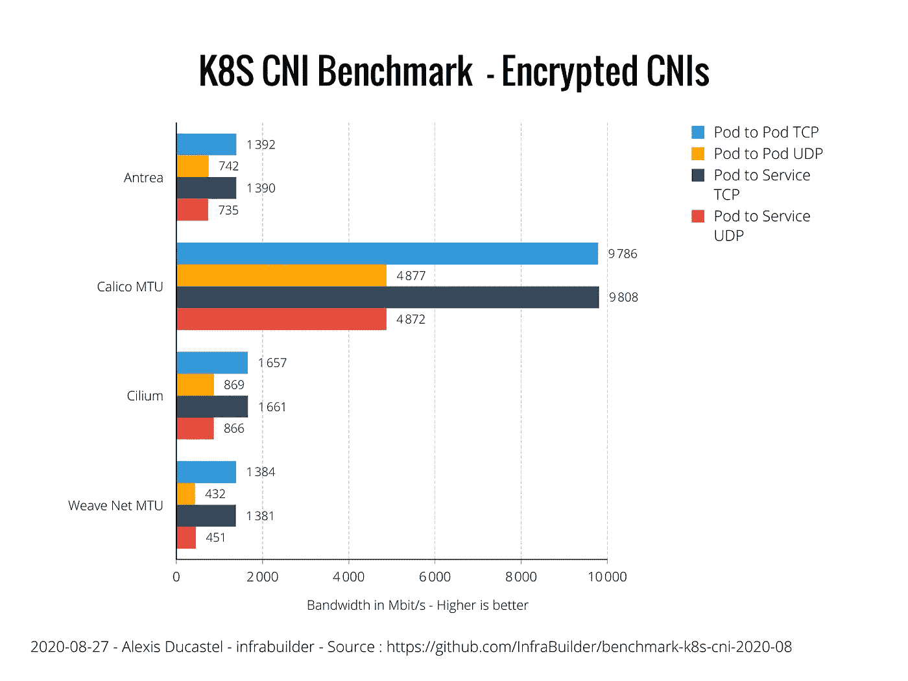

## 4.2)资源消耗

在本节中，我们将研究 TCP 和 UDP 点对点通信所使用的资源。在这里显示 Pod-to-Service 图是没有意义的，因为它没有提供进一步的信息。

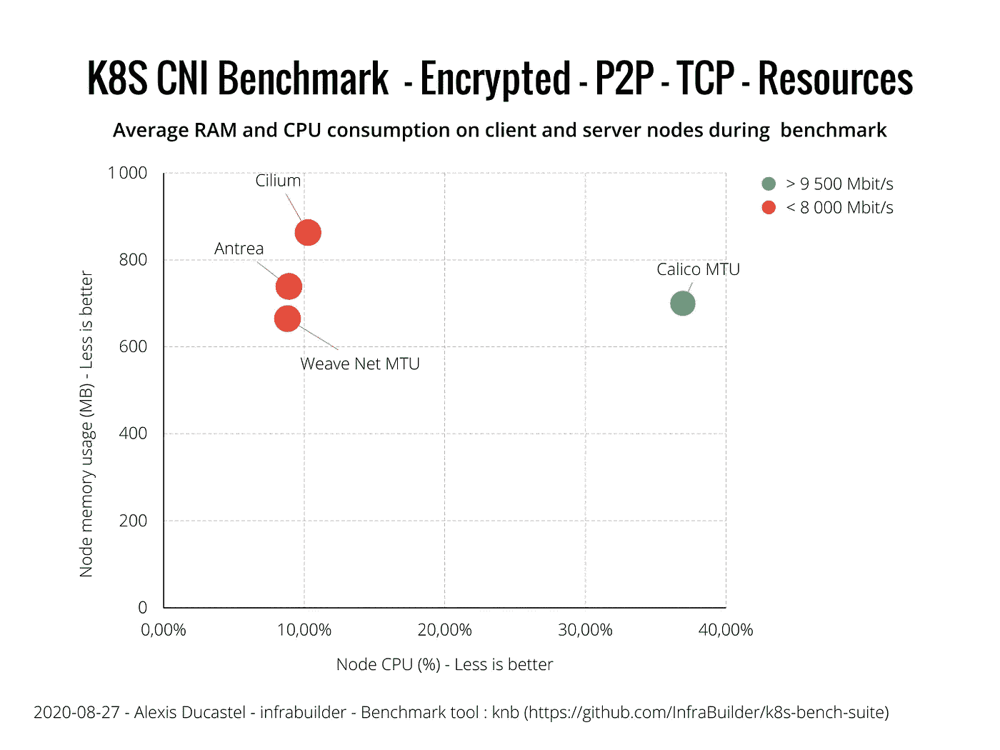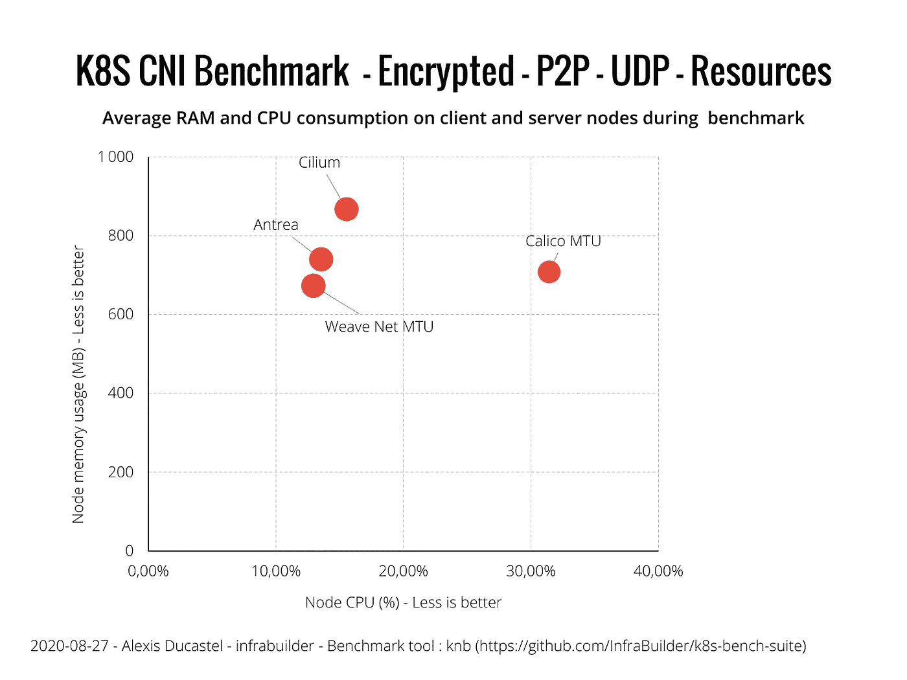

# 5)总结

让我们试着回顾一下这些图表。我们在这里引入了一点主观性，用“非常快”、“低”等限定词代替实际值。

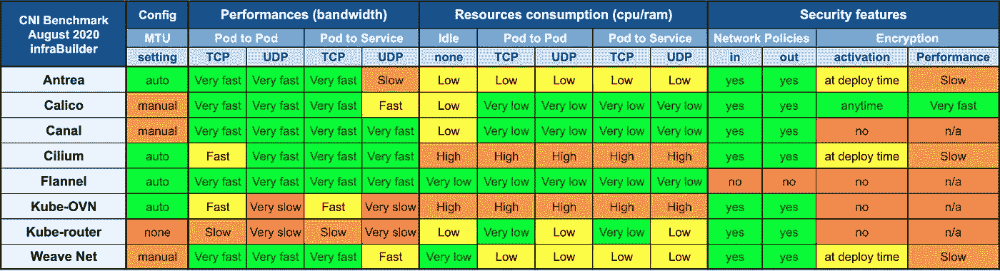

基准测试结果汇总(2020 年 8 月)

# 6)结论-我的评论

最后一部分是主观的，传达了我自己对结果的理解。

很高兴看到 CNI 新人的加入。Antrea 通过提供许多功能玩得很好，甚至在早期版本中也是如此:auto-mtu、加密选项和直接安装。

考虑到性能，除了 Kube-OVN 和 Kube-Router 之外，所有 CNI 都做得很好。关于 Kube-Router，它无法检测 MTU，我在文档中找不到调整它的方法(这里有一个关于 MTU 配置[的公开问题](https://github.com/cloudnativelabs/kube-router/issues/165))。

关于资源消耗，Cilium 仍然比其竞争对手使用更多的 RAM，但该公司公开瞄准大规模集群，这与 3 节点基准测试不完全相同。Kube-OVN 也是 RAM 和 CPU 密集型的，它仍然是一个相当年轻的 CNI，依赖于 Open v switch(Antrea 也是，但 Antrea 更轻，性能更好)。

除了法兰绒之外，所有被测试的 CNI 都执行网络策略。很可能法兰绒永远也不会实现它，因为他们的目的非常明确:越轻越好。

另外，加密性能才是这里真正的“wow 效应”。Calico 是最古老的 CNI 之一，但他们直到几周前才提供加密。他们更喜欢 wireguard 而不是 IPsec，至少可以说，它在这个领域中表现得非常出色，完全是其他 CNI 所没有的。当然，由于加密负载，它消耗了大量的 CPU，但它们实现的带宽完全值得(记住，Calico encrypted perf 比排名第二的 Cilium 大约好 6 倍)。此外，您还可以在群集上部署 Calico 后随时激活 wireguard 加密，您也可以在短时间内或永远禁用它。这是非常用户友好的。但是！我们提醒您，Calico 目前无法自动检测 MTU(该功能计划在不久的将来发布)，因此如果您的网络支持巨型帧(MTU 9000)，请不要忘记调整 MTU。

此外，请注意，Cilium 能够加密整个节点到节点的流量(不仅仅是 pod 流量)，这对于面向公众的集群节点来说可能是一个非常有吸引力的功能。

最后，以下是我对以下用例的建议:

*   **我需要一个 CNI 用于额外的小节点集群或者我不关心安全** 那么就用**法兰绒**，这几乎是最轻的稳定 CNI。
    ( *也是最古老的。根据传说，它是由 Homo-Kubernautus 或 Homo-Containorus* 发明的。不妨对辉煌 [k3s](https://k3s.io/) 项目感兴趣！看看吧！
*   **我需要一个 CNI，用于我的标准集群** 好的， **Calico** 是你的选择，**如果有必要的话，不要忘记调整 MTU** 。您可以玩网络策略，轻松启用/禁用加密等。
*   我的(非常)大规模集群需要一个 CNI。我很乐意为之努力，但我们没有数百台 10Gbit/s 连接的服务器。所以最好的选择是在至少有**印花布**和**纤毛**的节点上运行定制的基准。

感谢阅读！