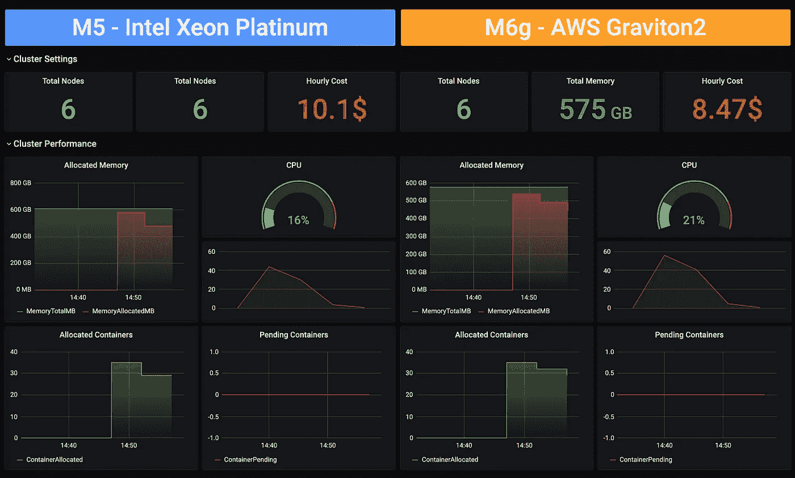
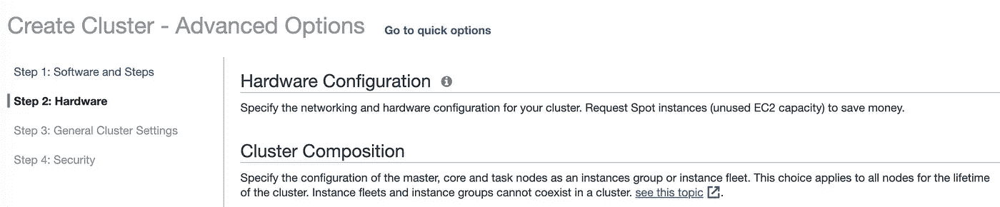
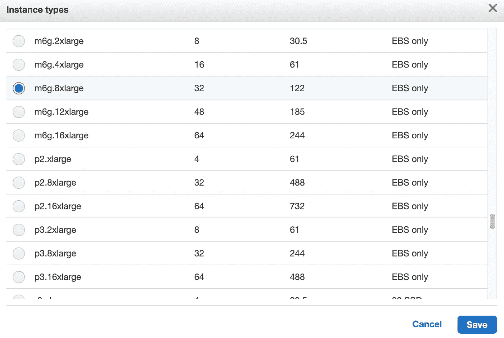
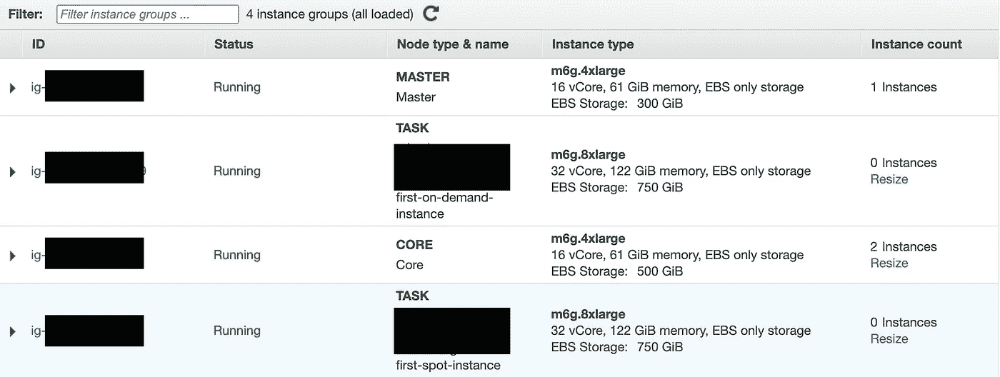
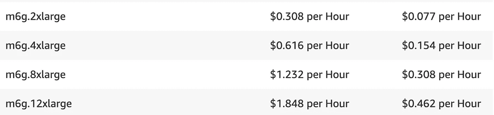
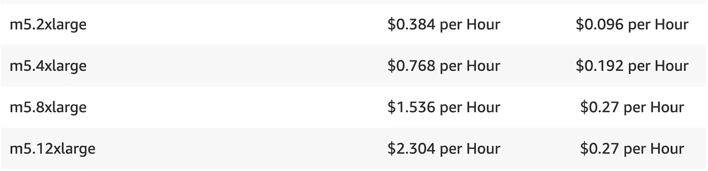
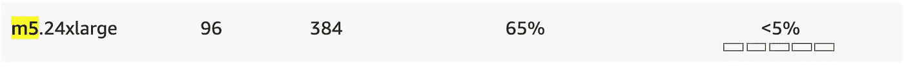
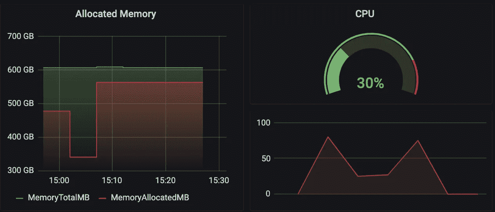
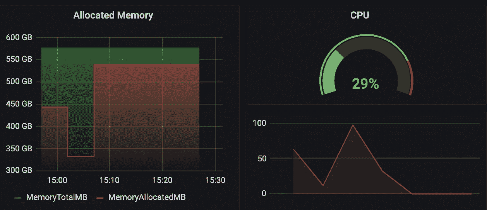
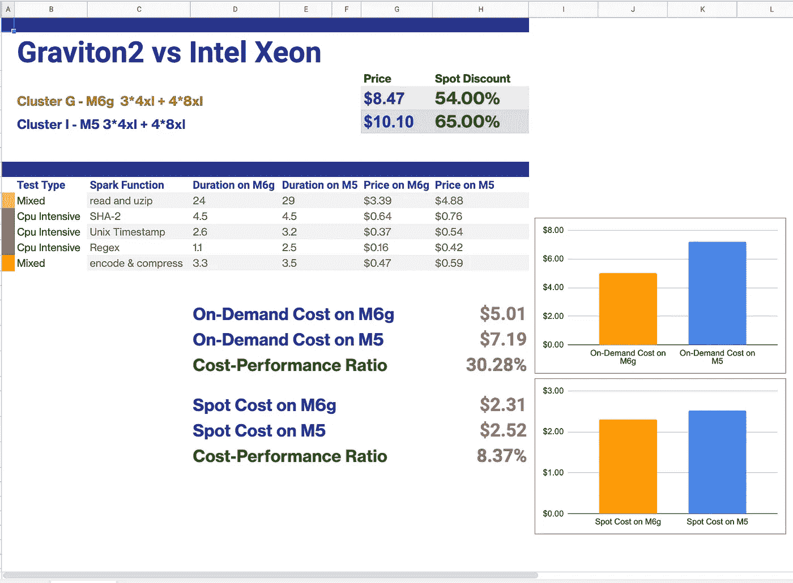

# 用 Apache Spark 工作负载对 Graviton2 处理器进行基准测试

> 原文：<https://itnext.io/benchmarking-graviton2-processors-with-apache-spark-workloads-4bd9415374e7?source=collection_archive---------2----------------------->

# 介绍

Amazon EC2 提供了广泛的计算实例组合，包括许多采用最新一代英特尔和 AMD 处理器的实例。AWS Graviton2 处理器增加了更多选择。AWS Graviton2 处理器由 AWS 定制[，使用 64 位 Arm Neoverse 内核，为运行在 Amazon EC2 上的工作负载提供最佳性价比。](https://en.wikipedia.org/wiki/Annapurna_Labs)

2020 年 10 月 16 日，亚马逊[宣布](https://aws.amazon.com/about-aws/whats-new/2020/10/amazon-emr-provides-lower-cost-improved-performance/)EMR 现在支持亚马逊 EC2 M6g，并在基于 Graviton2 的实例上为 [Apache Spark](https://spark.apache.org/docs/latest/) 工作负载提供高达 35%的低成本和高达 15%的性能提升。

# 目标

显然，这些对所有 EMR 用户来说都是好消息。特别是对于那些在 EMR 上运行非常繁重的工作负载的人，底层 EC2 机器的每月成本非常高。本文的主要目标是探索从基于英特尔 M5 实例的 EMR 到基于 AWS Graviton2 M6g 的 EMR 的迁移过程，并创建 M6g 与 M5 的性能基准。

# 移民

迁移到基于 M6g 的 EMR 非常简单。Amazon EMR 在以下地区的 EMR 版本 6.1.0 和 5.31.0 及更高版本上支持 Amazon EC2 M6g 实例:美国东部(北弗吉尼亚)、美国东部(俄亥俄州)、美国西部(俄勒冈州)、欧盟(爱尔兰)、欧盟(法兰克福)和亚太地区(东京)。

因此，如果您正在其中一个区域运行，只需创建一个新的 EMR 集群，单击高级选项，并导航到硬件步骤

集群组成

在“集群节点和实例”部分，单击实例类型并选择 M6g 类型。

M6g 实例类型

为集群的所有节点类型选择 M6g，然后按“创建集群”。当集群启动时，确保所有正在运行的实例都是 M6g。

以上所有操作也可以通过 EMR 的 [CloudFormation 模板来完成。](https://docs.aws.amazon.com/AWSCloudFormation/latest/UserGuide/aws-resource-elasticmapreduce-cluster.html)

# 费用

我将对两个 EMR 集群使用相同的设置:1 个主节点(4xlarge)、2 个核心节点(4xlarge)、4 个按需任务节点(8xlarge)。

在这种设置下，基于 M6g 的 EMR 集群的小时价格

M6g 成本表

将是 3 *(0.616+0.154)+4 *(1.232+0.308)= 2.31+6.16 = 8.47 美元

基于 M5 的电子病历相同设置

M5 成本表

将花费 3 *(0.768+0.192)+4 *(1.536+0.27)= 10.1 美元

以上价格均基于[亚马逊 EMR us-west-2](https://aws.amazon.com/emr/pricing/)定价表。我们可以看到，基于 M6g 实例的 EMR 集群比基于 M5 实例的 EMR 集群便宜 **17%** 。节省 17%是很棒的，但这与 T4 宣布的 35%相差甚远。另一个悬而未决的问题是这两种类型的 spot 实例的可用性以及 AWS 在 M6g 和 M5 上提供的折扣。现在，我可以看到 M6g spot 实例上的按需节省高达 54%(美国西部 2)

M6g Spot 实例

同时，你可以得到高达 65%的 M5 机器的折扣

M5 现货实例

我不会讨论 spot 实例，但是请注意，根据 AWS 地区和当前的可用性，M5 spot 实例的价格可能低于 M6g spots 的价格。在这种情况下，使用 [EMR 实例群](https://docs.aws.amazon.com/emr/latest/ManagementGuide/emr-instance-fleet.html)可能是个好主意。

# 基准

现在，让我们通过在相同的输入上运行相同的作业，在 EMR(M5)和 EMR(M6g)之间创建一个直接的性能比较。输入数据是 150GB 的压缩 CSV 文件，包含 885743562 行。我将通过将输入数据帧预缓存到 spark 内存中来最大限度地减少 IO 时间，然后在测量处理时间、CPU 和内存使用量的同时，对整个数据集运行繁重的转换。

源代码

对于数据集转换，我将使用 Apache Spark [内置的](https://spark.apache.org/docs/latest/api/sql/index.html)函数，如 sha2、from_unixtime、regexp_extract、text to parquet writer。所有这些函数都是计算密集型的，并且对于比较不同处理器的性能是可靠的。

## 测试 1(第 10 行):读取、解压缩、缓存。

该测试 EMR(M5)在 29 分钟内完成，EMR(M6g)仅在 24 分钟内完成，快了 21%。我们记得这个测试不是百分之百可靠的，因为它涉及到大量的 IO(从 AWS S3 读取 150GB 到集群的内存中)。

M6g

M5

*获胜者:M6g*

## 测试 2(第 14 行):计算列的 SHA-2 校验和。

从该测试开始，所有数据都缓存到内存中，不涉及 IO。因此，以下所有测试都将是 CPU 能力的重要指标。两个集群都在 4.5 分钟内完成了校验和计算。其实 M6g 快了一点，但是真的很接近。这里没有赢家。

M6g

M5

*获胜者:平局*

## 测试 3(第 17 行):将 Unix 时间戳转换为日期时间字符串

在这个测试中，M6g 的表现比 M5 好得多。在 M6g 机器上转换 Unix 时间戳需要 2.6 分钟，而在 M5 上需要 3.2 分钟，快了 19%。

M6g

M5

*获胜者:M6g*

## 测试 4(第 22 行):提取一个匹配正则表达式的组

M6g 通过击倒对手进行测试。在 M6g 上执行正则表达式比在 M5 上快 2.2 倍。

*获胜者:M6g*

## 测试 5(第 27 行):创建拼花文件

就像测试 1 一样，这个测试不是 100%可靠的，因为它包含了一个 CPU 密集型任务(创建一个 parquet 格式的数据)和一个 IO 密集型任务(写 S3 对象)。基于 M6g 的 EMR 表现稍好，完成该测试只需 3.3 分钟，而基于 M5 的 EMR 需要 3.5 分钟。

*获胜者:M6g*

# 资源

这些测试在每个集群上分配了 35 个执行器。每个执行器在 M5 上配置了 4 个内核和 14GB 内存，在 M6g 上配置了 13GB 内存。总共:140 个内核，490GB/455GB 可访问内存，50 GB 内存用于纱线开销。在测试过程中，两个集群的平均 CPU 利用率都在 30%左右。

M5

M6g

# 摘要

我的结论是，与 M5 相比，M6g 在性能方面做得非常好。在 Apache Spark 工作负载测试中，M6g 取得了 5 轮中的 4 轮。当从结果中移除异常值时，M6g 的性能比 M5 高 18%。

就 EMR 的按需价格而言，M6g 降低了 16%的成本。对于像 12XLarge 这样的大型机器来说，成本降低会更低，因为出于某种原因，M6g 机器上的 ERM 成本比 M5 机器高得多(0.462 比 0.27)。

M6g

M5

另一个问题是 spot 实例的成本。M6g 的按需购买机器的成本折扣高达 54 %, M5 高达 65%。因此，如果您非常依赖 spot 实例，使用 M5s 时总价格可以更低。

总之，在按需实例上运行时，总的性价比提高了大约 30%,而在完全在现场实例上运行时，只有大约 8%。

性价比

希望这个基准对你有用。我非常有兴趣了解您在 Graviton2 上运行的 Apache Spark 工作负载，尤其是如果您在稳定性、性能或定价方面有任何有趣的发现。