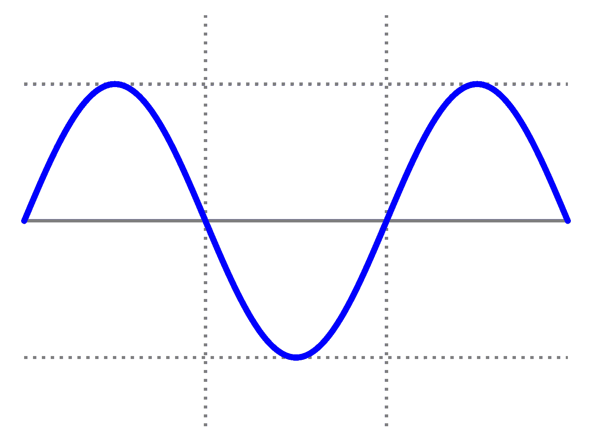

# 基准正弦函数。

> 原文：<https://itnext.io/benchmarking-sine-functions-16b067bf63ce?source=collection_archive---------6----------------------->

很少有人想避开 [sin()](https://www.tutorialspoint.com/c_standard_library/c_function_sin.htm) 函数，但是，在一些情况下，这样做是有益的。本文针对线性插值波表、混叠波表、无限脉冲响应正弦波和七个不同精度的多项式近似值，对常规 sin()函数进行了基准测试。

IIR 正弦波是用初始参数设置的，然后在每个节拍的基础上调用，这不是那种每次调用都要传递参数的函数；正在初始化。当您需要简单、高质量的低成本正弦波时，这些非常适合音频应用。提供的所有其他函数都被设计为在每次调用时传递θ、ω、弧度、度数等。

在我们继续之前，您可能想看看基准测试的代码并自己编译它，如果不是这样也没关系，但是如果您这样做了，就在这里:
[https://gist . github . com/mrbid/1 f 25 bfc 27d 97 b 81 D5 d 9 e C5 e 45 f 81 a6 e 1](https://gist.github.com/mrbid/1f25bfc27d97b81d5d9ec5e45f81a6e1)
使用命令编译；`gcc sine_bench.c -Ofast -lm -o sine_bench`

对于基准测试，需要记住的一点是，这些基准测试是在启用了-Ofast 优化标志的情况下执行的，其原因是，与仅使用常规的 sin()函数相比，性能增益非常有限，以至于没有任何性能增益值得精度损失。

```
Slowest to fastest...
Executions in 1 second...
-------------------------
sin():         26,557,697
fast_sin1():   33,017,414
fast_sin2():   34,991,929
lerp_sin():    37,344,972
fast_sin4():   37,701,782
fast_sin7():   45,245,155
fast_sin5():   45,613,310
fast_sin3():   45,926,931
fast_sin6():   46,565,172
aliased_sin(): 47,113,225
IIRSine2():    69,406,434
IIRSine():     70,789,548
```

首先，我们可以看到`IIRSine()`明显更快，所以如果你可以使用这些函数，这是显而易见的。我们也看到`sin()`通常是最慢的，但这是精度函数的预期，当我们寻找更快的替代方案时，我们必须牺牲精度。

现在，我们来看看函数的精度，平均偏差超过 6 位小数(0.000001):

```
Avg error of functions from 0 to 3.1 ...
----------------------------------------
lerp_sin():    0.000032
aliased_sin(): 0.000030
fast_sin1():   0.002653
fast_sin2():   0.000125
fast_sin3():   0.035730
fast_sin4():   0.000012
fast_sin5():   0.000832
fast_sin6():   0.378000
fast_sin7():   2.774034Avg error of functions from 0 to 6.3 ...
----------------------------------------
lerp_sin():    0.000032
aliased_sin(): 0.000030
fast_sin1():   0.002660
fast_sin2():   0.000125
fast_sin3():   5.304368
fast_sin4():   0.181263
fast_sin5():   0.386772
fast_sin6():   3.512034
fast_sin7():   41.145363Avg error of functions from 0 to 9.4 ...
----------------------------------------
lerp_sin():    0.000032
aliased_sin(): 0.000030
fast_sin1():   0.002661
fast_sin2():   0.000121
fast_sin3():   64.467628
fast_sin4():   33.455360
fast_sin5():   1.473552
fast_sin6():   11.423285
fast_sin7():   471.490936Avg error of functions from 0 to 12.6 ...
-----------------------------------------
lerp_sin():    0.000031
aliased_sin(): 0.000030
fast_sin1():   0.002621
fast_sin2():   0.000117
fast_sin3():   322.956146
fast_sin4():   1181.200317
fast_sin5():   1.779256
fast_sin6():   22.638031
fast_sin7():   3915.010742
```

我们可以看到，`aliased_sin()`是迄今为止最精确的近似值，但仅略高于`lerp_sin()`。`aliased_sin()`的计算速度也比多项式逼近快得多，而且精度保持得更久。所有的多项式近似都变得相当糟糕——相当快，除了 [nightcracker](https://www.gamedev.net/nightcracker/) 在 [GameDev 论坛](https://www.gamedev.net/forums/topic/621589-extremely-fast-sin-approximation/)上的`fast_sin2()`。`fast_sin1()`也很不错，但它总是比`fast_sin2()`稍慢，也不太准确。

从这些结果中，我可以总结出，如果你真的需要高性能和高质量的正弦波，可以使用`IIRSine()`函数，否则，你必须不惜一切代价避免`sin()`函数，那么你最好的选择是尝试线性插值波表或混叠波表`lerp_sin()`和`aliased_sin()`函数，它们分别比原始`sin()`函数快 33.7%和 55.8%，是最快和最精确的替代方案。但是，如果内存是一个限制，并且您真的无法为一个波表留出 1024 字节到 262 千字节的空间，那么`fast_sin2()`多项式就是您的下一个最佳选择。

最后说明:
*`*lerp_sin()*`*函数使用带线性插值的 256 样本波表，而* `*aliased_sin()*` *函数使用不带插值的 65536 样本波表。* `*aliased_sin()*` *结果更准确的原因很简单，因为有更多的样本，而且事实证明，在现代硬件上，有更多样本比有更少样本的插值更快。**

**

*图片来源:[维基百科](https://commons.wikimedia.org/wiki/File:Simple_sine_wave.svg)*