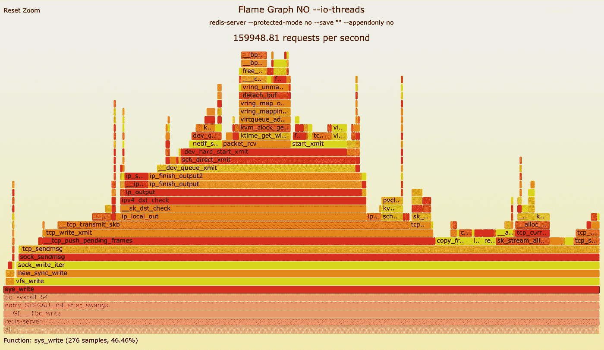
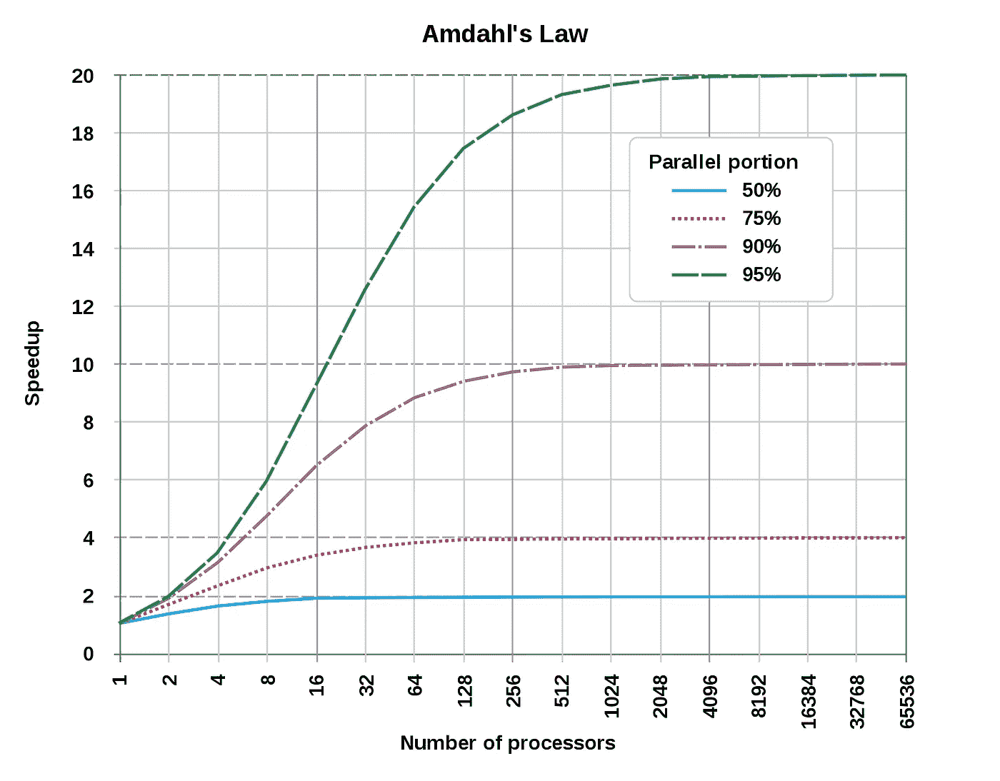
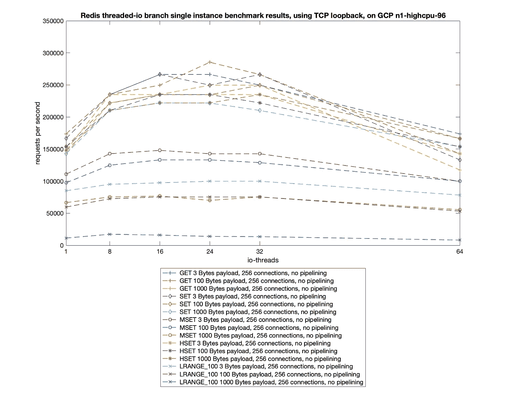
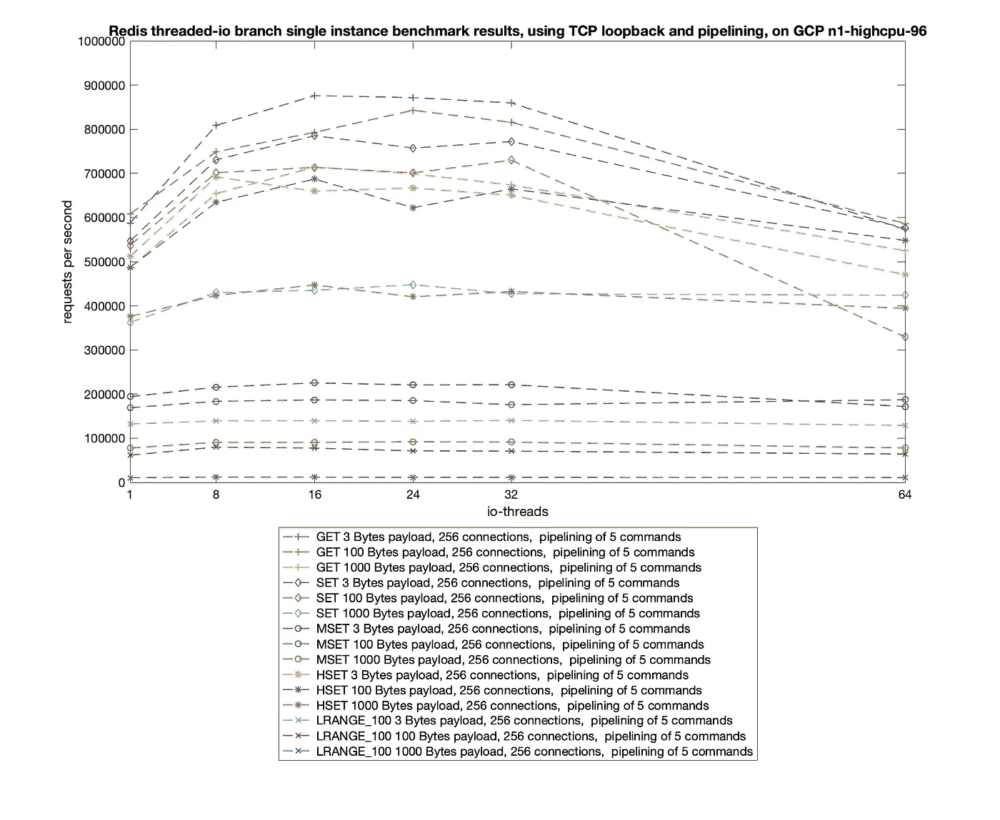
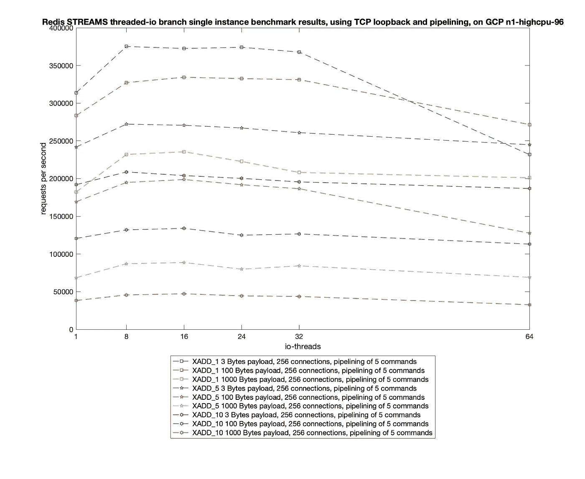
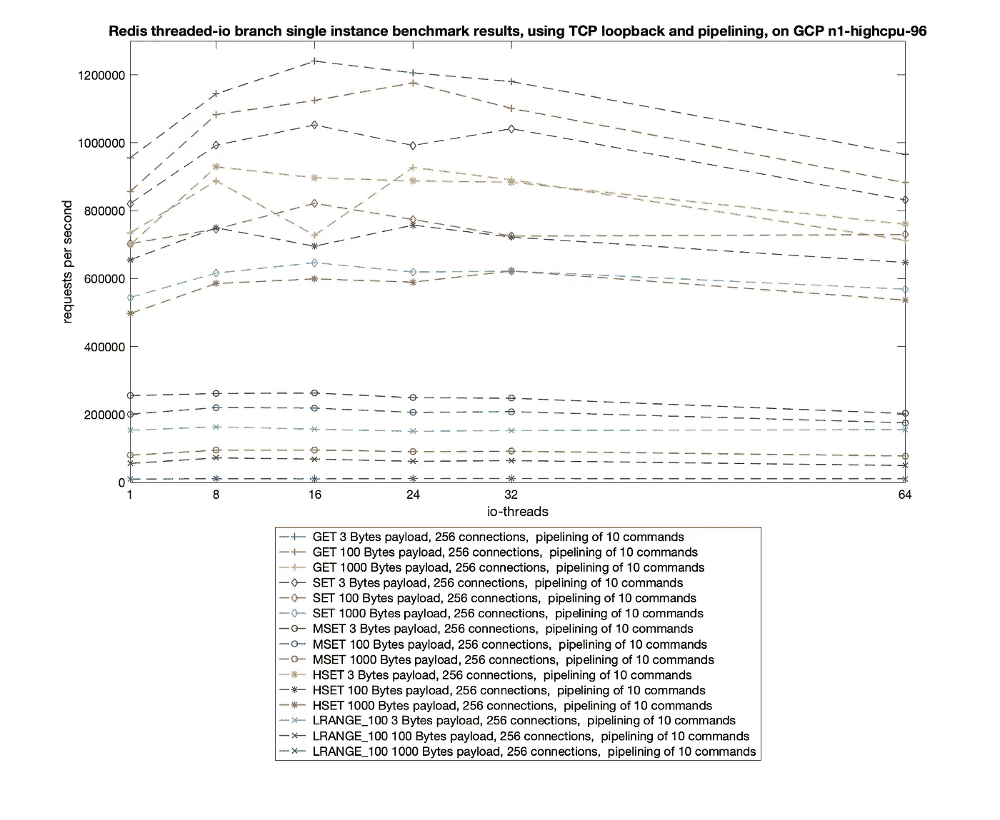
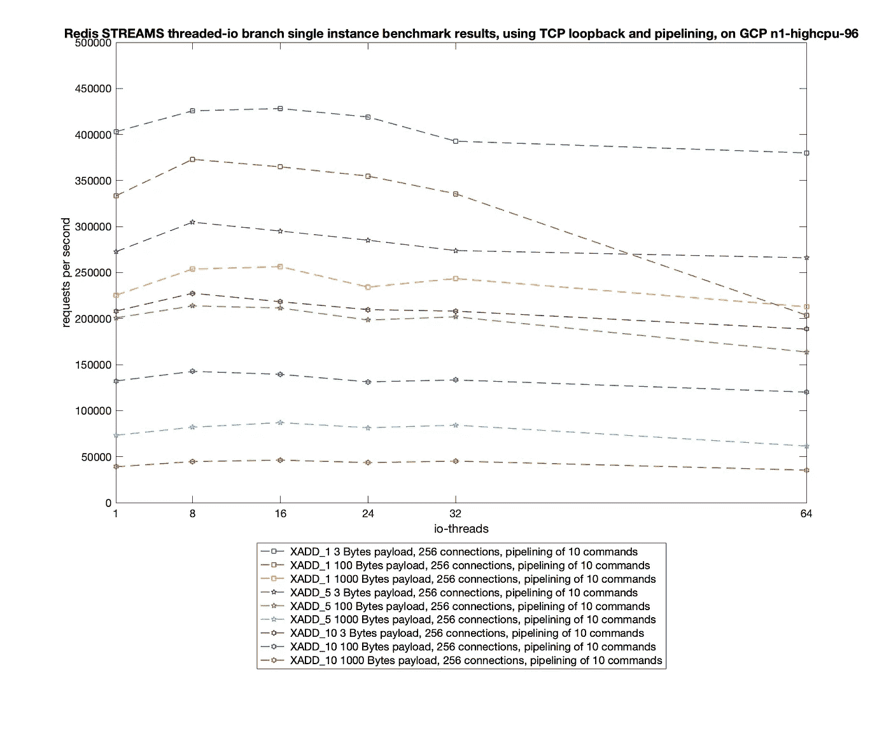
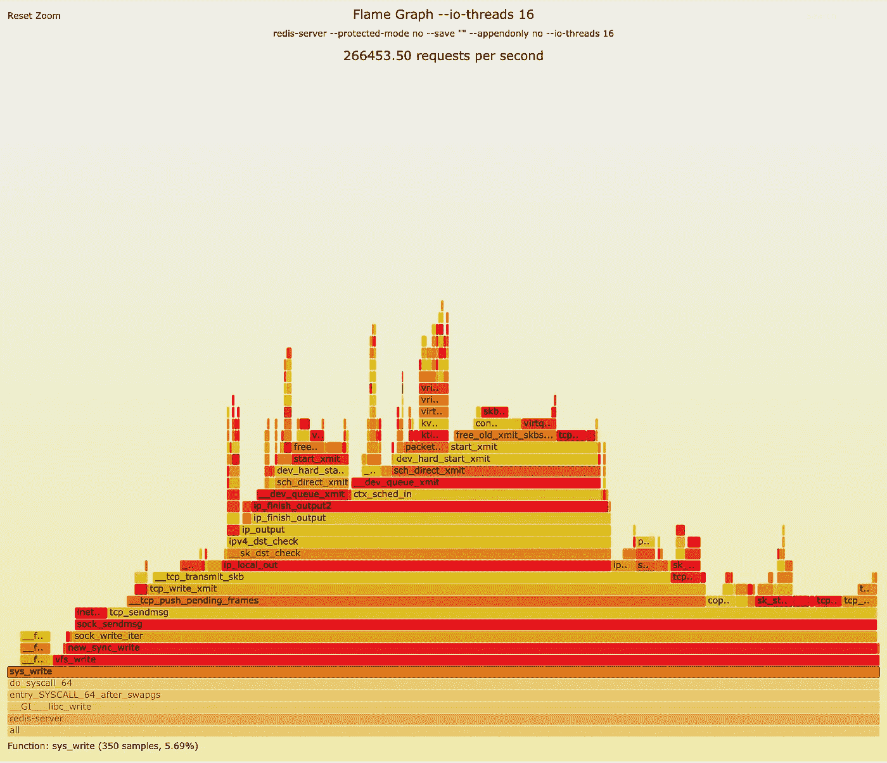

# 实验性 Redis 多线程 I/O 的基准测试

> 原文：<https://itnext.io/benchmarking-the-experimental-redis-multi-threaded-i-o-1bb28b69a314?source=collection_archive---------4----------------------->

Redis 通常被认为是一个单进程、单线程模型。对于较新版本的 Redis，情况并非如此。


**金门大桥** —这张照片是 2019 年 3 月 30 日在旧金山湾拍摄的，当时正在为 RedisConf 19 做准备

引用[官方文件](https://redis.io/topics/faq):

> 从 Redis 4.0 开始，我们开始让 Redis 更加线程化。目前，这仅限于在后台删除对象，以及阻止通过 Redis 模块实现的命令。对于下一个版本，计划是让 Redis 越来越线程化。

Redis 运行多个后端线程来执行后端清理工作，比如清理脏数据和关闭文件描述符。当你在每次后台保存时派生子进程时，它不再是单进程。

要使 Redis 更加多线程化，最简单的方法是，一旦 Redis 需要执行任何写或读操作，这项工作就由 N 个先前分散的 I/O 线程来执行。没有增加太多的复杂性，因为主线程仍然负责主要任务，但是大部分优势，因为 Redis 花费的大部分时间都在 IO 上，通常，Redis 的工作负载要么是内存，要么是网络。

## 1)调优 Redis 虚拟机并找出哪些 Redis 代码路径是热的(CPU 上繁忙)

为了找出我们在 io 上花费了多少时间，我们在 GCP 上设置了两个 **n1-highcpu-96** 实例，其中一个我们将运行 redis-server(从线程化 IO 分支),另一个我们将运行 redis-benchmark。

为了以最高效的方式运行 redis-server，我们使用 tuned-adm **吞吐量-性能配置文件**和手动设置，通过以下方式调整了两个 **n1-highcpu-96** 实例:

*   禁用**调谐**和 **ktune** 节电机制。
*   启用 **sysctl** 设置，提高您的磁盘和网络 I/O 的吞吐量性能，并切换到**截止时间调度器**。
*   将 CPU 调节器设置为`performance.`
*   手动禁用透明大页面。
*   手动将 somaxconn 提高到 65535。
*   手动将 vm.overcommit_memory 从 0(默认值)设置为 1(从不拒绝任何 malloc)。

我们上面提到的手动设置可以通过运行以下命令来实现。最后一项确保 sysctl 设置会立即生效。

```
***sudo -i*** echo never > /sys/kernel/mm/transparent_hugepage/enabledsysctl -w vm.overcommit_memory=1
sysctl -w net.core.somaxconn=65535
*sysctl -p*
```

## 1.1)分析单线程 redis 服务器

**1.1.1 ) redis-server 虚拟机**

现在，我们已经针对服务器工作负载调整了虚拟机，我们可以在其中一个虚拟机上启动 redis-server 实例，配置如下:

```
**fcosta_oliveira@n1-highcpu-96-redis-server-1**:**/**redis-server --protected-mode no --save "" --appendonly no   --daemonize yes
```

**1.1.2 ) redis 基准虚拟机**

为了评估 Redis 的性能并生成我们分析 Redis 所需的多个工作负载，我们将在整篇文章中使用 redis-benchmark。官方的 redis-benchmark 程序是获取一些数据的一种快速而有用的方法。

我们已经派生出官方版本，并在 github 存储库之后的[中包含了对新流数据类型的测试。我们目前正在等待](https://github.com/filipecosta90/redis/tree/benchmark_xadd)[的公关修订](https://github.com/antirez/redis/pull/6015)，以便将其纳入 Redis。

在本节中，我们只对验证 Redis 花费在 IO 上的时间感兴趣，以便能够使用 Amdahl 定律来预测使用并行工作负载时的理论加速。为此，我们将使用新的线程 redis 基准来发送 1000 万个 GET 命令，由 150 个客户端发出，密钥大小为 100 字节。

```
**fcosta_oliveira@n1-highcpu-96-redis-benchmark-1**:**~/**redis-benchmark -t get -c 150 -n 10000000 — threads 46 -h {ip of redis-server vm} -d 100
```

**1.1.3)运行基准工具**时分析堆栈轨迹

当我们从**n1-high CPU-96-redis-benchmark-1**虚拟机运行基准测试时，我们可以通过运行以下命令，使用 Linux perf_events(又名“perf”)以 99Hz 堆栈样本的固定采样率分析**n1-high CPU-96-redis-server-1**虚拟机、中的 redis-server 堆栈跟踪:

```
**fcosta_oliveira@n1-highcpu-96-redis-server-1**:**~/**sudo perf record -F 99 — pid `pgrep redis-server` -g -o 100_bytes_no_iothreads
```

产生下面的火焰图:



Redis 服务器在实验性 Redis 多线程 I/O 改进前的执行时间记为 t，它包括不会从资源改进中受益的部分的执行时间和会从中受益的部分的执行时间。从前面的 flame 图可以看出，46.6%的执行时间(花费在 sys_write 上)可能是实验性 Redis 多线程 I/O 加速的主题。

加速受到程序串行部分的限制，在我们的例子中为 53.4%，导致使用并行计算的理论最大加速为 2 倍，如下图的蓝线所示。



根据阿姆达尔的理论加速定律，进化是一个程序执行的等待时间与执行它的处理器数量的函数关系。从[https://en.wikipedia.org/wiki/Amdahl%27s_law](https://en.wikipedia.org/wiki/Amdahl%27s_law)检索的图像。

## 2)为我们的基准设定硬性限制

**2.1)网络硬限制**

网络带宽和延迟通常会直接影响 Redis 的性能。在进一步进行基准测试之前，我们将使用 qperf 检查基准测试和 redis-server 虚拟机之间的延迟。

以下输出的实验结果是针对单租户非拥塞网络的，其中没有来自其他应用程序的后台流量，因此没有网络干扰。

```
**fcosta_oliveira@n1-highcpu-96-redis-benchmark-1**:**~/qperf**$ qperf -t 60 -v {ip of redis-server vm} tcp_bw 
**tcp_lattcp_bw:**    
   bw              =  3.05 GB/sec    
   msg_rate        =  46.5 K/sec    
   time            =    60 sec    
   send_cost       =   248 ms/GB    
   recv_cost       =   181 ms/GB    
   send_cpus_used  =  75.6 % cpus    
   recv_cpus_used  =  55.3 %
**cpustcp_lat: **   
    latency        =  27.6 us    
    msg_rate       =  36.3 K/sec    
    time           =    60 sec    
    loc_cpus_used  =  14.6 % cpus    
    rem_cpus_used  =  15.9 % cpus
```

我们可以观察到网络的实测带宽为 3.05 GB/秒(24.4Gbits 秒)。Redis 中为每个键设置 100 个字节值的基准将被网络硬限制在大约每秒 3200 万次查询。

**2.2)内存硬限制**

浏览 Redis 官方文档，

> RAM 的速度和内存带宽对于全局性能似乎不太重要，尤其是对于小对象。对于大对象(> 10 KB)，这可能会变得很明显。

尽管如此，我们将使用 STREAM 对 VM 内存带宽进行基准测试，这是一个旨在表示长向量上的操作的基准测试，广泛用于研究、测试和营销目的。

以下命令获取流，并将数组大小设置为大于 n1-highcpu-96 缓存。我们已经重复了 10 次测试，并放弃了第一次。

```
git clone [https://github.com/jeffhammond/STREAM.git](https://github.com/jeffhammond/STREAM.git)
cd STREAM/
gcc -fopenmp -D_OPENMP -O -DSTREAM_ARRAY_SIZE=100000000 stream.c -o stream.100M
export OMP_NUM_THREADS=48
./stream.100M
```

流的第二次运行如下所示。

我们可以观察到副本内核的最佳速率 GB/s 约为 83GB/s。例如，Redis 中为每个键设置 100 个字节值的基准测试会“天真地”受到 VM 内存的硬限制，约为每秒 8.9 亿次查询。我们没有考虑不同的内存访问模式和无效性——测得的最佳速率和硬限制只是相对粗略的估计。

# 3)针对不同的配置运行基准测试

我们的实验研究从考虑内存密集型工作负载开始，这些工作负载执行具有不同特征的内存到内存网络 I/O，即:

*   **设置**，向 Redis 服务器产生写请求。写请求时间复杂度为 O(1)。
*   **GET** ，生成对 Redis 服务器的读取请求。读请求时间复杂度为 O(1)。
*   **MSET** ，在数据结构上生成写请求，其中插入或检索数字比 SET O(1)请求花费更高的时间复杂度 O(N)，其中 N 是要设置的键的数量。
*   **HSET** ，在更复杂的数据结构上生成写请求，但是其中插入操作具有与 SET O(1)相同的时间复杂度。
*   **LRANGE** 前 100 个元素，生成对数据结构的读请求，其中检索数据的时间复杂度 O(S+N)高于 GET O(1)，这取决于到列表头部或尾部的距离(S)以及我们想要检索的元素数量(N)。
*   **X_ADD** ，以仅附加数据结构生成写请求。该操作具有恒定的时间复杂度 O(N)。我们将把这个操作的测试扩展到字段-值对的几种组合:XADD_1 用于具有一个字段-值对的流，XADD_5 用于具有五个字段-值对的流，XADD_10 用于具有十个字段-值对的流。

所有工作负载都被配置为从内存中的 Redis 存储中产生/请求三种不同大小(3 字节、100 字节和 1 KB)的对象。为了加速和减少基准测试过程中的手工工作，产生了下面的脚本。然而，我们仍然需要按需更改 redis 服务器 io-threads 配置。第 3 节将介绍在**n1-high CPU-96-redis-server-1**和**n1-high CPU-96-redis-benchmark-1**上运行所需的命令顺序。

## 3.0)在基准虚拟机上:

```
**@n1-highcpu-96-redis-benchmark-1**:**/**mkdir results
```

## 3.1)没有 io 线程

**3.1.1)在 redis-server 虚拟机上:**

```
**@n1-highcpu-96-redis-server-1**:**/**redis-server — protected-mode no — save “” — appendonly no — io-threads 1
```

**在基准虚拟机上:**

```
**@n1-highcpu-96-redis-benchmark-1**:**/**./**run-redis-benchmark.sh** “1000000” “10.168.0.2” “0” “./results”
```

## 3.2) 8 个 io 线程

**3.2.1)在 redis-server 虚拟机上:**

```
**@n1-highcpu-96-redis-server-1**:**/**redis-server — protected-mode no — save “” — appendonly no — io-threads 8
```

**3.2.2)在基准虚拟机上:**

```
**@n1-highcpu-96-redis-benchmark-1**:**/**./**run-redis-benchmark.sh** “1000000” “10.168.0.2” “8” “./results”
```

## 3.3) 16 个 io 线程

**3.3.1)在 redis-server 虚拟机上:**

```
**@n1-highcpu-96-redis-server-1**:**/**redis-server — protected-mode no — save “” — appendonly no — io-threads 16
```

**3.3.2)在基准虚拟机上:**

```
**@n1-highcpu-96-redis-benchmark-1**:**/**./**run-redis-benchmark.sh**”1000000" “10.168.0.2” “16” “./results”
```

## 3.4) 24 个 io 线程

**3.4.1)在 redis-server 虚拟机上:**

```
**@n1-highcpu-96-redis-server-1**:**/**redis-server — protected-mode no — save “” — appendonly no — io-threads 24
```

**3.4.2)在基准虚拟机上:**

```
**@n1-highcpu-96-redis-benchmark-1**:**/**./**run-redis-benchmark.sh** “1000000” “10.168.0.2” “24” “./results”
```

## 3.5) 32 个 io 线程

**3.5.1)在 redis-server 虚拟机上:**

```
**@n1-highcpu-96-redis-server-1**:**/**redis-server — protected-mode no — save “” — appendonly no — io-threads 32
```

**3.5.2)在基准虚拟机上:**

```
**@n1-highcpu-96-redis-benchmark-1**:**/**./**run-redis-benchmark.sh** “1000000” “10.168.0.2” “32” “./results”
```

## 3.6) 48 个 io 线程

**3.6.1)在 redis-server 虚拟机上:**

```
**@n1-highcpu-96-redis-server-1**:**/**redis-server — protected-mode no — save “” — appendonly no — io-threads 48
```

**3.6.2)在基准虚拟机上:**

```
**@n1-highcpu-96-redis-benchmark-1**:**/**./**run-redis-benchmark.sh** “1000000” “10.168.0.2” “48” “./results”
```

## 3.7) 64 个 io 线程

**3.7.1)在 redis-server 虚拟机上:**

```
**@n1-highcpu-96-redis-server-1**:**/**redis-server — protected-mode no — save “” — appendonly no — io-threads 64
```

**3.7.2)在基准虚拟机上:**

```
**@n1-highcpu-96-redis-benchmark-1**:**/**./**run-redis-benchmark.sh**”1000000" “10.168.0.2” “64” “./results”
```

# 4)提高了读写性能

我们测量了 16 或 24 个 io 线程(取决于命令和工作负载)的较大性能提升。例如，我们已经将 GET 操作的每秒请求数从 173，000 个增加到了 285，000 个，使用 24 个 io 线程，每秒请求数增加了 110，000 个，加速提高了 1.6 倍。

显而易见，当消息大小增加时，以每秒请求数表示的吞吐量会降低。如下所示，此行为与所有命令一致。

我们决定单独绘制 Redis STREAMS 基准。对于流，改进与其他 Redis 操作不相上下，从没有 io 线程时每秒 117，000 个请求到有 8 个 io 线程时每秒 210，000 个请求。

下图展示了单命令、5 命令和 10 命令管道的每秒测量请求数。

## 4.1.1)单命令性能(无流水线)



## 4.1.2 ) Redis 流单命令性能(无流水线)


## 4.1.3 ) 5 命令管道性能



## 4.1.4 ) Redis STREAMS 5 命令管道性能



## 4.1.5 ) 10 命令管道性能



## 4.1.6 ) Redis 流 10 命令管道性能



## 4.2)分析实验 Redis 多线程 I/O 的堆栈跟踪

如果您使用 Linux perf_events(又名“perf”)对 SET 命令工作负载上的 16 个线程在**n1-high cpu-96-redis-server-1**VM、中再次分析 redis-server 堆栈跟踪，您将获得一个 CPU 火焰图，类似于下图。**我们已经把 45%到 5%的时间花在给 fd 写信上了。**

> 我们已经花了 45%到 5%的时间给 fd 写信。



# 结论

我们对多线程在读写操作方面的改进进行了基准测试。然而，这些相同的 io 线程可以用于命令处理和其他不受 CPU 限制的操作。

引用[萨尔瓦托](https://twitter.com/antirez/status/1117308774459555841):

> 将请求解析放在相同的代码路径中的工作仍在继续。

多线程自然比单线程有更高的性能极限，但在如今的云计算环境和挑战下，连单机的上限也往往不够。


来自[https://www . network computing . com/Data-centers/100-Gbps-Headed-Data-centers](https://www.networkcomputing.com/data-centers/100-gbps-headed-data-centers)的“100 Gbps 走向数据中心”

由于主要云提供商采用了 40 Gbps 和 100Gbps 网络适配器的新标准(AWS 的[弹性网络适配器](https://docs.aws.amazon.com/AWSEC2/latest/UserGuide/enhanced-networking-ena.html)、Azure 的 [ExpressRoute Direct](https://azure.microsoft.com/en-us/blog/azure-networking-fall-2018-update/) 和[具有 100 Gbps 连接的 HB 和 HC Azure 虚拟机](https://azure.microsoft.com/en-us/blog/introducing-the-new-hb-and-hc-azure-vm-sizes-for-hpc/)以及 GCP 的 [32 Gbps)，网络带宽很快就会作为第一个瓶颈消失。因此，我们需要考虑的是如何利用网络适配器的多核优势和性能优势。](https://cloud.google.com/vpc/docs/quota#per_instance)

需要进一步探索的是一种多实例集群解决方案，在这种方案中，可以使用多线程技术来改进每个独立的 redis-server 实例。这是我们将在下一篇文章中深入探讨的内容。

如前所述，在 Redis 中为每个键设置 100 字节值的基准测试，将被网络硬限制在每 VM 每秒 3200 万次查询左右。即使对于 1000 字节的值，Redis 也只能被网络硬限制在每 VM 每秒 300 万次查询左右。我们将需要 16 个独立的 redis 实例，每台 redis 服务器每秒 20 万次查询的速度来填满网络。

Redis Labs 在公共云提供商亚马逊的 26 个 EC2 节点上创造了每秒 5000 万次操作的记录，这意味着每个实例每秒的 2M 请求数。然而，借助专为计算密集型应用设计的新 AWS 公共云 [C5n 实例](https://aws.amazon.com/blogs/aws/new-c5n-instances-with-100-gbps-networking/)并提供与裸机几乎无差别的性能，借助 100 Gbps 网络以及每秒更高的数据包上限，我们应该能够以更少的虚拟机节点在 1 毫秒内提供至少相同的 5000 万次操作，并利用开源 Redis 版本严格打破 Redis 实验室记录。