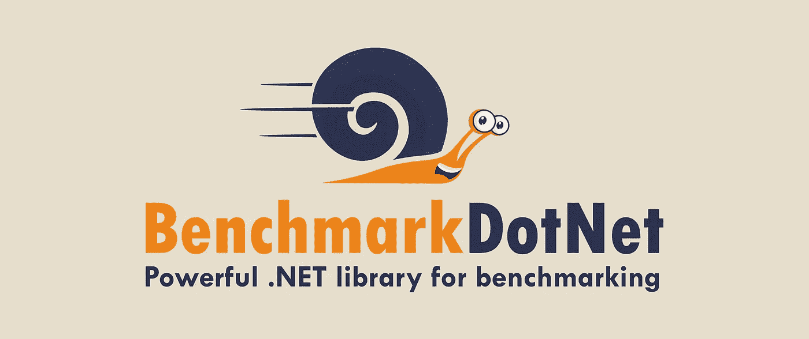

# 底层基准测试——迭代数组。网

> 原文：<https://itnext.io/benchmarking-to-the-bottom-iterating-arrays-in-net-a58a539656e2?source=collection_archive---------3----------------------->

## 寻找迭代数组的最快方法，同时在。NET 使用[BenchmarkDotNet](https://benchmarkdotnet.org/)验证大规模性能。



BenchmarkDotNet —一个强大的。用于基准测试的. NET 库

我最近花了一些时间查看一个旧系统，想知道如何让它性能更好。有许多方法可以使这样的系统更快、性能更好，但是我想避免大规模的重构，以将风险降到最低。具体来说，我关注的是那些可以累积起来产生更大影响的小项目。最明显的是整个系统的升级，但当这不是一个选项时，这些小变化可能是一个工程师必须做出的改变。

做这项工作已经激发了我的兴趣，首先，我想知道哪种方式是做这些日常小事的最佳方式。我正在慢慢构建一个小的任务系列。它可能会消耗不同的库来完成一个任务，或者直接比较每天的任务。无论哪种方式，都可以学到教训，获得乐趣。

# 迭代和访问数组

今天我决定看看可以迭代一个[数组](https://docs.microsoft.com/en-us/dotnet/csharp/programming-guide/arrays/)的许多不同方法。这并不复杂，但是考虑到软件工程师经常使用 C#中的列表和数组，解决它们也是有价值的。

胜负的关键实际上是将数组中的项赋给一个变量。这将确保值正在被读取，不访问该项的纯迭代可能导致扭曲的结果。

以下是通过 [BenchmarkDotNet](https://benchmarkdotnet.org/) 使用和测试的方法。

*   [为](https://docs.microsoft.com/en-us/dotnet/csharp/language-reference/statements/iteration-statements#the-for-statement)
*   [ForEach](https://docs.microsoft.com/en-us/dotnet/csharp/language-reference/statements/iteration-statements#the-foreach-statement)
*   [数组 ForEach](https://docs.microsoft.com/en-us/dotnet/api/system.array.foreach)
*   [获取枚举器](https://docs.microsoft.com/en-us/dotnet/api/system.collections.generic.ienumerable-1.getenumerator)
*   [跨度为](https://docs.microsoft.com/en-us/dotnet/api/system.span-1)
*   [Span ForEach](https://docs.microsoft.com/en-us/dotnet/api/system.span-1)

# 理论

鉴于与[之前的测试](https://medium.com/@stphnwlsh/benchmarking-your-way-to-the-bottom-iterating-lists-7ab4e6d2dbf6)的相似性，我可以想象`Span`方法将是我们这里的明显赢家。由于没有 LINQ 方法可供选择，我将选择所有方法中表现最差的`GetEnumerator`方法。我预计`for`环线会离`Span`相当近，而`foreach`会稍微靠后一点。

# 设置

使用 [BenchmarkDotNet](https://benchmarkdotnet.org/) 创建一个控制台应用程序使得运行基准测试变得非常简单。为了确保涵盖旧系统，这些测试将在两个**中运行。NET Framework 4.8** 和**。NET 6.0** 因为这是当前对. NET 的长期支持版本。一个用于旧世界，一个用于新世界。

前提很简单。创建一个 100 和 10，000 深的字符串`Array`。然后运行测试来迭代每一项，并重复这样做，直到 [BenchmarkDotNet](https://benchmarkdotnet.org/) 乐意给我们一个结果。这应该给我们一个合理的假设，最快的方式去做这件事。

迭代数组的设置方法

# 方法

接下来是为我想要测试的每种类型的`Array`迭代创建一个方法。每种方法都做一件事来使它成为一个均匀的基准。每个方法将遍历`Array`中的每个条目，访问列表中的条目，并将其赋给一个变量。一旦所有的项目都被处理，它将完成并记录完成任务所用的时间。

# 结果

幸运的是， [BenchmarkDotNet](https://benchmarkdotnet.org/) 包含了一个排名栏，可以清楚地显示哪一轮测试胜出。当您阅读这些结果时，您可以使用 Mean 列来比较每个测试之间的运行时间差异。其中一些有明显的赢家，而其他的差别可以忽略不计。

# 。NET Framework 4.8 —迭代和访问

```
| Rank | Method        | N     |           Mean |
| ---: | ------------- | ----- | -------------: |
|    1 | ForEachLoop   | 100   |       305.9 ns |
|    2 | ForLoop       | 100   |       343.9 ns |
|    3 | ArrayForEach  | 100   |       451.1 ns |
|    4 | GetEnumerator | 100   |    10,561.3 ns |
|    5 | ForEachLoop   | 10000 |    30,064.2 ns |
|    6 | ForLoop       | 10000 |    33,541.9 ns |
|    7 | ArrayForEach  | 10000 |    43,825.3 ns |
|    8 | GetEnumerator | 10000 | 1,055,741.5 ns |
```

# 。NET 6.0 —迭代和访问

```
| Rank | Method        | N     |         Mean |
| ---: | ------------- | ----- | -----------: |
|    1 | SpanForEach   | 100   |     141.9 ns |
|    2 | ForLoop       | 100   |     173.6 ns |
|    2 | ForEachLoop   | 100   |     175.2 ns |
|    2 | SpanFor       | 100   |     175.5 ns |
|    3 | ArrayForEach  | 100   |     370.7 ns |
|    4 | GetEnumerator | 100   |   6,190.5 ns |
|    5 | SpanForEach   | 10000 |  12,333.7 ns |
|    6 | ForLoop       | 10000 |  16,181.6 ns |
|    6 | SpanFor       | 10000 |  16,187.0 ns |
|    6 | ForEachLoop   | 10000 |  16,251.8 ns |
|    7 | ArrayForEach  | 10000 |  36,155.1 ns |
|    8 | GetEnumerator | 10000 | 611,853.5 ns |
```

# 思想

## 。NET 框架 4.8

老实说，这很令人惊讶，从测试结果来看`foreach`是明显的赢家。鉴于它在`List`上糟糕的表现，我真的没想到会这样。它比`for`循环更快地迭代更大和更小的数组。数组有了新的冠军。正如所料，GetEnumerator 绝对是表现最差的。结果很明显，如果你`Array.Foreach`支持`foreach`，那么是时候重构你的代码了。你可以带着它或者带着`for`环离开，因为差别不是很大。

## 。NET 6.0

这是一个熟悉的故事。NET 6.0 的`Span` `foreach`方法拿回家的奖品。紧随其后的是`for`、`foreach`和`Span` `for`，这让我觉得不值得在这里进行大规模的重构。虽然只有很小的收益，但是任何新代码都应该使用一个`Span`和一个`foreach`的组合。`Array.ForEach`远远落后于此，完全值得重构。`GetEnumerator`已经放下的够多了，只是不值得你浪费时间。

## ForEach FTW

虽然在某些领域没有改变生活，但是`foreach`循环显然是赢家，应该作为**的首选迭代器来实现。网 6.0** 和**。NET 框架 4.8** 应用程序。只要记住。NET 6.0 来使它也成为一个`Span`。

# 密码

所有这些代码都是开源的。你可以在 [GitHub](https://github.com/stphnwlsh/Benchmarking) 上找到我的标杆作品。结果是运行基准测试的 GitHub 动作的输出，您应该能够在该存储库中找到详细的输出。

```
**Support**If you like this, or want to checkout my other work, please connect with me on [LinkedIn](https://www.linkedin.com/in/stphnwlsh), [Twitter](https://twitter.com/stphnwlsh) or [GitHub](https://github.com/stphnwlsh).
```