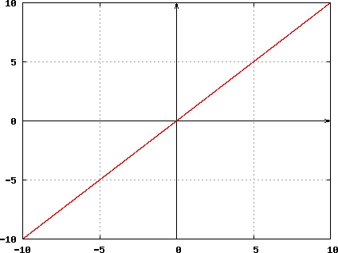

# Scala 猫中身份单子的好处

> 原文：<https://itnext.io/benefits-of-identity-monad-in-scala-cats-a2cb0baef639?source=collection_archive---------7----------------------->

在开始讲述 cat 中的身份 Monad 之前，让我们简单描述一下 Monad 及其在函数式编程中的用法。

# 什么是单子

根据[猫文档](https://typelevel.org/cats/typeclasses/monad.html)一个月:

> 允许组合相关的有效函数。

这个定义非常简短，包含了一些新概念，比如`dependent` `effectful`或者`composition`。有几个内容试图以不同的方式描述单子概念:

 [## 猫:单子

### Monad 用一个新的函数 flatten 扩展了应用类型类。Flatten 接受嵌套上下文中的值(例如…

typelevel.org](https://typelevel.org/cats/typeclasses/monad.html) 

或者这个:

 [## ScalaFP:让我们找到单子背后的原因。

### 函数式编程中的单子起着重要的作用，但它们最让初学者困惑。…的原因之一

blog.knoldus.com](https://blog.knoldus.com/scalafp-lets-find-reasons-behind-monads/) 

您可以阅读这些好文章来了解更多关于 Monad 的信息，但首先，请从不同的角度在一个段落中阅读 Monad 的定义(然后继续讨论同一性 Monad):

**在** `**Monad[F[_]]**` **，** `**F**` **表示“效果”或“计算上下文”，如** `**Future**` **，** `**Either**` **或** `**Option**` **，允许将函数(** `**A => B**` **或** `**A => F[B]**` **)应用于单个有效值(** `**A**` 【T31)，而无需“离开”该“效果”或“计算上下文”(【T31

现在来看看 Monad 类型类的简化版本:

Monad 类型类的简化版本

# 什么是同一性单子？

让我们继续一个例子。我们将使用 Monad 编写一个通用函数，将两个字符串附加到包装在 Monad 中的参数上，并在结果的开头添加一个 echo，然后返回 Monad 作为结果:

这个函数只适用于打包成单子的所有字符串值(如 Option、Future 或…)，但不适用于普通字符串值。为了解决这类问题，猫提供了身份类型。同一性单子的定义是:

Identity Monad 是一个类型别名，它将类型转换为单参数类型构造函数。我们可以将任何类型的任何值转换为相应的 Id。我们可以这样使用它:

或者更简单地说:

# 结论

单位单子允许我们编写处理一元和非一元值的函数，它非常强大，因为我们可以在生产中将值包装到**“效果”或“计算上下文”**中，并将它们从**“效果”或“计算上下文”**中移除，以便使用单位单子进行测试。例如，我们可以使用 Future 在产品中异步运行代码，使用 Identity Monad 在测试中同步运行代码，并轻松地在异步和同步世界之间切换。

# 资源:

*   [斯卡拉与猫书](https://underscore.io/books/scala-with-cats/)
*   [猫咪纪录片](https://typelevel.org/cats/)