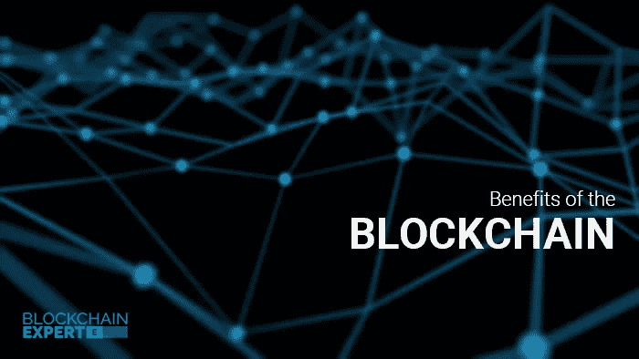

# 区块链的好处

> 原文：<https://itnext.io/benefits-of-the-blockchain-fe1f3fa11d48?source=collection_archive---------1----------------------->

区块链技术的主要优势是建立透明的点对点交易。这也是区块链最大的吸引力之一。

区块链福利

[*点击这里在 LinkedIn* 上分享这篇文章](https://www.linkedin.com/cws/share?url=https%3A%2F%2Fitnext.io%2Fbenefits-of-the-blockchain-fe1f3fa11d48)

## 关于区块链

区块链可以简单定义为分布在互联网上的账本，用于存储交易细节。它还可以用于跟踪网络中的资产。

区块链的应用与日俱增。一些应用是:

*   智能合同
*   加密货币
*   医疗保健应用
*   治理解决方案
*   IOT 等

下来我们将看到区块链与其他旧技术的不同以及区块链的[好处:](http://www.blockchainexpert.uk/blog/top-12-benefits-of-the-blockchain)

## 1.数据不变性

我们在区块链中有很强的数据安全性。

## 2.透明度

所有利益相关方都可以查看存储在公共网络中的数据；例外也可以通过限制来实现。

## 3.低成本

没有第三方的参与，是在两个人之间完成的。所以我们可以避免支付给第三方的服务费。

## 4.可审计性

所有的交易从头到尾都有记录，所以我们可以跟踪所有的交易。

## 5.自动化

第三方被“智能合同”、“计算机程序”和“未成年人”所取代，所以一切都是自动化的。

## 6.更高的精度

因为是自动化的，所以误差很小。

## 7.不可能丢失数据

数据存储在不同的节点中，因此即使一个节点被排除，整个网络也不会受到影响。

## 8.可信系统

由于没有第三方，用户会对系统更加信任。

## 9.安全性

对所有重要信息进行加密；只有发送方和接收方可以访问它们。区块操纵也不太可能发生。

## 10.易接近的

所有类型的用户都可以访问区块链。它被大多数开源平台大力推广。

## 11.实时结算

对于目前的金融系统，区块链提供了一个增强的实时结算选项。

## 12.没有中央权威

在区块链中，我们没有一个中央机构来控制，它是分散的。

更多详情可以登陆我们的网站[区块链专家](http://www.blockchainexpert.uk/)

*原载于 2017 年 11 月 18 日*[*medium.com*](https://medium.com/blockchainexpert-blog/benefits-of-the-blockchain-aea936e6b14e)*。*