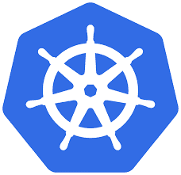
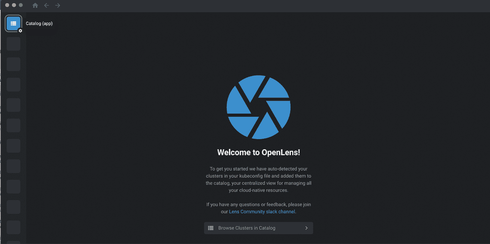
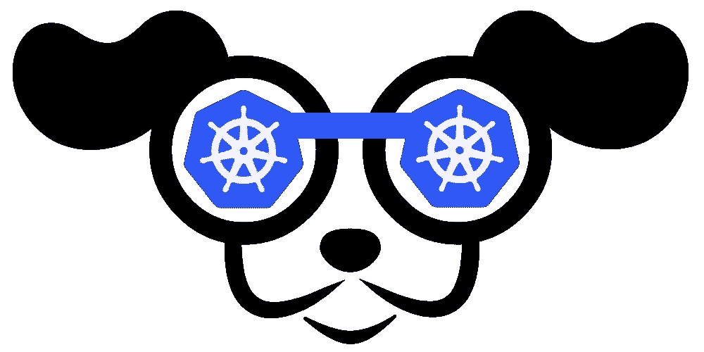
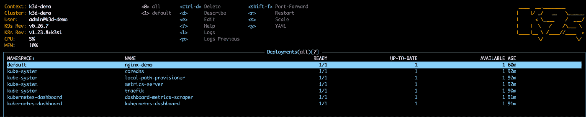
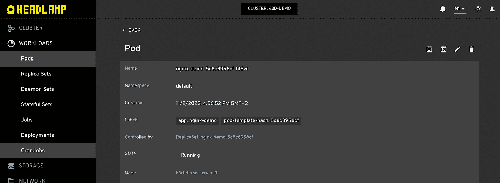
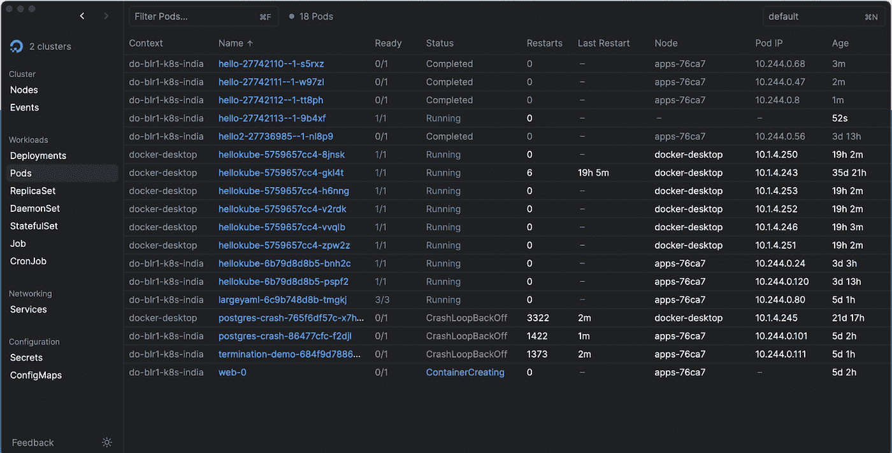

# 您需要了解的顶级 Kubernetes IDE 的最佳替代产品

> 原文：<https://itnext.io/best-alternatives-for-the-top-kubernetes-ide-you-need-to-know-of-87a2cefe2daa?source=collection_archive---------0----------------------->

欢迎来到我的 Kubernetes 博客。这些博客旨在为您提供有效的 Kubernetes 知识和工具，提高效率，同时减少压力和交付高质量解决方案的时间。点按“关注”按钮，以便在新故事发布时得到通知。

**让我们开始吧……**

在每个 Kubernetes 用户旅程的开始，与集群的交互主要从 kubectl CLI 工具开始，在很短的时间内，转移到 Kubernetes GUI as Lens，这是 Kubernetes 最常用的 GUI 工具之一。

库伯内特斯

对我们来说不幸的是，拥有 Lens 的 Mirantis 发布了新的[订阅模式](https://www.mirantis.com/blog/lens-pro-vision-for-the-future-new-subscription-model-new-features-available/)，从 2023 年 1 月起，Lens 用户将需要决定使用付费还是免费版本。

*如果您的公司收入或资金超过 1000 万美元，您必须使用付费订阅。*

**那么让我们来看看镜头的最佳替代品**

*   [开放式镜头](https://github.com/lensapp/lens)
*   [八分圆](https://octant.dev/)
*   [K9s](https://k9scli.io/)
*   [前照灯](https://github.com/kinvolk/headlamp)
*   [阿斗](https://aptakube.com/)

**开放式镜头**

OpenLens 是一个开源项目，位于支持 Lens 主要功能的代码之后。该代码由 Team Lens 开发人员与社区一起开发，目前将保持免费。

Openlens 启动仪表板

Lens 建立在 OpenLens 项目的基础上，包括一些附加软件和具有不同许可证的库。然而，Kubernetes 用户使用 Lens 的核心功能将在 Openlens 中提供。

下载 Openlens 项目在过去是一件难事，因为 Openlens 发布的是项目的源代码，而不是可执行文件下载。为了简化安装过程，来自社区的一些了不起的人打开了一个 GitHub 项目，提供了一个主要操作系统的可下载可执行文件。你可以访问他们的 GitHub 回购[这里](https://github.com/MuhammedKalkan/OpenLens)。

**八分圆**

Octant 是一个开源项目，它为理解复杂的 Kubernetes 环境提供了一种新的方法。它几乎不需要任何努力就可以安装并从默认的 kubeconfig 文件位置读取您的配置。

八分仪表板

Octant，off the start 向您提供 Lens 提供的关于星团的全面信息。除此之外，octant 还显示了一个资源视图，帮助您理解 Kubernetes 集群中资源之间的关系。

**K9s**

K9s

K9s 是一个基于终端的 UI，用于管理 Kubernetes 集群，旨在简化 Kubernetes 集群管理。K9s 持续监视集群的变化，并提供快捷方式命令来与集群资源进行交互。

K9s pods 概述

K9s 还有一些特殊的特性，比如显示 Kubernetes 资源之间依赖关系的**x 射线**、显示集群高级状态的**、**以及扫描和报告部署的资源和配置问题的 **popeye** 。

**前照灯**

Headlamp 是一个年轻的开源项目，您可以将其部署为具有 web UI 界面的集群内部署，或者作为桌面应用程序在本地下载。本地使用 Headlamp 的唯一要求是将 kubeconfig 文件保存在本地机器中。

前照灯仪表板

Headlamp 提供了简洁的仪表板，能够处理多个集群，显示 pods 日志，执行，编辑资源等。

**阿斗**

Aptakube 是一个轻量级的多集群 Kubernetes 桌面客户端。使用 Aptakube，您可以查看一个或多个 Kubernetes 集群的资源、查看 pod、节点健康状态、日志等等。

Aptakube 仪表盘图片(取自[https://aptakube.com/](https://aptakube.com/)

对资源的描述表现得非常好，也很容易理解。因此，如果您需要一个工具来查看基本资源，它可能是一个极好的选择。

我希望将来能看到两个特性:执行到 pod 的能力和在 GUI 中查看定制资源定义的能力。

*目前，该产品是免费的，但在未来，该项目计划添加付费订阅。*

**结论**

2023 年 1 月，镜头用户将需要决定是使用付费还是免费版本。如上所示，我们亲爱的社区提供了多种免费选项，并且符合大多数 Kubernetes 用户的需求。所以请在评论中让我知道你将在 2023 年使用哪种工具。

***********************************************************************

谢谢，如果您有任何问题或需要任何帮助，您可以通过 LinkedIn 联系我。

链接:

[www.devunet.com](http://www.devunet.com)(访问我公司网站)

https://www.linkedin.com/in/dekel-malul/(在 Linkedin 上与我联系)