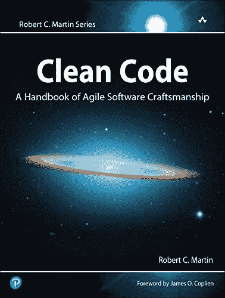
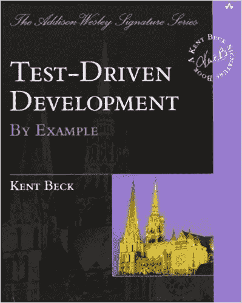
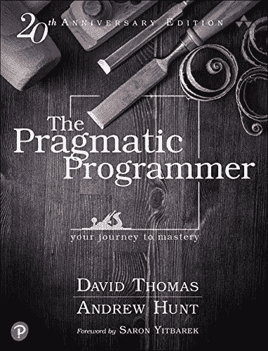
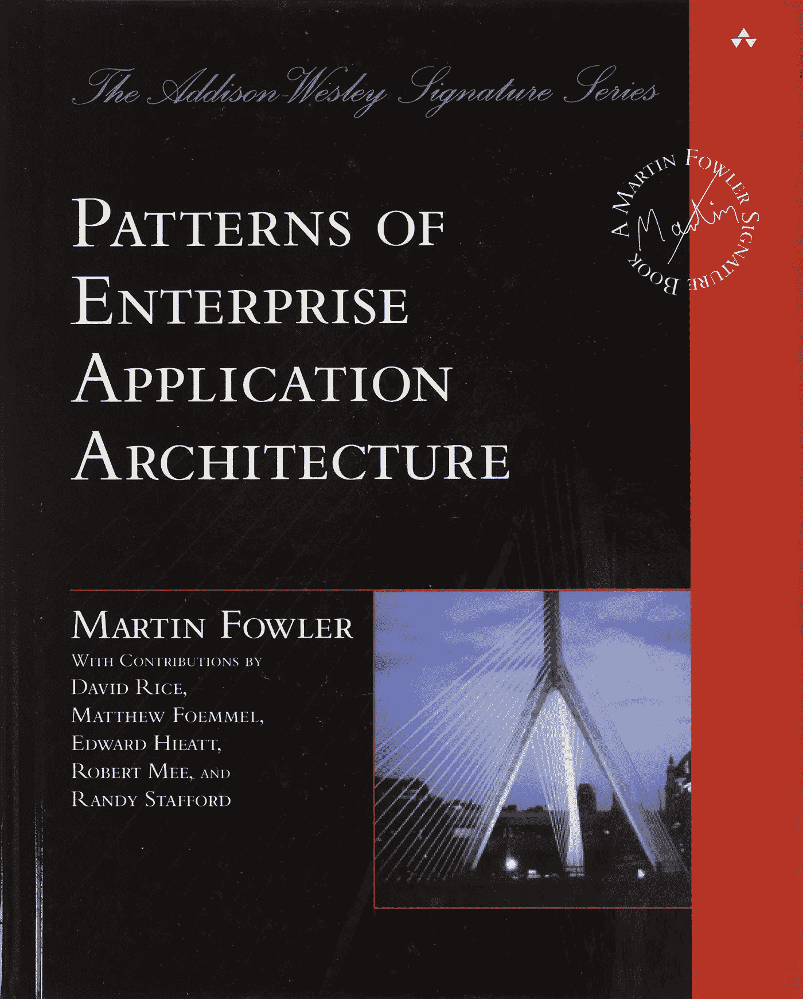
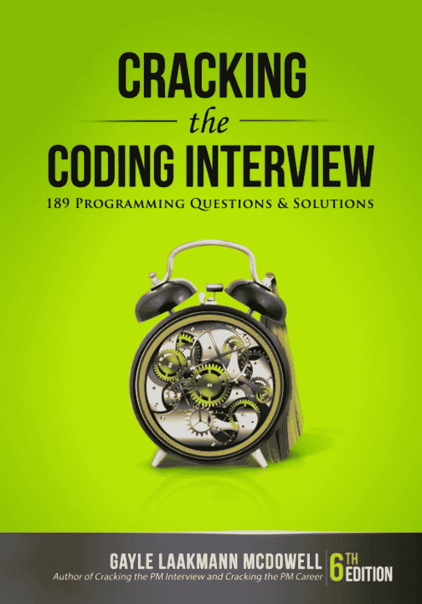

# 每个软件开发人员都必须知道的最佳书籍！

> 原文：<https://itnext.io/best-books-that-every-software-developer-must-know-8b96faff180d?source=collection_archive---------1----------------------->

## 你的书架上有这些书吗？

由[克里顿·巴雷](https://medium.com/u/c136f2653dbf?source=post_page-----8b96faff180d--------------------------------)和达尔·E-2·艾一起创作

任何称职的软件开发人员都会告诉你，提高技能的最重要的事情之一就是阅读。

但是关于这个主题有大量的书籍，很难知道从哪里开始。

为了帮助你，我为任何软件开发人员编辑了一份必读书目。

> *注意:该列表仅包含与任何特定编程语言无关的书籍*。

[亚马逊链接](https://amzn.to/3eJFowd)

## 罗伯特·马丁的《干净的代码》。

这本经典书籍就如何编写易于阅读和维护的代码提供了建议。

这本书强调了程序员必须使用的技术、最佳实践和工具。

它对重构和测试有很多见解。

2016 年第一次看这本书，至今**还在后悔没有早点多读。**

## 主要话题

*   什么是好代码
*   编写**好代码的过程**
*   为函数、类、对象创建好的名字
*   将坏代码重构为好代码
*   单元测试和 TDD(测试驱动开发)

[亚马逊链接](https://amzn.to/3QzZdTP)

## [测试驱动开发:通过实例(Kent Back )](https://amzn.to/3QzZdTP)

又一个经典。

自从我在一次 Codemotion 活动中发现 TDD 以来，我对它了解不多。

这本书我读了很多遍，从那以后，我的代码质量提高了很多。

很简单，测试驱动开发消除了应用程序开发中的恐惧。

## 主要话题

*   仅当自动化测试失败时才编写新代码
*   消除重复
*   TDD 循环
*   TDD 循环的真实代码示例

[亚马逊链接](https://amzn.to/3BufgOI)

## 《务实的程序员:你的精通之旅》作者:D.Thomas，A. Hunt

简直是我一生中最重要的书之一。

在我看来，这本书应该是软件开发领域任何级别和职位的人的必读之作。

这本书教授了这么多永恒而坚实的原则，对于一般的开发人员来说，可能要花好几年才能学会，**尤其是如果你是一个自学成才的开发人员。**

## 主要话题

*   干原则(不重复)
*   避免过度设计
*   注意变量命名的重要性
*   避免全局变量
*   避免过度测试
*   避免过早优化
*   把复杂的问题分解成更小更容易理解的部分
*   与他人合作愉快并为他人着想

[亚马逊链接](https://amzn.to/3d2UDjk)

## [马丁·福勒的企业应用架构模式](https://amzn.to/3d2UDjk)

在我看来，这本书应该是有多年软件设计经验的人读的。

在这本书里，福勒定义了所有程序员都应该知道的标准。

是任何建筑师书架上的必备。

## 主要话题

*   应用程序架构模式
*   将企业应用程序划分为多个层
*   组织业务逻辑的主要方法
*   处理跨多个事务的数据的并发
*   包括 MVC 在内的许多模式

[亚马逊链接](https://amzn.to/3LcpRB1)

## [破解编码面试，第 6 版:189 个编程问题及解答](https://amzn.to/3LcpRB1)

想换工作吗？
想破解扔给你的所有代码？

你不擅长高级编码技术？

那么这本书是给你的。

这本书对于每个准备面试的人来说都是一个很好的深度资源。

不能光看:要多学习，多实践。

这本书不仅有助于准备面试，也有助于提高你的编码技能！

## 结论

有很多方法可以提高你的开发技能，读书是我的最爱之一。

拿起几本这样的书，开始阅读。📚

你不会后悔的！！😃

# 这里有一些我写的其他文章，我想你会觉得有用

 [## 用 React 和帧运动制作 SVG 动画

### 你好👋在这篇文章中，我将向你展示我是如何为我的博客标识创建一个绘制效果的。在这里你将得到什么(你可以…

www.klitonbare.com](https://www.klitonbare.com/blog/animate-svg-with-framer)