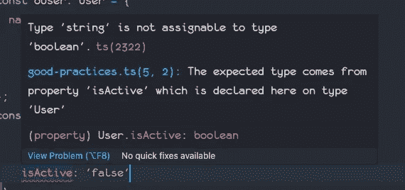
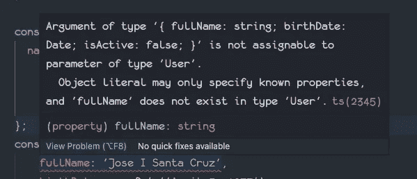

# Angular 12 迁移的最佳编码实践

> 原文：<https://itnext.io/best-coding-practices-from-an-angular-12-migration-78a3bc96a65d?source=collection_archive---------1----------------------->

## 另一篇最佳实践和指南文章

几天前，我和我的同事安排了一次会议，会上我提出了一些关于良好开发实践的指导方针。这一切都是因为我在一个特征分支上做的[角度 12](https://angular.io/) 迁移。

从上下文来看，我目前工作的公司有几个项目安排在 [NX Monorepo](https://nrwl.io/) 中。随着新的 Angular 版本的发布，我们在 git 存储库上打开了一个特性分支，在这里我们对应用程序进行了所有必要的调整和更改，以便使用新的 Angular 版本。

Angular 12 与 Angular 11 并没有什么不同，所以移植几乎没有痛苦。但是……代码验证有点严格，所以出现了一些问题，我在许多地方发现了一些缺陷，这就是我打算写的，希望阅读这篇文章的人不要犯同样的错误。

## 重要说明

正如我已经提到的，迁移中涉及的项目是基于 NX 口味的 monorepo 构建的，这意味着几个应用程序驻留在一个存储库中。这些应用程序既是前端又是后端，所以在 Angular 前端项目上发现了一些问题，但在 Typescript 后端项目上也发现了一些问题。

# 变量类型

当使用 [Typescript](https://www.typescriptlang.org/) 编写任何函数时，如果我们使用的变量没有类型，我们的代码就容易出错。Typescript 在运行时不进行任何类型验证，所以如果有错误，它将抛出一个错误，如果您不注意处理错误，可能会发生大爆炸和火灾。

例如。

```
export interface User {
  name: string;
  age: number;
  birthDate: Date;
  isActive: boolean;
}// Both parameters are implicit any (can be anything)
export function editUser(originalUser, newUserInfo) {
  let updatedUser = Object.assign({}, originalUser, newUserInfo);
  return updatedUser;
}const oUser: User = {
  name: 'Jose Santa Cruz',
  age: 44,
  birthDate: new Date('April 5, 1977'),
  isActive: true
};
const uUser = editUser(oUser, { 
  fullName: 'Jose I Santa Cruz',
  birthDate: new Date('April 5, 1977'),
  isActive: 'false'
});
console.log(uUser);
/*
{
  name: 'Jose Santa Cruz',
  age: 44,
  birthDate: 1977-04-05T04:00:00.000Z,
  isActive: 'false',
  fullName: 'Jose I Santa Cruz'
}
*/
```

而那个执行是“*正确的*”，只是因为我们没有检查变量类型。如果我们只是做一些调整，同样的代码会显示一些错误(在编码时间上)。

```
export function editUser(originalUser: User, newUserInfo: User) {
  let updatedUser = Object.assign({}, originalUser, newUserInfo);
  return updatedUser;
}

const oUser: User = {
  name: 'Jose Santa Cruz',
  age: 44,
  birthDate: new Date('April 5, 1977'),
  isActive: true
};
const uUser = editUser(oUser, { 
  fullName: 'Jose I Santa Cruz',
  birthDate: new Date('April 5, 1977'),
  isActive: 'false'
});
```

这立即显示了该错误(在[对代码](https://code.visualstudio.com/)):



类型字符串不能赋给类型 boolean。而且有道理，`'false' !== false`

更正此问题会显示另一个错误:



这也是正确的，因为一开始定义的用户界面没有 fullName 属性。只需将 fullName 属性更改为 Name。您还必须根据需要添加年龄属性。如果你希望它是可选的，只需编辑界面，使其显示为:`age?: number;`

正如我所说的，这在编程时很有帮助，你不会因为没有输入变量而犯编程错误，但没人说这种错误不会在运行时发生。所有这些错误都会在编译阶段出现。

但是具有泛型的类型也需要足够具体，以避免一些类似的错误，我将在下一节解释这一点。

# 承诺

承诺是一个不同的故事。总结一下什么是[承诺](https://developer.mozilla.org/en-US/docs/Web/JavaScript/Reference/Global_Objects/Promise)，假设你问我明天的气候。我会回答“*好的，我会告诉你明天……*的气候”，答案不一定马上就出来，你还可以去给自己冲杯咖啡，再编码一会儿，某个时候我会说“*明天会是个晴天*”。你通常需要注意这个答案，否则它会丢失，你永远也不会知道我什么时候回答的，或者我什么时候重启自己而忘记回答或者出错了。

在代码中:

```
function randomError() {
  return ( Math.random() * 1000 ) >= 499;
}function dummyDelay(callback: any, timeout?: number) {
  // If no timeout (in ms) is given then consider 
  // a random delay of at least 1.5s 
  // and a max delay of 3.5s
  timeout = (!timeout) ? Math.floor(Math.random() * 2000) + 1500 : timeout;
  console.debug('Your answer will come on after a ', timeout/1000, 's delay...');
  setTimeout(callback, timeout);
}export function askForClimate() {
  console.log('Hi! I will tell you the climate... (please be patient :) )');
  return new Promise((resolve, reject) => {
    dummyDelay(()=> {
      if (randomError()) {
        // On error, just forget to give 
        // the climate but acknowledge that
        // to the user 
        reject('Oh no! something terrible happened...');
      }	 // For the example all days will be 
      // sunny days
      resolve('Today will be a sunny day! Enjoy...');
    });

  });
}askForClimate().then(
  data => console.log('The climate: ', data),
  err => console.error('ERROR ', err)
);
```

我知道，我在这里跳过了很多思考(我很惭愧，零个文档)。但我会尽力补偿你:

*   *askForClimate* :我们的主要功能。你问气候，我告诉你我会回答(有时)。由于我们没有使用 API 来真正获得气候，我将模拟随机误差和随机延迟。
*   *randomError* :基于随机数生成“随机”错误或无错误状态。耶！可能是一个更好的随机函数，但我保持简单。
*   *dummyDelay* :将回调函数的执行延迟超时 ms，这是一个假延迟，只是为了模拟网络延迟就好像通过 API 调用获得气候一样。

所以，你问气候( *askForClimate* )，我说我来回答(`console.log` at *askForClimate* )，时间流逝( *dummyDelay* ，有事发生( *randomError* ，最后你可能会也可能不会收到气候的答案。

上面的代码工作正常，但显然我们可以做得更好。事实上，如果将这段代码放在 Angular 12 服务下，您会得到很多错误，这是因为 Angular 12 编译比通常更严格。所以让我们对代码的类型更严格一些。

```
function randomError(): boolean {
  return ( Math.random() * 1000 ) >= 499;
}

function dummyDelay(callback: (args?: unknown) => void, timeout?: number): void { // If no timeout (in ms) is given then consider a 
  // random delay of at least 1.5s 
  // and a max delay of 3.5s
  timeout = (!timeout) ? Math.floor(Math.random() * 2000) + 1500 : timeout;
  console.debug('Your answer will come on after a ', timeout/1000, 's delay...');
  setTimeout(callback, timeout);
}

export function askForClimate(): Promise<string> {
  console.log('Hi! I will tell you the climate... (please be patient :) )');
  return new Promise((resolve: (answer: string | PromiseLike<string>) => void, reject: (reason?: any) => void) => {
    dummyDelay(()=> { if (randomError()) {
        // On error, just forget to give the climate
        // but acknowledge the user that 
        reject('Oh no! something terrible happened...');
      }

      // For the example all days will be sunny days
      resolve('Today will be a sunny day! Enjoy...');
    });

  });
}

askForClimate().then(
  (data: string) => console.log('The climate: ', data),
  (err: unknown) => console.error('ERROR ', err)
);
```

我要把它发挥到极致。在很多情况下，变量类型是从父函数中正确推断出来的。

严格类型的好处是，当使用您编写的函数时，您的同事不会犯类型错误:

```
* Argument of type '(data: number) => void' is not assignable to parameter of type '(value: string) => void | PromiseLike<void>'.
  Types of parameters 'data' and 'value' are incompatible.
    Type 'string' is not assignable to type 'number'.ts(2345) *
```

作为一个好的实践，至少尝试为所有变量添加类型，这包括用于[泛型类型](https://www.typescriptlang.org/docs/handbook/2/generics.html)的变量(例如 Promise < *T* >)。在最坏的情况下，使用`any`类型(不好，但也没那么糟)。如果将来你有机会知道变量类型，你可以使用管道连接类型，例如:
`const pinCode: string | number; // pinCode can be a string or a number` 或者如果你不知道变量类型，也不想使用任何类型，使用未知类型。如果这样做，请确保相应地转换变量，例如:

```
const pinCode: unknown;
const deltaN: number = 123;
const validation: number = (parseInt(pinCode as number, 10)) + deltaN;
```

# 回报承诺的承诺

这个问题没有出现在 Angular 12 前端代码上，而是出现在后端。我们使用 NX monorepo，因此大多数编码验证和限制都会影响前端和后端代码。

在我们的后端，我们使用 [Sequelize](https://sequelize.org/) ，Sequelize 的大多数函数已经返回了承诺。问题是我在后端代码中发现了几个具有这种结构的函数:

```
// seqUser is a Sequelize model class
export function retrieveUsers() {
  return new Promise((resolve, reject) => {
    seqUser.findAll().then(
      users => resolve(users),
      error => {
        console.error('ERROR retrieving user list: ', error);
        reject();
      }
    );
  });
}
```

看到这里的问题了吗？`seqUser.findAll`已经返回了一个`Promise<Array<seqUser>>`，所以没有必要将一个承诺包装在另一个承诺中。

但是请注意，我说的是*“没有真正的需要”*。那么，*真的有需求吗？很高兴你这么问。这是很有争议的，唯一有合理的理由将*承诺*包装在*承诺*中的情况是，检索到的数据需要一些额外的处理。因此您可以检索数据并修改一些值。*

为什么在那里做，而不在真正使用承诺的函数中做？嗯，有一种东西叫做关注点分离( *SoC* )，我稍后会讲到。

# 库导入

正如我所说，该公司的项目生活在一个 Nx 的 monorepo。repo 有几个前端、后端和库项目，其中许多共享组件、类和服务。定义可伸缩的 monorepo 结构的意图很明显，因此组件的替换可以在不影响底层代码的情况下完成，但有时 IDE(在这种情况下是 VS 代码)在导入库组件时无法帮助避免一些特定的错误。

用一个例子；让我们假设你有几个项目被安排成一个 Nx monorepo。您当前正在处理的库项目需要另一个库项目的某些功能:

*   *lib/front-ui* :一个 Angular 库，有多个组件、服务、指令和管道，可以在多个项目中使用(这就是为什么它是一个库，以避免代码重复)。
*   *lib/shared-utils* :具有不依赖于任何其他库的纯函数的实用程序库。这样，我们可以在前端和后端项目中使用这个库。

使用 [Nx CLI](https://nx.dev/latest/angular/getting-started/nx-cli) 创建库，命令如下:

```
$ ng g @nrwl/angular:library FrontUi --buildable
$ ng g @nrwl/node:library SharedUtils --buildable
```

一旦执行，`angular.json`文件将有 2 个新的块，旨在构建这些库，`tsconfig.base.json`文件将有新的路径定义。*可构建的*参数是在你想单独构建你的库的情况下，也是利用 [Nx 云编译缓存](https://nx.app/docs/distributed-caching)。

***注***:Nx CLI 本身就值得一篇完整的文章。

首先要做的是调整 tsconfig 的路径:

```
"@mine/shared-utils": ["libs/shared-utils/src/index.ts"],
"@mine/front-ui": ["libs/front-ui/src/index.ts"]
```

到

```
"@mine/shared-utils": ["libs/shared-utils/src/index.ts"],
"@mine/shared-utils/*": ["libs/shared-utils/src/lib/*"],
"@mine/front-ui": ["libs/front-ui/src/index.ts"],
"@mine/front-ui/*": ["libs/front-ui/src/lib/*"]
```

所以你有希望直接导入所有正确导出的库组件(比如 [Angular Material](https://material.angular.io/) )。

顺便说一下，在我的`nx.json`上我有`"npmScope": "mine"`。

让我们假设你正在开发一个新的前台界面服务，叫做`NewDataService` : `$ ng g service services/NewData --project front-ui`

在您的代码中，您需要从 utils 库中导入实用函数`printableJson`。大多数时候(也许不是大多数，但是很多时候)，如果你让 *IDE* 做脏活并找出你的进口在哪里，你将*(可能/最有可能)*以类似于
`import { printableJson } from ' libs/shared-utils/src/lib/services/new-data.service';`
或者更糟的
`import { printableJson } from ' ../../../../../shraed-utils/src/lib/services/new-data.service';`结束

还记得您的 tsconfig.base 文件吗？让我们使用它:
`import { printableJson } from ' @mine/shared-utils';`
或者更好(如果一切都正确导出的话):
`import { printableJson } from ' @mine/shared-utils/printableJson';`

这更具可读性。

# 内部进口

让我们假设您正在处理同一个服务( *front-ui 的 NewDataService* )，但是需要添加对同一个库中另一个服务的调用，例如`RetrieveMetadataService`(已经在 front-ui 中定义)。你注意导入东西*“好的方式”*，在一个意想不到的例子中，你得到了:`import RetrieveMetadataService from '@mine/front-ui';`

记住你还在 *front-ui* 里面。这可能会在开发环境中工作，但是在为生产进行构建时，您将会得到一个循环依赖错误。为什么？您不能将同一个库导入其自身。不好看，不好看= >会一次生产编译失败。

# 如何避免“坏”进口

只要确保你没有调用同一个库本身，并确保在你的导入中没有任何 *src* 文件夹引用。如果你在你的导入上发现文本 *src/* 你做错了。

# 不可动摇的进口

我在代码中发现的另一种讨厌的导入是像
import * as my library from ' @ mine/my-library '；

这种导入对你的应用程序非常有害，因为它们将整个库作为别名导入，而不仅仅是你在代码中使用的几个函数。这些导入不是可动摇的树，并且严重影响了最终的应用程序包大小。

较大的包大小会导致糟糕的用户体验，因为应用程序大小会变得太大，下载大文件总是不好的(从 web 应用程序的角度来看)。

# 怎么解决？

这很简单，找到你代码中所有的`* as`,尽你所能修复它们。

# 学习使用命令行界面

正如您可能已经看到的，我使用了几个例子来放置命令执行:

*   用于在 monorepo 中创建 Nx 库
*   用于在 *front-ui* 库中创建服务

这是因为我几乎记不住一个服务的内部语法，或者肯定不知道如何安排一个库的文件夹结构和编辑正确的文件。好消息是，有人已经努力完成了同样的任务，并制作了一个非常完整的命令行工具，所以我们可以忘记这一切，专注于开发的重要部分，即解决代码中的需求。

Angular CLI 是一个命令行工具，允许我们生成 Angular 应用程序所需的所有代码结构。之后，您必须编写所有的业务逻辑，但是您几乎可以忘记从您知道有效的组件中复制和粘贴。相信我，复制和粘贴代码可以工作几次，但你会忘记编辑或调整一些东西，一切都会悲惨地失败。

Angular CLI 和 Nx CLI 的每个代码生成器都使用 schematics。原理图是一段代码，它使用 JSON 定义作为其参数，一些类型脚本文件作为内部逻辑，一些模板用于生成代码。你真的不需要知道你安装的每一个 CLI 的所有原理图选项，只需要学习足够的知识来避免复制和粘贴。例如。

*   创建一个组件:`ng g component components/NewComponent`
*   创建一个路由组件(又名页面):`ng g component pages/NewPage`
    ，然后是`ng g module pages/NewPage --routing`
*   创建服务:`ng g service services/NewService`

对于指令、管道、防护等等…

如果你只是想看看运行生成器后会生成哪些文件，在末尾添加 *-预演*参数。如果您的服务、组件或页面不打算/打算" *live* "在一个单独的文件夹中，请使用- flat true 或 *- flat false* 参数。

相信我，你不会后悔学习使用 CLI。


建议在运行任何 CLI 命令时，尝试使用 *-模拟运行参数*。是阻止自己把事情搞砸的好方法。有关更多信息，请参考:

*   [https://angular.io/cli](https://angular.io/cli)
*   [https://nx.dev/latest/angular/getting-started/nx-cli](https://nx.dev/latest/angular/getting-started/nx-cli)

# 可伸缩的代码和关注点的分离

在工作中，我通常会谈到可扩展性。这与使应用程序变得更大，或者能够处理巨大的工作负载有关，只是与此有关。可伸缩应用程序可以理解为可以毫无问题地响应许多请求的应用程序，并且可以伸缩，这意味着它可以被复制以提高可靠性和性能。这也意味着你可以让你的应用程序在代码中增长，增加新的特性，而不损害已经存在的代码。(这个定义我可能错得很离谱)。

理论上，所有好的代码都应该是可伸缩的(理论上……理论上，一切看起来都很美好)。

# “好代码”是什么样的？

输入 SoC 或关注点分离。但是在此之前，让我告诉你一些不好的代码，类似于我在迁移过程中的一些可悲的发现。我主要是在一些后端项目中发现这种代码犯罪。

假设我们有一个 REST API，以及一些检索完整用户列表的路径。使用公司中使用的相同技术堆栈(Express、Sequelize 和其他东西)，代码应该类似于:

```
import express from 'express';
import { userController } from 'user.controller';const router = express.Router();router.get('/users', userController.retrieveUserList);
```

注意，我跳过了所有的认证中间件，或者任何其他的路由、函数等等(同样，为了我们的例子简单起见)。

user.controller 文件可能类似于:

```
import { Request, response } from 'express';
import { user } from '@mine/db-models';export function retrieveUserList(req: Request, res, Response) {
  // ... lots of logic here
  // ... some extra validations
  // ... retrieve the userList from the database using Sequelize
  user.findAll().then(
    userList => res.status(200).json(userList),
    err => {
      console.error('ERROR Retrieving user list: ', err);
      res.status(500).json({
        status: 500,
        errDetail: err
      });
    }
  );
}
```

乍一看，一切正常。但是:

*   如果我告诉你，你需要改变很多额外的逻辑呢？
*   如果我告诉您额外的验证需要连接到其他地方呢？
*   如果我告诉你我们不再使用 Sequelize 会怎么样？

所有的*“假设”*列表都需要编辑代码，做一些调整，让事情在新的需求下工作。问题是不需要修改一些代码(事实上，我们应该为此得到报酬)，问题是如果`retrieveUserList`函数有几百行代码，这个控制器很快就会变得完全不可维护。让我们这么说吧，一个 100+行的控制器函数很可能也有*零*文档或注释或任何可以帮助任何开发人员打理这个意大利面沙拉的东西。

所以让我们再想想我们到底应该做什么:

1.  获取请求
2.  应用额外的逻辑
3.  进行验证
4.  检索用户列表(从数据库)
5.  返回用户列表(响应)

正如您所看到的，所有这些操作都可以清楚地识别出来，即使它们之间有一些联系，它们也可以独立实现。这种方法有几个优点:

*   您可以重用该逻辑。(粗体表示*重要*
*   你不需要修改一个真正无法管理的文件来改变一些代码。
*   每个文件都有一个单一的责任(理想的情况)

因此，一个良好编码的控制器将知道它必须解决一些事情，但是…它不应该知道如何解决它们。


[Imgur/funkblast1](https://imgur.com/gallery/TFY1R)

这背后的主要思想是你所有的代码应该像乐高积木一样工作。如果你需要更换一块砖(比方说一个服务做了"*某事*")，你只需要它匹配形状和大小。

所以，重写我们的例子:

路由文件保持不变，没有任何问题。但是控制器文件:

```
import { Request, response } from 'express';
import { user } from '@mine/db-models';
import { UserDataService } from './user.service';
import { UserValidationService, RequestHeaders } from './user-validation.service';
import { CompanyUserQueryService } from './company-user-query.service';
import { ErrorResponse } from '@mine/backend-utils';export function retrieveUserList(req: Request, res, Response) { // CompanyUserQueryService logic here
  const company = req.query.company || 'all';
  let preparedQuery: string;
  if (req.query.company) {		
    preparedQuery = CompanyUserQueryService.prepareQuery(company);
  } // User validations
  const requestHeaders: RequestHeaders = UserValidationService.parseHeaders(req);
  const validationStatus: boolean = UserValidationService.validateAuth(requestHeaders.auth);

  if (validationStatus) {
    // Retrieve the userList from the database 
    UserDataService.retrieveUsers().then(
      userList => res.status(200).json(userList),
      err => ErrorResponse.sendError(res, err)
    );
  }

}
```

> 我发挥了一点创造力，为额外的逻辑和验证部分添加了一些函数调用。试着想象一下，如果所有的逻辑都在控制器上实现，代码会有多可怕(如果你的想象力没有我的丰富，有太多的代码行，这是一个提示)…

所以，我们重写了我们的例子，好吧，其实不是，我们只是把它分成几个服务，重构代码，让每个服务处理它们自己的责任(*单一责任原则*)。代码变得更短，因为它不包括控制器中的所有内部业务逻辑。

为了更好地理解这种代码重构，请试着将这些要点视为编码规则:

1.  一个 *API* 端点必须解决一个需求
2.  需求可以是简单的或复杂的任务
3.  *API* 端点的控制器必须知道**它必须做什么**，但它不必知道如何去做。
4.  控制器必须导入/要求/使用尽可能多的服务来解决它必须解决的问题。
5.  一个服务知道**如何**解决问题(这里是良好的实现)。

我对这些特定需求进行编码的方式遵循特定的编码模式(伪代码)，其中我对应该执行的步骤或代码块的顺序进行编号:

```
function requirement (parameters): return something {
  // 1\. capture and parse any parameters (can use functions 
  //    in the same controller)
  // 2\. validate parameters (can use functions in the same
  //    controller)
    // ... now a same item that can change depending on 
    //     the requirement
    //   3\. apply extra internal logic 
    //   3\. apply validations logic 
    //   3\. retrieve information from some source
  // 4\. return something
}
```

如果这些步骤中的任何一个可以用其他东西来代替，那么这就是一个很好的指示，它应该作为服务来实现。否则控制器中的内部功能就足够了。只是不要忘记，即使你知道你的一些应用程序内部不会随着时间的推移而改变，如果你认为它会改变，那么最好将它分离在不同的服务上。在理想的情况下，所有的服务都应该是可替换的，就像一个乐高积木。

当使用 Typescript 时，我实现的大多数服务都试图实现一个接口，该接口定义了所有服务变量、函数签名(意味着它们的参数(和它们的类型)以及每个函数的响应类型。例如，`function retrieveUserList()`是否连接到 *PostgreSQL* 或 *MongoDB* 或文件存储并不重要，内部实现是否需要不同的库来连接到数据存储库也不重要。真正重要的是，在每个服务实现上，`retrieveUserList`接收*零个*参数并返回一个`Promise<Array<User>>`。

起初这似乎有点难以处理，但是当您的经理决定从 PostgreSQL 迁移到 MongoDB，并且您发现您必须重写整个控制器时，您最终会明白，处理许多解决其自身责任的小文件要比处理一个内部实现了所有内容的大文件好得多。

…最后

# 测试和文档

根据我的经验，测试和文档都不是开发人员最喜欢的。但是它们确实很有帮助。

许多正式的 QA 专家和测试人员会讨厌这一点，但是测试并不一定是带有断言的规范。它只需要涵盖边缘情况，并表明它做了它应该做的任何事情，并且当然做得很好。即使你已经阅读了我的前一段，最好还是使用测试框架来做你的测试。如今(IMHO) [Jest](https://jestjs.io/) 是统治这个领域的测试框架，所以看看它，试一试吧。

和文档。我有 Java 背景，JavaDocs 是我非常喜欢的一个东西。只需添加`/**`并按下`Enter`键，文档框架就添加到了您的类方法中。VS 代码，作为我目前的基础 IDE，有 JavaDoc 之类的东西，也有不少 [JsDoc](https://jsdoc.app/) 插件。

我在很多地方读到过*“好的代码会自己说话，不需要文档。”我只会相信，如果所有的开发人员都使用同一把剪刀。没有人和其他人是一样的，所以你学习和理解的速度可能和其他队友大不相同。代码是最好的例子。举个例子:*

```
gb(xs: any, f: any) {
  return xs.reduce((r: any, v: any, i: any, a: any, k: any = f(v)) 
    => ((r[k] || (r[k] = [])).push(v), r), {});
}
```

几乎完全无法理解。而且要好得多(同样的代码，只做了一些细微的调整):

```
/**
 * GroupBy function
 * From: You Dont Need Lodash Underscore
 * Ref. https://github.com/you-dont-need/You-Dont-Need-Lodash-Underscore#_groupby
 * @param xs original array of JSON objects meant to be grouped
 * @param f grouping field name
 * @returns new JSON object with the grouped data 
 */
 groupBy(xs: any, f: any) {
   return xs.reduce((r: any, v: any, i: any, a: any, k: any = f(v)) 
     => ((r[k] || (r[k] = [])).push(v), r), {});
 }
```

这里仍然有些不可思议，但至少它解释了这个函数的作用。作为一个很好的练习，你可以改进这个函数的类型:)

不要忘记，你(通常)不是为自己编码，而是为你的队友，甚至是你未来的自己编码。在我的特殊情况下，当我在几个星期后回到我自己的代码时，我真的很感激我放置了任何有用的注释，当我面对我自己的未记录的神秘代码时，我真的很讨厌自己。所以寓意是:*写有用的评论*。

还记得`function requirement`伪码上的编号项目吗？我通常会留下这些，因为，知道我的编码风格，有很大的机会面对一段巫师咒语代码行，它完成了大部分的魔法。

这就是了，如果你能坚持到这一步而没有睡着，感谢你的阅读。一如既往，欢迎评论、问题和掌声(如果你喜欢的话:)。

注意安全。