# 下一个项目的最佳文件夹结构

> 原文：<https://itnext.io/best-folder-structure-for-your-next-project-a0d18ad1483a?source=collection_archive---------0----------------------->

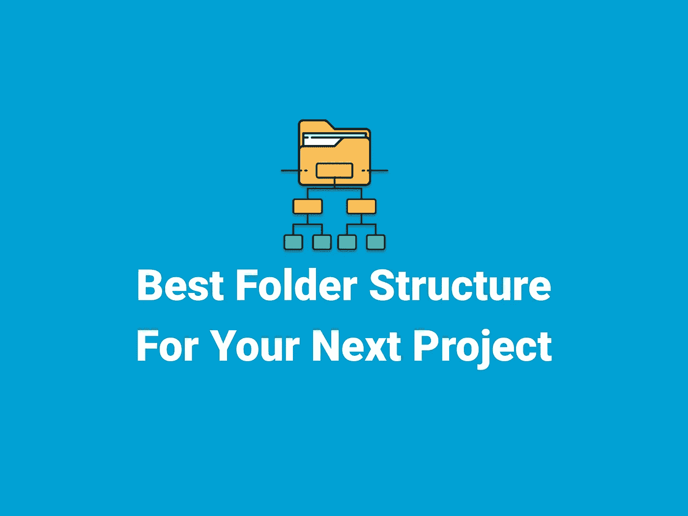

对于每个开发人员来说，快速增长的项目和不断变化的计划是一个真正的噩梦。摆脱这种情况的唯一方法是做好计划。因为愚蠢的文件夹结构，我一直在挣扎。我不想让你们再经历一次这样的事情。在本文中，我将向您介绍我的文件夹结构，您也可以在您的项目中使用它。

## 动机

我想要一个文件夹结构:

*   如果我想添加一个功能，很容易扩展。
*   将我的业务逻辑从我的 UI 中分离出来。
*   易于移除任何模块。
*   容易识别我的组件在哪里。
*   容易改变任何路线，如果需要的话。
*   如果需要，可以轻松连接到新的后端。

所以基本上我们想要一些**简单**和**灵活**的东西。我在本文中使用 MVC(模型-视图-控制器)模式。如果你想知道 MVC 是什么，这里有一些完美的解释。

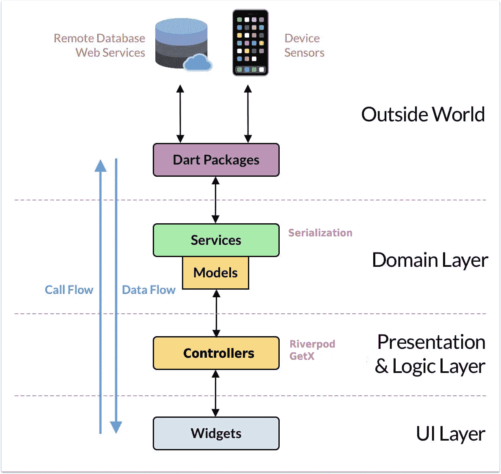

**MVC 模式**

## 入门指南

我只想简单点。所以没有专业术语，只有简单的解释。

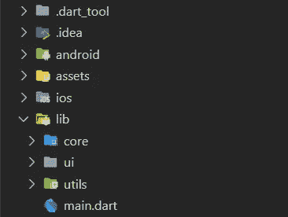

**我在项目中使用的文件夹结构**

## 资产

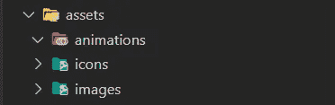

**资产文件夹**

在项目级别创建一个“资产”文件夹。将它命名为“资产”是一个常见的约定。但是你可以随心所欲。但是在你的项目中要保持一致。此外，您可以根据图像、动画、图标等类型对资产进行分组。

## 核心

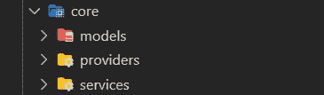

**核心文件夹**

所有的业务逻辑部分都在这里。在内部，我们有模型、提供商和服务。

## 模型

**模型文件夹**

把你所有的模型放在这里，比如`my_user.dart`、`product.dart`或者其他。我将发表一篇不同的文章，讨论如何使用模型使你的项目更加结构化。

## 控制器

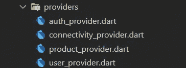

**提供商/控制器文件夹**

状态管理逻辑放在这里。您可以将您的 providers、blocs 逻辑或任何其他状态管理逻辑放入该文件夹。您甚至可以将其重命名为您的状态管理架构，如 providers、blocs 等。

## 服务

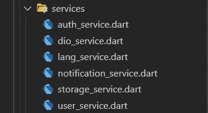

**服务文件夹**

进入你的应用程序的任何数据都必须来自这里。它可能正在连接 REST API 或任何数据库连接。

## 用户界面(视图)

**UI(视图)文件夹**

所有的用户界面都在这里。在里面我们有网页和共享。

## 页

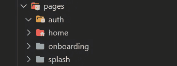

**页面文件夹**

在将我们的 UI 与业务逻辑分离之后，我们需要将视图分成单独的模块。您可能有像 auth、home、onboarding、splash 等模块。

## 共享的

**共享文件夹**

如果你有一些你将不止一次使用的部件或页面，你可以把它们添加到这个文件夹。

## 页

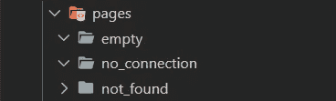

**页面文件夹**

您可以添加您的特定页面，如未找到页面或无连接页面。

## 小工具

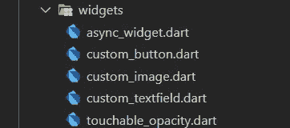

**Widgets 文件夹**

您可以添加多次使用的 widgets。这样你就不会写样板代码，而且如果你改变了你的部件，你使用它的任何地方都会改变。

## 实用工具

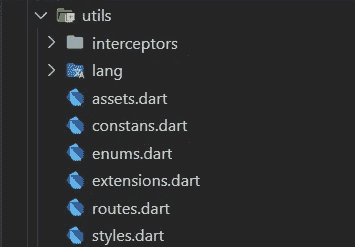

**Utils 文件夹**

这里有控制你的应用程序的所有东西，比如常量、资产、枚举、语言文件夹、路径、风格等等。

## 这是唯一的方法吗？

不，一点也不。您可以选择最适合您的任何架构或文件夹结构。这个适合我。我希望如此，这对你们也有用。试一试，看看对你是否有效。在你觉得合适的地方做出改变，直到你找到适合你的东西。如果你找到比这更好的。请在评论中告诉我。

**感谢您的阅读！**👏👏

如果你喜欢这篇文章，请点击👏按钮(你知道你可以升到 50 吗？)

另外，别忘了关注我，在你的社交网站上分享这篇文章！也让你的朋友知道吧！！