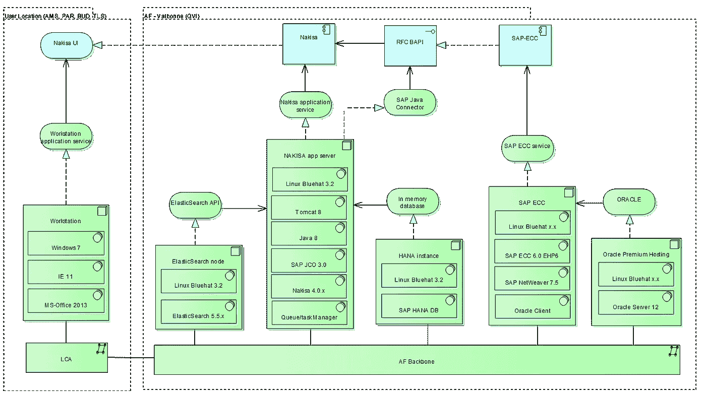

# 符合 IFRS 16 的软件实施的最佳实践

> 原文：<https://itnext.io/best-practice-of-a-software-implementation-to-comply-with-ifrs-16-eab705f555b1?source=collection_archive---------5----------------------->

> *本文与*[*cornéKlaassen*](https://www.linkedin.com/in/corn%C3%A9-klaassen-48a5a8/)*和*[*Richard van der Laan*](https://www.linkedin.com/in/richarddennisvanderlaan/)*密切合作撰写。LINKIT 非常感谢他们的贡献。*

[LINKIT](https://www.linkit.nl) 正在支持法航-荷航实施国际会计准则委员会的最新标准 IFRS 16。这一影响租赁合同的新标准要求 AFKL 开发租赁合同管理平台。

来源:法航-荷航

[*点击这里在 LinkedIn 上分享这篇文章*](https://www.linkedin.com/cws/share?url=https%3A%2F%2Fitnext.io%2Fbest-practice-of-a-software-implementation-to-comply-with-ifrs-16-eab705f555b1)

2016 年 1 月 13 日，国际会计准则制定机构 IASB 发布了新准则《国际财务报告准则第 16 号——租赁》。这一新标准将使几乎所有的租赁合同处于平衡状态。

许多跨国企业都受到了新标准的严重影响，特别是因为它必须集成到现有的 it 环境中。本文描述了法航-荷航为遵守 IFRS 16 而快速实施的一项新技术。AF/KL 是该领域的早期(甚至可能是第一个)采用者，因此可以作为其他组织的最佳实践。

## **早期采用者**

在受《国际财务报告准则》第 16 条约束的公司中，法航-荷航显得尤为突出。虽然这一规定仅在 2019 年 1 月 1 日或之后开始的财年生效，但该航空公司集团已于 2018 年 1 月 1 日早些时候应用了该规定。AFKL 受到这一标准的强烈影响，因为其 40%的机队是租赁的，并且该公司有大量的房地产合同。早期实施是综合 2018 年开始的多项 IFRS 变更的结果。

## **软件选择要求**

该软件用于支持法航-荷航的流程，其合同数据库管理多个合同级别。所有这些都应导致在 SAP 中创建相关的资产和会计分录。另一个复杂性是法航-荷航需要在多个管理机构任职。使用权资产以欧元记账，而租赁负债可能以不同的货币记账。此外，非 SAP 公司也需要联网。

## **软件选择&实现**

该航空公司在部署阶段采用了 SLAN(na kisa 的 SAP Lease Administration)软件，根据波动参数自动重新计算债务。SLAN 是一个合理的解决方案，因为 AFKL 在 SAP 上有后台。

在外部专家的支持下，SLAN 的实施得到了多国和多功能内部团队的合作。由于《国际财务报告准则》第 16 号是全新的，新软件仍在“进行中”。AFKL 的主要关注点是拥有最低要求的功能，并在上线后投资于 bug 修复和“最好拥有”功能，如用户友好性等。

## **放大**

2017 年夏天，AFKL 决定扩大项目规模，并在软件开发和测试方面雇佣了一些额外的资源。当软件与 SAP 集成时，AFKL 也需要 SAP 经验丰富的员工。为了进行日常管理，AFKL 与 LINKIT 合作，利用具有特定技能(如 SAP 资产会计、迁移、架构和项目管理)的外部资源扩大团队规模。

## **挑战**

由于项目的高度复杂性(技术/功能要求、影响计算和范围的财务审计员要求)，AFKL 决定让一名专业人员负责领导软件构建。

为了保持对 sprint 计划的控制(例如添加新功能)，AFKL 需要与 Nakisa 开发团队紧密合作。AFKL 还需要与供应商进行可靠的沟通和互动，因为该项目需要在多个地点进行管理和实施，而核心软件在 8 月前仍在蒙特利尔与 Nakisa 一起使用。

## **技术要求和复杂程度**

技术要求包括基于 Linux 的应用架构，带有 SAP HANA DB、使用 SAML2 的单点登录和带有 SSL 安全层的 ElasticSearch。为 ElasticSearch 使用不同的安全包使安装和认证变得复杂(Nakisa 使用 X-Pack，而 AFKL 使用 SearchGuard)。

由于缺乏正确的安装和配置文档，使用 SAML2 的单点登录是另一个复杂性。最后，AFKL 结合 SAP 角色授权使用了基于 SiteMinder AD 认证(HABILE)的单点登录。

## **架构**

要了解本项目中使用的复杂架构，请查看下图:

