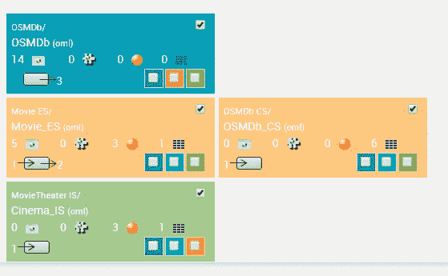
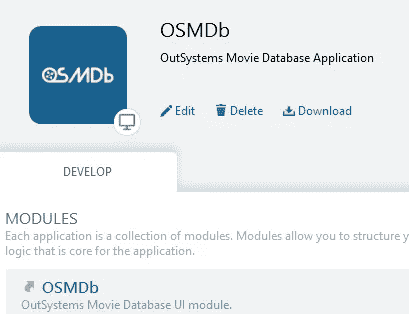
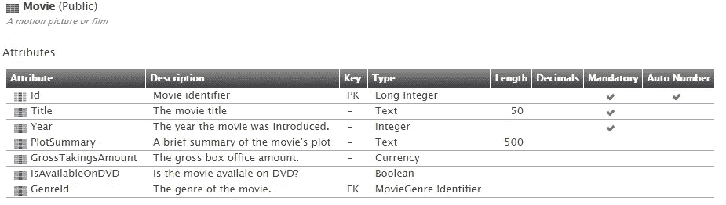
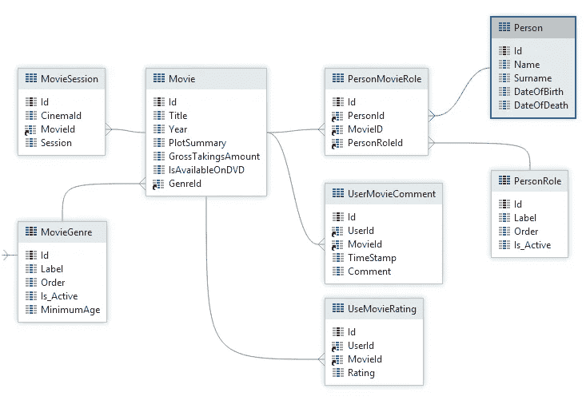
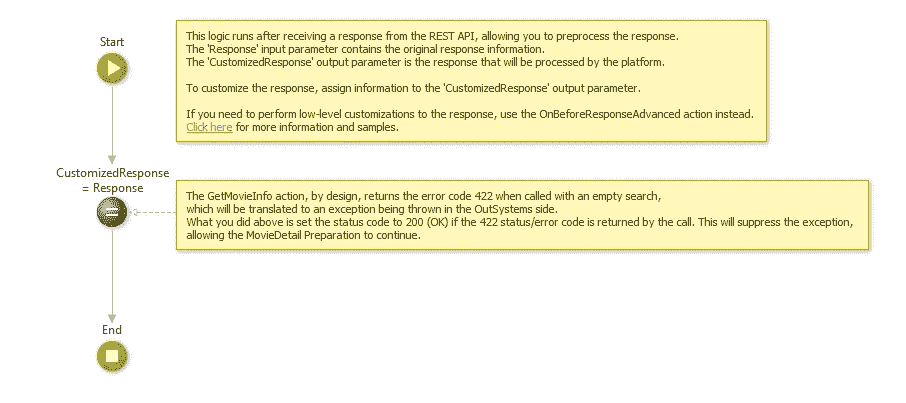
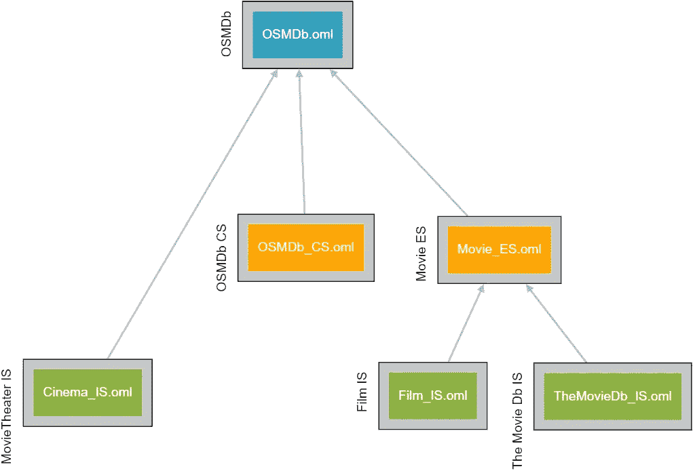
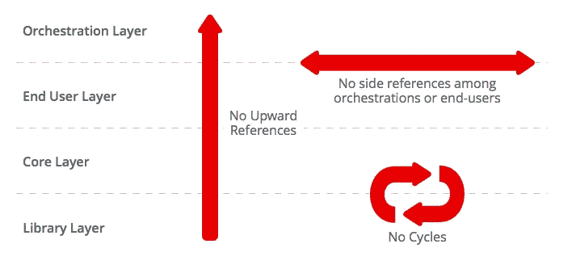

# 开发高质量外部系统应用程序的最佳实践

> 原文：<https://itnext.io/best-practices-for-developing-high-quality-outsystems-apps-bfbfc6d67081?source=collection_archive---------4----------------------->

当创建一个 OutSystems Mobile 或 Web 应用程序时，仅仅“让代码工作”是不够的。应用程序必须针对**耐久性**和**可维护性**来构建。本文描述了我们可以用来确保构建**健壮、高性能和可维护的应用程序**的方法和工具。

# 记录可维护性

我们大多数人不喜欢写文档，但是我们真正讨厌的是不知道一段代码应该做什么，以及为什么代码是以某种方式创建的。因此，我们必须在遵循敏捷宣言的同时记录我们的工作:“在大量文档上工作代码”。

首先，我们不应该混淆**项目文档**和**系统文档**。项目文档只在项目期间甚至是冲刺阶段有效，而系统文档应该在应用程序的整个生命周期内有效。第二，我们必须让文档成为我们编码程序的一部分，而不是最后的苦差事。我还认为**文档必须是代码**的一部分，不应该单独维护。

建立一套**文档标准**(参见 [OutSystems Platform 最佳实践](https://success.outsystems.com/Documentation/Best_Practices/OutSystems_Platform_Best_Practices))并使用 [**OutDoc**](https://www.outsystems.com/forge/component/159/outdoc/) 实用程序检查合规性。

## 示例文档标准

**模块命名约定:**采用空间和扩展的命名约定。命名约定有助于揭示每个模块或元素的本质，加强参考体系结构和规范化模式。请参见 d [使用架构框架设计应用](https://www.outsystems.com/learn/courses/67/designing-apps-using-an-architecture-framework/)课程，了解有关命名约定及其支持的架构的深入指南。

发现中的 OSMDb 组件视图

给**应用**一个有意义的**图标**和清晰的描述。同时输入所有**空间**和**扩展的描述。**

应用程序和模块描述示例

使**描述成为实体、属性、服务器动作、Web 块和用户角色的强制**。

实体电影的文档

所有实体空间必须包含至少一个**实体图**。对于复杂的结构，应该有一个实体图来解释每个链接概念。

MoviesDb 实体图

描述**复杂的逻辑**，在一个复杂的逻辑旁边附上评论并解释它。几个月后，甚至你都无法理解其中的逻辑，也不记得你为什么选择用一种特殊的方式来实现它。

带解释性注释的逻辑

使用**架构决策记录** (ADR)模板来记录您的设计决策，并将其放入您的应用程序、模块或最合适的地方。请观看[架构决策实践记录](https://youtu.be/41NVge3_cYo)视频，了解有关 ADR 的更多信息。

# 代码审查

**代码评审**是对计算机源代码的系统化检查(有时也称为同行评审)。它旨在发现软件开发中被忽略的错误，从而提高软件的整体质量。审查以各种形式进行，如非正式的巡查或正式的检查。

建立**编码标准**，让**代码评审**成为你**完成**定义的一部分。一个好的起点是 [OutSystems 平台最佳实践](https://success.outsystems.com/Documentation/Best_Practices/OutSystems_Platform_Best_Practices)。

记录您遇到的**反模式**，并在代码评审中检查它们。

# 测试

## 为什么测试很重要？

我们都会犯错。有些错误并不重要，但有些错误代价高昂或十分危险。软件测试是必不可少的，因为它确保产品的**质量和**客户在应用**中的可靠性和满意度(来源: [istqb 考试规范](http://istqbexamcertification.com/why-is-testing-necessary/))。**

测试是团队的责任，每个团队角色执行不同类型的测试。开发人员对他们实现的用户故事执行**单元测试**，产品负责人执行类似**端到端或探索性测试**的测试。关键用户对于指导、验证和验收活动至关重要。测试人员或 QA 协调员计划测试，验证验收标准，并协调**用户验收测试**。

OutSystems Forge 中有一些组件可以帮助实现、执行和管理测试:

*   测试自动机
*   测试框架
*   BDD 框架
*   单元测试框架

深入解释测试超出了本文的范围。遵循[成为外部系统测试员](https://www.outsystems.com/learn/paths/10/becoming-a-tester-in-outsystems/)的指导路径，了解更多关于该主题的信息。

# 验证和重构应用程序

定期使用 [Discovery](https://www.outsystems.com/forge/component/409/discovery/) forge 组件(例如每天、每周)来验证您的架构是否符合 4 层架构。此外，您可以使用[清洁架构工具](https://www.outsystems.com/forge/component/1548/clean-architecture-tool/)来更好地了解架构。

干净的体系结构 OSMDb 域视图

为了实现一个设计良好的应用架构，你**必须始终**遵守[4 层画布](https://success.outsystems.com/Support/Enterprise_Customers/Maintenance_and_Operations/Designing_the_architecture_of_your_OutSystems_applications/01_The_4_Layer_Canvas)的 3 条规则:

1.  没有向上引用
2.  编排层或最终用户层模块之间没有引用
3.  模块之间没有循环引用

按影响顺序修复违规:

1.  **对编排模块的上层和侧面违反:**永远不要消耗层次结构的顶层，以避免模块的单个集群
2.  **对最终用户的上部和侧面侵犯:**消费最终用户模块会阻止每个最终用户模块下的合理树形层次结构
3.  **核心之间的直接循环:**影响较小，因为它创建了仅限于核心/库模块的较小集群
4.  **核心层模块的上层违规:**库的隔离性差，这意外地拉动了核心/库模块的集群
5.  **库之间的直接循环:**影响通常局限于所涉及的模块，因为它们位于层次结构的底部

要了解更多关于架构和应用程序验证的信息，请遵循外部系统中的[架构模式](https://www.outsystems.com/learn/courses/68/architecture-patterns-in-outsystems/)和[验证和重构应用程序](https://www.outsystems.com/learn/courses/69/validating-and-refactoring-applications/)培训，还可以查看[设计外部系统应用程序的架构](https://success.outsystems.com/Support/Enterprise_Customers/Maintenance_and_Operations/Designing_the_architecture_of_your_OutSystems_applications)页面。

# 结论——总结

质量保证是交付健壮和可维护的外部系统应用程序的关键。您可以使用以下工具和方法来提高软件质量:

*   文件标准
*   代码审查
*   测试
*   验证和重构应用程序

明智地使用这些工具和实践。从小处着手，随着项目的增长而扩展。它们的范围和频率从开发人员的任务到整个应用程序甚至企业级都有所不同。

记住:

> 如果一件事值得做，就值得把它做好！