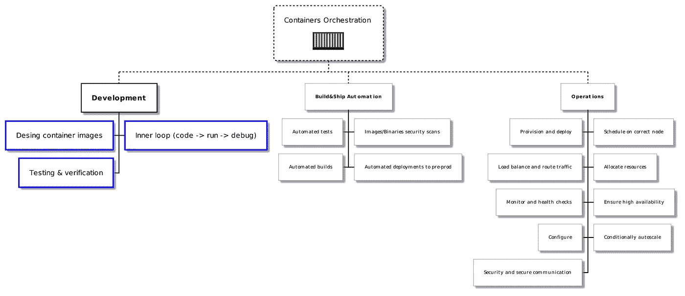
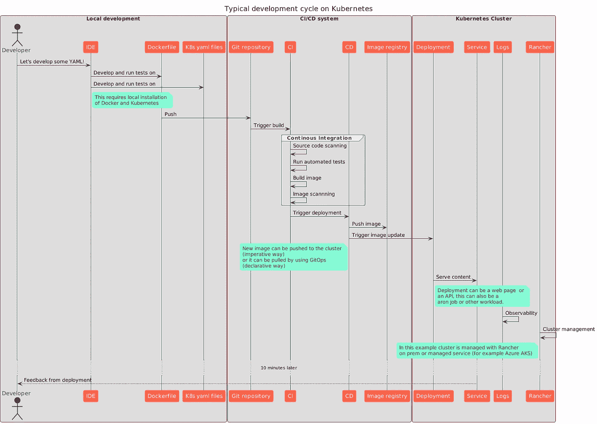
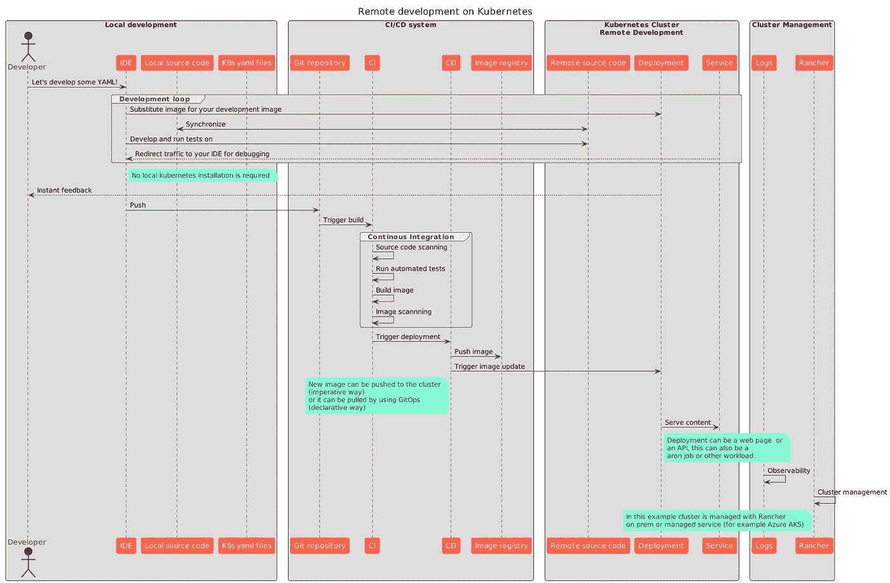

# 在 Kubernetes 上开发的最佳实践

> 原文：<https://itnext.io/best-practices-for-developing-on-kubernetes-8fbdbba12538?source=collection_archive---------3----------------------->

马文·迈耶在 [Unsplash](https://unsplash.com/?utm_source=unsplash&utm_medium=referral&utm_content=creditCopyText) 上的照片

## 如何在摩擦较少的 Kubernetes 上开发

## 介绍

在[的上一篇博客](/how-to-be-a-devops-maestro-containers-orchestration-guide-b2cf884eaed1?source=your_stories_page-------------------------------------)中，我们探讨了容器编排意味着什么，以及我们如何利用云原生模式和工具来改善我们的日常运营活动。

今天我们将“向左转”，看看如何让开发人员从一开始就开发云原生软件。

我们将研究开发，以及构建和发布软件，看起来像是在一个云原生世界中，容器编排是成功的关键。

读完这篇博客后，你将学会如何使用云原生工具和模式来减少在 Kubernetes 上开发软件的摩擦。

容器化工作负载管理的扩展定义:

> *容器化工作负载管理是在容器映像和容器的整个生命周期中自动执行常见任务的过程。它包括软件开发、构建&航运自动化以及运营、安全和合规。*

今天我们将重点关注****开发**方面。**

****

## **云原生开发**

**开发 Kubernetes 意味着开发云原生应用程序。**

**[CNCF](https://www.cncf.io) *定义云原生为(强调我):***

> ***云原生技术使组织能够在现代动态环境中构建和运行*****公共、私有和混合云** *。* **容器、服务网格、微服务、不可变基础设施** *和* **声明式 API***就是这种方法的例子。*****
> 
> *****这些技术使得* **松散耦合的系统** *具有* **弹性、可管理、可观察** *。结合* **健壮的自动化** *，他们允许工程师* **频繁地** *和可预见地以最少的辛劳做出高影响力的变更。*****

*****来源:*[*【https://github.com/cncf/foundation/blob/master/charter.md】*](https://github.com/cncf/foundation/blob/master/charter.md)****

****正如您所想象的，上述需求极大地复杂化了开发过程。****

## ****好了，我有了这个网络应用程序…****

****Kubernetes 之前的软件开发没那么复杂。假设你有一个网络应用程序，可能是一个花哨的[苗条的](https://svelte.dev/)应用程序，或者是一个老式的[棱角分明的](https://angular.io/guide/router-tutorial)甚至是老式的普通的[普通的 JavaScript](https://www.javatpoint.com/what-is-vanilla-javascript) 。****

****从一个简单的角度来看，你会着手你的开发业务，写一些 HTML，一些 CSS 和 JavaScript，看看它在浏览器中是什么样子的，希望使用 Jasmine/Karma/量角器/Cypress 等进行一些测试。也许你在做 PWA，也许只是服务器渲染的 blazor，谁知道呢。最终，你的 SPA 应用程序得到了极大的改善，并与 webpack 打包在一起，通过 CDN 提供服务，每个人都很开心！****

****直到有一天…你的经理宣布从这一天起每个人都必须“做”Kubernetes！显然，正如我在上一篇博客中所写的，运营有巨大的好处，但你在低声诅咒，因为这意味着要处理一件(或多件)事情。****

****你在本地安装 Kubernetes。也许是 docker 桌面的一部分，也许是 minukube 或者 Kind。开发过程大概是这样的:****

********

****来源:作者****

## ****以同样的价格获得更多****

****Kubernetes 为房屋的运营方面带来了非常明显的好处，但这并不意味着开发商应该置身事外！有很多工具，甚至普通的 Kubernetes 也提供了一些值得考虑的好处。****

****作为一名 web 开发人员，你需要考虑你的应用程序的使用模式。客户如何利用每个页面，使用模式是什么等。可以通过 Prometheus 或 Jaeger[从你的 web 应用程序中抓取指标和追踪信息。它的意思是你不用担心它！](https://codeblog.dotsandbrackets.com/scraping-application-metrics-prometheus/)****

****通常情况下，您需要考虑证书、传输中的数据加密等。嗯，这里 Kubernetes(更具体地说是服务网格)也能有所帮助！****

## ****没有免费的午餐…或者有吗？****

****到目前为止，我们的 Kubernetes 体验还不错，我们在常规开发工作流程的基础上获得了一些额外的好处。正如他们所说，没有免费的午餐！我们仍然要继续我们的业务，开发、测试和发布我们的软件。让我们改进这个过程，转向远程开发。****

********

****来源:作者****

****远程开发意味着我们不必安装 Kubernetes，我们的源代码会自动与 pod 中运行的远程容器同步。这里有一些工具值得一试。****

**** [## okteto——Kubernetes 开发平台

### Okteto 负责更新您的应用程序，以便在您编码时提供持续的反馈。Okteto 与您自己的……

okteto.com](https://okteto.com/)  [## 斯卡福德

### 很快。可重复。简单。当地 Kubernetes 开发。斯卡福德处理建造、推进和…

斯卡福德开发公司](https://skaffold.dev/)  [## 倾斜

### 您的服务器在本地运行吗？在库伯内特斯？两者都有？Tilt 为您提供智能重建和无处不在的实时更新，因此…

倾斜.开发](https://tilt.dev/)  [## DevSpace——Kubernetes 最快的开发工具(开源)

### DevSpace 是一个非常轻量级的客户端专用 CLI 工具，它使用您当前的 kube-context，就像 kubectl 或 helm…

devspace.sh](https://devspace.sh/)  [## 远程呈现

### Kubernetes 和 OpenShift 微服务 Telepresence 2.4.0 的快速本地开发现已推出阅读新闻稿…

www.telepresence.io](https://www.telepresence.io/) 

每种工具都有自己的优点和缺点，但在大多数情况下，它们都以类似的方式工作。

## 让我们摆脱本地 IDE

除了 IDE 之外，我们几乎已经将整个开发过程都转移到了集群中。如果您不能或不想在本地运行 IDE，也可以在集群中运行它，并通过浏览器连接到它。这一领域有一些产品，而且增长很快。

 [## Gitpod -随时准备编码

### 我们发明了预构建，因此应用程序代码、配置和基础架构都可以存储为机器可执行文件…

www.gitpod.io](https://www.gitpod.io/) 

[https://github.com/features/codespaces](https://github.com/features/codespaces)

 [## web 应用程序的在线代码编辑器。由 Visual Studio 代码提供支持。-斯塔克布里兹

### 编辑描述

stackblitz.com](https://stackblitz.com/) 

远程 ide 不是必须的。只要开发环境是容器化的，就有充分的理由继续使用本地 ide。

## 关键要点

“左移”运动是授权开发者完全拥有他们开发的软件的每一个方面。这是一个完全符合 DevOps 理念的伟大目标，但也给开发者带来了很多额外的负担。

在本文中，我展示了如何使用云原生工具和模式来减少 Kubernetes 上开发工作流中的摩擦。要使体验无缝，还有很多工作要做，但是利用现在可用的东西肯定会改进 Kubernetes 上的日常开发任务。****