# 角度的最佳实践

> 原文：<https://itnext.io/best-practices-in-angular-a8926fa02ae2?source=collection_archive---------0----------------------->

这是一个简单的介绍，介绍了可以应用到 Angular 项目中的最佳实践。请注意，这些最佳实践可以应用于其他语言，但是我们在本文中的重点将是 TypeScript。

什么是最佳实践和可读代码？这不是一门科学，我的观点可能与你的不同。本文的目的是为您提供信息和一些提示，让您在每种情况下决定最佳方法。这些建议从会议、同事和客户那里得到了很多好的反馈。因此，我希望我能帮助你。

先说一个你要真心实意回答的问题。你的代码审查是这样的吗？

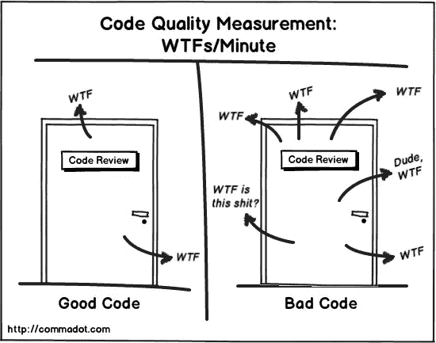

如果是这样，你如何使你的代码更容易阅读？

简单！你只需要遵循这篇文章给你的一些建议。再说一次，这是我的工作方式，我热爱它。你可以有不同于我的观点，并且完全有效。所以，让我们从这次开始。😊

# 角度 CLI

[**Angular CLI**](https://cli.angular.io/) 是构建 Angular 应用程序的最佳方式。要进行全局安装，请运行以下命令:

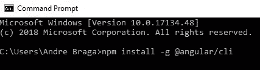

CLI 有脚手架(也称为 schematics)工具，用于为您创建新项目和生成新代码。然而，这不是主要的好处。CLI 的主要好处是它自动化了使用`ng serve`进行实时开发的构建管道，以及使用`ng build -prod`下载到浏览器的生产代码。

# 升力原理

让我们来看看电梯的原理是什么。

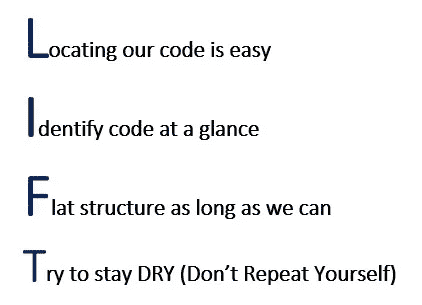

这个原则帮助你快速找到代码。所以，如果你不使用这个原则，问问你自己:为了构建一个特征，你能多快地打开和处理你需要的所有文件？我的建议是:尊重并使用电梯。

## **有意义的名字**

给方法、变量和参数起一个好名字是非常重要的。

这个代码示例表明很难阅读和理解这个方法的行为。但是如果你看下一个例子，你会发现它更简单。

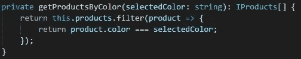

## **5 秒法则**

如果你不能在 5 秒钟内理解，你可能需要重构。放松，我知道你在想我疯了，但我说的 5 秒是一个比喻。目标是理解你的代码需要容易被每个人获得。

## **可读性组织**

*   最重要的东西先放。
*   后跟方法的属性。
*   分组排序。
*   一致的命名和拼写很重要。

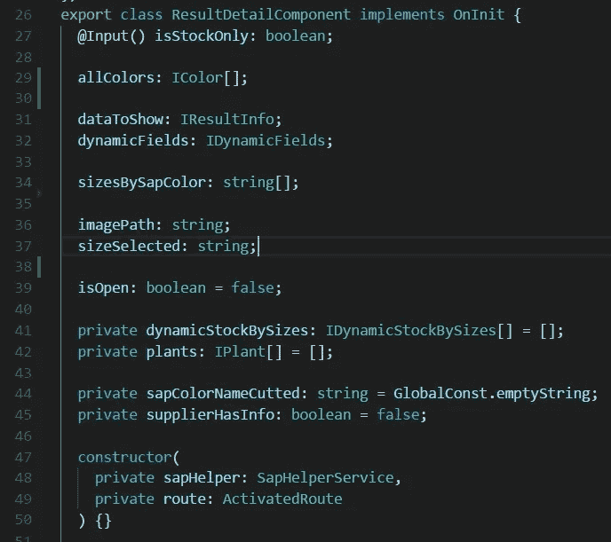

*   **每个文件一个项目
    →** 一个文件必须只有一个组件，对于服务或指令也是如此。
*   **单一主体责任
    →** 单一类或模块应该只有一个单一责任。
*   **符号命名
    →** 属性和方法必须是 camel case(如 currentUser)。
    →类(组件、服务、指令……)必须大写，称为 Pascal case(如 UserComponent)。
    →组件和服务应在名称上有各自的后缀。

> *用户组件*
> 
> *用户服务*

→进口

> *外部进口优先*
> 
> *在从自己的应用程序导入文件之前给一个空行*
> 
> *这为我们提供了一种识别外部文件和应用程序文件的简单方法*

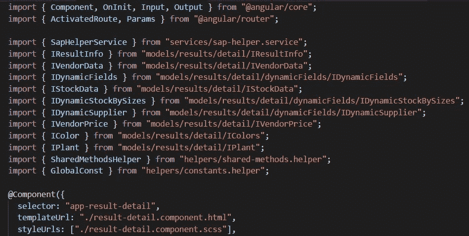

*   **小功能
    →** 小功能更好读，更快理解用途。如果你的函数超过 10 行，你需要问问自己，把它分成更小的函数是否更好。这可能很难做到，但不幸的是，在现实世界中，我们看到许多巨大的函数，由于其大小和复杂性而难以阅读。在我看来，这是每个人都应该遵循的重要惯例。

# **首先通过代码提供清晰度**

*   **自描述代码**
*   **用常量替换魔法字符串(代码重用)**
*   **用代码解释，不要用注释**
*   **注释必须可读并可维护**
*   **避免注释:
    →** 解释代码“做什么”。
    →过时不正确(错误的评论比没有评论更糟糕)。
    →取而代之，拥有一个名副其实的函数。
    →代码从不说谎，评论有时会。
*   **在下列情况下使用注释:
    →** 解释你为什么这样做。
    →解释后果。
    → API 文件。

# **角度组件最佳实践**

*   建议在组件前加上前缀。如果您使用 Angular CLI 创建组件，默认情况下，CLI 将为您的组件加上前缀:`selector: ‘app-component-name’`。您可以决定是保留“app”作为前缀，还是将其更改为项目名称。如果您正在使用功能模块部分，您可以使用每个功能模块的名称通过前缀来区分每个组件。例如，如果你的项目名称是'**数码商店'**，你可以把' ds '作为前缀。(' ds-component-name ')。
*   将 HTML、CSS 和 TypeScript 文件分开也是一个好的做法。这允许我们有更有组织性和可读性的文件。
*   输入
    →你可以在组件装饰器中声明输入装饰器，靠近选择器、模板等。但这是不可取的。这里的最佳实践是在类内部声明它，就像这样。

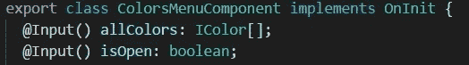

→对于输出装饰器，规则完全相同。

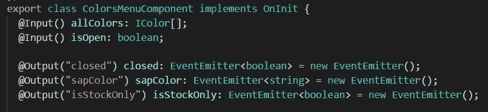

*   **将复杂的逻辑委托给服务
    →** 我们希望我们的组件尽可能简单。这意味着如果我们的组件需要做一些复杂的逻辑，我们需要决定这个逻辑是否属于这个组件。如果我们讨论的是一两行逻辑，也许把它留在组件中是可以的。在我看来，组件没有责任执行复杂的逻辑。我们可以把这个留给服务，这样我们的组件就像一个收到包裹的邮递员，知道它必须把它发送给某人，而不需要知道包裹的内容。这是您需要在自己的应用程序中做出的最终决定。
*   **组件成员序列
    →** 公共方法必须在私有方法之前声明。这更容易阅读或找到，因为这样我们可以防止私有方法在大量公共方法中丢失。注意，默认情况下，所有方法都是公共的，所以要声明私有方法，需要在方法名前写 private 关键字。

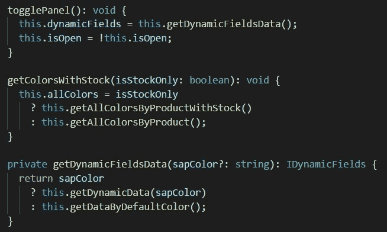

*   **实现生命周期挂钩接口
    →** 我们必须声明生命周期挂钩接口，以便在我们没有使用我们声明的接口时发出警告。例如，当我们使用`ngOnInit`时，如果我们像这样声明实现:

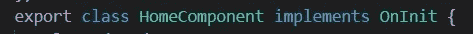

如果我们不创建它，我们将收到一个警告，告诉我们缺少`ngOnInit`:

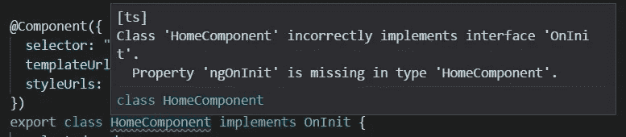

# **角度服务最佳实践**

*   **使服务成为可注入的
    →** 这只有在一个服务注入另一个服务时才有必要，但建议每次都使用，因为你永远不知道服务什么时候需要注入另一个服务(依赖注入)，也很难记住我们决定不使用可注入装饰器。

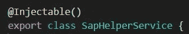

→我们可以使用构造函数内部的`@Inject`并移除全局`@Injectable`，但除非需要，否则不建议这样做。例如，如果您注入的服务没有使用`service`数据类型作为这个服务。这个要求很少，通常我们不需要这个。建议始终使用`@Injectable`。此外，我们将需要更多的代码，因为我们将需要这样做的所有参数。

*   **使用服务进行数据检索
    →** 就像我们上面所说的，你应该使用单一主体责任。我们的组件必须调用一个服务来获取一些数据。例如，我们可以直接调用组件中的 API 代码很简单，但是为了遵守这个原则，最好将这个逻辑放在服务中。该服务可以调用 API、localStorage 或者在开发过程中帮助我们的虚拟结构，但是对于我们的组件来说，这应该是透明的。如果我们需要更新服务中的调用，组件保持不变。组件不需要考虑如何获取数据，也不需要知道数据是来自 API 还是本地存储。组件的责任只是知道他有必要调用服务。该服务有义务知道从哪里以及如何获取数据。所以，请避免直接在组件上调用 API 的诱惑。

# 结论

为了提高应用程序的性能，我建议你考虑使用提前编译、延迟加载，并注意包的大小。在我的下一篇文章中，我将深入探讨这些问题，敬请关注！

 [## 学习角度-最佳角度教程(2019) | gitconnected

### 前 48 角教程-免费学习角。课程由开发人员提交和投票，使您能够…

gitconnected.com](https://gitconnected.com/learn/angular)