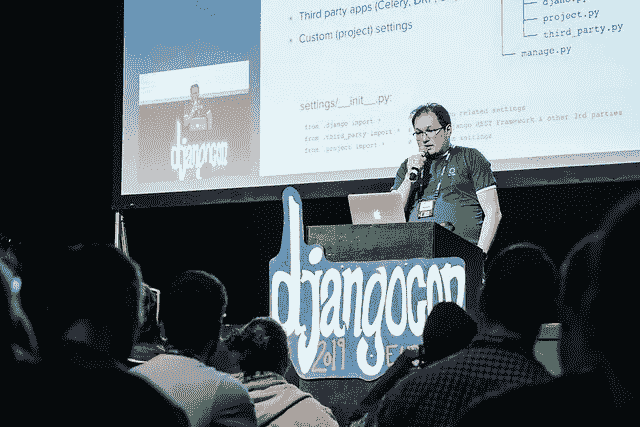
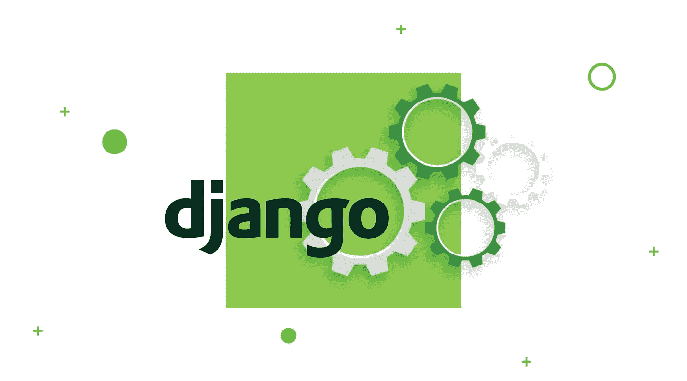

# 配置 Django 设置的最佳实践

> 原文：<https://itnext.io/best-practices-of-configuring-django-settings-85e5e770f54b?source=collection_archive---------4----------------------->

*在这里，我想分享一篇让我参加 2019 年哥本哈根 DjangoConEurope 的文章。这些信息成为我闪电演讲的基础(查看下面的链接观看视频)，除了感谢* [*Django Stars 团队*](https://djangostars.com/company/team/?utm_source=itnext.io&utm_medium=medium&utm_campaign=django%20settings&utm_content=django%20stars%20team) *对准备工作的帮助和 DjangoCon 的邀请，我想表达的是希望你会觉得有用。*

> [***https://2019.djangocon.eu/talks/lightning-talks-day-2/***](https://2019.djangocon.eu/talks/lightning-talks-day-2/)



## 好了，现在我们来配置 Django 设置。

本文面向使用 Django 框架的工程师。它深入分析了配置 Django 项目设置，以及不同方法的优缺点。在本文中，您还可以找到关于工具、最佳实践和架构解决方案的建议，所有这些都经过了成功项目的时间考验和证明。



# 管理 Django 设置:问题

**不同的环境。通常，你有几个环境:本地、开发、ci、qa、试运行、生产等。每个环境都可以有自己的特定设置(例如:`DEBUG = True`、更详细的日志记录、附加应用程序、一些模拟数据等)。您需要一种允许您保留所有这些 Django 设置配置的方法。**

**敏感数据。**每个 Django 项目中都有`SECRET_KEY`。在此之上，可以有用于第三方 API(如 Amazon 或 Twitter)的 DB 密码和令牌。这些数据不能存储在 VCS。

**团队成员之间的共享设置。**你需要一个通用的方法来消除使用设置时的人为错误。例如，开发人员可能添加了第三方应用程序或一些 API 集成，但未能添加特定设置。在大型(甚至中型)项目中，这可能会导致真正的问题。

**Django 设置是一个 Python 代码。这是一个诅咒，同时也是一个祝福。它为您提供了很大的灵活性，但也是一个问题——settings . py 可能有一个非常复杂的逻辑，而不是键值对。**

# 设置配置:不同的方法

如果不进行硬编码，就没有内置的通用方法来配置 Django 设置。但是书籍、开源和工作项目提供了很多关于如何做到最好的建议和方法。让我们简单看一下最受欢迎的几个来考察它们的优缺点。

# 设置 _local.py

这是最古老的方法。我第一次在生产服务器上配置 Django 项目时使用了它。以前我看到很多人用它，现在我仍然看到它。

这种方法的基本思想是扩展`settings_local.py`文件中所有特定于环境的设置，VCS 忽略了这一点。这里有一个例子:

`settings.py`文件:

`settings_local.py`文件:

**优点:**

*   不在 VCS 的秘密。

**缺点:**

*   `settings_local.py`不在 VCS，因此您可能会丢失一些 Django 环境设置。
*   Django 设置文件是一个 Python 代码，所以`settings_local.py`可以有一些不明显的逻辑。
*   你需要有`settings_local.example`(在 VCS)为开发者分享默认配置。

# 每个环境都有单独的设置文件

这是以前方法的扩展。它允许你在 VCS 保存所有的配置，并在开发者之间共享默认设置。

在这种情况下，您用下面的文件结构制作一个`settings`包:

```
settings/
   ├── __init__.py
   ├── base.py
   ├── ci.py
   ├── local.py
   ├── staging.py
   ├── production.py
   └── qa.py
```

设置/local.py:

要运行具有特定配置的项目，您需要设置一个附加参数:

**优点:**

*   所有的环境都在 VCS。
*   开发者之间很容易共享设置。

**缺点:**

*   您需要找到一种方法来处理秘密密码和令牌。
*   设置的“继承”可能很难跟踪和维护。

# 环境变量

要解决敏感数据的问题，可以使用环境变量。

这是使用 Python `os.environ`的最简单的例子，它有几个问题:

1.  你需要处理`KeyError`异常。
2.  您需要手动转换类型(参见`DATABASE_PORT`用法)。

要修复`KeyError`，您可以编写自己的定制包装器。例如:

此外，您可以为此包装设置默认值并添加类型转换。但实际上，没有必要编写这个包装器，因为你可以使用第三方库(我们将在稍后讨论这个)。

**优点:**

*   配置与代码是分离的。
*   环境奇偶校验—所有环境都有相同的代码。
*   设置中没有继承，代码更干净更一致。
*   使用环境变量有一个理论基础——[12 个因素](https://djangostars.com/blog/configuring-django-settings-best-practices/?utm_source=itnext.io&utm_medium=medium&utm_campaign=django%20settings&utm_content=12%20factors#6)。

**缺点:**

*   您需要处理开发人员之间共享默认配置的问题。

# 12 个因素

《12 个因素》收集了关于如何构建易于在云中部署和扩展的分布式 web 应用的建议。它是由知名云托管提供商 [Heroku](https://www.heroku.com/) 创建的。

顾名思义，该系列由十二部分组成:

1.  代码库
2.  属国
3.  配置
4.  后勤服务
5.  构建、发布、运行
6.  处理
7.  端口绑定
8.  并发
9.  一次性
10.  开发/生产平价
11.  日志
12.  管理流程

每一点都描述了实现项目特定方面的推荐方法。Django、Python、pip 等工具涵盖了其中的一些内容。有些被设计模式或基础设施设置所覆盖。在本文的上下文中，我们感兴趣的是一个部分:配置。

它的主要规则是**在环境**中存储配置。遵循这个建议将会给我们带来配置与代码的严格分离。

你可以阅读更多关于 12factor.net 的文章。

## 您可能还喜欢:

[](https://djangostars.com/blog/the-python-celery-cookbook-small-tool-big-possibilities/?utm_source=itnext.io&utm_medium=medium&utm_campaign=django%20settings&utm_content=you%20may%20also%20like) [## Python 芹菜食谱:小工具，大可能性

### Python 社区中的每个人都至少听说过一次芹菜，甚至可能已经使用过它了…

djangostars.com](https://djangostars.com/blog/the-python-celery-cookbook-small-tool-big-possibilities/?utm_source=itnext.io&utm_medium=medium&utm_campaign=django%20settings&utm_content=you%20may%20also%20like) [](https://djangostars.com/blog/what-is-docker-and-how-to-use-it-with-python/?utm_source=itnext.io&utm_medium=medium&utm_campaign=django%20settings&utm_content=you%20may%20also%20like) [## 什么是 Docker 以及如何在 Python 中使用它(教程)

### 这是一个介绍 Docker 容器的教程。到本文结束时，你将知道如何在…上使用 Docker

djangostars.com](https://djangostars.com/blog/what-is-docker-and-how-to-use-it-with-python/?utm_source=itnext.io&utm_medium=medium&utm_campaign=django%20settings&utm_content=you%20may%20also%20like) 

# 姜戈郊区

基于以上所述，我们看到**环境变量是存储设置**的最佳位置。

现在是时候谈谈工具箱了。

使用`os.environ`编写代码有时会很棘手，需要额外的努力来处理错误。最好用[**django-environ**](https://django-environ.readthedocs.io/en/latest/)代替。

从技术上讲，它是以下内容的合并:

*   [envparse](https://github.com/rconradharris/envparse)
*   [第一把手](https://github.com/nickstenning/honcho)
*   [DJ-数据库-网址](https://github.com/kennethreitz/dj-database-url)
*   [dj 搜索网址](https://github.com/dstufft/dj-search-url)
*   [dj-config-url](https://github.com/julianwachholz/dj-config-url)
*   [django-cache-url](https://github.com/ghickman/django-cache-url)

这个应用程序提供了一个功能良好的 API，用于从环境变量或文本文件中读取值，少量的类型转换等。让我们看一些例子。

`settings.py`文件之前:

`settings.py`文件后:

`.env`文件:

# 设置结构

你可以按照来源来划分设置，而不是按照环境来划分:Django，第三方应用(Celery，DRF，等等。)，以及您的自定义设置。

文件结构:

```
project/
├── apps/
├── settings/
│   ├── __init__.py
│   ├── djano.py
│   ├── project.py
│   └── third_party.py
└── manage.py
```

`__init__.py`文件:

每个模块可以作为一个包来完成，并且您可以更精细地对其进行拆分:

```
project/
├── apps/
├── settings/
│   ├── project
│   │   ├── __init__.py
│   │   ├── custom_module_foo.py
│   │   ├── custom_module_bar.py
│   │   └── custom_module_xyz.py
│   ├── third_party
│   │   ├── __init__.py
│   │   ├── celery.py
│   │   ├── email.py
│   │   └── rest_framework.py
│   ├── __init__.py
│   └── djano.py
└── manage.py
```

# 命名规格

变量的命名是开发中最复杂的部分之一。设置的命名也是如此。我们不能暗示 Django 或第三方应用程序，但我们可以遵循这些简单的规则进行自定义(项目)设置:

*   为您的设置取一个有意义的名称。
*   对于您的自定义(项目)设置，请始终使用项目名称前缀。
*   在评论中为您的设置写下描述。

**不好的例子:**

**好例子:**

把`MYAWESOMEPROJECT`改成你真实的项目名。

# Django 环境:最佳实践

*   保留环境变量中的设置。
*   写入生产配置的默认值(不包括密钥和令牌)。
*   不要硬编码敏感设置，也不要把它们放在 VCS。
*   将设置分组:Django、第三方、项目。
*   遵循自定义(项目)设置的命名约定。

# 结论

设置文件是任何 Django 项目的一个小但非常重要的部分。如果你做错了，你会在开发的各个阶段遇到很多问题。但是如果你做得对，这将是你的项目的一个很好的基础，允许它在未来成长和扩展。

使用环境变量方法，您可以轻松地从整体架构切换到微服务架构，将您的项目包装在 Docker 容器中，并将其部署在任何 VPS 或云托管平台上，如 Amazon、Google Cloud 或您自己的 Kubernetes 集群。

# 来源:

*   [https://12factor.net/](https://12factor.net/)
*   [https://django-environ.readthedocs.io/en/latest/](https://django-environ.readthedocs.io/en/latest/)
*   [Django 的两个范围](https://www.twoscoopspress.com/collections/everything/products/two-scoops-of-django-1-11)

> *这篇关于* [***配置 Django 设置***](https://djangostars.com/blog/configuring-django-settings-best-practices/?utm_source=itnext.io&utm_medium=medium&utm_campaign=django%20settings&utm_content=originally%20posted) *的文章最初发布于* [***Django Stars 博客***](https://djangostars.com/blog/?utm_source=itnext.io&utm_medium=medium&utm_campaign=django%20settings&utm_content=Django%20Stars%20blog) *。*

[](https://djangostars.com/services/python-django-development/?utm_source=itnext.io&utm_medium=medium&utm_campaign=django%20settings&utm_content=banner_end)