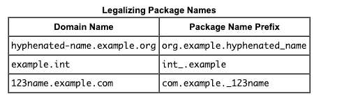

# 写一个超级干净和可读的代码的最佳实践。

> 原文：<https://itnext.io/best-practices-to-write-a-super-clean-and-readable-code-22cb3d45b052?source=collection_archive---------4----------------------->


任何傻瓜都能写出计算机能理解的代码。优秀的程序员编写人类能够理解的代码。——马丁·福勒。

在计算机编程领域，代码可读性是一个普遍的主题。这是我们作为开发人员首先要学习的东西之一。本文将详细介绍编写可读代码时最重要的最佳实践。

```
**package** proj.service;*/**
 * Created by John Doe.
 */
//This is interface get result and do it clean DB operation.* **public interface** myservice **extends** Workers {

    **public int *i*** = 0;

    **public abstract** String getResultList();

*//    public abstract void openconnection();* }
```

In 包名无效。

[Sun / Oracle 推荐](https://docs.oracle.com/javase/tutorial/java/package/namingpkgs.html)按照一个相当实用的模板命名包，即 domain.company. product。模块:

# 命名规格



```
**package** site.testengineer.persistence;*/**
 * Created by John Doe.
 */
//This is interface get result and do it clean DB operation.* **public interface** myservice **extends** Workers {

    **public int *i*** = 0;

    **public abstract** String getResultList();

*//    public abstract void openconnection();* }
```

一个自动生成的 Javadoc 模板。

由无名氏创作。此评论没有信息性消息。

*   你需要在正确的地方应用不同类型的评论。确保你正确地使用了每一种类型的注释:不要乱丢注释，也不要把它们插入你不应该插入的地方。
*   评论必须使用英语。
*   JavaDoc 的内容必须符合现实。

```
**package** site.testengineer.persistence;

*/**
 * Class {****@code*** *myservice} retrieves list of {****@code*** *UserAccount}'s.
 * Keep in mind, the list should not be stored  after sessions clean up.
 *
 ** ***@author*** *John Doe.
 ** ***@see*** *site.testengineer.model.UserAccount.
 ** ***@since*** *1.01
 */* **public interface** myservice **extends** Workers {

    */**
     * The constant i.
     */* **public int *i*** = 0;

    */**
     * Gets result list.
     *
     ** ***@return*** *the result list
     */* **public abstract** String getResultList();

*//    public abstract void openconnection();* }
```

Un 接口的信息名称。

myservice 不是以 camelCase 风格编写的，但是将其重命名为 MyService 并不能解决问题，您需要尽可能正确地命名它。您必须将接口命名为 UserTransactionService，因为 UserAccountTransactionService 太大，并且 TransactionService 不提供信息。应该强调的是，实现这个接口的类有义务执行与用户相关的事务。重命名接口、类和 JavaDoc。

```
**package** site.testengineer.persistence;

*/**
 * Class {****@code*** *UserTransactionService} retrieves list of {****@code*** *UserAccount}'s.
 * Keep in mind, the list should not be stored  after sessions clean up.
 *
 ** ***@author*** *John Doe.
 ** ***@see*** *site.testengineer.model.UserAccount;
 ** ***@since*** *1.01
 */* **public interface** UserTransactionService **extends** UserAccount {

    */**
     * The constant i.
     */* **public int *i*** = 0;

    */**
     * Gets result list.
     *
     ** ***@return*** *the result list
     */* **public abstract** String getResultList();

*//    public abstract void openconnection();* }
```

C 注释掉或未使用的代码。

我们可以看到，有人将 **openconnection()** 方法注释掉了。这段代码被注释掉了，禁用了，这意味着如果它不是文档并且自 11 月以来没有更改过，它就是垃圾。您应该尝试在代码中删除这种垃圾。

```
**package** site.testengineer.persistence;

*/**
 * Class {****@code*** *UserTransactionService} retrieves list of {****@code*** *UserAccount}'s.
 * Keep in mind, the list should not be stored  after sessions clean up.
 *
 ** ***@author*** *John Doe.
 ** ***@see*** *site.testengineer.model.UserAccount;
 ** ***@since*** *1.01
 */***public interface** UserTransactionService **extends** UserAccount{

    */**
     * The constant i.
     */* **public int *i*** = 0;
    */**
     * Gets result list.
     *
     ** ***@return*** *the result list
     */* **public abstract** String getResultList(); }
```

自定义格式。

增加/减少页边距和空格，使您的作品尽可能具有可读性:

*   删除不必要的线路。
*   在类名后添加空格。
*   从方法中分离出常量。
*   删除多余的空行。

```
**package** site.testengineer.persistence;

*/**
 * Class {****@code*** *UserTransactionService} retrieves list of {****@code*** *UserAccount}'s.
 * Keep in mind, the list should not be stored  after sessions clean up.
 *
 ** ***@author*** *John Doe.
 ** ***@see*** *site.testengineer.model.UserAccount;
 ** ***@since*** *1.01
 */* **public interface** UserTransactionService **extends** UserAccount {
    */**
     * The constant i.
     */* **public int *i*** = 0;

    */**
     * Gets result list.
     *
     ** ***@return*** *the result list
     */* **public abstract** String getResultList();
}
```

C onstants。

我相信恒**我**这里有三个问题:

*   它不是以大写字母开头的
*   它没有任何意义。该常量必须重命名为**用户索引**或**账户 ID**
*   最大的问题是常量根本不属于接口。如果你使用**枚举**类或**私有类，并且只使用常量**，面向对象的设计看起来更加精炼。我认为它看起来更愉快和清晰。

```
**package** site.testengineer.persistence;

*/**
 * Class {****@code*** *UserTransactionService} retrieves list of {****@code*** *UserAccount}'s.
 * Keep in mind, the list should not be stored  after sessions clean up.
 *
 ** ***@author*** *John Doe.
 ** ***@see*** *site.testengineer.model.UserAccount;
 ** ***@since*** *1.01
 */* **public interface** UserTransactionService **extends** UserAccount {

    */**
     * Gets result list.
     *
     ** ***@return*** *the result list
     */* **public abstract** String getResultList();
}
```

不必要的元素。

如果默认使用**公共抽象**接口中的任何方法，那么编写**公共抽象** t 是没有意义的。

```
**package** site.testengineer.persistence;

*/**
 * Class {****@code*** *UserTransactionService} retrieves list of {****@code*** *UserAccount}'s.
 * Keep in mind, the list should not be stored  after sessions clean up.
 *
 ** ***@author*** *John Doe.
 ** ***@see*** *site.testengineer.model.UserAccount;
 ** ***@since*** *1.01
 */* **public interface** UserTransactionService **extends** UserAccount {

    */**
     * Gets result list.
     *
     ** ***@return*** *the result list
     */* String getResultList();
}
```

我的架构不完美。

你可以相信类的作者，想象它以 String 的形式返回一个作为序列化 XML/JSON 的 **UserAccount 的**列表，但是最好使用 List < UserAccount >而不是 String。还必须重命名该方法。 **getResultList()** 方法的名称太抽象。

```
**package** site.testengineer.persistence;

*/**
 * Class {****@code*** *UserTransactionService} retrieves list of {****@code*** *UserAccount}'s.
 * Keep in mind, the list should not be stored  after sessions clean up.
 *
 ** ***@author*** *John Doe.
 ** ***@see*** *site.testengineer.model.UserAccount;
 ** ***@since*** *1.01
 */* **public interface** UserTransactionService **extends** UserAccount {

    */**
     * Gets result list.
     *
     ** ***@return*** *the result list
     */* List<UserAccount> getUserAccounts();
}
```

延伸文件。

我们需要关于 **getUserAccounts()** 方法做什么以及它具体返回什么的信息。类只能描述其使用的大概场景，所以当前在头中的内容应该平滑地移动到方法的 JavaDoc，服务本身应该从一般功能的角度来描述。

```
**package** site.testengineer.persistence;

*/**
 * Class {****@code*** *UserTransactionService}  is a specific type of <i>User</i> transactional service.
 * This service is able to retrieve user data since is has {****@code*** *UserAccount}.
 *
 ** ***@author*** *John Doe.
 ** ***@see*** *site.testengineer.model.UserAccount
 ** ***@since*** *1.01
 */* **public interface** UserTransactionService **extends** UserAccount {

    */**
     * Returns list of {****@code*** *UserAccount}'s.
     * Keep in mind, the list should not be stored  after sessions clean up.
     *
     ** ***@return*** *list of user accounts
     ** ***@see*** *site.testengineer.model.UserAccount
     */* List<UserAccount> getUserAccounts();
}
```

在的这篇文章中，我试图将代码质量提高到一个更合理的版本。当然，这只是一个例子，在项目中移除/重做很多并不是那么容易的。我已经完成了我的主要使命:你需要为你每天写的东西负责。很大程度上取决于它。我希望你能注意到上面描述的大多数可能的方法。