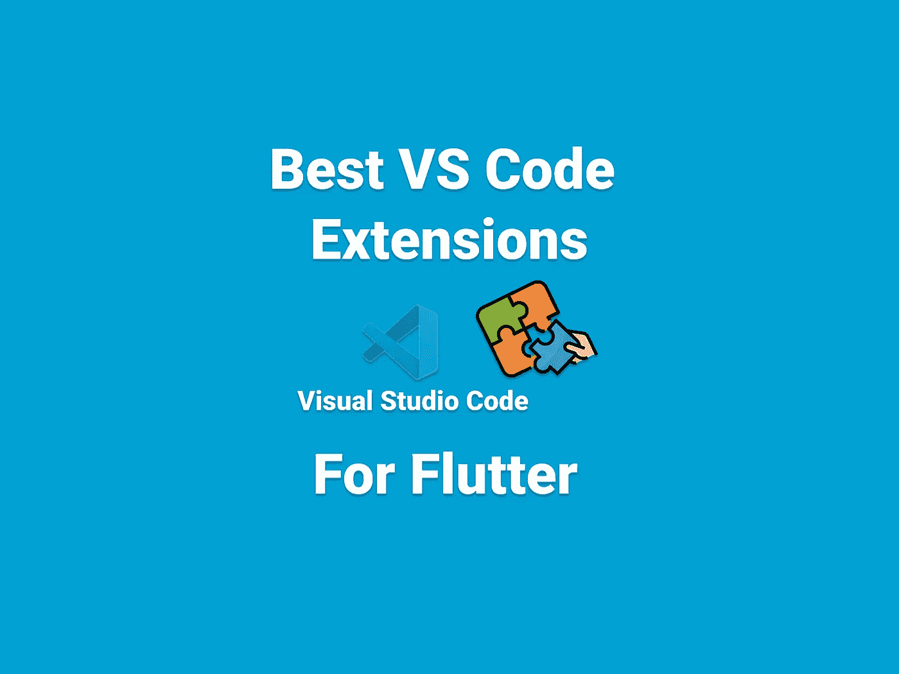
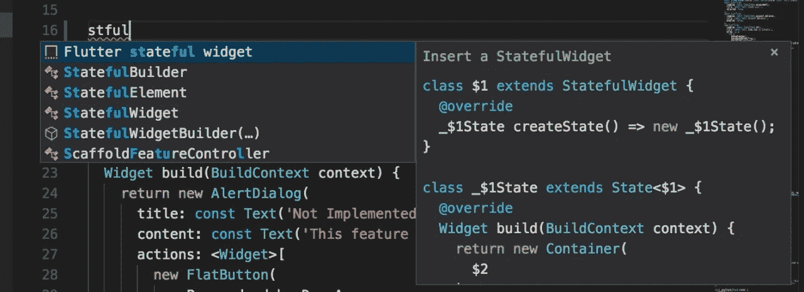
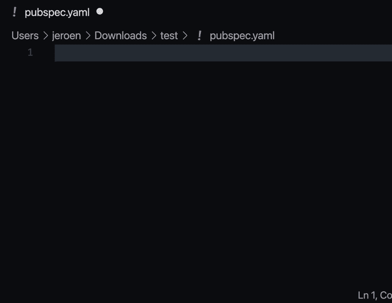
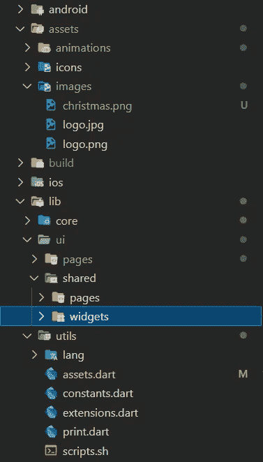
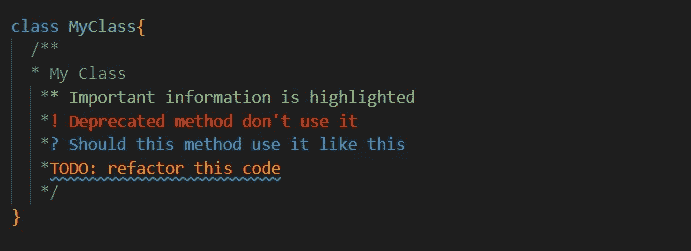
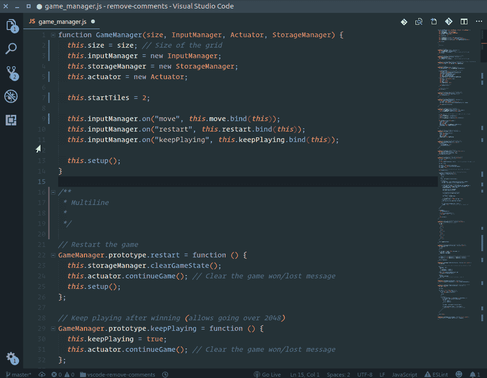
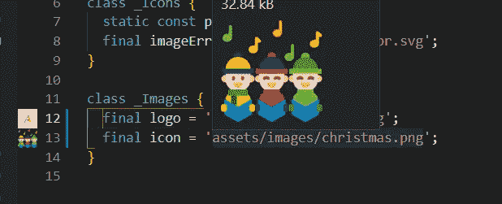
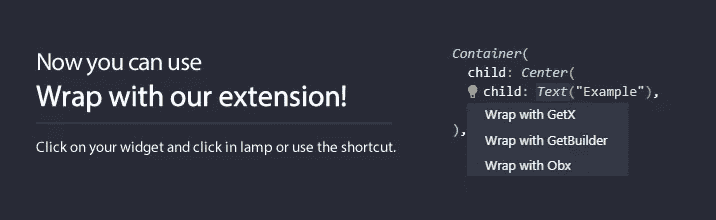
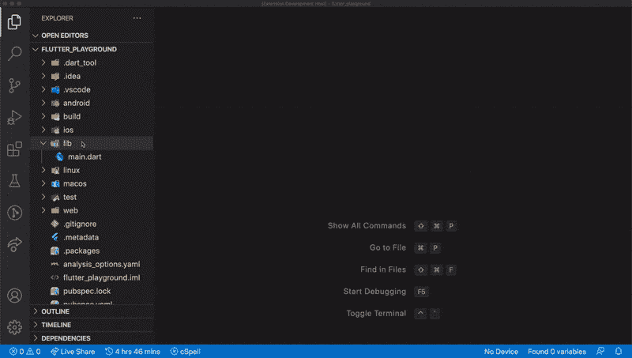
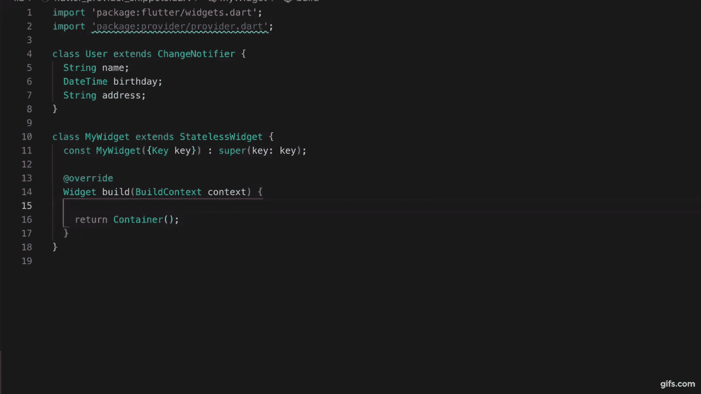

# 颤振的最佳 VS 代码扩展

> 原文：<https://itnext.io/best-vs-code-extensions-for-flutter-adcc808c5204?source=collection_archive---------0----------------------->

VS 代码是广泛使用的颤振 IDE 之一。但是有很多方法可以使用 VS 代码的扩展来提高生产率。

## [牛逼的颤振片段](https://marketplace.visualstudio.com/items?itemName=Nash.awesome-flutter-snippets)

Awesome Flutter Snippets 是一个常用的 Flutter 类和方法的集合。它通过消除与创建小部件相关的大部分样板代码来提高开发速度。通过分别输入快捷键`streamBldr`和`singleChildSV`可以创建`StreamBuilder`和`SingleChildScrollView`等小部件。

## [Pubspec 辅助](https://marketplace.visualstudio.com/items?itemName=jeroen-meijer.pubspec-assist)

Pubspec Assist 是一个 Visual Studio 代码扩展，它允许您轻松地将依赖项添加到您的 [Dart](https://dart.dev/) 和 [Flutter](https://flutter.dev/) 项目的`pubspec.yaml`中，而无需离开您的编辑器。

**注意:**在 Dart 版本> 2.5 中，该功能默认可用！

## [素材图标主题](https://marketplace.visualstudio.com/items?itemName=PKief.material-icon-theme)

材料图标主题是一个 Visual Studio 代码扩展，允许你改变你的文件夹和文件图标，使他们不无聊！

## [Dart 数据类生成器](https://marketplace.visualstudio.com/items?itemName=BendixMa.dart-data-class-generator)

Dart 数据类生成器是一个 Visual Studio 代码扩展，允许您轻松、快速地创建 dart 数据类，而无需编写样板文件或运行代码生成。

## [托多树](https://marketplace.visualstudio.com/items?itemName=Gruntfuggly.todo-tree)

Dart 数据类生成器是一个 Visual Studio 代码扩展。这个扩展可以在你的工作空间中快速搜索注释标签，如 TODO 和 FIXME，并在浏览器窗格中的树形视图中显示它们。单击树中的待办事项将打开文件，并将光标放在包含待办事项的行上。

已找到的待办事项也可以在打开的文件中突出显示。

## [更好的评论](https://marketplace.visualstudio.com/items?itemName=aaron-bond.better-comments)

Better Comments 是一个 Visual Studio 代码扩展。这个扩展将帮助您在代码中创建更加人性化的注释。
有了这个扩展，你可以将你的注释分类成:

*   警报
*   问题
*   托多斯
*   突出
*   注释掉的代码也可以被样式化，以清楚地表明代码不应该在那里
*   您喜欢的任何其他评论风格都可以在设置中指定

## [删除注释](https://marketplace.visualstudio.com/items?itemName=plibither8.remove-comments)

Remove Comments 是一个 Visual Studio 代码扩展。这个扩展将帮助您一次从代码中删除所有注释！一气呵成地整理和解压缩您的代码！

## [图像预览](https://marketplace.visualstudio.com/items?itemName=kisstkondoros.vscode-gutter-preview)

图像预览是一个 Visual Studio 代码扩展，它显示要在边框和悬停时预览的图像。

## 状态管理片段

[**GetX 片段**](https://marketplace.visualstudio.com/items?itemName=get-snippets.get-snippets)

GetX Snippets 是一个 Visual Studio 代码扩展，旨在加速使用 Flutter 开发应用程序的过程，面向所有使用 [Get](https://pub.dev/packages/get) 包的人。

[**集团**](https://marketplace.visualstudio.com/items?itemName=FelixAngelov.bloc)

Bloc 是 Visual Studio 代码扩展。这个包是为了方便实现用 Flutter 开发应用程序的`BLoC`设计模式(业务逻辑组件),面向所有使用 [bloc](https://pub.dev/packages/flutter_bloc) 包的人。

[**飘起的河荚片段**](https://marketplace.visualstudio.com/items?itemName=robert-brunhage.flutter-riverpod-snippets)

Flutter Riverpod Snippets 是一个 Visual Studio 代码扩展，它提供了一种增强 Riverpod 使用方式的方法。它包含不同片段的集合，比如`provider`。

[**提供方**](https://marketplace.visualstudio.com/items?itemName=Zaraclaj.flutter-provider-snippets)

Flutter Provider Snippets 是一个 Visual Studio 代码扩展，它允许收集在使用 [provider](https://pub.dev/packages/provider) 时常用的 Flutter 类和方法。它提高了你的发展速度。

感谢您的阅读。

如果你有任何问题，请随时评论。👏👏👏