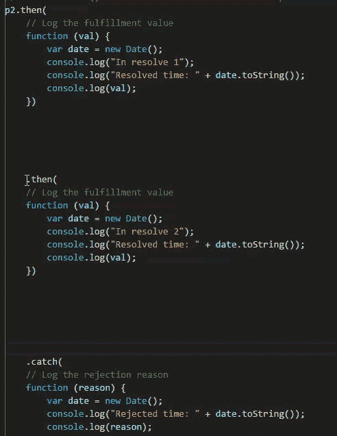
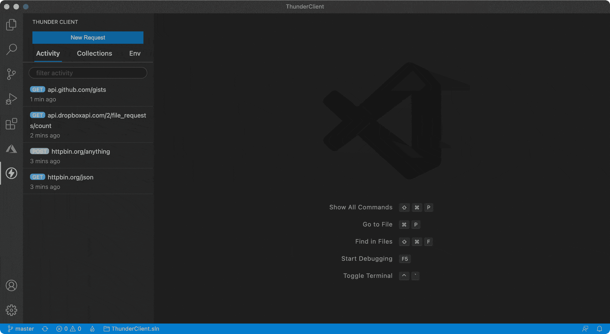
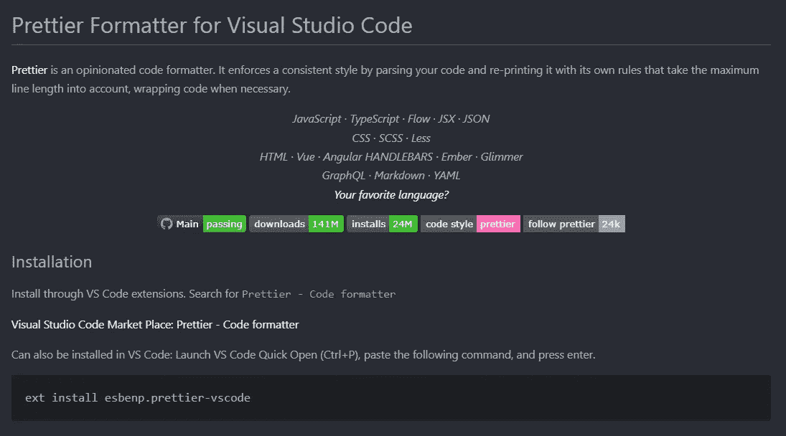
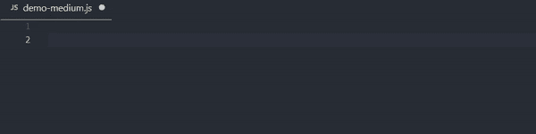

# 2022 年全栈开发者评选的最佳 VsCode 扩展

> 原文：<https://itnext.io/best-vscode-extensions-by-a-full-stack-developer-in-2022-f730037b6e0b?source=collection_archive---------0----------------------->

## 作为一名完整的堆栈开发人员，以下是我挑选的最好的 VS 代码扩展！😜

这些年来，我从 Sublime Text 转到 IntelliJ，最后转到 VSCode。

Visual Studio Code，简称 VS Code，是一个强大的免费代码编辑器。

我将与你分享我作为全栈开发者在日常工作中使用的顶级扩展。：

Kliton 用 Dalle 2 AI 生成图像

## [**1。TabOut**](https://marketplace.visualstudio.com/items?itemName=albert.TabOut)

这对我来说改变了我的生活😎

这个扩展用 tab 键把你的光标移出括号、引号和方括号。

*Gif 由* [*扩展页*](https://raw.githubusercontent.com/albertromkes/tabout/master/images/tabout-command.gif) 拍摄

## [2。编辑 CSV](https://marketplace.visualstudio.com/items?itemName=janisdd.vscode-edit-csv)

我过去常常编辑我的 CSV(用 Excel 或 Pages ),但现在我不必离开 VsCode，感谢这个扩展。

*Gif 由* [*扩展页面*](https://github.com/janisdd/vscode-edit-csv/raw/HEAD/images/titleImg.gif) 拍摄

## [3。饿删](https://marketplace.visualstudio.com/items?itemName=jasonlhy.hungry-delete)

多次按 backspace 来删除前导制表符或空格以便返回到该行的前一个结尾是非常烦人的。

按一下`ctrl+backspace`**删除前导空格和制表符，直到到达一个非空字符**

****

***Gif 由* [*扩展页*](https://github.com/Jasonlhy/VSCode-Hungry-Delete/raw/HEAD/images/after.gif) 拍摄**

****饥饿删除**也支持多光标**

****

***Gif 由* [*扩展页面*](https://github.com/Jasonlhy/VSCode-Hungry-Delete/raw/HEAD/images/multiple.gif) 拍摄**

## **[4。迅雷客户端](https://marketplace.visualstudio.com/items?itemName=rangav.vscode-thunder-client)**

**只是 Vscode 中的一个有效的邮差替代。😃**

****

***Gif 由* [*扩展页面*](https://github.com/rangav/thunder-client-support/blob/master/images/thunder-client.gif?raw=true) 拍摄**

## **[5。更漂亮](https://marketplace.visualstudio.com/items?itemName=esbenp.prettier-vscode)**

**这个扩展不需要介绍:它是最好的代码格式化程序。😎**

****

## **[6。波拉科德](https://marketplace.visualstudio.com/items?itemName=pnp.polacode)**

**PolaCode 是一个可以截取我们源代码截图的扩展。**

**是不是很神奇？😛**

****

***Gif 图片由* [*扩展页面*](https://github.com/octref/polacode/raw/master/demo/usage.gif)**

## **[7。Github 副驾驶](https://marketplace.visualstudio.com/items?itemName=GitHub.copilot)**

**这一个确实令人兴奋。🙈**

**Copilot 使用人工智能实时建议代码和整个功能。**

**它已经训练了数十亿行公共代码:Copilot 将自然语言提示，包括注释和方法名称，转化为代码建议。**

****

## **[8。路径智能感知](https://marketplace.visualstudio.com/items?itemName=christian-kohler.path-intellisense)**

**Path Intellisense 扩展允许您自动完成文件名**

**键入路径名时使用 intellisense 使快速导入文件变得更加容易。**

****

***Gif 由* [*扩展页面*](https://i.giphy.com/iaHeUiDeTUZuo.gif) 拍摄**

## **9。GitLens**

****

**当我开始使用 git lens ii 时，我被它迷住了。**

**它提供了当前行责备、代码热图、代码作者、图表等等。**

**它不像是一个扩展:它像是集成到了 VsCode 中。**

## **10。更好的评论**

**通过这一扩展，您可以将您的注释分为:**

*   **警报**
*   **问题**
*   **托多斯**
*   **突出**
*   **注释掉的代码也可以被样式化，以清楚地表明代码不应该在那里**
*   **您喜欢的任何其他评论风格都可以在设置中指定**

****

# **结论😏**

**这些是每个开发人员必备的 VS 代码扩展。**

**你最喜欢的 VS 代码扩展是什么？**

**请在评论中告诉我。**

# **我写的其他一些文章，我想你会觉得有用**

** [## 用 React 和帧运动制作 SVG 动画

### 你好👋在这篇文章中，我将向你展示我是如何为我的博客标识创建一个绘制效果的。在这里你将得到什么(你可以…

www.klitonbare.com](https://www.klitonbare.com/blog/animate-svg-with-framer)  [## 每个软件开发人员都必须知道的最佳书籍！

### 你的书架上有这些书吗？

itnext.io](/best-books-that-every-software-developer-must-know-8b96faff180d)  [## 不使用条件呈现操作符编写更好的 React 代码

### 避免使用使代码不可读的三元运算

better 编程. pub](https://betterprogramming.pub/how-i-improved-my-react-code-readability-and-maintainability-with-conditional-rendering-94b32448bc70)**