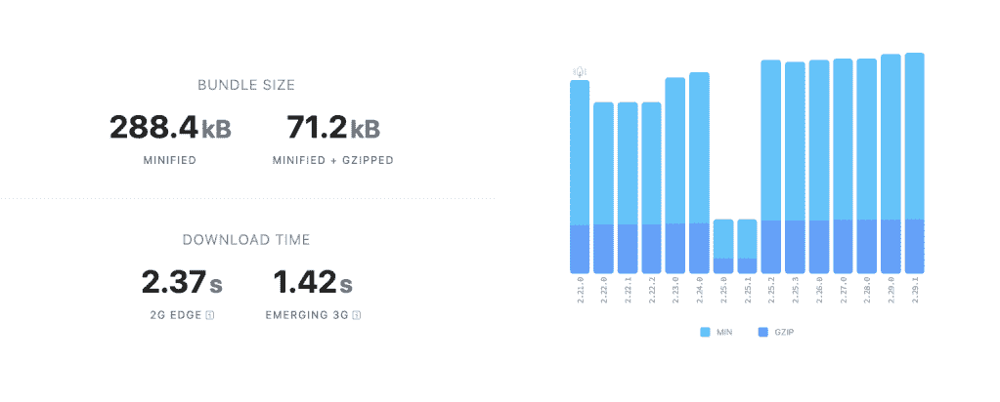
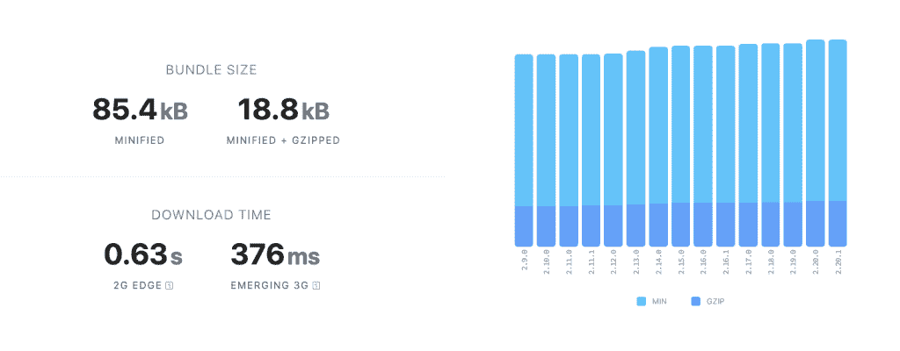
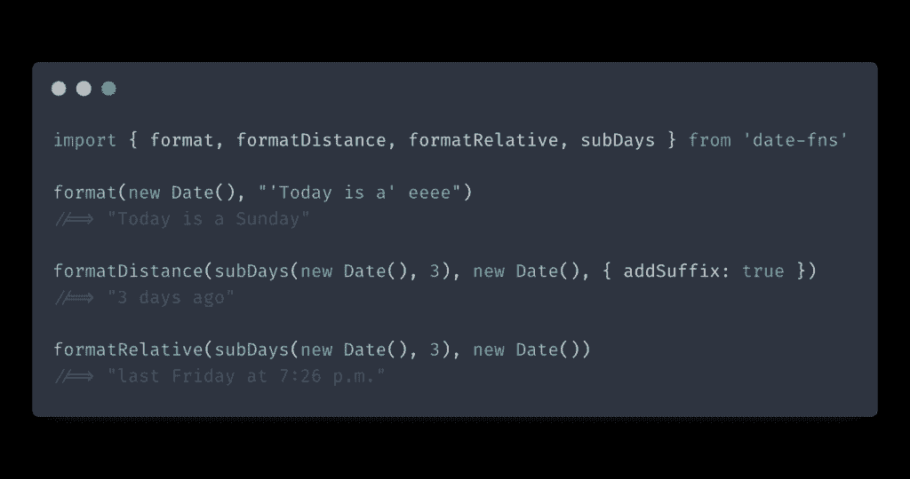
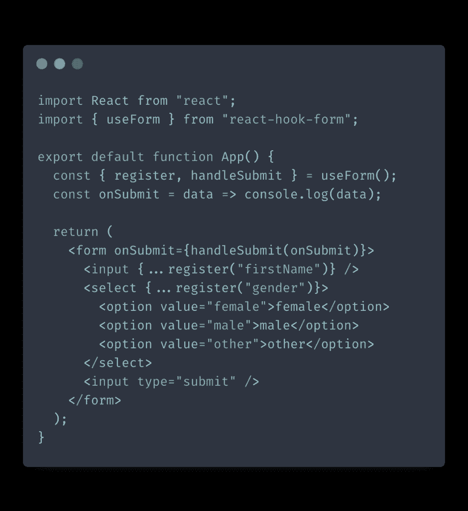
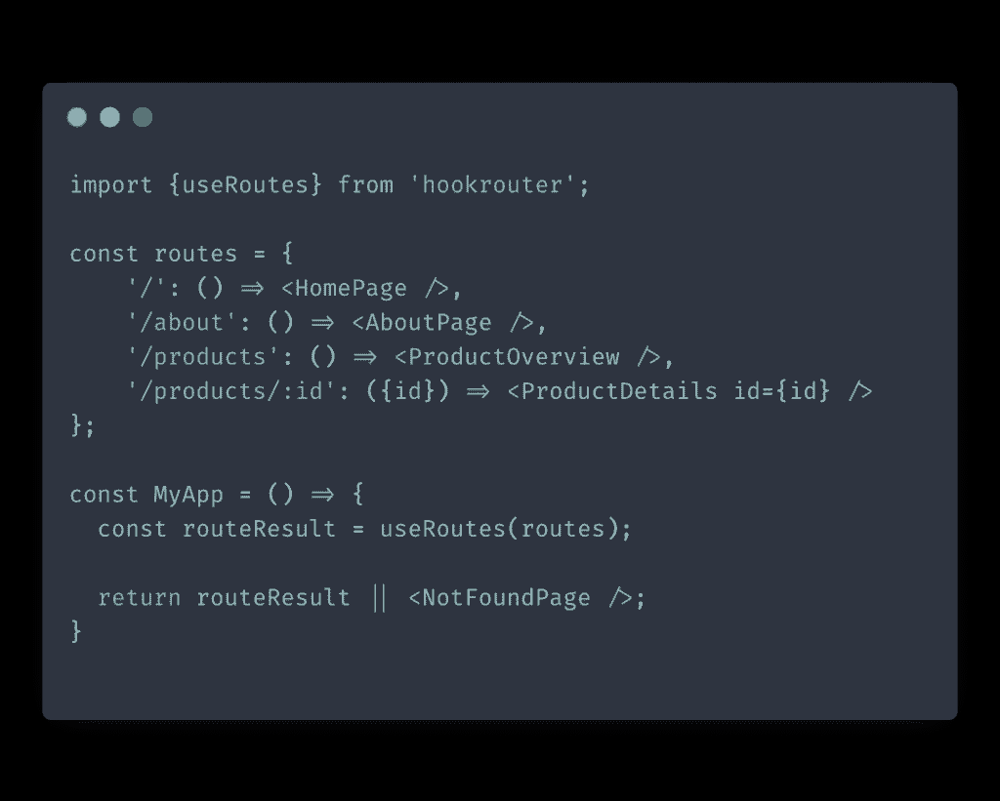
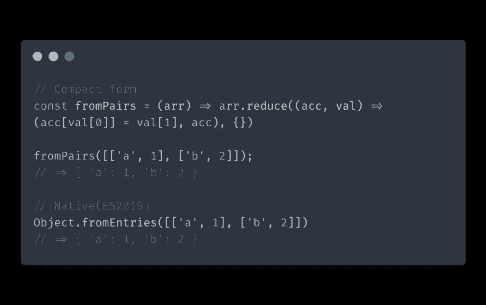

# 最流行的 React 库的更好替代方案

> 原文：<https://itnext.io/better-alternatives-to-the-most-popular-react-libraries-52b219cf5b45?source=collection_archive---------1----------------------->

JavaScript 是迄今为止软件开发领域中节奏最快的生态系统。事物是不断变化的，昨天很热的工具今天就要过时了。对于 React 库来说更是如此。虽然这可能会令人厌倦，但你必须跟上变化，以保持你的技能相关和高生产率。

因此，让我们来看看最流行的 React 库的替代方案，它们在很多方面都是更好的选择。

# 时刻与日期-fns

让我们从 JavaScript 世界的一个重量级人物开始。MomentJS 已经存在了很长时间，是使用最广泛的库之一。

MomentJS 是一个包含许多功能的怪物。缺点是这使得库的大小相当大。

MomentJS 的包大小是 288 kb——这对于一些日期操作来说是很大的一部分。尤其是考虑到你不能导入单独的方法，这意味着你不能用它做任何[树摇动](https://webpack.js.org/guides/tree-shaking/)。

你应该重新考虑使用 MomentJS 的另一个原因是这个库的开发已经过时了。甚至 MomentJS 的开发者也宣布他们[停止发布](https://momentjs.com/docs/#/-project-status/)新功能。

date-fns 是另一个流行的日期操作库。该库具有大多数相同的功能，但包的大小要小得多:

date-fns 返回原生 JavaScript 日期对象，这使得事情变得更简单。您将不再需要在时刻和本地日期格式之间周旋。下面是用 date-fns 格式化日期的示例代码:

最重要的是，date-fns 库是不可变的。这意味着它返回一个新的日期实例，而不是改变您给它的日期实例。

总的来说，date-fns 是 MomentJS 的可靠替代品。

# Formik VS React Hook 形式

[Formik](https://github.com/formium/formik) 是最流行的处理表单的 React 库之一。在撰写本文时，它在 Github 上几乎有 27K 颗星。Formik 是一个非常成熟的库，具有大量的功能来处理构建表单的主要难点。

也就是说，Formik 有一个主要缺点——过度渲染。Formik 将在用户输入时不断重新呈现整个表单。如果你的表单有很重的 UI，Formik 会通过在每次击键时重新呈现表单来让你的应用程序屈服。

React Hook Form 是一个较新的处理表单的库。顾名思义，它是用钩子建造的。总的来说，React Hook Form 采用了一种更精简的方法来构建表单，最终您将使用它编写更少的代码行。

但是与 Formik 相比，React Hook Form 的主要优势在于它使用了一种不受控制的输入方法，这种方法可以将你的应用程序从那些冗余的重新渲染中拯救出来。

连接表单很简单:您需要做的就是使用`register`方法注册表单的输入，并用`handleSubmit`包装提交事件处理程序。

# 反应路由器与钩路由器

React-router 是管理应用程序路由的 React 库。我过去使用 react-router 的问题是它太臃肿了。但是，随着钩子的引入，react-router 的作者在 API 中添加了[钩子。钩子大大减少了你编写的样板代码的数量。尽管如此，还是有一些有趣的选择。](https://reactrouter.com/web/api/Hooks)

hookrouter 是一个全新的库，完全基于 hooks，采用了一种更简单的应用程序路由方法。hookrouter 拥有 react-router 拥有的大部分基本功能，如编程导航、重定向和传递路由属性。

您没有使用`Route`和`Switch`来声明性地定义您的路由，而是使用消耗您的`routes`对象的`useRoutes`钩子，逐个评估每个路由，并检查它们是否匹配当前的 URL 路径。

使用 hookrouter，路由嵌套更加简单。如果在子组件中使用`useRoutes`钩子，它将不会匹配完整的 URL 路径，而只会匹配移除父组件路径后剩下的 URL 部分。这使得关于嵌套的推理更加容易。

那么哪个更好呢？在这种情况下，没有明确的赢家，答案是视情况而定。

react-router 仍然有更多的功能，可能是大型项目的更好选择。

如果你喜欢基于钩子的方法，你可能会更喜欢 hookrouter。对于使用 react-router 是多余的小型应用来说，它也是一个更好的工具。

# Lodash VS 原生 JavaScript

Lodash 是一个很棒的库，它提供了很多 JavaScript 过去缺乏的特性。然而，JavaScript 一直在不断改进。随着 ECMAScript2015 的发布，Lodash 的一些最常用的功能现在得到了本机支持。

这并不是说 Lodash 完全过时了。它仍然有许多非常有用的 API，不值得重新发明。请注意，您很有可能从项目中省略 Lodash，从而减少依赖性。

例如，下面是如何使用原生 JavaScript 来做 [fromPairs](https://lodash.com/docs/4.17.15#fromPairs) 函数所做的事情:

`Object.fromEntries`是 ES2019 提案中的一种新的实用方法，与`fromPairs`做同样的事情。所有的现代浏览器都支持它，除了 IE 和 Opera。如果你必须支持旧的浏览器，你可以使用 array 的`reduce`方法轻松地重新创建功能。

这里有一个在 Lodash 上使用原生 JavaScript 工具的很好的例子列表。

这就是这篇文章的全部内容。我希望这个 React 库列表对你有用。请记住，这不是严格的 1:1 比较。这些备选方案不一定在每种情况下都更好，所以您仍然应该使用良好的判断，并使用更适合您的项目的方案。

*原载于 2021 年 4 月 11 日 https://isamatov.com**[*。*](https://isamatov.com/better-alternatives-to-most-popular-react-libraries/)*