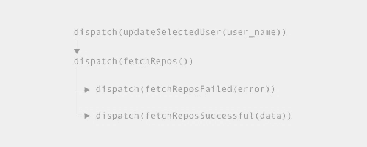
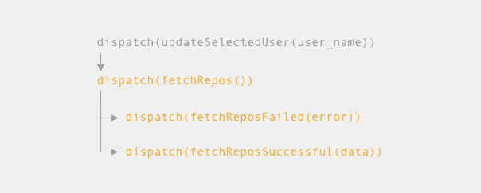
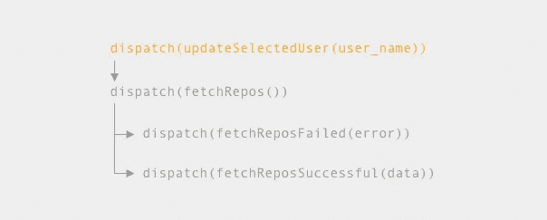
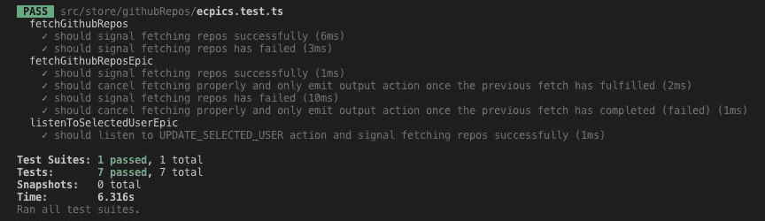
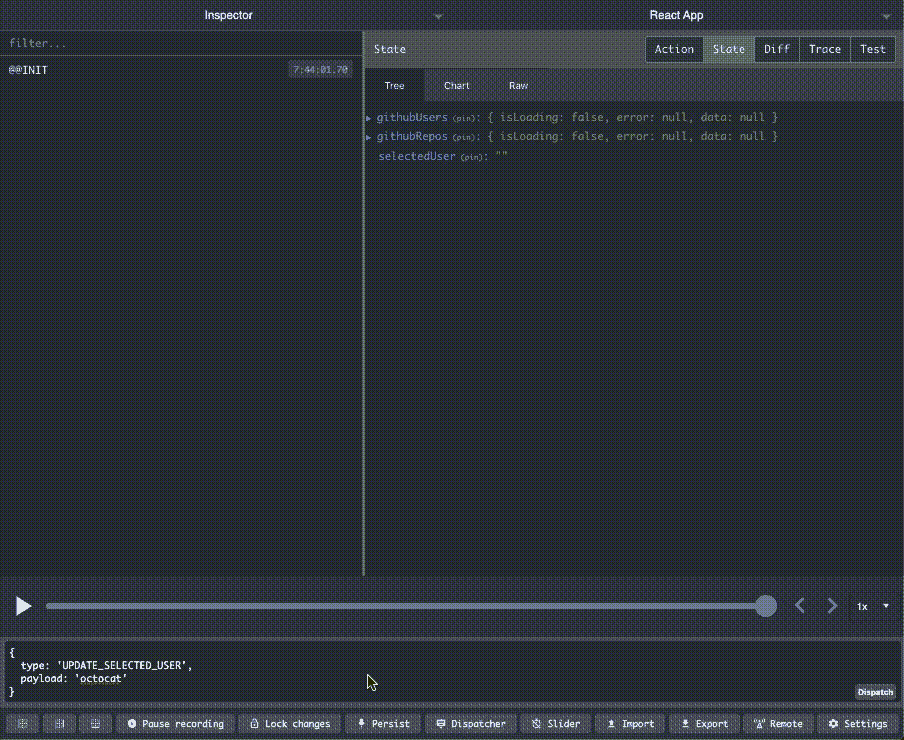

# 为 Redux Observable 和 TypeScript 编写更好的大理石测试

> 原文：<https://itnext.io/better-marble-test-70c7676a1e2?source=collection_archive---------2----------------------->


照片摄于奥地利。牛从山上下来过冬。

大理石测试是一种测试可见物体的绝妙方法。它关注的是随着时间的推移可观察到的行为。测试断言和[大理石图](https://rxmarbles.com/)的结合让我们可以直观地看到所发出的值随时间的进展。

用 [TypeScript](https://www.typescriptlang.org/) 为`[redux-observable](https://redux-observable.js.org/)` 编写 Marble 测试有时会有点棘手。找到指导或良好实践并不容易。我花了一段时间研究才适应它，所以我想和你分享我的发现，希望它能让你更好地了解如何测试你的史诗。

我已经做了一个[快速演示](https://github.com/DawChihLiou/better-redux-observable-marble-testing)。请参考其类型、动作和减速器。

## TL；速度三角形定位法(dead reckoning)

*   使用来自`[TestScheduler](https://rxjs-dev.firebaseapp.com/api/testing/TestScheduler)`的`createTime()`方法模拟 API 错误响应。
*   用`action$`作为热观测值测试史诗。
*   史诗中的`state$`是一个`[StateObservable](https://redux-observable.js.org/docs/basics/Epics.html)`，它带有一个[主题](https://rxjs-dev.firebaseapp.com/api/index/class/Subject)和一个你的 Redux 商店的状态。
*   收集弹珠图来帮助人们更好地理解你的测试。
*   如需演示，请点击查看[。](https://github.com/DawChihLiou/better-redux-observable-marble-testing)

让我们一起来看一个场景:

> 在 web 应用程序中向用户显示 Github 用户列表。通过点击一个列表项，我们将获取各个 Github 用户的公共存储库并显示出来。

当选择一个 Github 用户时，我们调度一个`UPDATE_SELECTED_USER`动作来更新商店中的`selectedUser`。更新后，我们想调度一个`fetchRepos`动作来通知从 Github 获取。一旦接收到 API 响应，存储将被更新为成功响应或错误。动作流程如下所示:



行动流程

## 测试执行提取的可观察对象

我们想从编写一个请求存储库列表的服务开始。我们将根据请求是否成功来保存响应数据或更新错误状态。

[fetchGithubRepos 流](https://gist.github.com/DawChihLiou/f79edd5366a52519b9b2466bf3ff7d40)

对于我们的第一个测试，我们想看看一个成功的请求是否会立即触发服务中的`fetchReposSuccessful`动作。弹珠图和弹珠的价值是这样的:

```
const marbles = {
  i: '-i', // api response
  o: '-o', // output action
};const values = {
  i: response,
  o: fetchReposSuccessful(response),
};
```

请注意，我们一起列出了大理石图。我发现这是一个非常清晰的表示，可以显示随时间推移而产生的值。我们可以在此结构中添加描述或中间步骤，以提高可读性:

```
const marbles = {
  i: '-i', // api response
  // == tap ==  
  // '-i'
  // == map ==
  o: '-o', // output action
};
```

接下来，就像在[正式文档](https://redux-observable.js.org/docs/recipes/WritingTests.html)中一样，我们将在`TestScheduler.run`中附上我们的测试。

```
scheduler.run(({ cold, expectObservable }) => {      
  const getJSON = (url: string) => cold(marbles.i, values);        
  const output$ = fetchGithubRepos('test-user', getJSON);      
  expectObservable(output$).toBe(marbles.o, values);    
});
```

Done 现在我们测试当 API 请求失败时，observable 是否发出`fetchReposFailed`。测试的棘手部分是模拟失败的请求。我们能做的就是用`[timer](https://rxjs-dev.firebaseapp.com/api/index/function/timer)`创造一个可观察的。

酷的是我们可以用 TestScheduler 为`timer`创建时间跨度。

```
const duration = scheduler.createTime('-|');      
const getJSON = (url: string) => 
  timer(duration).pipe(mergeMap(() => throwError(error)));
```

我们用 marble 符号和`TestSchedule`来创建`timer`，而不是用毫秒来表示持续时间。所以当我们执行`getJSON`，**时，它会在调度器**中的一个 tick 之后发出一个错误。预期的输出如下所示:

```
const marbles = {      
  d: '-|', // mock api response time duration
  o: '-(o|)', // output action. Complete when error thrown.
}; const values = {      
  o: fetchReposFailed(error),    
};scheduler.run(({ expectObservable }) => {             
  const output$ = fetchGithubRepos('test-user', getJSON as any);        
  expectObservable(output$).toBe(marbles.o, values);    
});
```

你可以在下面找到完整的测试。

[fetchGithubRepos 流的单元测试](https://gist.github.com/DawChihLiou/f43083bc00096fe40b69cdaec7a3a260)

## 测试没有状态的史诗

我们已经准备好编写第一个使用`fetchGithubRepos`服务获取存储库的 epic。

`[fetchGithubRepos](https://gist.github.com/DawChihLiou/2bbe6064a0c911b4fcd2119b2af597c1)` [史诗](https://gist.github.com/DawChihLiou/2bbe6064a0c911b4fcd2119b2af597c1)

这是一部直截了当的史诗。我们想要监听`FETCH_REPOS_REQUESTED`动作类型，从动作有效负载中选择用户名，并使用用户名执行服务 observable。注意，我们正在使用`[switchMap](https://rxjs-dev.firebaseapp.com/api/operators/switchMap)`,所以我们能够取消重复的 API 请求。



为了测试 epic，我们想看看它是否监听正确的动作，以及它是否只发出最近可观察到的动作。大理石看起来像这样:

```
const marbles = {      
  r: '--r', // mock api response      
  i: '-ii--i', // input action
  // == switchMap() ==      
  // only emit the latest value for consecutive inputs
  // '----r--r'
  // == map() ==
  o: '----o--o', // output action    
};const values = {      
  i: fetchRepos('test-user'),      
  r: response,      
  o: fetchReposSuccessful(response),    
};
```

现在构建测试。

```
scheduler.run(({ hot, cold, expectObservable }) => {      
  const action$ = hot(marbles.i, values) as any;      
  const state$ = null as any;      
  const dependencies = {        
    getJSON: (url: string) => cold(marbles.r, values),      
  };      
  const output$ = 
    fetchGithubReposEpic(action$, state$, dependencies);        
  expectObservable(output$).toBe(marbles.o, values);    
});
```

为了模拟输入动作的可观察性，我们从`scheduler.run`的回调函数中使用`hot`助手来创建热的可观察性。可观察的行动在本质上是冷的；然而，当它们通过`[redux-observable](https://redux-observable.js.org/docs/basics/SettingUpTheMiddleware.html)` [的中间件](https://redux-observable.js.org/docs/basics/SettingUpTheMiddleware.html)时，**动作可观察物通过将主体设置为观察者而变热**。在本·莱什的文章中阅读更多关于冷热的观察。在文章中，他还谈到了如何让代码变得可观察。

你可以看到我们断言`action$`为`any`供`fetchGithubReposEpic`使用。那是因为一部史诗期待`action$`是`[ActionsObservable](https://github.com/redux-observable/redux-observable/blob/master/src/ActionsObservable.ts)`型而不是`[ColdObservable](https://rxjs-dev.firebaseapp.com/api/testing/TestScheduler)`型。`CodeObservable`扩展了`Observable`，它是 TestScheduler 中一个可观察的帮助器，以方便测试。我们可以有把握地断言。

我们将`state$`分配给`null`,因为我们不访问 epic 中的商店。

对于依赖关系，我们用`cold`助手模拟`getJSON`来模拟成功的 API 请求。

【fetchGithubRepos Epic 的单元测试

## 使用 state$测试 Epic

现在我们可以完成最后一块来完成完整的动作流程。



我们正在创建一个 epic 来监听`updateSelectedUser`动作，并使用刚刚更新的用户名来触发`fetchGithubRepos`服务 observable。

[listenToSelectedUser 史诗](https://gist.github.com/DawChihLiou/d2c1e730f6608f886dc34bca0d2add80)

为了测试它，我们需要知道如何模拟国家可观测量。状态可观测量(`state$`)实际上是由`[StateObservable](https://github.com/redux-observable/redux-observable/blob/master/src/StateObservable.ts)`创建。`StateObservable`接受一个 Subject 和一个 Redux 状态作为参数。

```
const reduxState: AppState = {
  selectedUser: 'test-user',        
  githubRepos: reposInitialState,
};const state$ = new StateObservable<AppState>(
  new Subject(), reduxState);
```

我们已经准备好一起组装测试:

[listenToSelectedUser Epic 的单元测试](https://gist.github.com/DawChihLiou/f7606a8655c19990b03fe01663a6b4ba)

现在让我们看看测试结果！



如果它也能工作，让我们试一试。



随意看看我放在一起的[演示](https://github.com/DawChihLiou/better-redux-observable-marble-testing)。你可以在那里找到更多关于如何输入史诗和可观测量的细节。

给你！感谢您通读。

我希望我尽可能直截了当地抓住它。如果你有想法或者有什么不清楚的地方，欢迎在下面发表评论，或者在 twitter 上与我联系！

如果你是函数式编程的粉丝，可以看看我写的这篇关于转换器 的文章。这是编写转换器的一步一步的推理，并且涉及到函数式编程的关键思想。

编码快乐！