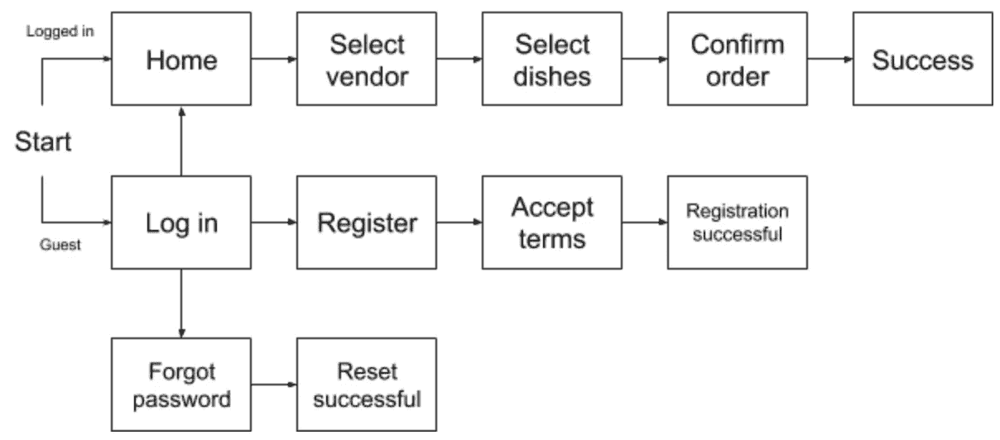
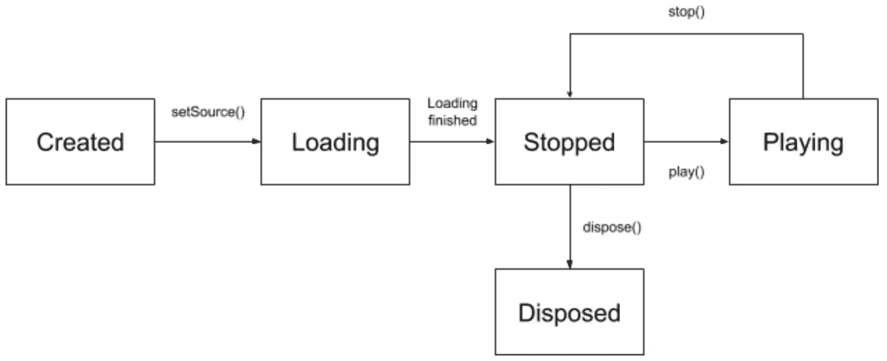
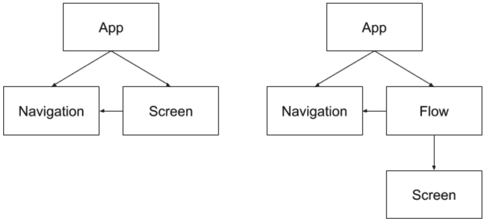
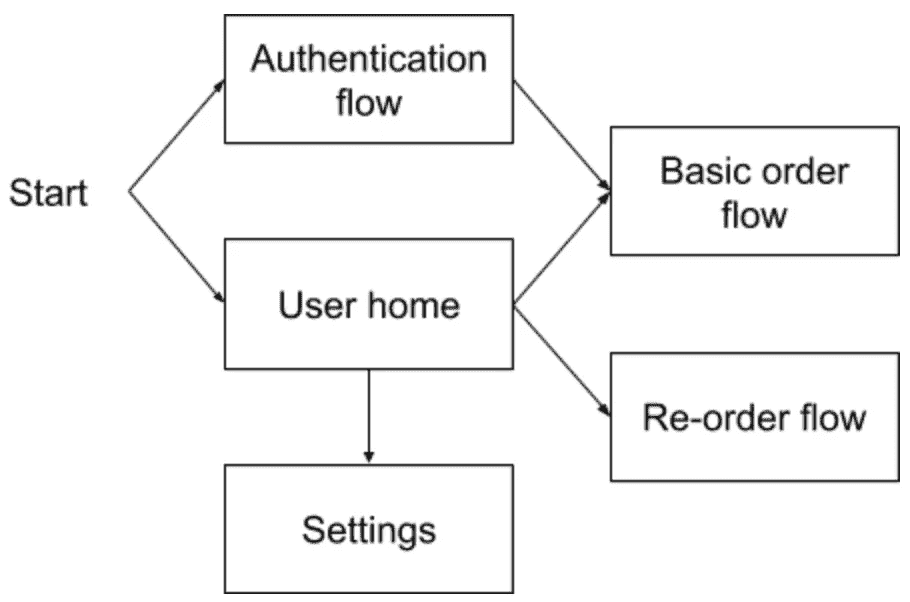

# 使用状态机实现更好的导航

> 原文：<https://itnext.io/better-navigation-with-state-machines-6c917866f351?source=collection_archive---------3----------------------->

应用导航有点像宠物仓鼠。它看起来相当无辜和谦逊，但是如果您没有正确地隔离它，它将很快开始在您的代码中留下丑陋的痕迹。

今年早些时候，我参加了一个食品配送应用程序的项目。我既没有参与应用程序本身的设计，也没有参与开发，而是参与了支持工作。这意味着我能够利用事后诸葛亮*和*局外人的观点来看待代码库，这给了我成为绝对的聪明人的双重优势。我的观点是导航一塌糊涂。

澄清一下，我不是想贬低我同事的任何工作。React Native 在开发开始时经历了很多变化，人们仍然在解决问题；统一的导航概念可能是任何人都不会想到的。尽管如此，回顾一下某项任务本可以处理得更好，总有价值。

"镜子里的任务看起来比以前容易多了."([卡勒·科特莱宁](https://unsplash.com/@kallek?utm_source=medium&utm_medium=referral)， [Unsplash](https://unsplash.com?utm_source=medium&utm_medium=referral) )

所以，继续吧，让我们看看你会怎么做。还要注意的是，这个模型决不局限于反应原生；这是一种通用模式，可以应用于任何使用基于屏幕导航的应用程序。

## 问题是

我们应用程序的用例由一些定义良好的屏幕流组成。当用户想要下订单时，他们将从供应商选择屏幕开始，然后转到供应商的菜单屏幕、订单确认屏幕，最后是一个成功的结果。登录和注册也有自己的流程，某些编辑功能也是如此。

基本订单和认证流程

第一个问题是，屏幕可以是多个流的一部分。例如，用户可以从设置屏幕和订单确认屏幕记录新的送货地址。该应用程序还有一个用户最近点的菜的列表，以及一个直接将它们带到供应商菜单的按钮，所选的菜已经在购物车中，有效地将它们放在订单流程的中间。

带有重叠屏幕的基本订单、重新订单和设置流程

通常，所有这些都是由屏幕本身处理的。如果一个屏幕是多个流的一部分，或者如果您需要从一个流的中间开始，您必须包括所有的分支和数据准备。您可以将代码分为视图类和逻辑类，但最终它仍然是屏幕的代码。

然后，还有数据的保存。随着流程的进行，每个屏幕都会提供额外的细节，这些细节需要存储起来以备将来重用。在订单流中，用户首先选择供应商，然后是菜肴，然后是送货地址，直到最后所有的信息都打包并在一个 API 请求中发送到服务器。到那时，这些碎片需要被收集到某个地方。

单个屏幕输出的基本订单流

您可以尝试将单个对象从一个屏幕传递到下一个屏幕(记住，不同的流将收集不同的数据，所以在 TypeScript 中愉快地完成这项工作)；或者，如果应用程序使用 Redux，您可以将所有内容推送到一个中心存储，并使所有屏幕都可以访问它(本质上是重新发明全局变量)。

最后，既然你已经想通了所有的问题，现在是最后一个重磅炸弹:创建一个可以授权给单一供应商的应用程序版本。当用户开始点餐时，会跳过供应商选择屏幕，而是直接选择菜肴。因此，基本上，您需要改变启动新订单流的每个交互的行为。主屏幕上有一个，汉堡菜单上有一个，另外当用户注册时我们会自动启动订单流程，而且……我*认为*就这些？也许吧？呃，测试会出来的。

说“QA”不能不带“eh”。([汤姆·索多吉](https://unsplash.com/@tomsdg?utm_source=medium&utm_medium=referral)， [Unsplash](https://unsplash.com?utm_source=medium&utm_medium=referral) )

让我们试试别的东西。

## 这个概念

根据定义，状态机是

> 一种设备，它可以处于一组稳定状态中的一种状态，这种状态取决于它以前的状态和它输入的当前值。

具体来说，这意味着一个对象对任何方法调用的响应都由一个内部变量(“状态”)控制，该变量的值被限制在一个明确定义的集合中。一个常见的例子是媒体回放对象，它的状态可以映射到流程图，如下所示:

基本媒体回放对象的状态和状态转换

这种对象的某些方法调用只在某些状态下有效。在除了`Stopped`之外的任何状态下调用`play()`，或者在除了`Created`之外的任何状态下调用`setSource()`，可能会无声地失败或者抛出异常。有效的方法调用通常会改变对象的状态。

通常，状态机对象的方法将遵循以下模式:

1.  **验证**:验证该方法调用在对象的当前状态下是否有效。如果不是，则返回或抛出异常。
2.  **执行**:执行任何需要的副作用。
3.  **过渡**:改变物体的状态。
4.  **Result(可选)**:如果有，返回操作结果。

状态机可以通过多种方式实现。最基本的解决方案是用对象的可能状态声明一个枚举，并使用该枚举类型的私有成员:

根据您使用的语言，您也可以使用函数指针或内部类来更好地封装特定于状态的行为。实际的实现现在并不重要。

## 应用程序

基本思想是在屏幕和导航对象之间插入一个附加层，其目的是封装当前流的所有支配性逻辑。不是每个屏幕单独决定下一个应该显示哪个，而是向流对象发送信号，可选地传递一些数据作为结果，比如从用户收集的输入。流对象将检查这些数据，确定下一步需要做什么，并导航到适当的屏幕。

状态机很容易适应这个过程，这里的机器是流对象，它的当前状态是当前屏幕。当显示一个新屏幕时，flow 对象向它传递一个回调；当这个回调的目的实现后，屏幕可以使用它。在内部，回调方法将遵循与我们上面概述的相同的基本模式:

1.  **验证**:检查从屏幕接收的数据。
2.  **执行**:将相关数据提交给流对象的内部存储，或者执行其他一些与屏幕本身没有直接联系的操作。
3.  **Transition** :导航到新屏幕，传递回调函数和屏幕初始化所需的任何附加数据。

例如，下面是如何编写回调函数来处理用户从订单流中的供应商列表(加上一些额外的助手函数)中进行的选择:

一旦屏幕被连接成流，逻辑的抽象就可以更上一层楼。就像屏幕可以通知流应该加载新的屏幕一样，流也可以通知应用程序应该启动不同的流。本质上，应用程序本身的流程也可以组织成一个状态机:

当应用程序启动时，如果没有登录用户，它会加载验证流，如果有，它会加载默认流(只包含主屏幕)。当用户按下主屏幕上的“新订单”按钮时，默认流程可以向应用程序发出信号，启动订单流程，等等。

## 事物的利与弊

最大的优点是应用程序的业务逻辑被完全正确地隔离了。代码本身可能会变得更加复杂，但是 app 的*逻辑*要简单得多。如果你想了解哪个屏幕在哪个之后出现，在什么条件下出现，你只需要看一个地方。

这种逻辑的集中化也使得改变变得微不足道。在我们的例子中，如果您需要创建一个应用程序的分支，订单流在不同的屏幕上开始，您只需要更改订单流对象的几行代码，其他地方都不用做。创建新的流也可以在不修改任何屏幕组件的情况下完成。

在流程的整个生命周期中保持一致的单个对象也使其成为数据保存的理想选择。每次屏幕返回一个结果，流可以选择存储它；然后，它可以将其存储的全部或部分数据传递给新的屏幕或新的流。

不利的一面是，向任何体系结构添加新的一层都不可避免地会带来一大堆开销，并且会使代码更难全面掌握。然而，我发现状态机导航方法带来的好处远远超过这种增加的复杂性。

*Mate Safranka 是*[*super charge*](https://supercharge.io)*的前端开发者。当他不整理他的形式语言和自动机教科书时，他喜欢向初学者和非开发人员解释编程概念。查看他关于* [*层抽象*](https://medium.com/@mate.safranka/you-a-driver-and-a-taxi-layers-of-abstraction-abbd4be9bdad) *或者*[*HTTP vs Sockets*](https://medium.com/@mate.safranka/mail-order-vs-tech-support-http-and-sockets-in-plain-english-40d2349676ed)*的文章。*