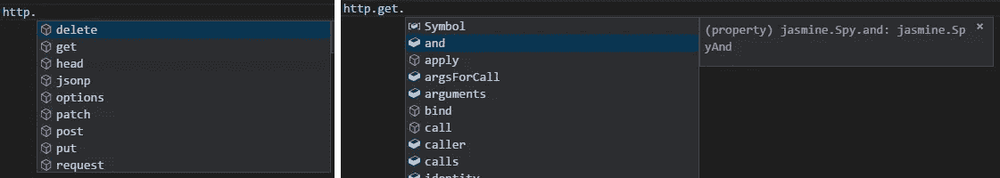

# 对 Jasmine 更好的类型脚本支持

> 原文：<https://itnext.io/better-typescript-support-for-jasmine-20dc7454ba94?source=collection_archive---------5----------------------->


Typescript 是一种很棒的语言，它通过利用类型安全使 Javascript 开发人员更有效率。然而，当使用 Jasmine 测试时，您会失去这个好处，因为在大多数情况下，您必须使用类型`any`。

我将使用 Angular 示例，但是该场景适用于任何其他框架。

# 问题是

假设我们有一项服务:

要用 Jasmine 测试这个服务，您通常需要编写类似如下的设置代码:

第一个问题在第 3 行:`let http: any`。这意味着所有的类型安全都消失了，不再有来自你钟爱的 IDE 的代码建议。

# 向模拟添加类型安全

幸运的是，解决第一个问题很简单。声明一个[映射类型](https://www.typescriptlang.org/docs/handbook/release-notes/typescript-2-1.html#mapped-types):

```
export type Spied<T> = {  
  [Method in keyof T]: jasmine.Spy;
};
```

从`any`变为`Spied<HttpClient>`:

现在，您可以输入关于该服务的信息，此外还有关于 jasmine spy 的信息:



关于这种方法的详细信息可以在[Vildan Softic](http://pragmatic-coder.net/author/zewa/)blog post[类型安全 Jasmine Spies](http://pragmatic-coder.net/typesafe-jasmine-spies/) 中找到。

# 简化 jamsine.createSpyObj()函数

测试的第二个问题在第 11 行:

```
useValue: jasmine.createSpyObj('http', ['get'])
```

如果将来你添加了一个使用 POST 动作的方法，你将不得不返回并添加`post`到声明中。这很烦人，而且容易出错。例如，在重构期间更新了一个方法名，但是您的 spy 将保持不变，因此您的测试将会失败。

我希望有一个只接受类类型的方法`spyOnClass`，以及一个将所有方法作为返回值的 spy，例如`useValue: spyOnClass(HttpClient)`。

下面是实现过程:

我在代码中添加了一些注释，但想法很简单:我们获得类原型的所有属性和方法，过滤方法，并用这些方法创建一个 spy 对象。现在我们可以为任何类创建一个 spy，我们不需要关心方法中的拼写错误，也支持重命名/重构😍！

# 让它变得更好

现在我们可以这样模仿一个类:

```
{ provide: HttpClient, useValue: spyOnClass(HttpClient) }
```

这种类型的代码会在任何地方重复出现，让我们也将它移到一个函数中:

```
export function provideMock<T>(spiedClass: Type<T>) {
  return {
    provide: spiedClass,
    useValue: spyOnClass(spiedClass)
  };
}
```

现在，设置变得更加简单:

我们在这里，我们的间谍现在有打字信息，间谍创造本身是简单和通用的。下面是一个完整的工作堆栈示例:

请👏如果你觉得这个信息有用。上面的技术已经对我们当前的项目帮助很大。