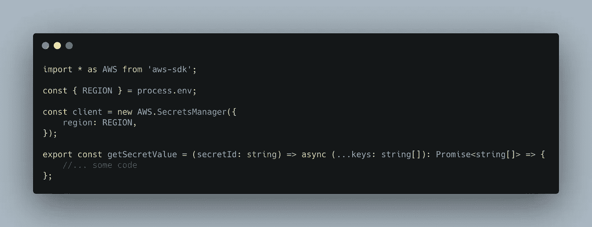
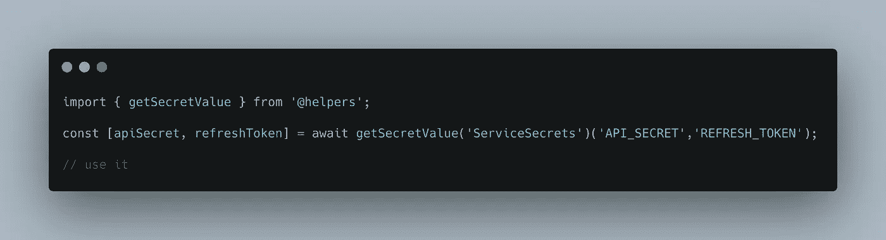
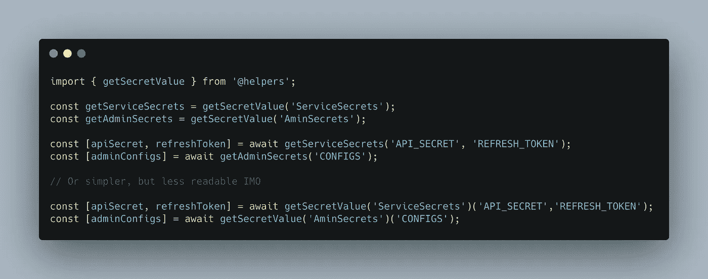
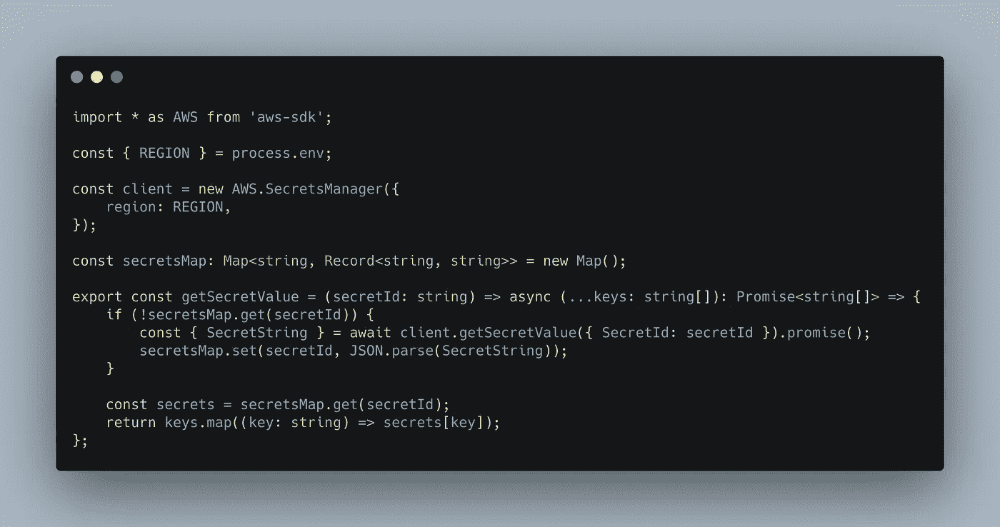
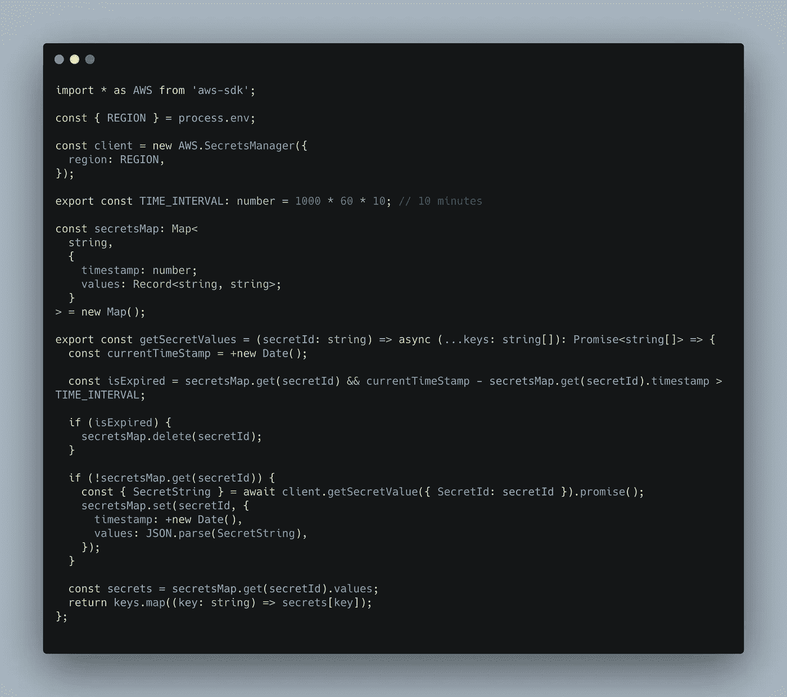

# 在无服务器世界获得秘密的更好方法

> 原文：<https://itnext.io/better-way-to-get-secrets-in-serverless-world-1aba8a71b3a1?source=collection_archive---------1----------------------->

最有可能的是，如果你正在积极地使用无服务器技术，你已经实现了这样一种助手来在运行时从 secret Manager 中检索一些秘密数据。我认为可能会有一些陷阱和需要改进的地方。

在这个例子中，我们将实现一个助手来从 [AWS Secret Manager](https://aws.amazon.com/ru/secrets-manager/) 获取秘密值

欢迎你在船上拆卸这样的帮手！我们将使用 typescript。基于这里使用的技术，将有可能使用任何编程语言(嗯，几乎)。

让我们定义一下我们助手的初始**【外观】**

已经可以出现问题了。为什么这么复杂？函数返回一个函数？我们一起想办法。首先，我们需要了解我们将如何使用这个助手。

[HOF](https://typeofnan.dev/what-is-a-higher-order-function/) 帮助我们“**创建**多个不同的函数，这些函数将通过不同的**secret 返回秘密值。**这看起来比使用 **secretId** 作为外部帮助者的单独参数更准确。如果没有 HOF，就需要扩展助手本身的逻辑。

到目前为止应该不会出现新的问题。让我们定义我们的助手的主要逻辑

没有什么特别的，我们接收 **SecretString** ，然后解析它并尝试通过提供的键获取值。

在这一点上，我们可以停下来，去喝杯咖啡/茶，重新观看《瑞克和莫蒂》的最佳剧集，但正如我之前所说的，有一个需要改进的地方有自己的缺陷。

> 运行无服务器功能时，只要您在运行它，它就会保持活动状态(也称为热状态)。您的容器保持活动状态，准备就绪并等待执行。
> 
> 一段时间不活动后，您的云提供商将丢弃容器，您的功能将变为不活动状态(也称为 cold)。

来源:[https://www.serverless.com/blog/keep-your-lambdas-warm](https://www.serverless.com/blog/keep-your-lambdas-warm)

现在，我们可以了解这一事实，而不必再打电话给 AWS Secrets Manager，因为这不仅耗费时间，还耗费金钱。一张简单的**地图**会帮助我们。

在成功接收到来自 **secretManager** 的数据后，我们将它放入 map 中，其中 key 是 secretId，value 是一个经过解析的字符串(secret values)。因此，我们避免重复调用 **secretManager，**，因为我们直接从 **Map** 中获取值(当然，以防 lambda 变暖)。

你可能认为这是结束了。但是有了这样的实现，你就可以很轻松的擦自己的脚了！让我们假设你有一个超级成功的创业公司。持续的交通让您的 lambdas 保持温暖！您查看日志并了解到您需要更改其中一个秘密值，因为一些 API 键被错误地定义为 prod *env* 。打开 *aws 控制台*，将数值更改为正确值。一段时间过去了，但是根据日志，lambda 仍然不能正常工作。这导致永久温暖和助手使用来自**地图的**缓存的**秘密值。**怎么才能修复？正确，为我们的秘密添加一些到期时间，假设没有一个值在地图中的"**缓存**"不应该超过 *10 分钟。*来实施吧。这就是我们最终实现的 **getSecretValues** helper 的样子

希望对你有帮助。我欢迎任何形式的反馈。请随意与你的助手/技巧分享，这可能对无服务器世界有用。这个助手是我的[无服务器模板](https://github.com/collierrgbsitisfise/serverless-bonk-template)的一部分。在这里你可以找到助手的原始来源。