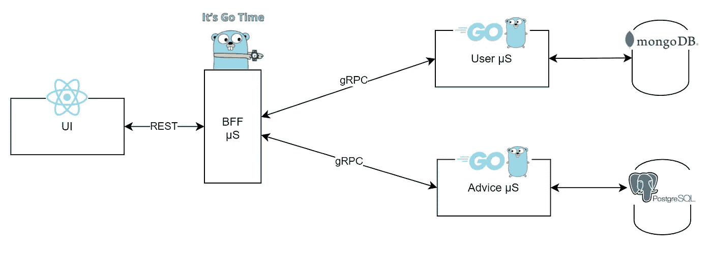
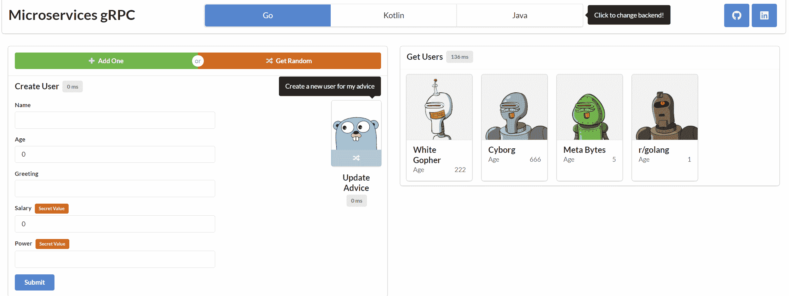
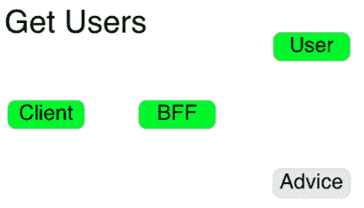
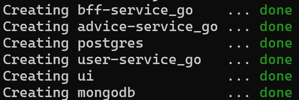

# 使用 REST 和 gRPC 通过 Go 微服务[构建] BFF 模式。

> 原文：<https://itnext.io/bff-pattern-with-go-microservices-using-rest-grpc-87d269bc2434?source=collection_archive---------0----------------------->



高级图表

## 让我们用 REST 和 gRPC 构建 dockerized Go 微服务来演示 BFF 模式。将其绑定到 UI，并在 AWS EC2 上部署所有内容。(也有 Kotlin 和 Java 版本)

TL；DR: [Github Go](https://github.com/uid4oe/microservices-go-grpc) ， [Github Kotlin](https://github.com/uid4oe/microservices-kotlin-grpc) ， [Github Java](https://github.com/uid4oe/microservices-java-grpc) ， [Github UI](https://github.com/uid4oe/microservices-grpc-ui)

BFF，也就是所谓的“永远最好的朋友”*模式是一个已经建立的架构…玩笑归玩笑，当我们的系统有**多个**前端，而这些前端又有很大**不同的需求**时， [BFF](https://medium.com/frontend-at-scale/frontend-architectural-patterns-backend-for-frontend-29679aba886c) —后端对前端模式是有意义的。我们的目标不是根据不同的前端特定需求来改变我们的核心服务，而是在前端和核心服务之间的一个层中实现这些需求。因此，我们为前端添加了一个 ***后端服务。这也允许我们在一个结构化和有界的上下文中处理这样的需求。****

*理想情况下，我们的业务/领域相关逻辑应该放在不对外公开的微服务中。这种设置支持 SoC、模块化和灵活性。在这个例子中， [**用户服务**](https://github.com/uid4oe/microservices-go-grpc/tree/main/user) 和 [**建议服务**](https://github.com/uid4oe/microservices-go-grpc/tree/main/advice) 将持有我们的域逻辑。 [**BFF 服务**](https://github.com/uid4oe/microservices-go-grpc/tree/main/bff) 将执行 [gRPC](https://medium.com/swlh/grpc-in-the-life-of-microservices-309933945d6) 对域服务的调用。此外，如果需要，它将负责汇总/定制收到的域响应。*

**

*用户界面(带有语义 UI 的 React.js)*

*以上，我们有我们的 [UI](https://github.com/uid4oe/microservices-grpc-ui) 。我们将为[机器人](https://robohash.org/)用户实现 CRUD 操作，并将[随机建议](https://api.adviceslip.com/)与他们的`[user_id](https://github.com/uid4oe/microservices-go-grpc/blob/af856b536b03bee25a5e157b021bb4d26c4ed48e/advice/advicedb/postgres.go#L14)`链接起来。嗯，但是基于*高级图表*我们将数据的一些部分存储在不同的存储库中。这是否意味着我们将需要在前端执行多个网络调用？**没有！BFF 服务将为我们处理此类情况。下面有一个很酷的 gif，突出显示了在我们的例子中处理不同请求类型所涉及的部分。***

**

*很酷的 gif*

*因此，我们现在有了这个 ***额外的*** 服务来解决上述问题。但是性能呢。房间里的大象。为了减少新引入的开销，我们将在服务之间使用 [**gRPC**](https://medium.com/swlh/grpc-in-the-life-of-microservices-309933945d6) 。让我们从定义 [**用户服务**](https://github.com/uid4oe/microservices-go-grpc/tree/main/user) **的契约开始。***

*`[user.proto](https://github.com/uid4oe/microservices-go-grpc/blob/main/user/userpb/user.proto)`用于定义我们服务中需要的一切。我们在这里添加所有需要的`message`、`service`、`rpc`、`enum`类型。它们将在代码生成期间由`protoc`使用。*

*为了生成相关代码，我们可以使用`[generate-pb.sh](https://github.com/uid4oe/microservices-go-grpc/blob/main/genarate-pb.sh)`，它基本上是执行`protoc`命令。*

*太好了！ [**用户服务**](https://github.com/uid4oe/microservices-go-grpc/tree/main/user) 和任何其他服务之间的桥梁现在准备好了。我们可以开始在 [**用户服务**](https://github.com/uid4oe/microservices-go-grpc/tree/main/user) (gRPC 服务器)上实现`rpc **GetUsers**`。*

*上面， [**用户服务**](https://github.com/uid4oe/microservices-go-grpc/tree/main/user) (gRPC 服务器)通过将请求委托给`[**userdb**](https://github.com/uid4oe/microservices-go-grpc/tree/main/user/userdb)` 包中的一个方法来实现`[rpc **GetUsers**](https://github.com/uid4oe/microservices-go-grpc/blob/af856b536b03bee25a5e157b021bb4d26c4ed48e/user/main.go#L74)`，该方法通过`[**mongo_client**](https://github.com/uid4oe/microservices-go-grpc/blob/af856b536b03bee25a5e157b021bb4d26c4ed48e/user/userdb/mongo.go#L77)`执行 DB 操作。*

*我们已经完成了 [**用户服务**](https://github.com/uid4oe/microservices-go-grpc/tree/main/user) (gRPC 服务器)，并准备开始构建 [**BFF 服务**](https://github.com/uid4oe/microservices-go-grpc/tree/main/bff) (gRPC 客户端)。由于`protoc`，所需的 [***存根***](https://github.com/uid4oe/microservices-go-grpc/blob/af856b536b03bee25a5e157b021bb4d26c4ed48e/user/userpb/user_grpc.pb.go#L30)***(***gRPC 客户端对于 [**用户服务**](https://github.com/uid4oe/microservices-go-grpc/tree/main/user) 、或任何其他 **)** 已经生成。*

*在 [**BFF 服务**](https://github.com/uid4oe/microservices-go-grpc/tree/main/bff) 中设置好我们的 HTTP/2 连接后，我们将使用`**userGrpcServiceClient**` 进行通信，这是我们的存根(您可以随意命名)。当我们的存根调用它的`rpc **GetUsers**` 方法时，请求将到达我们 gRPC 服务器在 [**用户服务**](https://github.com/uid4oe/microservices-go-grpc/tree/main/user) **中的实现。**就这样！我们现在可以通过 gRPC 使用 MongoDB，并将响应返回给 [**BFF 服务**](https://github.com/uid4oe/microservices-go-grpc/tree/main/bff) 。*

*我们几乎完成了，只剩下两件事来为我们的前端服务。准备处理函数并运行一个将端点绑定到我们的处理函数的 HTTP 服务器。*

*上面，处理函数`[**GetUsers**](https://github.com/uid4oe/microservices-go-grpc/blob/af856b536b03bee25a5e157b021bb4d26c4ed48e/bff/main.go#L33)` 将请求委托给`**user_client**` ，其中包含一个 [**用户服务**](https://github.com/uid4oe/microservices-go-grpc/tree/main/user) 的[*存根* ，命名为](https://github.com/gin-gonic/gin)`[**userGrpcServiceClient**](https://github.com/uid4oe/microservices-go-grpc/blob/af856b536b03bee25a5e157b021bb4d26c4ed48e/bff/client/user_client.go#L56)` 正如我们之前讨论的。*

*最后，我们将设置 HTTP 服务器，在本例中我们将使用 [Gin](https://github.com/gin-gonic/gin) 。`gin.Default()`连接记录器和恢复中间件。`cors.Default()`允许我们接受来自任何地方的流量。我们用它们的处理函数注册我们的端点/路由。现在，一旦发出请求，Gin 将调用注册的处理函数。*

***万岁！我们完了！！！**此时，我们可以通过 gRPC 使用 [**用户服务**](https://github.com/uid4oe/microservices-go-grpc/tree/main/user) 的 repository (MongoDB)，将响应返回给 [**BFF 服务**](https://github.com/uid4oe/microservices-go-grpc/tree/main/bff) ，按照我们想要的方式定制它，然后返回前端。*

*其余的实现可以在 [GitHub](https://github.com/uid4oe/microservices-go-grpc) 上找到。如果您对使用 SQL 存储库的服务感兴趣，请检查 [**建议服务**](https://github.com/uid4oe/microservices-go-grpc/tree/main/advice) **(** PostgreSQL)。*

*是时候结束我们的工作了！首先，我们需要一个`Dockerfile`*

*我们应该用需要暴露的端口值来改变`"PORT"`。例如，`8080`。然后，我们可以使用`docker build -t uid4oe/go-ms-bff:latest`构建应用程序并创建图像*

*此外，我更喜欢使用`scratch`，因为它可以缩小最终图像的尺寸。我们应该对其余的服务应用相同的步骤，并将图像推送到 [Docker Hub](https://hub.docker.com/) 。`docker push uid4oe/go-ms-bff:latest`*

*最后，我们需要一个`[docker-compose.yml](https://github.com/uid4oe/microservices-go-grpc/blob/main/docker-compose.yml)`文件来收集所有信息。默认情况下，我们可以使用链接中的文件。使用`[docker-compose.yml](https://github.com/uid4oe/microservices-go-grpc/blob/main/docker-compose.yml)`，我们还应该将`[mongo-init.js](https://github.com/uid4oe/microservices-go-grpc/blob/main/mongo-init.js)`、`[advice.sql](https://github.com/uid4oe/microservices-go-grpc/blob/main/advice.sql)`、`[.env](https://github.com/uid4oe/microservices-go-grpc/blob/main/.env)`复制到我们的 EC2 实例中。*

*到最后，我们可以按照[亚马逊指南](https://docs.aws.amazon.com/AmazonECS/latest/developerguide/docker-basics.html)在 EC2 中设置 Docker。之后，我们需要使用这个 [**要点**](https://gist.github.com/npearce/6f3c7826c7499587f00957fee62f8ee9#docker-compose-install) 将`docker-compose`添加到我们的实例中，现在我们都准备好了！哦，确保**入站规则**配置正确。默认情况下，端口`80`和`8080`应该接受流量。*

*一旦我们运行下面的命令，所有的服务都将启动并运行。*

```
*docker network create uid4oe
docker-compose up -d*
```

**

*哇！那是一段相当长的旅程。非常感谢您抽出时间。所有必要的文件都在 [Github](https://github.com/uid4oe/microservices-go-grpc) 中。我还添加了 [Kotlin Spring](https://github.com/uid4oe/microservices-kotlin-grpc) 、 [Java Spring](https://github.com/uid4oe/microservices-java-grpc) 版本。就功能而言，它们与 Go 版本相同。特别感谢珀西·博尔默回顾了这个故事。*

*祝您愉快！*