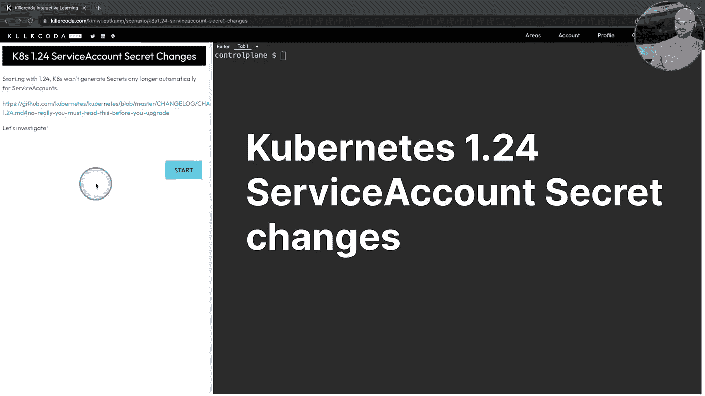

# K8s 1.24 中关于服务帐户及其秘密的重大变化

> 原文：<https://itnext.io/big-change-in-k8s-1-24-about-serviceaccounts-and-their-secrets-4b909a4af4e0?source=collection_archive---------0----------------------->

## K8s 不会再自动为服务帐户生成秘密



# TL；速度三角形定位法(dead reckoning)

*   创建 ServiceAccount 时，不会自动创建更多机密
*   默认情况下，Pods 内部仍有一个属于其服务帐户的令牌
*   我们可以为服务帐户创建令牌:`kubectl create token`
*   我们可以为服务帐户手动创建密码

# 亲眼看看变化

我创建了一个[场景](https://killercoda.com/kimwuestkamp/scenario/k8s1.24-serviceaccount-secret-changes)，你可以按照简单的步骤在浏览器中交互地查看变化。

# 行动的改变

首先你需要一个 [K8s 1.24 集群](https://killercoda.com/kimwuestkamp/scenario/k8s1.24-serviceaccount-secret-changes)！

## 创建服务帐户

你会看到没有更多的秘密自动创建！

```
kubectl create sa cicdkubectl get sakubectl get secret
```

## 创建使用此 ServiceAccount 的 Pod

这里的一切都和以前一样:

```
apiVersion: v1
kind: Pod
metadata:
  name: cicd
spec:
 **serviceAccount: cicd**
  containers:
  - image: nginx
    name: cicd
```

一旦 Pod 运行，你可以看到里面仍然有一个令牌，所以如果你的应用程序使用这个你应该没问题！

```
kubectl exec cicd -- cat /run/secrets/kubernetes.io/serviceaccount/token
```

## 手动生成 ServiceAccount 令牌

我们可以简单地手动生成令牌，以便在管道中使用，或者在需要联系 K8s Apiserver 时使用:

```
kubectl create token cicdkubectl create token cicd --duration=999999h
```

> 提示:您可以使用例如 [https://jwt.io](https://jwt.io/) 来检查令牌，只是不要对生产令牌这样做！

## 为服务帐户创建一个密码

我们可以手动创建密码，并将其分配给服务帐户:

```
apiVersion: v1
kind: Secret
**type: kubernetes.io/service-account-token**
metadata:
  name: cicd
 **annotations:**
 **kubernetes.io/service-account.name: "cicd"**
```

现在，如果我们描述这个秘密，我们还会看到为它生成了一个令牌:

```
kubectl describe secret cicd
```

不过，一个很大的不同是，服务账户不再像以前那样有一个秘密部分:

```
kubectl get sa cicd -oyaml
```

为了找到属于 ServiceAccount 的秘密，我们需要搜索所有具有适当注释的秘密。

## 删除服务帐户

如果我们删除 ServiceAccount，那么密码也会自动删除，就像以前的版本一样:

```
kubectl delete sa cicdkubectl get sa,secret # all gone
```

# 保持最新和通知！

[推特](https://twitter.com/killercoda)

[领英](https://www.linkedin.com/company/killercoda)