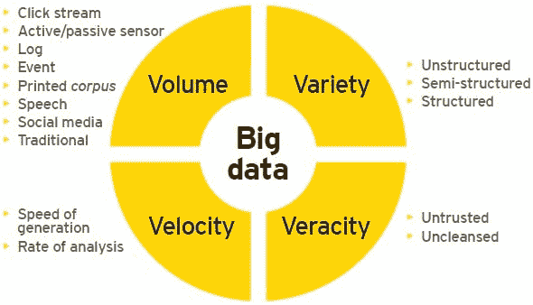
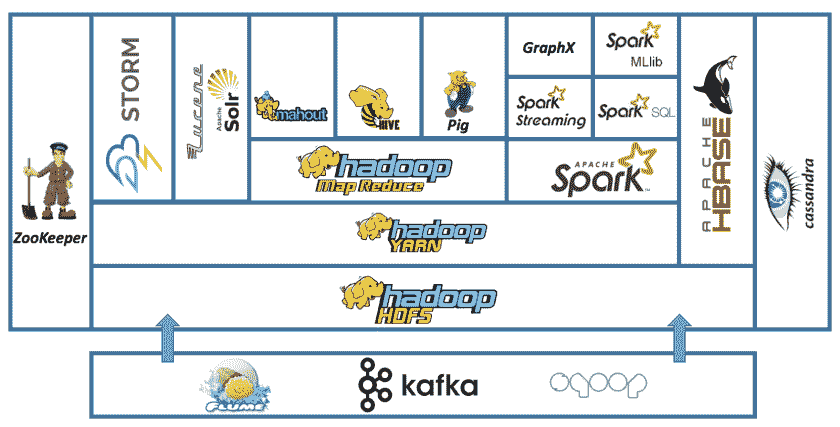
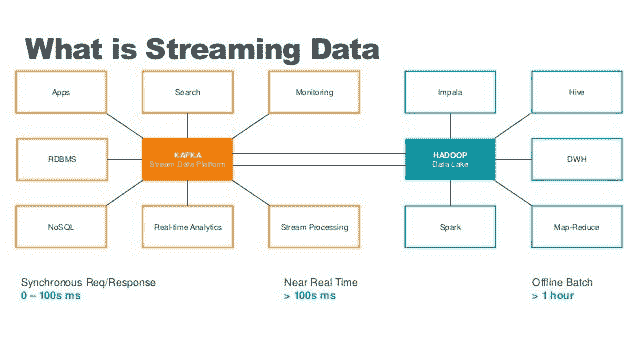
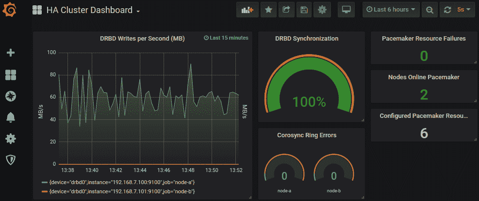

# 大数据清单

> 原文：<https://itnext.io/big-data-checklist-5389e3ea2ce8?source=collection_archive---------1----------------------->

格伦·卡斯滕斯-彼得斯在 [Unsplash](https://unsplash.com?utm_source=medium&utm_medium=referral) 上拍摄的照片

# 介绍

本文基于我之前的文章“ [***大数据管道秘方***](/big-data-pipeline-recipe-c416c1782908?source=your_stories_page-------------------------------------) ”，在这篇文章中，我试图快速概述大数据世界的各个方面。

本文更详细地介绍了在开始大数据之旅时需要考虑的不同方面。通常，架构师关注于技术堆栈和技术细节，而没有注意到这类解决方案最重要的方面:**数据**。

我将尝试总结您在构建数据管道的同时处理大量数据时需要考虑的一切；我还将谈到其他方面，如监控或团队结构，这些也是项目成功的关键。*我们开始吧……*

# 数据考虑因素

**大数据很复杂**，除非万不得已，否则不要投入这个世界。例如，要获得洞察力，从小处着手，也许可以使用[弹性搜索](https://en.wikipedia.org/wiki/Elasticsearch)和[普罗米修斯](https://prometheus.io/docs/introduction/overview/) / [格拉法纳](https://grafana.com/)开始收集信息，并创建仪表板来获得关于你的业务的信息。随着数据的扩展，这些工具可能不够好，或者维护起来过于昂贵。这时你应该开始考虑数据湖或数据仓库；然后切换你的思维设定开始**思考**大**大**。

检查您的数据的**容量，您有多少，需要存储多长时间。检查**温度**！随着时间的推移，数据会失去价值，那么您需要将数据存储多长时间呢？您需要多少储物层(热/暖/冷)？你能存档或删除数据吗？**

你需要问自己的其他**问题**是:你存储的是什么类型的数据？你使用哪种格式？你有法律义务吗？您需要以多快的速度接收数据？您需要多快获得可供查询的数据？您期待什么类型的查询？OLTP 还是 OLAP？您的基础架构有哪些限制？您的数据是什么类型？关系？图表？文档？您是否有要实施的模式？

我可以写几篇关于这个的文章，理解你的数据、设定[边界](https://en.wikipedia.org/wiki/Domain-driven_design)、需求、义务等对于你的管道工作是非常重要的。

大数据的 4v

数据**量**是关键，如果你每天处理数十亿个事件或海量数据集，你需要将大数据原则应用到你的管道中。然而，**没有单一的界限将*小*和*大*数据**分开，其他方面，如**速度**、您的**团队组织**、**公司**的规模、所需的分析类型、**基础设施**或**业务目标**将影响您的大数据之旅。让我们回顾其中的一些…

## OLTP 与 OLAP

几年前，企业曾经拥有由关系数据库支持的在线应用程序，该数据库用于存储用户和其他结构化数据( [**OLTP**](https://en.wikipedia.org/wiki/Online_transaction_processing) )。一夜之间，这些数据通过复杂的作业归档到一个**数据仓库**中，该数据仓库针对数据分析和商业智能进行了优化([**【OLAP】**](https://en.wikipedia.org/wiki/Online_analytical_processing))。历史数据被复制到数据仓库，并用于生成用于制定业务决策的报告。

## 数据仓库与数据湖

随着数据的增长，数据仓库变得昂贵且难以管理。此外，公司开始存储和处理非结构化数据，如图像或日志。有了**大数据**，公司开始创建 [**数据湖**](https://medium.com/@javier.ramos1/introduction-to-data-lakes-afec9e1500ad) 来集中他们的结构化和非结构化数据，创建一个包含所有数据的存储库。

简而言之，数据湖只是一组将数据存储在 **HA** **文件系统**中的计算机节点和一组[工具](http://www.bmc.com/guides/hadoop-ecosystem.html) 来处理数据并从中获得洞察力。基于 [Map Reduce](https://en.wikipedia.org/wiki/MapReduce) 创建了一个庞大的工具生态系统，如 [Spark](https://spark.apache.org/) 使用更具**成本效益的商用硬件来处理任何类型的数据**。这个想法是，你可以在便宜的硬件上处理和存储数据，然后直接查询存储的文件，而不使用数据库，而是依靠文件格式和外部模式，我们将在后面讨论。Hadoop 使用 [**HDFS**](https://hadoop.apache.org/docs/r1.2.1/hdfs_design.html) 文件系统以经济高效的方式存储数据。

对于 **OLTP** 来说，最近几年，有一种向**的转移，使用的数据库有 [**MongoDB**](https://www.mongodb.com/) 或 [**Cassandra**](https://cassandra.apache.org/) 这样的数据库，它们可以扩展到 SQL 数据库的限制之外。然而，**最新的数据库可以处理大量的数据**并且可以用于 OLTP 和 OLAP，并且以较低的成本用于流和批处理；甚至像[yugabytdb](https://www.yugabyte.com/)这样的事务型数据库也能处理海量数据。拥有许多系统、应用程序、来源和数据类型的大型组织将需要数据仓库和/或数据湖来满足他们的分析需求，但是如果您的公司没有太多的信息渠道和/或您在云中运行，一个单一的大规模数据库就足够了**简化**您的架构并大幅**降低成本**。**

## **Hadoop 或无 Hadoop**

**自 2006 年发布以来， [**Hadoop**](https://en.wikipedia.org/wiki/Apache_Hadoop) 一直是大数据世界的主要参考。基于 [**MapReduce**](https://en.wikipedia.org/wiki/MapReduce) 编程模型，它允许使用简单的编程模型处理大量数据。这些年来，生态系统呈指数级增长，创建了一个丰富的生态系统来处理任何用例。**

**最近，有一些对 Hadoop 生态系统的[批评](https://www.datanami.com/2018/10/18/is-hadoop-officially-dead/)，很明显，在过去几年中，使用一直在减少。新的 **OLAP** 引擎能够使用自己的数据格式以超低延迟接收和查询，已经取代了 Hadoop 中一些最常见的查询引擎；但最大的影响是云提供商发布的 [**无服务器分析**](https://aws.amazon.com/big-data/datalakes-and-analytics/) 解决方案数量的增加，在这些解决方案中，您可以执行任何大数据任务**而无需管理任何基础架构**。**

****

**简化的 Hadoop 生态系统**

**鉴于 Hadoop 生态系统的规模和庞大的用户群，它似乎还远未消亡，许多较新的解决方案除了创建兼容的 API 和与 Hadoop 生态系统的集成之外别无选择。虽然 HDFS 是生态系统的核心，但它现在只在内部使用，因为云提供商已经建立了更便宜更好的深度存储系统，如 S3 或 T21。云提供商也提供开箱即用的**托管 Hadoop 集群**。看起来，Hadoop 仍然生机勃勃，但你应该记住，在你开始构建你的 Hadoop 生态系统之前，还有其他更新的替代方案。在本文中，我将尝试提及哪些工具是 Hadoop 生态系统的一部分，哪些工具与其兼容，哪些工具不是 Hadoop 生态系统的一部分。**

## **批处理与流**

**根据您对数据温度的分析，您需要决定是否需要实时流、批处理或在许多情况下两者都需要**。****

****在一个完美的世界里，你可以从实时的数据中获得所有的洞察力，执行基于窗口的聚合。然而，对于某些用例来说，这是不可能的，而对于另一些用例来说，这是不经济的；这就是为什么许多公司同时使用批处理和流处理。您应该检查您的业务需求，并决定哪种方法更适合您。例如，如果您只需要创建一些报告，批处理应该就足够了。**批量更简单更便宜**。****

********

****最新的处理引擎，如 [Apache Flink](https://flink.apache.org/) 或 [Apache Beam](https://beam.apache.org/) ，也被称为**第四代大数据引擎**，为批处理和流数据提供了统一的编程模型，其中批处理只是每 24 小时进行一次的流处理。这简化了编程模型。****

****一种常见的模式是为信用卡欺诈等时间关键型洞察提供流数据，为报告和分析提供批处理数据。较新的 OLAP 引擎允许以统一的方式查询两者。****

## ****ETL 与 ELT****

****根据您的使用情况，您可能希望**在加载或读取时转换数据**。ELT 意味着您可以执行查询，将转换和聚合数据作为查询的一部分，这可以使用 SQL 来实现，您可以在 SQL 中应用函数、过滤数据、重命名列、创建视图等。这可以通过大数据 OLAP 引擎实现，它提供了一种以 ELT 方式进行实时和批量查询的方法。另一个选择是在加载时转换数据( **ETL** )，但是请注意，在处理过程中进行连接和聚合并不是一项简单的任务。一般来说，**数据仓库使用 ETL** ，因为它们倾向于需要固定的模式(星型或雪花型)，而**数据湖更加灵活，可以在读取时执行 ELT 和模式**。****

****每种方法都有自己的优点和缺点。简而言之，读取时的转换和聚合较慢，但提供了更大的灵活性。如果您的查询很慢，您可能需要在处理阶段进行预连接或聚合。稍后讨论的 OLAP 引擎可以在接收期间执行预聚合。****

# ****团队结构和方法****

****最后，您的**公司政策、组织、方法、基础设施、团队结构和技能在您的大数据决策中发挥着重要作用**。例如，您可能有一个数据问题，需要您创建一个管道，但您不必处理大量的数据，在这种情况下，您可以编写一个流应用程序，在单个管道中执行接收、丰富和转换，这更容易；但是，如果您的公司已经有了一个数据湖，您可能希望使用现有的平台，这是您不会从头开始构建的。****

****再比如 ETL vs ELT。开发人员倾向于构建 ETL 系统，其中的数据可以以简单的格式进行查询，因此非技术人员可以构建仪表板并获得洞察力。然而，如果您有一个强大的数据分析师团队和一个小的开发人员团队，您可能更喜欢 ELT 方法，其中开发人员只关注摄取；数据分析师编写复杂的查询来转换和聚合数据。这表明在您的大数据之旅中考虑您的团队结构和技能是多么重要。****

****由于数据是整个组织中的一个跨职能方面，因此建议让一个拥有不同技能和背景的多元化团队一起工作。**数据湖非常擅长在维护数据治理和安全性的同时实现轻松协作**。****

# ****基础设施****

****在决定使用哪些工具时，您当前的基础设施会限制您的选择。首先要问的问题是:**云 vs 本地**。云提供商提供了许多选择和灵活性。此外，它们为您的大数据需求提供了无需服务器的解决方案，更易于管理和监控。毫无疑问，云是大数据的去处；即使对于 Hadoop 生态系统，**云提供商也提供托管集群**和比本地更便宜的存储。查看我关于云解决方案的其他文章。****

****如果您在内部运行**，您应该考虑以下几点:******

*   ******我在哪里运行我的工作负载？**肯定 [**Kubernetes**](https://kubernetes.io/) 或**Apache**[**Mesos**](https://mesos.apache.org/)**提供统一的编排框架，以统一的方式运行您的应用。无论您使用何种框架，部署、监控和警报方面都是相同的。相比之下，如果您在裸机上运行，您需要考虑和管理部署的所有横切方面。在这种情况下，托管集群和工具比库和框架更合适。******
*   ******我有什么类型的硬件？如果你有配备快速固态硬盘和高端服务器的专用硬件，那么你可能能够部署像 Cassandra 这样的大规模数据库，并获得出色的性能。如果你只是拥有商用硬件，Hadoop 生态系统将是一个更好的选择。理想情况下，您希望有几种类型的服务器用于不同的工作负载；对卡珊德拉的要求与 HDFS 大不相同。******

# ******监控和警报******

******这对数据管道的成功至关重要。在大数据世界里，**你需要关于你的流程和数据的持续反馈**。您需要**收集指标、收集日志、**监控您的系统、创建**警报**、**仪表板**等等。******

****使用开源工具如 [**Prometheus**](https://prometheus.io/docs/introduction/overview/) 和 [**Grafana**](https://grafana.com/) 进行监控和报警。使用日志聚合技术收集日志并存储在类似[**elastic search**](https://en.wikipedia.org/wiki/Elasticsearch)的地方。****

********

****Grafana 监控****

******尽可能利用云提供商的能力**进行监控和警报。根据您的平台，您将使用不同的工具集。对于云无服务器平台，您将依赖您的云提供商工具和最佳实践。对于 Kubernetes，您将使用开源监视器解决方案或企业集成。我非常推荐这个 [**网站**](https://openapm.io/) ，在这里你可以浏览和检查不同的解决方案，并构建你自己的 [**APM**](https://en.wikipedia.org/wiki/Application_performance_management) 解决方案。****

****大数据世界中需要考虑的另一件事是可审计性和问责制。由于不同的法规，您可能需要跟踪数据，在数据流经管道时捕获并记录每一个变化。这被称为**数据起源或血统**。像 [**阿帕奇图集**](https://atlas.apache.org/#/) 这样的工具被用来控制、记录和治理你的数据。其他工具如 [**Apache NiFi**](https://nifi.apache.org/) 支持开箱即用的数据沿袭。对于**实时痕迹，**检查 [**打开遥测**](https://opentelemetry.io/) **或** [**耶格**](https://www.jaegertracing.io/) **。**还有很多云服务比如**[**Datadog**](https://www.datadoghq.com/)**。********

****对于 Hadoop 使用， [**Ganglia**](http://ganglia.sourceforge.net/) 。****

# ****安全性****

****在安全方面，[**Apache Ranger**](https://ranger.apache.org/)**为你的 Hadoop 平台提供了统一的安全监控框架。提供集中的安全管理，在一个中央用户界面中管理所有与安全相关的任务。它提供了使用不同方法的**授权**，以及跨整个 Hadoop 平台的完全可审计性。******

****您还应该在网络安全、机密管理、SSL 证书管理、密钥轮换等方面保持并执行您的组织准则。确保您让 RBAC 能够管理谁可以访问您的数据湖中的哪些资源。****

# ****人****

****你的团队是成功的关键。大数据工程师可能很难找到。投资培训、技能提升和研讨会。去除孤岛和繁文缛节，简化迭代，使用[域驱动设计](https://en.wikipedia.org/wiki/Domain-driven_design)来设定你的团队边界和职责。****

****对于大数据，您将有**两大类别**:****

## ******数据工程师******

****数据工程师负责数据的摄取、丰富和转换。这些工程师拥有**强大的开发和运营背景**，负责创建数据管道。开发人员、管理员、DevOps 专家等都属于这一类。****

## ******数据科学家******

****他们可以是商业智能专家、数据分析师等。负责生成报告、仪表板和收集见解。这些人专注于 **OLAP** 并具有强烈的商业理解，他们收集的数据将用于做出关键的商业决策。**SQL**和可视化强，软件开发弱。**机器学习**专家也可能属于这一类。****

# ****预算****

****这是一个重要的考虑因素，这是一个有限的资源。如果你有无限的资金，你可以部署一个大规模的数据库，并使用它来满足你的大数据需求，而不会有很多复杂性，但这将花费你。因此，本文中提到的每项技术都需要有技能的人来使用、部署和维护它。有些技术比其他技术更复杂，所以你需要考虑到这一点。****

# ****结论****

****我在上一篇文章中谈了很多关于大数据的内容，跳入解决方案并开始构建您的管道是非常诱人的，但请记住后退一步，分析所有交叉的方面。**了解您的数据、您的团队和您的组织**并为您的特定用例选择最佳工具，而不仅仅是跟随趋势。****

****我希望你喜欢这篇文章。欢迎发表评论或分享这篇文章。跟随 [***我***](https://twitter.com/JavierRamosRod)**作未来的职务。******