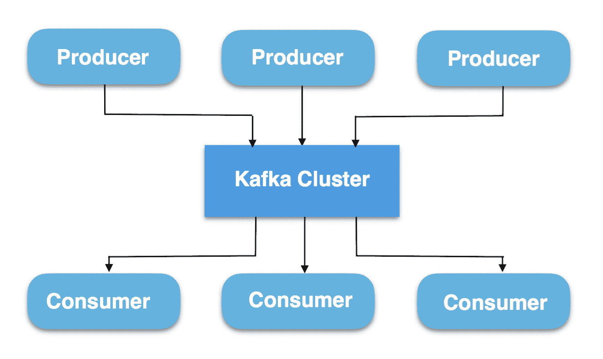
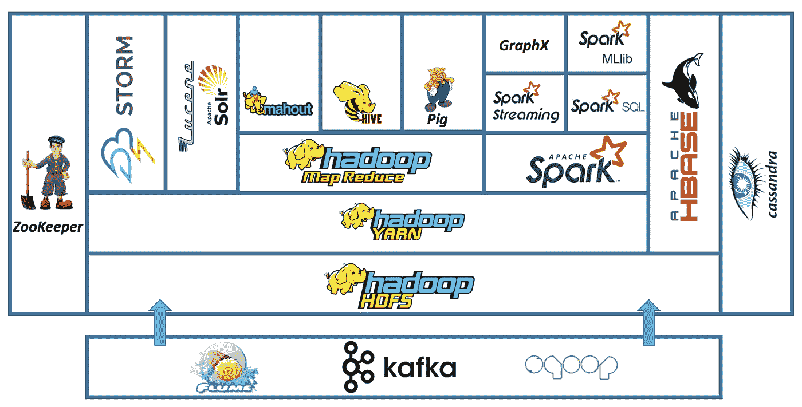
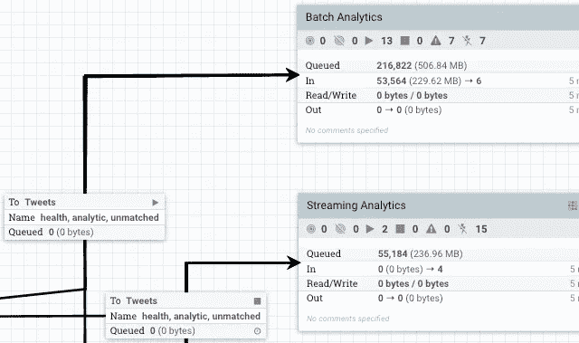

# 大数据接收选项

> 原文：<https://itnext.io/big-data-ingestion-options-2d95851410d3?source=collection_archive---------1----------------------->

照片由[乔纳森派](https://unsplash.com/@r3dmax?utm_source=medium&utm_medium=referral)在 [Unsplash](https://unsplash.com?utm_source=medium&utm_medium=referral)

# 介绍

本文基于我之前的文章“ [***大数据管道秘方***](/big-data-pipeline-recipe-c416c1782908?source=your_stories_page-------------------------------------) ”，在这篇文章中，我简要概述了大数据世界的方方面面。

在本文中，我将更详细地回顾关键的**数据摄取**过程，并讨论不同的选项。

这是建立数据管道的第一步，也可能是最关键的一步。**需要仔细规划和设计**，因为这一过程为数据管道的其余部分奠定了基础。

# 数据摄取

第一步是获取数据，**这个阶段的目标是获取您需要的所有数据，并将其以原始格式存储在一个存储库中。**这通常由其他团队所有，他们将数据推送到 [Kafka](https://kafka.apache.org/) 或数据存储中。

对于没有大量数据的简单管道，您可以构建一个简单的微服务工作流，在单个管道中接收、丰富和转换数据(*接收+转换*)，您可以使用[**Apache air flow**](https://airflow.apache.org/)等工具来编排依赖关系。在本文中，我们将重点关注需要分成几个阶段的大数据。

对于大数据，建议您**将接收与处理**分开，可以并行运行的大规模处理引擎不太适合处理阻塞调用、重试、反压力等。因此，建议在开始处理之前保存所有数据。

作为摄取的一部分，您应该通过调用其他系统来丰富您的数据，以确保所有数据(包括参考数据)在处理之前都已进入湖中。

有两种摄取方式:

*   **拉取**:从数据库、文件系统、队列或 API 等地方拉取数据
*   **推送**:应用程序也可以将数据推送到你的湖中，但我们总是建议在两者之间有一个像**卡夫卡**那样的消息平台。一个常见的模式是**变更数据捕获** ( [**CDC**](https://en.wikipedia.org/wiki/Change_data_capture) )，它允许我们实时地将数据从数据库和其他系统转移到湖中。

正如我们已经提到的，使用**[**Kafka**](https://kafka.apache.org/)**或**[**Pulsar**](https://pulsar.apache.org/)**作为数据摄取的**中介**来实现持久性、反压、并行化和对摄取的监控是非常常见的。然后，使用 [**Kafka Connect**](https://docs.confluent.io/current/connect/index.html) 将数据保存到您的数据湖中。这个想法是，您的 OLTP 系统将向 Kafka 发布事件，然后将它们摄取到您的湖中。这是首选选项；如果源系统可以直接将数据推入数据湖，那么就采用这种方法，因为您不必管理对其他系统和团队的依赖。一般来说，**依赖性管理对于摄取过程**至关重要；您通常会从各种系统中获取数据，有些是新系统，有些是遗留系统；您将需要管理数据或 API 上的任何更改。****

********

****Kafka 是数据摄取的关键组件****

****[**领域驱动设计**](https://en.wikipedia.org/wiki/Domain-driven_design) 可以用来管理依赖关系，管理变更，设置正确的职责。****

****如果源系统无法将数据推入数据湖，而您需要从其他系统中提取数据。切记:**避免直接通过 API**批量摄取数据；您可能会将 HTTP 端点称为数据**浓缩**，但请记住，从 API 获取数据在大数据世界中并不是一个好主意，因为它速度慢、容易出错(网络问题、延迟……)，并且会关闭源系统。虽然，API 在 OLTP 世界中设置领域边界是很棒的，但是这些边界是由数据存储(*批处理*)或主题(*实时* ) **在大数据** **世界**中设置的。当然，这总是取决于你的数据的大小，但是如果你没有其他选择的话，尽可能使用 Kafka 或者 Pulsar。从 API 中以流式方式提取少量数据，而不是批量提取。对于数据库，使用 [**Debezium**](https://debezium.io/) 等工具将数据流式传输到 Kafka (CDC)。****

****同样，**为了最小化依赖性**，如果**源系统将数据推送到 Kafka** 而不是您的团队拉数据，这总是更容易，因为您将与其他源系统紧密耦合。如果这是不可能的，并且您仍然需要拥有摄取过程，我们可以看一下**摄取的两大类别:******

## ******未管理的解决方案******

****这些是您开发的将数据吸收到您的数据湖中的应用程序；您可以在任何地方运行它们，这是一个定制的解决方案。当从没有现成解决方案的 API 或其他 I/O 阻塞系统获取数据时，或者当您没有使用 Hadoop 生态系统时，这种情况非常常见。****

****这个想法是使用流库从不同的主题、端点、队列或文件系统接收数据。因为你在开发应用程序，所以你有充分的灵活性。大多数库提供重试、反压、监控、批处理等等。这是一种**自己编码**的方法，因此您将需要其他工具来进行编排和部署。你得到了更多的控制和更好的性能，但需要付出更多的努力。****

****您可以让单个整体或微服务使用服务总线进行通信，或者使用外部工具进行编排。一些可用的库有 Apache [**Camel**](https://camel.apache.org/) 或 [**Akka 生态系统**](https://akka.io/)**([Akka HTTP](https://doc.akka.io/docs/akka-http/current/index.html)+[Akka Streams](https://doc.akka.io/docs/akka/current/stream/index.html)+[Akka Cluster](https://doc.akka.io/docs/akka/current/index-cluster.html)+[Akka Persistence](https://doc.akka.io/docs/akka/current/typed/index-persistence.html)+[alpa kka](https://doc.akka.io/docs/alpakka/current/index.html))。根据摄入管道的复杂程度，你可以将它部署为一个整体或微服务(T21)。******

******如果你使用 **Kafka 或 Pulsar** ，你可以用它们作为摄取编排工具来获取数据并丰富它。每个阶段将数据移动到一个新的主题，通过使用主题进行依赖管理，在基础结构本身中创建一个 [**DAG**](https://en.wikipedia.org/wiki/Directed_acyclic_graph) **。如果您没有 Kafka，并且想要一个更加可视化的工作流，您可以使用[**Apache air flow**](https://airflow.apache.org/)来编排依赖项并运行 DAG。这个想法是要有一系列的服务来接收和丰富数据，然后将数据存储在某个地方。每一步完成后，执行下一步，由气流协调。最后，数据被存储在某种存储器中。********

## ****托管解决方案****

**在这种情况下，您可以使用部署在集群中用于接收的工具。这在 Hadoop 生态系统中很常见，您可以使用工具 [**Sqoop**](https://sqoop.apache.org/docs/1.99.7/index.html) 从 OLTP 数据库中获取数据，使用 [**Flume**](https://flume.apache.org/) 获取流数据。这些工具提供监控、重试、增量加载、压缩等等。**

****

**底部有摄取选项的 Hadoop 生态系统**

## **[**阿帕奇尼菲**](https://nifi.apache.org/)**

****NiFi** 就是这些难以归类的工具之一。它本身就是一头野兽。它可以用于接收、编排甚至简单的转换。所以理论上，它可以解决简单的大数据问题。这是一个**托管解决方案**。它有一个**可视界面**，你可以拖放组件并使用它们来获取和丰富数据。它有超过 300 个内置处理器，可以执行许多任务，你可以通过实现你自己的来扩展它。**

****

**NiFi 工作流**

**它有自己的架构，所以它不使用任何数据库或 HDFS，但它与 Hadoop 生态系统中的许多工具进行了集成。可以调用 API，集成 Kafka，FTP，很多文件系统和云存储。您可以管理执行路由、过滤和基本 ETL 的数据流。对于某些用例，NiFi 可能就是你所需要的。**

**然而，NiFi 不能扩展到超过某个点，因为超过 10 个节点的集群中的节点间通信会变得低效。它倾向于更好地垂直扩展，但是您可能会达到它的极限，特别是对于复杂的 ETL。但是，您可以将它与 Spark 等工具集成在一起来处理数据。 **NiFi 是获取和丰富数据的绝佳工具。****

# **结论**

****数据摄取至关重要**，确保您分析了不同的选项，并选择了**最大限度减少依赖性的方法**。使用**领域驱动设计来管理变更和设定界限**。可能的话，试着将**数据推送到你的数据湖**中，而不是拉出来。如果您需要拉动它，尽可能使用**管理解决方案**。如果你需要拉数据，试着使用**流解决方案**，它提供反压力、持久性和错误处理。**

***祝您的数据之旅好运！***

**我希望你喜欢这篇文章。欢迎发表评论或分享这篇文章。跟随[***me***](https://twitter.com/JavierRamosRod)**进行未来岗位。****