# 大数据管道配方

> 原文：<https://itnext.io/big-data-pipeline-recipe-c416c1782908?source=collection_archive---------0----------------------->

# 介绍

如果您从 [**大数据**](https://en.wikipedia.org/wiki/Big_data) 开始，通常会对大量可供选择的工具、框架和选项感到不知所措。在本文中，我将尝试总结出**的要素**和**的基本配方**，帮助您开始大数据之旅。我的目标是对不同的工具进行分类，并尝试解释每个工具的用途以及它如何适应生态系统。

首先让我们回顾一些注意事项，并检查您是否真的有***大数据问题*** *。*我将重点介绍可以在**本地部署的**开源**解决方案。云提供商为您的数据需求提供了几种解决方案，我将在本文中略微提到它们。如果您在云中运行，您应该真正检查一下您有哪些选项，并从成本、可操作性、可管理性、监控和上市时间等方面将它们与开源解决方案进行比较。**

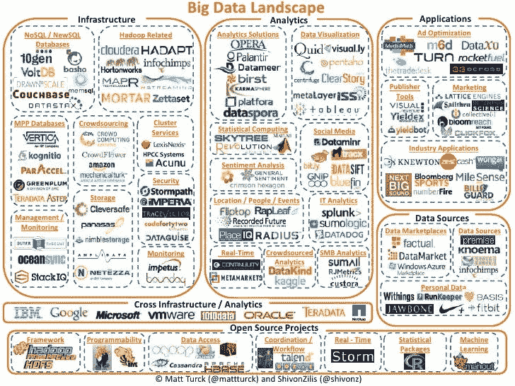

大数据生态系统

# 数据考虑因素

*(如果您有大数据方面的经验，请跳到下一部分……)*

**大数据很复杂**，除非万不得已，否则不要轻易涉足。要获得洞察力，从小处着手，也许可以使用[弹性搜索](https://en.wikipedia.org/wiki/Elasticsearch)和[普罗米修斯](https://prometheus.io/docs/introduction/overview/) / [格拉法纳](https://grafana.com/)开始收集信息，并创建仪表板来获得关于你的业务的信息。随着数据的扩展，这些工具可能不够好，或者维护起来过于昂贵。这时，您应该开始考虑数据湖或数据仓库；并切换你的思维设定开始**思考**大**大**。

检查您的数据的**容量，您有多少数据，需要存储多长时间。检查数据的**温度**，它会随着时间的推移而失去值，那么您需要将数据存储多长时间？您需要多少储物层(热/暖/冷)？你能存档或删除数据吗？**

你需要问自己的其他**问题**是:你存储的是什么类型的数据？你使用哪种格式？你有法律义务吗？您需要以多快的速度接收数据？您需要多快获得可供查询的数据？您期待什么类型的查询？OLTP 还是 OLAP？您的基础架构有哪些限制？您的数据是什么类型？关系？图表？文档？您是否有要实施的模式？

我可以写几篇关于这个的文章，理解你的数据、设定[界限](https://en.wikipedia.org/wiki/Domain-driven_design)、要求、义务等对于这个食谱的工作是非常重要的。

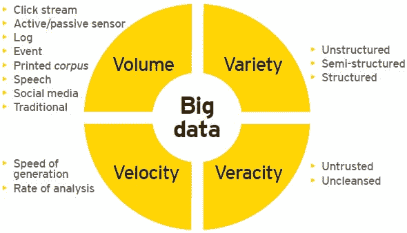

大数据的 4v

数据**量**是关键，如果你每天处理数十亿个事件或海量数据集，你需要将大数据原则应用到你的管道中。然而，**没有单一的界限将*小*和*大*数据**分开，其他方面，如**速度**、您的**团队组织**、**公司**的规模、所需的分析类型、**基础设施**或**业务目标**将影响您的大数据之旅。让我们回顾其中的一些…

## OLTP 与 OLAP

几年前，企业曾经拥有由关系数据库支持的在线应用程序，该数据库用于存储用户和其他结构化数据( [**OLTP**](https://en.wikipedia.org/wiki/Online_transaction_processing) )。一夜之间，这些数据通过复杂的作业归档到一个**数据仓库**中，该数据仓库针对数据分析和商业智能进行了优化([**【OLAP】**](https://en.wikipedia.org/wiki/Online_analytical_processing))。历史数据被复制到数据仓库，并用于生成用于制定业务决策的报告。

## 数据仓库与数据湖

随着数据的增长，数据仓库变得昂贵且难以管理。此外，公司开始存储和处理非结构化数据，如图像或日志。有了**大数据**，公司开始创建 [**数据湖**](https://medium.com/@javier.ramos1/introduction-to-data-lakes-afec9e1500ad) 来集中他们的结构化和非结构化数据，创建一个包含所有数据的存储库。

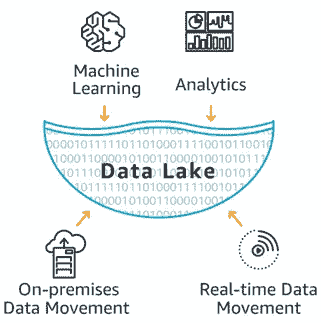

简而言之，数据湖只是一组将数据存储在 **HA** **文件系统**中的计算机节点和一组[工具](http://www.bmc.com/guides/hadoop-ecosystem.html) 来处理数据并从中获得洞察力。基于 [Map Reduce](https://en.wikipedia.org/wiki/MapReduce) 创建了一个庞大的工具生态系统，如 [Spark](https://spark.apache.org/) 使用更具**成本效益的商用硬件来处理任何类型的数据**。这个想法是，你可以在便宜的硬件上处理和存储数据，然后直接查询存储的文件，而不使用数据库，而是依靠文件格式和外部模式，我们将在后面讨论。Hadoop 使用 [**HDFS**](https://hadoop.apache.org/docs/r1.2.1/hdfs_design.html) 文件系统以经济高效的方式存储数据。

对于 **OLTP** 来说，最近几年，有一种向**的转移，使用的数据库有 [**MongoDB**](https://www.mongodb.com/) 或 [**Cassandra**](https://cassandra.apache.org/) 这样的数据库，它们可以扩展到 SQL 数据库的限制之外。然而，**最新的数据库可以处理大量的数据**并且可以用于 OLTP 和 OLAP，并且以较低的成本用于流和批处理；甚至像[yugabytdb](https://www.yugabyte.com/)这样的事务型数据库也能处理海量数据。拥有许多系统、应用程序、来源和数据类型的大型组织将需要数据仓库和/或数据湖来满足他们的分析需求，但是如果您的公司没有太多的信息渠道和/或您在云中运行，一个单一的大规模数据库就足够了，**简化**您的架构并大幅**降低成本**。**

## **Hadoop 或无 Hadoop**

**自 2006 年发布以来， [**Hadoop**](https://en.wikipedia.org/wiki/Apache_Hadoop) 一直是大数据世界的主要参考。基于 [**MapReduce**](https://en.wikipedia.org/wiki/MapReduce) 编程模型，它允许使用简单的编程模型处理大量数据。这些年来，生态系统呈指数级增长，创建了一个丰富的生态系统来处理任何用例。**

**最近，有一些对 Hadoop 生态系统的[批评](https://www.datanami.com/2018/10/18/is-hadoop-officially-dead/)，很明显，在过去几年中，使用一直在减少。新的 **OLAP** 引擎能够使用自己的数据格式以超低延迟接收和查询，已经取代了 Hadoop 中一些最常见的查询引擎；但最大的影响是云提供商发布的 [**无服务器分析**](https://aws.amazon.com/big-data/datalakes-and-analytics/) 解决方案数量的增加，在这些解决方案中，您可以执行任何大数据任务**而无需管理任何基础架构**。**

****

**简化的 Hadoop 生态系统**

**鉴于 Hadoop 生态系统的规模和庞大的用户群，它似乎还远未消亡，许多较新的解决方案除了创建兼容的 API 和与 Hadoop 生态系统的集成之外别无选择。虽然 HDFS 是生态系统的核心，但它现在只在内部使用，因为云提供商已经建立了更便宜更好的深度存储系统，如 S3 或 T21。云提供商也提供开箱即用的**托管 Hadoop 集群**。看起来，Hadoop 仍然生机勃勃，但你应该记住，在你开始构建你的 Hadoop 生态系统之前，还有其他更新的替代方案。在本文中，我将尝试提及哪些工具是 Hadoop 生态系统的一部分，哪些工具与其兼容，哪些工具不是 Hadoop 生态系统的一部分。**

## **批处理与流**

**根据您对数据温度的分析，您需要决定是否需要实时流、批处理或在许多情况下两者都需要**。****

****在一个完美的世界里，你可以从实时的数据中获得所有的洞察力，执行基于窗口的聚合。然而，对于某些用例来说，这是不可能的，而对于另一些用例来说，这是不经济的；这就是为什么许多公司同时使用批处理和流处理。您应该检查您的业务需求，并决定哪种方法更适合您。例如，如果您只需要创建一些报告，批处理应该就足够了。**批量更简单更便宜**。****

****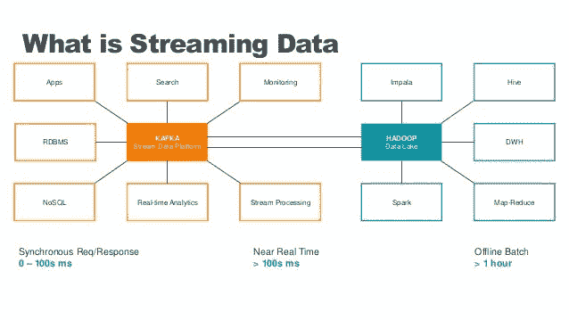****

****最新的处理引擎，如 [Apache Flink](https://flink.apache.org/) 或 [Apache Beam](https://beam.apache.org/) ，也被称为**第四代大数据引擎**，为批处理和流数据提供了统一的编程模型，其中批处理只是每 24 小时进行一次的流处理。这简化了编程模型。****

****一种常见的模式是为信用卡欺诈等时间关键型洞察提供流数据，为报告和分析提供批处理数据。较新的 OLAP 引擎允许以统一的方式查询两者。****

## ****ETL 与 ELT****

****根据您的使用情况，您可能希望**在加载或读取时转换数据**。ELT 意味着您可以执行查询，将转换和聚合数据作为查询的一部分，这可以使用 SQL 来实现，您可以在 SQL 中应用函数、过滤数据、重命名列、创建视图等。这可以通过大数据 OLAP 引擎实现，它提供了一种以 ELT 方式进行实时和批量查询的方法。另一个选择是在加载时转换数据( **ETL** )，但是请注意，在处理过程中进行连接和聚合并不是一项简单的任务。一般来说，**数据仓库使用 ETL** ，因为它们倾向于需要固定的模式(星型或雪花型)，而**数据湖更加灵活，可以在读取时执行 ELT 和模式**。****

****每种方法都有自己的优点和缺点。简而言之，读取时的转换和聚合较慢，但提供了更大的灵活性。如果您的查询很慢，您可能需要在处理阶段进行预连接或聚合。稍后讨论的 OLAP 引擎可以在接收期间执行预聚合。****

## ****团队结构和方法****

****最后，您的**公司政策、组织、方法、基础设施、团队结构和技能在您的大数据决策中发挥着重要作用**。例如，您可能有一个数据问题，需要您创建一个管道，但您不必处理大量的数据，在这种情况下，您可以编写一个流应用程序，在单个管道中执行接收、丰富和转换，这更容易；但是，如果您的公司已经有了一个数据湖，您可能希望使用现有的平台，这是您不会从头开始构建的。****

****再比如 ETL vs ELT。开发人员倾向于构建 ETL 系统，其中的数据可以以简单的格式进行查询，因此非技术人员可以构建仪表板并获得洞察力。然而，如果您有一个强大的数据分析师团队和一个小的开发人员团队，您可能更喜欢 ELT 方法，其中开发人员只关注摄取；数据分析师编写复杂的查询来转换和聚合数据。这表明在您的大数据之旅中考虑您的团队结构和技能是多么重要。****

****由于数据是整个组织中的一个跨职能方面，因此建议让一个拥有不同技能和背景的多元化团队一起工作。**数据湖非常擅长在维护数据治理和安全性的同时实现轻松协作**。****

# ****佐料****

****在回顾了大数据世界的几个方面之后，我们来看看有哪些基本成分。****

## ****数据(存储)****

****你首先需要的是一个存储所有数据的地方。不幸的是，没有一款产品能满足您的需求，这就是为什么您需要根据您的使用案例选择合适的存储。****

****对于实时**数据摄取**，通常使用追加日志来存储实时事件，最著名的引擎是 [**Kafka**](https://kafka.apache.org/) 。一个备选就是**阿帕奇** [**脉冲星**](https://pulsar.apache.org/) 。两者都提供流媒体功能，同时也为您的活动提供存储空间。这通常是热数据的短期存储(记住数据温度！)因为它不具有成本效益。还有其他工具，如 [**Apache NiFi**](https://nifi.apache.org/) 用于摄取数据，它们有自己的存储。最后，数据从附加日志转移到另一个存储，可能是数据库或文件系统。****

******海量数据库******

****然而，Hadoop HDFS 是数据湖最常见的格式；大型数据库可以用作数据管道的后端，而不是文件系统；查看我以前关于 [**大规模数据库**](/massive-scale-databases-5b5917ed94e5) 的文章，了解更多信息。总之，像 [**Cassandra**](https://cassandra.apache.org/) ，[**yugabytdb**](https://www.yugabyte.com/)或 [**BigTable**](https://cloud.google.com/bigtable/) 这样的数据库可以比数据湖更快地保存和处理大量数据，但并不便宜；然而，数据湖文件系统和数据库之间的价格差距一年比一年小；这是你在 **Hadoop/NoHadoop 决策**中需要考虑的一部分。越来越多的公司现在选择大数据数据库而不是数据湖来满足其数据需求，并使用深度存储文件系统进行归档。****

****总结一下 Hadoop 生态系统之外的数据库和存储选项**要考虑的有:******

*   ******[**Cassandra**](https://cassandra.apache.org/)**:**可以存储大量数据的 NoSQL 数据库，提供最终的一致性和许多配置选项。非常适合 OLTP，但也可用于具有预先计算的聚合的 OLAP(不灵活)。另一个选择是 [**ScyllaDB**](https://www.scylladb.com/) ，它对于 [OLAP](https://www.scylladb.com/2019/05/23/workload-prioritization-running-oltp-and-olap-traffic-on-the-same-superhighway/) ( [高级调度器](https://www.scylladb.com/2019/05/23/workload-prioritization-running-oltp-and-olap-traffic-on-the-same-superhighway/))来说更快更好******
*   ****[**yugabytdb**](https://www.yugabyte.com/):可以处理全局事务的大规模关系数据库。关系数据的最佳选择。****
*   ****[**MongoDB**](https://www.mongodb.com/) :强大的基于文档的 NoSQL 数据库，可用于摄取(临时存储)或作为仪表板的快速数据层****
*   ****[**InfluxDB**](https://www.influxdata.com/) 为时间序列数据。****
*   ****[**普罗米修斯**](https://prometheus.io/docs/introduction/overview/) 为监测数据。****
*   ****[**ElasticSearch**](https://en.wikipedia.org/wiki/Elasticsearch) :可以存储大量数据的分布式倒排索引。有时被许多人忽略或仅用于日志存储，ElasticSearch 可用于广泛的用例，包括 OLAP 分析、机器学习、日志存储、非结构化数据存储等等。绝对是您的大数据生态系统中必备的工具。****

****记住 [SQL 和 NoSQL](https://www.bmc.com/blogs/sql-vs-nosql/) 、**之间的区别在 NoSQL 世界中，你不要对数据建模，你要对你的查询建模。******

****数据库比较****

******Hadoop 数据库******

****[**HBase**](https://hbase.apache.org/) 是 Hadoop 生态系统内最受欢迎的数据库**。它可以以列格式保存大量数据。它基于 [BigTable](https://research.google.com/archive/bigtable.html) 。******

****[**文件系统**](https://hadoop.apache.org/docs/r1.2.1/hdfs_design.html) **(深层存储)******

****对于**数据湖**，在 Hadoop 生态系统中，使用 [**HDFS**](https://hadoop.apache.org/docs/r1.2.1/hdfs_design.html) 文件系统。然而，大多数云提供商已经将其替换为自己的深度存储系统，如**或 [**GCS**](https://cloud.google.com/storage/) 。******

****这些文件系统或深度存储系统比数据库便宜，但只提供基本存储，不提供强有力的保证。****

****您需要根据您的需求和预算，为您的使用情形选择合适的存储。例如，如果预算允许，您可以使用数据库进行接收，然后一旦数据被转换，就将其存储在您数据湖中以供 OLAP 分析。或者，您可以将所有内容存储在深层存储中，而将一小部分热数据存储在快速存储系统(如关系数据库)中。****

******文件格式******

****如果你使用 **HDFS** ，另一个重要的决定是你将使用什么格式存储你的文件。请注意，深度存储系统将数据存储为文件，不同的文件格式和压缩算法为某些用例提供了好处。**如何在数据湖中存储数据至关重要**，你需要考虑**格式**、**压缩**，尤其是**你如何** [**分割**](https://mungingdata.com/apache-spark/partitionby/) **你的数据。******

****最常见的格式有 CSV，JSON，****，** [**协议缓冲区**](https://developers.google.com/protocol-buffers/) **，** [**Parquet**](https://parquet.apache.org/) ，以及 [**ORC**](https://orc.apache.org/) 。******

********

****文件格式之间的比较****

****选择格式时要考虑的一些事情有:****

*   ****数据的结构:一些格式接受嵌套数据，比如 JSON、Avro 或 Parquet，而其他格式则不接受。即使有，也可能不是高度优化的。Avro 是嵌套数据最有效的格式，我建议不要使用 Parquet 嵌套类型，因为它们非常低效。处理嵌套的 JSON 也非常耗费 CPU 资源。一般来说，建议在摄取数据时将数据拉平。****
*   ******性能**:Avro 和 Parquet 等一些格式的性能比其他 JSON 等要好。即使在 Avro 和 Parquet 之间，对于不同的用例，一个会比另一个更好。例如，因为 Parquet 是一种基于列的格式，所以使用 SQL 查询数据湖很好，而 Avro 更适合 ETL 行级转换。****
*   ******易读**:考虑你是否需要人们阅读数据。JSON 或 CSV 是文本格式，是人类可读的，而更高性能的格式如 parquet 或 Avro 是二进制的。****
*   ******压缩**:有些格式比其他格式提供更高的压缩率。****
*   ******模式演变**:在数据湖中添加或删除字段远比在数据库中复杂。像 Avro 或 Parquet 这样的格式提供了某种程度的模式进化，允许您在更改数据模式的同时查询数据。像 [**三角洲湖**](https://delta.io/) 格式这样的工具提供了更好的工具来处理模式的变化。****
*   ******兼容性** : JSON 或 CSV 被广泛采用，几乎与任何工具兼容，而性能更高的选项集成点更少。****

****正如我们所看到的，CSV 和 JSON 是易于使用、人类可读的常见格式，但缺乏其他格式的许多功能，这使得它太慢，无法用于查询数据湖。 **ORC 和 Parquet** 在 Hadoop 生态系统中广泛用于**查询数据**，而 [**Avro**](https://avro.apache.org/) 也在 Hadoop 之外使用，尤其是与 Kafka 一起用于摄取，非常适合**行级 ETL** 处理。面向行的格式比面向列的格式具有更好的模式进化能力，这使它们成为数据摄取的一个很好的选择。****

****最后，你还需要考虑如何**压缩文件中的数据**考虑文件大小和 CPU 成本之间的权衡。一些压缩算法速度较快，但文件较大，而另一些速度较慢，但压缩率较高。更多详情请查看这篇 [**文章**](http://www.dbtalks.com/article/what-are-different-data-compression-methods-in-hadoop/) 。****

********

****压缩选项****

****我推荐使用 snappy 来传输数据流，因为它不需要太多的 CPU 能力。对于批量 bzip2 是一个很好的选择。****

****同样，您需要回顾我们之前提到的注意事项，并根据我们回顾的所有方面做出决定。让我们以一些使用案例为例:****

******用例******

*   ****作为 ETL 管道的一部分，您需要接收实时数据并存储在某个地方，以便进一步处理。如果性能很重要，预算不是问题，你可以使用 Cassandra。标准的方法是使用优化的格式将它存储在 HDFS，如 AVRO。****
*   ****您需要处理您的数据，并将其存储在某个地方，以供高度交互式的用户使用，面向延迟很重要的应用程序(OLTP)，您事先知道查询。在这种情况下，根据数据量使用 Cassandra 或其他数据库。****
*   ****您需要将处理过的数据提供给用户群，一致性很重要，并且您不知道预先的查询，因为 UI 提供了高级查询。在这种情况下，您需要一个关系型 SQL 数据库，根据您的情况，一个经典的 SQL DB(如 MySQL)就足够了，或者您可能需要使用 YugaByteDB 或其他关系型大规模数据库。****
*   ****您需要存储已处理的数据，以便内部团队进行 OLAP 分析，这样他们就可以运行特殊查询并创建报告。在这种情况下，您可以将数据以 Parquet 或 ORC 格式存储在深层存储文件系统中。****
*   ****您需要使用 SQL 来运行历史数据的即席查询，但是您还需要需要在不到一秒钟内做出响应的仪表板。在这种情况下，您需要一种混合方法，将数据的子集存储在一个快速存储中，比如 MySQL 数据库，并将历史数据以 Parquet 格式存储在数据湖中。然后，使用查询引擎通过 SQL 查询不同的数据源。****
*   ****您需要执行需要在几毫秒内响应的非常复杂的查询，您可能还需要在读取时执行聚合。在这种情况下，使用 ElasticSearch 或一些更新的 OLAP 系统来存储数据，比如我们稍后将讨论的 [Apache Pinot](https://docs.pinot.apache.org/) 。****
*   ****你需要搜索非结构化的文本。在这种情况下，使用 ElasticSearch。****

## ****基础设施****

****在决定使用哪些工具时，您当前的基础设施会限制您的选择。首先要问的问题是:**云 vs 本地**。云提供商提供了许多选择和灵活性。此外，它们为您的大数据需求提供了无需服务器的解决方案，更易于管理和监控。毫无疑问，云是大数据的去处；即使对于 Hadoop 生态系统，**云提供商也提供托管集群**和比本地更便宜的存储。查看我关于云解决方案的其他文章。****

****如果您在内部运行**，您应该考虑以下几点:******

*   ******我在哪里运行我的工作负载？**肯定 [**Kubernetes**](https://kubernetes.io/) 或者**Apache**[**Mesos**](https://mesos.apache.org/)**提供统一的编排框架，以统一的方式运行你的应用。无论您使用何种框架，部署、监控和警报方面都是相同的。相比之下，如果您在裸机上运行，您需要考虑和管理部署的所有横切方面。在这种情况下，托管集群和工具比库和框架更合适。******
*   ******我有什么类型的硬件？如果你有配备快速固态硬盘和高端服务器的专用硬件，那么你可能能够部署像 Cassandra 这样的大规模数据库，并获得出色的性能。如果你只是拥有商用硬件，Hadoop 生态系统将是一个更好的选择。理想情况下，您希望有几种类型的服务器用于不同的工作负载；对卡珊德拉的要求与 HDFS 大不相同。******

## ******监控和警报******

******下一个要素对于数据管道的成功至关重要。在大数据世界里，**你需要关于你的流程和数据的持续反馈**。您需要**收集指标、收集日志、**监控您的系统、创建**警报**、**仪表板**等等。******

****使用开源工具如 [**Prometheus**](https://prometheus.io/docs/introduction/overview/) 和 [**Grafana**](https://grafana.com/) 进行监控和报警。使用日志聚合技术收集日志并存储在类似[**elastic search**](https://en.wikipedia.org/wiki/Elasticsearch)的地方。****

********

****Grafana 监控****

******尽可能利用云提供商的能力**进行监控和警报。根据您的平台，您将使用不同的工具集。对于云无服务器平台，您将依赖您的云提供商工具和最佳实践。对于 Kubernetes，您将使用开源监视器解决方案或企业集成。我非常推荐这个 [**网站**](https://openapm.io/) ，在这里你可以浏览和检查不同的解决方案，并构建你自己的 [**APM**](https://en.wikipedia.org/wiki/Application_performance_management) 解决方案。****

****大数据世界中需要考虑的另一件事是可审计性和问责制。由于不同的法规，您可能需要跟踪数据，在数据流经管道时捕获并记录每一个变化。这被称为**数据起源或血统**。像 [**阿帕奇图集**](https://atlas.apache.org/#/) 这样的工具被用来控制、记录和治理你的数据。其他工具如 [**Apache NiFi**](https://nifi.apache.org/) 支持开箱即用的数据沿袭。对于**实时痕迹，**检查 [**打开遥测**](https://opentelemetry.io/) **或** [**耶格**](https://www.jaegertracing.io/) **。**还有很多云服务比如**[**Datadog**](https://www.datadoghq.com/)**。********

****对于 Hadoop 使用， [**Ganglia**](http://ganglia.sourceforge.net/) 。****

## ****安全性****

****[**Apache Ranger**](https://ranger.apache.org/)**为您的 Hadoop 平台提供统一的安全监控框架。提供集中的安全管理，在一个中央用户界面中管理所有与安全相关的任务。它提供了使用不同方法的**授权**，以及跨整个 Hadoop 平台的完全可审计性。******

## ****人****

****你的团队是成功的关键。大数据工程师可能很难找到。投资培训、技能提升和研讨会。去除孤岛和繁文缛节，简化迭代，使用[域驱动设计](https://en.wikipedia.org/wiki/Domain-driven_design)来设定你的团队边界和职责。****

****对于大数据，您将有**两大类别**:****

*   ******数据工程师**负责摄取、浓缩和转换。这些工程师拥有**强大的开发和运营背景**，负责创建数据管道。开发人员、管理员、DevOps 专家等都属于这一类。****
*   ******数据科学家**:他们可以是商业智能专家、数据分析师等。负责生成报告、仪表板和收集见解。这些人专注于 **OLAP** ，凭借对商业的深刻理解，收集将用于做出关键商业决策的数据。**擅长 SQL** 和可视化，但在软件开发方面较弱。机器学习专家也可能属于这一类。****

## ****预算****

****这是一个重要的考虑因素，你需要钱来购买所有其他成分，而这是一种有限的资源。如果你有无限的资金，你可以部署一个大规模的数据库，并使用它来满足你的大数据需求，而不会有很多复杂性，但这将花费你。因此，本文中提到的每项技术都需要有技能的人来使用、部署和维护它。有些技术比其他技术更复杂，所以你需要考虑到这一点。****

# ****秘诀****

****现在我们有了原料，让我们来烹饪大数据食谱。简而言之，这个过程很简单；您需要从不同的来源接收数据、丰富数据、将数据存储在某个地方、存储元数据(模式)、清理数据、规范化数据、处理数据、隔离坏数据、以最佳方式聚合数据，并最终将数据存储在某个地方供下游系统使用。****

****让我们更详细地看一下每一步…****

## ****摄取****

****第一步是获取数据，**这个阶段的目标是获取您需要的所有数据，并将其以原始格式存储在一个存储库中。**这通常由其他团队所有，他们将数据推送到 Kafka 或数据存储中。****

****对于没有大量数据的简单管道，您可以构建一个简单的微服务工作流，在单个管道中接收、丰富和转换数据(接收+转换)，您可以使用工具[**Apache air flow**](https://airflow.apache.org/)来编排依赖关系。然而，对于大数据，建议您**将接收与处理**分开，可以并行运行的大规模处理引擎不太适合处理阻塞调用、重试、反压力等。因此，建议在开始处理之前保存所有数据。作为摄取的一部分，您应该通过调用其他系统来丰富您的数据，以确保所有数据(包括参考数据)在处理之前都已进入湖中。****

****有两种摄取方式:**:******

*   ******拉**:从数据库、文件系统、队列或 API 等地方拉数据****
*   ******推送**:应用程序也可以将数据推送到你的湖中，但我们总是建议在两者之间有一个像**卡夫卡**那样的消息平台。一个常见的模式是**变更数据捕获** ( [**CDC**](https://en.wikipedia.org/wiki/Change_data_capture) )，它允许我们实时地将数据从数据库和其他系统转移到湖中。****

****正如我们已经提到的，使用**[**Kafka**](https://kafka.apache.org/)**或**[**Pulsar**](https://pulsar.apache.org/)**作为数据摄取的**中介**来实现持久性、反压、并行化和对摄取的监控是非常常见的。然后，使用 [**Kafka Connect**](https://docs.confluent.io/current/connect/index.html) 将数据保存到您的数据湖中。这个想法是，您的 OLTP 系统将向 Kafka 发布事件，然后将它们摄取到您的湖中。**避免直接通过 API**批量摄取数据；您可以调用 HTTP 端点来丰富数据，但请记住，从 API 获取数据在大数据世界中并不是一个好主意，因为它速度慢、容易出错(网络问题、延迟……)，并且会导致源系统停机。虽然，API 在 OLTP 世界中设置领域边界很棒，但是这些边界是由大数据 **世界**中 **Kafka 中的数据存储(批处理)或主题(实时)设置的。当然，这总是取决于你的数据的大小，但是如果你没有其他选择的话，尽可能使用 Kafka 或者 Pulsar。从 API 中以流式方式提取少量数据，而不是批量提取。对于数据库，使用 [**Debezium**](https://debezium.io/) 等工具将数据流式传输到 Kafka (CDC)。**********

**为了最大限度地减少依赖性，如果**源系统将数据推送到 Kafka** 而不是您的团队拉数据，这总是更容易，因为您将与其他源系统紧密耦合。如果这是不可能的，并且您仍然需要拥有摄取过程，我们可以看一下**摄取的两大类别:****

*   ****Un Managed Solutions** :这些是您开发的应用程序，用于将数据接收到您的数据湖中；你可以在任何地方运行它们。当从没有现成解决方案的 API 或其他 I/O 阻塞系统获取数据时，或者当您不使用 Hadoop 生态系统时，这种**非常常见。这个想法是使用流库从不同的主题、端点、队列或文件系统接收数据。因为你正在开发应用程序，所以你有充分的**灵活性**。大多数库提供重试、反压、监控、批处理等等。这是一种**自己编码**的方法，因此您将需要其他工具来进行编排和部署。你得到了更多的控制和更好的性能，但需要付出更多的努力。您可以让单个整体或微服务使用服务总线进行通信，或者使用外部工具进行编排。一些可用的库有 Apache [**Camel**](https://camel.apache.org/) 或 [**Akka 生态系统**](https://akka.io/)**([Akka HTTP](https://doc.akka.io/docs/akka-http/current/index.html)+[Akka Streams](https://doc.akka.io/docs/akka/current/stream/index.html)+[Akka Cluster](https://doc.akka.io/docs/akka/current/index-cluster.html)+[Akka 持久性](https://doc.akka.io/docs/akka/current/typed/index-persistence.html) + [Alpakka](https://doc.akka.io/docs/alpakka/current/index.html) )。根据摄入管道的复杂程度，您可以将其部署为**整体或微服务**。如果您使用 **Kafka 或 Pulsar** ，您可以将它们用作摄取编排工具来获取数据并丰富数据。每个阶段将数据移动到一个新的主题，通过使用主题进行依赖性管理，在基础结构本身**中创建一个 [**DAG**](https://en.wikipedia.org/wiki/Directed_acyclic_graph) **。如果你没有 Kafka 并且你想要一个更加可视化的工作流，你可以使用[**Apache air flow**](https://airflow.apache.org/)来编排依赖关系并运行 DAG。这个想法是要有一系列的服务来接收和丰富数据，然后将其存储在某个地方。每一步完成后，执行下一步，由气流协调。最后，数据被存储在某种存储器中。******
*   ****托管解决方案**:在这种情况下，您可以使用部署在集群中用于接收的工具。这在 Hadoop 生态系统中很常见，您可以使用 [**Sqoop**](https://sqoop.apache.org/docs/1.99.7/index.html) 等工具从 OLTP 数据库中获取数据，使用 [**Flume**](https://flume.apache.org/) 获取流数据。这些工具提供监控、重试、增量加载、压缩等等。**

**[**阿帕奇尼菲**](https://nifi.apache.org/)**

**NiFi 是很难归类的工具之一。它本身就是一头野兽。它可以用于接收、编排甚至简单的转换。所以理论上，它可以解决简单的大数据问题。这是一个**托管解决方案**。它有一个**可视界面**，你可以拖放组件，用它们来获取和丰富数据。它有超过 300 个内置处理器，可以执行许多任务，你可以通过实现自己的来扩展它。**

****

**NiFi 工作流**

**它有自己的架构，所以它不使用任何数据库 HDFS，但它与 Hadoop 生态系统中的许多工具进行了集成。可以调用 API，集成 Kafka，FTP，很多文件系统和云存储。您可以管理执行路由、过滤和基本 ETL 的数据流。对于某些用例，NiFi 可能就是你所需要的。**

**然而，NiFi 不能扩展到超过某个点，因为超过 10 个节点的集群中的节点间通信会变得低效。它倾向于更好地垂直扩展，但是您可能会达到它的极限，特别是对于复杂的 ETL。但是，您可以将它与 Spark 等工具集成在一起来处理数据。NiFi 是获取和丰富数据的绝佳工具。**

**现代的 **OLAP** 引擎比如 [**德鲁伊**](https://druid.apache.org/technology) 或者 [**比诺**](https://pinot.apache.org/) 也提供了批量和流数据的自动摄取，我们将在另一节中谈到它们。**

**您还可以在摄取期间进行一些**初始验证和数据清理**，只要它们不是昂贵的计算或者不跨越有界的上下文，请记住，空字段可能与您无关，但对另一个团队很重要。**

**最后一步是决定数据的存放位置，我们已经讨论过了。您可以使用数据库或深层存储系统。对于一个数据湖，通常存储在 HDFS，格式将取决于下一步；如果你计划执行行级操作，Avro 是一个很好的选择。Avro 还支持使用[外部注册中心](https://github.com/confluentinc/schema-registry)的模式进化，这将允许您相对容易地为摄取的数据更改模式。**

## **[计]元数据**

**存储数据后的下一步是保存元数据(关于数据本身的信息)。最常见的元数据是**模式**。通过使用外部元数据存储库，数据湖或数据管道中的不同工具可以查询它来推断数据模式。**

**如果您使用 **Avro** 获取原始数据，那么[外部注册表](https://github.com/confluentinc/schema-registry)是一个不错的选择。这样你就可以很容易地将摄入与加工分离开来。**

**一旦数据被摄取，为了被 OLAP 引擎查询，使用**SQL**[**DDL**](https://en.wikipedia.org/wiki/Data_definition_language)是很常见的。Hadoop 生态系统中使用最多的数据湖/数据仓库工具是[**Apache Hive**](https://hive.apache.org/)**，**，它提供了一个元数据存储，因此您可以像使用数据仓库一样使用数据湖和已定义的模式。您可以在 Hive 上运行 SQL 查询，并连接许多其他工具如 [Spark](https://spark.apache.org/) 来使用 [Spark SQL](https://spark.apache.org/sql/) 运行 SQL 查询。Hive 是 Hadoop 生态系统中的一个重要工具，为您的分析查询提供了一个**集中式元数据库**。其他工具如 Apache Tajo 构建在 Hive 之上，在您的数据湖中提供数据仓库功能。**

**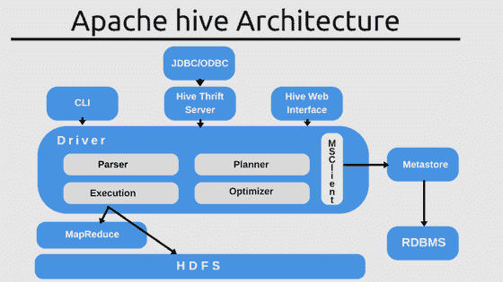**

**[**Apache Impala**](https://impala.apache.org/)**是 Hadoop 的原生**分析数据库**，它提供元数据存储，您仍然可以使用 [**Hcatalog**](https://cwiki.apache.org/confluence/display/Hive/HCatalog) 连接到 Hive 获取元数据。****

****[**Apache Phoenix**](https://phoenix.apache.org/index.html)也有一个 metastore，可以和 Hive 一起工作。Phoenix 专注于使用 ACID 属性对事务进行查询的 OLTP。它很灵活，通过利用 HBase 作为其后备存储，提供了来自 NoSQL 世界的模式读取功能。**阿帕奇** [**德鲁伊**](https://druid.apache.org/technology) 或 [**比诺**](https://pinot.apache.org/) 也提供元数据存储。****

## ****处理****

****此阶段的目标是使用单一模式清理、规范化、处理和保存数据。最终结果是一个**可信的数据集，具有定义良好的模式。******

****通常，您需要进行某种处理，例如:****

*   ******验证**:通过将数据存储在单独的存储器中来验证数据并隔离坏数据。根据您的数据质量要求，在达到某个阈值时发送警报。****
*   ******争论和清理**:清理你的数据，并以另一种格式存储以便进一步处理，例如用 Avro 替换低效的 JSON。****
*   ******数值的标准化**和**标准化******
*   ******重命名**字段****
*   ****…****

****记住，我们的目标是创建一个**可信的数据集**，以后可以用于下游系统。这是数据工程师的一个关键角色。**这可以以流或分批的方式进行。******

****在**批量加工**的情况下，管道加工可分为**三个阶段**:****

*   ******预处理阶段**:如果原始数据不干净或者格式不对，需要进行预处理。这一阶段包括一些基本的验证，但目标是**为下一阶段**准备有效处理的数据。在这个阶段，你应该尝试**将数据扁平化，保存为二进制格式**比如 Avro。这将加速进一步的处理。这个想法是，下一阶段将执行行级操作，而嵌套查询开销很大，因此现在将数据扁平化将提高下一阶段的性能。****
*   ******可信阶段**:数据被**验证、清理、规范化并被**转换为存储在**配置单元**中的公共模式。目标是创建数据所有者理解的可信公共数据集。通常，会创建一个数据**规范**，数据工程师的角色是应用转换来匹配规范。最终结果是一个可以轻松查询的 **Parquet** 格式的数据集。选择正确的分区并优化数据以执行内部查询至关重要。您可能希望在此阶段部分预计算一些聚合，以提高查询性能。****
*   ******报告阶段**:这一步是可选的，但经常是必需的。不幸的是，当使用数据湖时，**一个单一的模式不能满足所有的用例**；这是数据仓库和数据湖之间的一个区别。查询 HDFS 不如数据库或数据仓库高效，因此需要进一步优化。在这个阶段，你可能需要**去规范化**数据，使用不同的分区来存储它，这样不同的利益相关者可以更有效地查询它。这个想法是为不同的下游系统( [**数据集市**](https://en.wikipedia.org/wiki/Data_mart) )创建不同的**视图**。在此阶段，如果不使用 OLAP 引擎，您也可以计算聚合(请参见下一节)。可信阶段不知道谁将查询数据，这个阶段为消费者优化数据。如果客户端是高度交互的，您可能希望在这个阶段引入一个快速存储层，比如用于快速查询的关系数据库。或者，你可以使用 OLAP 发动机，我们将在后面讨论。****

****对于流式传输，逻辑是相同的，但它将以流式方式在定义的 DAG 内运行。Spark 允许你加入带有历史数据的流，但是它有一些限制。我们稍后将讨论 **OLAP 引擎**，它更适合将实时数据与历史数据合并。****

******加工框架******

****一些可用于处理的工具有:****

*   ****[**Apache Spark**](https://spark.apache.org/) :这是最广为人知的批处理框架。作为 Hadoop 生态系统的一部分，它是一个由**管理的**集群，可提供难以置信的**并行性**、监控和出色的 UI。它还支持流处理([结构化流](https://spark.apache.org/docs/latest/structured-streaming-programming-guide.html))。基本上，Spark 在内存中运行 MapReduce 作业，其性能是普通 MapReduce 的 100 倍。它与 Hive 集成以支持 [SQL](https://spark.apache.org/sql/) ，并可用于创建 Hive 表、视图或查询数据。它有很多集成，支持多种格式，有一个巨大的社区。它受到所有云提供商的支持。它可以作为 Hadoop 集群的一部分运行在 [**YARN**](https://hadoop.apache.org/docs/current/hadoop-yarn/hadoop-yarn-site/YARN.html) 上，也可以运行在 Kubernetes 和其他平台上。它有许多针对特定用例的库，如 SQL 或机器学习。****

********

*   ****[**阿帕奇 Flink**](https://flink.apache.org/) :第一个统一批处理和流式传输但重点放在**流式传输**的引擎。可以作为 Kafka 这样的微服务的骨干。它可以作为 Hadoop 集群的一部分运行在 YARN 上，但从一开始就已经针对 Kubernetes 或 Mesos 等其他平台进行了优化。它**极快**并提供实时流，对于**低延迟**流处理，尤其是对于**有状态**流，它比 Spark 更好。它也有 SQL，机器学习和更多的库。****

********

*   ****[**Apache Storm**](https://storm.apache.org/):Apache Storm 是一个免费开源的分布式实时计算系统。它专注于流，是 Hadoop 生态系统的托管解决方案的一部分。它是可扩展的、容错的，保证您的数据将被处理，并且易于设置和操作。****
*   ****[**Apache Samza**](https://samza.apache.org/) :另一个伟大的有状态流处理引擎。Samza 允许您构建有状态的应用程序，实时处理来自包括 Apache Kafka 在内的多个来源的数据。托管解决方案运行在 YARN 之上的 Hadoop 生态系统的一部分。****

****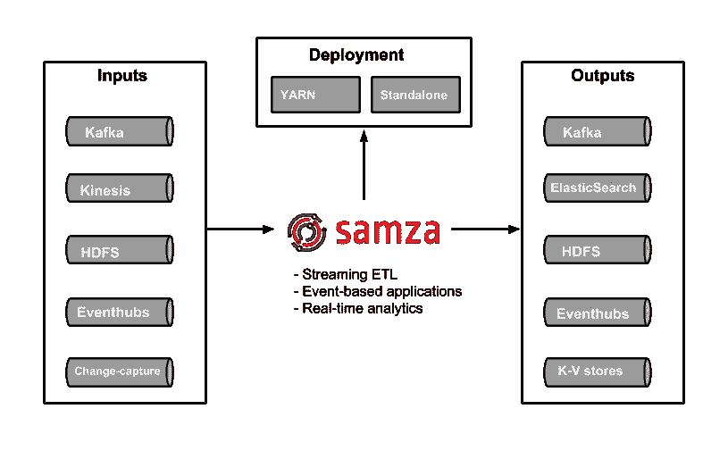****

*   ****[**Apache Beam**](https://beam.apache.org/):Apache Beam 它本身不是一个引擎，而是一个**统一编程模型**的**规范**，集合了所有其他引擎。它提供了一种可以与**不同语言**一起使用的编程模型，因此开发者在处理大数据管道时不必学习新的语言。然后，它插入**不同的后端**用于可以在云上或本地运行的处理步骤。Beam 支持前面提到的所有引擎，您可以轻松地在它们之间切换，并在任何平台上运行它们:cloud、YARN、Mesos、Kubernetes。如果您正在开始一个新项目，我真的建议从 Beam 开始，以确保您的数据管道经得起未来的考验。****

********

****在这个处理阶段结束时，您已经完成了数据，现在可以使用了！，但是为了烹饪，厨师必须与他的团队协调…****

## ****管弦乐编曲****

****数据管道编排是一个跨领域的过程，它管理所有其他任务之间的依赖关系。如果您使用流处理，您需要协调每个流应用程序的依赖关系，对于批处理，您需要调度和协调作业。****

****任务和应用程序可能会失败，所以你需要一种方法来**调度**，重新调度，**重放**，**监控**，**重试**，并统一调试你的整个数据管道。****

****较新的框架如 [**Dagster**](https://docs.dagster.io/) 或 [**Prefect**](https://docs.prefect.io/) 增加了更多的功能，并允许您跟踪数据资产，为您的管道添加语义。****

****一些**选项**包括:****

*   ****[**Apache oo zie**](https://oozie.apache.org/):oo zie 是 Hadoop 的**调度器**，作业被创建为 Dag，可以由时间或数据可用性触发。它集成了摄取工具，如 [Sqoop](https://sqoop.apache.org/) 和处理框架，如 Spark。****
*   ****[**Apache air flow**](https://airflow.apache.org/):air flow 是一个允许**调度、运行和监控工作流**的平台。使用 Dag 创建复杂的工作流。图中的每个节点都是一个任务，边定义了任务之间的依赖关系。Airflow scheduler 在一组工作线程上执行您的任务，同时遵循您描述的指定依赖关系。它为您生成 DAG，最大化**并行度**。Dag 是用 **Python** 编写的，所以你可以在本地运行它们，对它们进行单元测试，并将它们集成到你的开发工作流程中。它还支持**SLA 和警报**。 [**Luigi**](https://github.com/spotify/luigi) 是具有类似功能的气流的替代产品，但是气流比 Luigi 具有更多的功能，并且扩展性更好。****
*   ****[**Dagster**](https://docs.dagster.io/)**是机器学习、分析和 ETL 的较新的编排器。主要不同的是，你可以跟踪数据的输入和输出，类似于[**Apache NiFi**](https://nifi.apache.org/)**创建数据流解决方案。作为任务的一部分，您还可以具体化其他值。它还可以并行运行几个作业，易于添加参数，易于测试，提供简单的版本控制等等。它仍然有点不成熟，由于它需要跟踪数据，可能很难扩展，这是 NiFi 共有的问题。********
*   ******[**提督**](https://docs.prefect.io/) 类似于 Dagster，提供本地测试、版本控制、参数管理等等。与其他产品不同的是，Prefect 旨在克服 Airflow 执行引擎的[限制，如改进的调度程序、参数化的工作流、动态工作流、版本控制和改进的测试。它有一个核心的开源工作流管理系统和一个完全不需要设置的云产品。](https://medium.com/the-prefect-blog/why-not-airflow-4cfa423299c4)******
*   ****[**Apache NiFi**](https://nifi.apache.org/):NiFi 还可以调度作业、监控、路由数据、警报等等。它侧重于数据流，但您也可以处理批处理。它运行在 Hadoop 之外，但可以触发 Spark 作业并连接到 HDFS/S3。****

****简而言之，如果您的需求只是编排不需要共享数据的独立任务，请使用 Airflow 或 Ozzie。对于需要数据沿袭和跟踪的数据流应用程序，非开发人员使用 NiFi，开发人员使用 Dagster 或 Prefect。****

## ****数据质量****

****大数据中经常被忽视的一个重要方面是数据质量和保证。由于数据质量问题，公司每年都会损失大量资金。问题是，在数据科学中，这仍然是一个不成熟的领域，开发人员已经在这个领域工作了几十年，他们有很好的测试框架和方法，如 [BDD](https://en.wikipedia.org/wiki/Behavior-driven_development) 或 [TDD](https://en.wikipedia.org/wiki/Test-driven_development) ，但是你如何测试你的管道呢？****

****这一领域有两个常见问题:****

*   ****被误解的需求:转换和编排逻辑经常会变得非常复杂。业务分析师可能使用他们的领域语言编写需求，这些需求需要由经常犯错的开发人员进行解释，并计划、开发、测试和部署技术上正确但需求错误的解决方案。这类错误代价很高。****
*   ******数据验证**:流水线测试和代码差别很大。当开发软件时，你测试功能，这是黑盒测试，确定性的。对于给定的输入，你总是得到相同的输出。对于数据资产，测试更加复杂:您需要断言数据类型、值、约束等等。而且，您需要应用聚合来验证数据集，以确保行数或列数是正确的。例如，很难检测某一天数据量是否减少了 10%,或者某些值是否被正确填充。****

******公司在数据质量和测试方面还处于起步阶段**，这造成了**巨大的技术债务**。我真心推荐查看这篇 [**文章**](https://medium.com/@expectgreatdata/down-with-pipeline-debt-introducing-great-expectations-862ddc46782a) 了解更多信息。****

****为了减轻这些问题，试着遵循 DDD 原则，并确保设定界限和使用共同语言。使用支持数据血统的框架，如 NiFi 或 Dagster。****

****一些专注于数据质量的工具有:****

*   ****[**Apache Griffin**](https://griffin.apache.org/):作为 Hadoop 生态系统的一部分，该工具提供了一个统一的流程来从不同的角度衡量您的数据质量，帮助您构建可信的数据资产。它提供了一个 DSL，您可以使用它来为您的数据创建断言，并作为您的管道的一部分来验证它们。它与 Spark 集成在一起。您可以为您的数据集添加规则和断言，然后作为 Spark 作业运行验证。Griffin 的问题是，DSL 可能变得难以管理(JSON ),非技术人员很难理解，这意味着它不能解决被误解的需求问题。****

****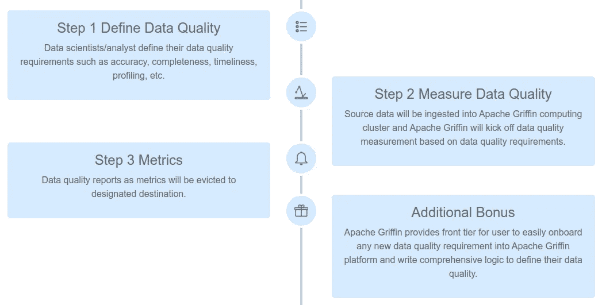****

****阿帕奇格里芬进程****

*   ****[**远大前程:**](https://greatexpectations.io/) 这是一个用 **Python** 编写的较新的工具，专注于数据质量、管道测试和质量保证。它可以轻松地与 Airflow 或其他编排工具集成，并提供自动化的数据验证。让这个工具与众不同的是，它是人类可读的，可以被数据分析师、BAs 和开发人员使用。它提供了一个直观的 UI，而且是完全自动化的，因此您可以将验证作为生产管道的一部分运行，并在一个漂亮的 **UI** 中查看结果。断言可以由非技术人员使用[笔记本](https://jupyter.org/try)编写，笔记本提供了开发人员可以容易理解、翻译成代码并用于测试的文档和正式需求。BAs 或测试人员编写数据断言([期望](https://docs.greatexpectations.io/en/latest/reference/glossary_of_expectations.html))，这些断言在 UI 中被转换为人类可读的测试，这样每个人都可以看到它们并验证它们。它还可以进行数据分析，为您生成一些断言。它可以直接连接到本地或云中的数据库或文件系统。它非常易于使用和管理。期望可以提交到源代码存储库中，然后集成到您的管道中。**远大前程为参与数据质量的各方创造了一个共同的语言和框架**，使得自动化和测试你的管道变得非常容易****。********

********

****远大前程 UI****

# ****查询您的数据****

****现在您已经有了自己的烹饪方法，是时候最终从中获得价值了。此时，您已经使用某种深度存储将数据存储在您的数据湖中，例如 HDFS，以可查询的格式存储在 OLAP 数据库中。****

****用于查询数据的工具有很多种，每一种都有其优点和缺点。他们中的大多数关注于 OLAP，但是很少有人也针对 OLTP 进行了优化。一些使用标准格式，只专注于运行查询，而另一些使用自己的格式/存储将处理推送到数据源，以提高性能。有些针对使用星型或雪花型模式的数据仓库进行了优化，而有些则更加灵活。概括来说，这些是不同的考虑因素:****

*   ****数据仓库与数据湖****
*   ****Hadoop 与独立版****
*   ****OLAP vs OLTP****
*   ****查询引擎与 OLAP 引擎****

****我们还应该考虑具有查询功能的处理引擎。****

## ****处理引擎****

****我们在上一节中描述的大多数引擎可以连接到元数据服务器，如 **Hive** ，并运行查询、创建视图等。这是创建细化报告层的常见用例。****

****[**Spark SQL**](https://spark.apache.org/sql/) 提供了一种无缝混合 SQL 查询和 Spark 程序的方法，因此您可以将 [DataFrame](https://www.tutorialspoint.com/spark_sql/spark_sql_dataframes.htm) API 和 SQL 混合使用。它具有通过 JDBC 或 ODBC 的 Hive 集成和标准连接；所以你可以通过 Spark 把 [Tableau](https://www.tableau.com/) 、 [Looker](https://looker.com/) 或者任何 BI 工具连接到你的数据上。****

****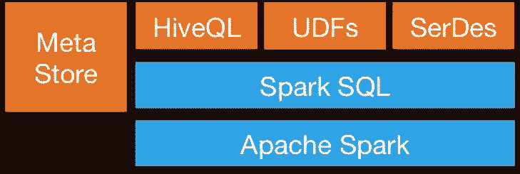****

******Apache Flink** 也提供了 [SQL](https://ci.apache.org/projects/flink/flink-docs-stable/dev/table/sql/) API。Flink 的 SQL 支持基于实现 SQL 标准的 [Apache 方解石](https://calcite.apache.org/)。它还通过`HiveCatalog`与[蜂巢](https://ci.apache.org/projects/flink/flink-docs-stable/dev/table/hive/)整合。例如，用户可以使用`HiveCatalog`将 Kafka 或 ElasticSearch 表存储在 Hive Metastore 中，并在以后的 SQL 查询中重用它们。****

## ****查询引擎****

****这类工具侧重于以统一的方式查询不同的数据源和格式。这个想法是使用 SQL 查询来查询你的数据湖，就像它是一个关系数据库一样，尽管它有一些限制。其中一些工具还可以查询 NoSQL 数据库等等。这些工具为外部工具提供了一个 JDBC 接口，例如 [Tableau](https://www.tableau.com/) 或 [Looker](https://looker.com/) ，以一种安全的方式连接到您的数据湖。**查询引擎是最慢的选项，但提供了最大的灵活性。******

*   ****[**阿帕奇猪**](https://pig.apache.org/) :它和 Hive 一起是最早的查询语言之一。它有自己不同于 SQL 的语言。Pig 程序的突出特性是它们的结构服从于大量的**并行化**，这反过来使它们能够处理非常大的数据集。它现在正在衰落，取而代之的是新的基于 SQL 的引擎。****
*   ****[**Presto**](https://prestodb.io/) :由脸书开源发布，它是一个开源的**分布式 SQL 查询引擎**，用于针对各种规模的数据源运行交互式分析查询。Presto 允许查询数据所在的位置，包括 Hive、Cassandra、关系数据库和文件系统。它可以在几秒钟内对大型数据集执行查询。它独立于 Hadoop，但集成了它的大多数工具，尤其是运行 SQL 查询的 Hive。****
*   ****[**Apache Drill**](https://drill.apache.org/) :为 Hadoop、NoSQL 甚至云存储提供无模式的 SQL 查询引擎。它独立于 Hadoop，但与 Hive 等生态系统工具有许多集成。单个查询可以连接来自多个数据存储的数据，执行特定于每个数据存储的优化。它很好地允许分析师像对待表格一样对待任何数据，即使他们正在读一个文件。 **Drill 完全支持标准 SQL** 。业务用户、分析师和数据科学家可以使用标准 BI/分析工具，如 [Tableau](https://www.tableau.com/) 、 [Qlik](https://www.qlik.com/us) 和 Excel，通过利用 Drill 的 JDBC 和 ODBC 驱动程序与非关系型数据存储进行交互。此外，开发人员可以在他们的定制应用程序中利用 Drill 的简单 REST API 来创建漂亮的可视化效果。****

********

****钻孔模型****

## ******OLTP 数据库******

****尽管 Hadoop 针对 OLAP 进行了优化，但是如果您想为交互式应用程序执行 OLTP 查询，仍然有一些选项。****

****[**h base**](https://hbase.apache.org/)**根据设计，它的 ACID 属性非常有限，因为它是按规模构建的，不提供现成的 ACID 功能，但它可以用于一些 OLTP 场景。******

******[**Apache Phoenix**](https://phoenix.apache.org/index.html) 构建在 HBase 之上，提供了一种在 Hadoop 生态系统中执行 OTLP 查询的方式。Apache Phoenix 与 Spark、Hive、Pig、Flume 和 Map Reduce 等其他 Hadoop 产品完全集成。它还可以存储元数据，并通过 DDL 命令支持表创建和版本化增量变更。它相当**快**，比使用 Drill 或其他查询引擎要快。******

****你可以使用 Hadoop 生态系统之外的任何大规模数据库，比如 **Cassandra、YugaByteDB、ScyllaDB for OTLP** 。****

****最后，在任何类型的快速数据库(如 MongoDB 或 MySQL)中有一个数据子集(通常是最新的)是非常常见的。上面提到的**查询引擎**可以在单个查询中连接慢速和快速数据存储之间的数据。****

## ****分布式搜索索引****

****这些工具提供了一种**存储和搜索非结构化文本数据**的方式，它们存在于 Hadoop 生态系统之外，因为它们需要特殊的结构来存储数据。想法是使用一个 [**倒排索引**](https://en.wikipedia.org/wiki/Search_engine_indexing) 来执行快速查找。除了文本搜索之外，这项技术还可以用于广泛的用例，比如存储日志、事件等。有两个主要选项:****

*   ****[**Solr**](https://lucene.apache.org/solr/) :它是一个流行的、高速的、开源的企业搜索平台，构建在 Apache[**Lucene**](https://lucene.apache.org/)之上。Solr 是可靠的、可扩展的和容错的，提供分布式索引、复制和负载平衡查询、自动故障转移和恢复、集中式配置等等。它对于文本搜索来说很棒，但与 [ElasticSearch](https://en.wikipedia.org/wiki/Elasticsearch) 相比，它的使用案例有限。****
*   ****[**ElasticSearch**](https://en.wikipedia.org/wiki/Elasticsearch) :它也是一个非常受欢迎的分布式索引，但它已经发展成为自己的生态系统，涵盖了许多用例，如 [APM](https://www.elastic.co/apm) ，搜索，文本存储，分析，仪表板，机器学习等等。它绝对是您工具箱中的一个工具，无论是用于开发还是用于数据管道，因为它非常通用。它还可以存储和搜索视频和图像。****

******ElasticSearch** 可用作**快速存储层 f** 或高级搜索功能的数据湖。如果您将数据存储在一个键值型的大型数据库中，比如 HBase 或 Cassandra，由于缺少连接，它们提供的搜索功能非常有限；你可以将 ElasticSearch 放在前面执行查询，返回 id，然后在你的数据库上进行快速查找。****

****它也可用于**分析**；您可以导出数据，对其进行索引，然后使用 [**Kibana**](https://www.elastic.co/kibana) 进行查询，创建仪表盘、报告等，您可以添加直方图、复杂聚合，甚至在数据基础上运行机器学习算法。弹性生态系统庞大，值得探索。****

********

## ****OLAP 数据库****

****在这个类别中，我们有数据库，它也可以为模式和查询功能提供元数据存储。与查询引擎相比，这些工具还提供存储，并可能在数据仓库的情况下实施某些模式(星型模式)。这些工具使用 SQL 语法和 Spark，其他框架可以与之交互。****

*   ****[**Apache Hive**](https://hive.apache.org/) :我们已经讨论过 Hive 作为 Spark 和其他工具的中央模式存储库，因此它们可以使用 **SQL** ，但是 Hive 也可以存储数据，因此您可以将它用作**数据仓库。**可以访问 **HDFS** 或 **HBase** 。当查询 Hive 时，它利用 [Apache Tez](http://tez.apache.org/) 、 [Apache Spark](http://spark.apache.org/) 或 [MapReduce](http://hadoop.apache.org/docs/current/hadoop-mapreduce-client/hadoop-mapreduce-client-core/MapReduceTutorial.html) ，比 Tez 或 Spark 快得多。它还有一种叫做 HPL-SQL 的过程语言。****
*   ****[**Apache Impala**](https://impala.apache.org/) :它是 Hadoop 的原生**分析数据库**，你可以用它来存储数据，并以高效的方式进行查询。它可以使用 [**Hcatalog**](https://cwiki.apache.org/confluence/display/Hive/HCatalog) 连接到 Hive 获取元数据。Impala 为 Hadoop 上的 BI/分析查询提供了**低延迟和高并发**(不是 Apache Hive 等批处理框架提供的)。Impala 还可以线性扩展，即使在多租户环境中也比 Hive 更适合查询。Impala 集成了原生 Hadoop 安全性和 Kerberos 进行身份验证，因此您可以安全地管理数据访问。它使用 **HBase** 和 **HDFS** 进行数据存储。****

****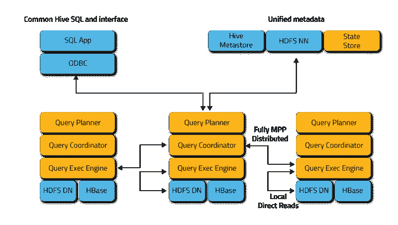****

*   ****[**Apache Tajo**](https://tajo.apache.org/) :是 Hadoop 的另一个**数据仓库**。Tajo 是为存储在 HDFS 和其他数据源上的大数据集的低延迟和可伸缩的特别查询、在线聚合和 ETL 而设计的。它与**Hive**Metastore**Metastore**集成，以访问公共模式。它有许多查询优化，它是可伸缩的，容错的，并提供了一个 JDBC 接口。****
*   ****[**Apache Kylin**](https://kylin.apache.org/):Apache Kylin 是一个较新的分布式**分析数据仓库**。Kylin 是**速度极快的**，因此它可以用来补充一些其他数据库，如 Hive，用于**性能**很重要的用例，如**仪表盘**或交互式报告，它可能是最好的 OLAP 数据仓库，但它更难使用，另一个问题是因为高维度，你需要更多的存储空间。其想法是，如果查询引擎或 Hive 不够快，您可以在 Kylin 中创建一个“*多维数据集*”，这是一个为 OLAP 优化的多维表，具有**预先计算的**值，您可以从您的仪表板或交互式报告中查询这些值。它可以直接从 Spark 构建立方体，甚至可以从 Kafka 近乎实时地构建立方体。****

****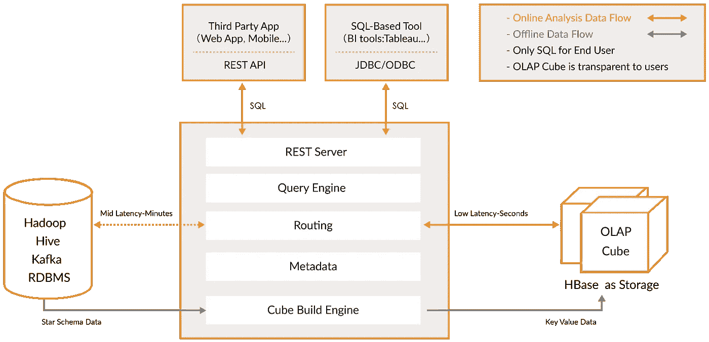****

## ****OLAP 发动机****

****在这一类别中，我包括**较新的引擎**，它们是以前的 OLAP 数据库的演变，提供更多功能，创建了一个**一体化分析平台**。实际上，它们是前两个类别的**混合体**，为你的 OLAP 数据库添加了**索引**。它们生活在 Hadoop 平台之外，但是紧密集成在一起。在这种情况下，您通常会跳过处理阶段，直接使用这些工具进行摄取。****

****他们试图以统一的方式解决**查询实时和历史数据**的问题，这样一旦实时数据可用，您就可以立即查询实时数据和历史数据，并且延迟较低，这样您就可以构建交互式应用程序和仪表板。这些工具在许多情况下允许查询原始数据，几乎不需要像 ELT 一样进行转换，但是性能很好，比常规的 OLAP 数据库更好。****

****它们的共同点是，它们提供了一个统一的数据视图、实时和批量数据接收、分布式索引、自己的数据格式、SQL 支持、JDBC 接口、冷热数据支持、多重集成和元数据存储。****

*   ****[**阿帕奇德鲁伊**](https://druid.apache.org/) :是最著名的实时 OLAP 引擎。它专注于时间序列数据，但也可以用于任何类型的数据。它使用自己的**列格式**，可以大幅压缩数据，它有很多内置的优化，如**倒排索引**，文本编码，自动数据汇总等等。使用延迟非常低的[宁静](https://druid.apache.org/docs/latest/ingestion/tranquility.html)或 Kafka 实时摄取数据，数据以针对写入优化的行格式保存在内存中，但一旦到达，就可以像以前摄取的数据一样进行查询。负责将数据异步移动到深层存储系统(如 HDFS)的后台任务。当数据移动到深层存储时，它被转换成按时间划分的更小的块，称为**段**，这些段针对低延迟查询进行了高度优化。每个段都有一个时间戳，您可以使用几个维度来过滤和执行聚合；和作为预先计算的集合的度量。对于批量接收，它将数据直接保存到数据段中。它支持推和拉摄取。它与 **Hive、**甚至 [**NiFi**](https://nifi.apache.org/) **有**集成**。**它可以使用 Hive metastore，并支持 Hive SQL 查询，然后转换为 Druid 使用的 JSON 查询。Hive 集成支持 JDBC，因此您可以连接任何 BI 工具。它也有自己的元数据存储，通常是 MySQL。它可以接收大量数据，并且可以很好地扩展。主要问题是它有很多组件，很难管理和部署。****

**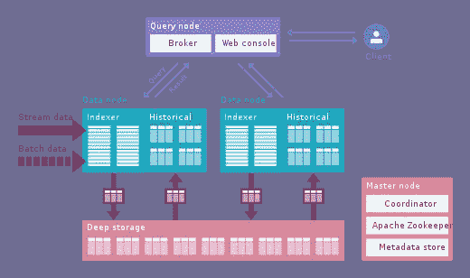**

**德鲁伊建筑**

*   **[**阿帕奇皮诺**](https://pinot.apache.org/) :是 LinkedIn 开源的德鲁伊的较新替代品。与 Druid 相比，它提供了**更低的延迟**，这要归功于提供部分预计算的 *Startree* 索引，因此它可以用于面向用户的应用程序(它用于获取 LinkedIn 提要)。它使用一个**排序索引**，而不是速度更快的倒排索引。它有一个可扩展的插件架构，也有许多集成，但不支持配置单元。它还统一了批处理和实时处理，提供了快速接收、智能索引和分段存储数据。与德鲁伊相比，它更容易部署，速度也更快，但是目前它还有点不成熟。**

**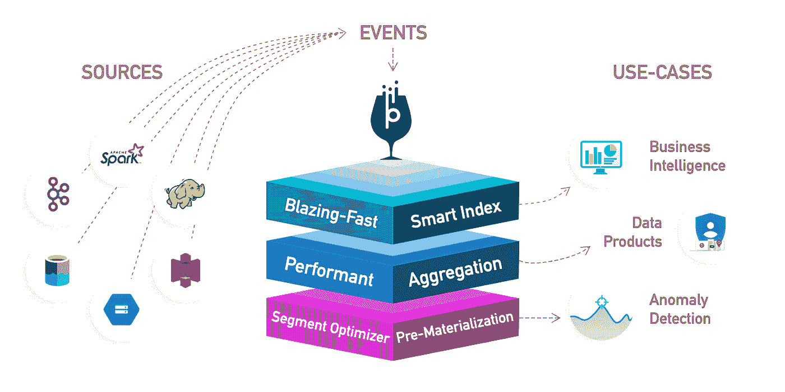**

**阿帕奇皮诺**

*   **[**ClickHouse**](https://clickhouse.tech/) :用 C++编写，这个引擎为 OLAP 查询提供了难以置信的性能，尤其是聚合。它看起来像一个关系数据库，所以你可以很容易地建模数据。它非常容易设置，有许多集成。**

****

**点击之家**

**查看这篇详细对比三款发动机的 [**文章**](https://medium.com/@leventov/comparison-of-the-open-source-olap-systems-for-big-data-clickhouse-druid-and-pinot-8e042a5ed1c7) 。同样，从小处着手，在做决定之前了解你的数据，这些新的引擎非常强大，但很难使用。如果你能等几个小时，那么使用批处理和数据库，如 Hive 或 Tajo 然后使用 Kylin 来加速您的 OLAP 查询，使它们更具交互性。如果这还不够，你需要更低的延迟和实时数据，考虑 OLAP 引擎。德鲁伊更适合实时分析。麒麟更专注于 OLAP 案件。德鲁伊作为实时流和卡夫卡有很好的融合；Kylin 从 Hive 或者 Kafka 批量取数据；尽管计划在不久的将来实现实时摄取。**

**最后， [**Greenplum**](https://greenplum.org/) 是另一个更加**专注 AI** 的 OLAP 引擎。**

**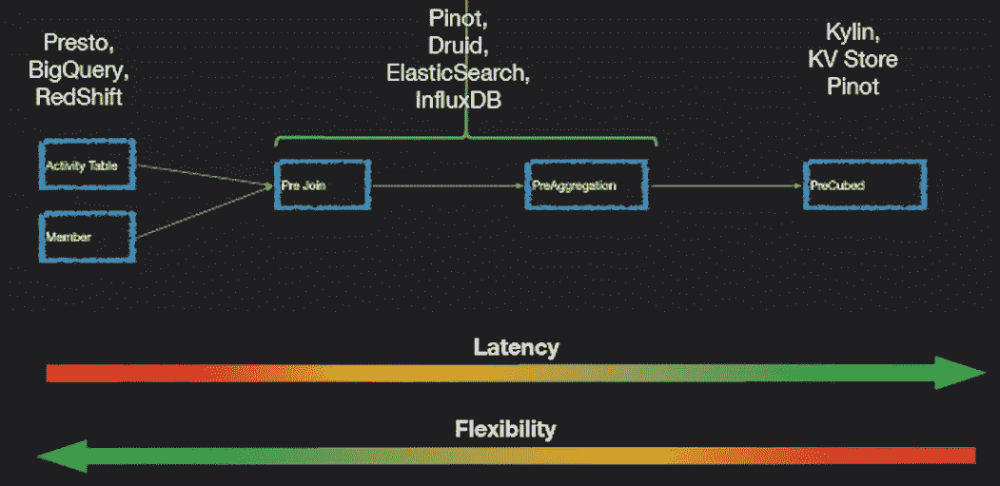**

**Presto/Drill 提供更大的灵活性，麒麟大潜伏，德鲁伊和皮诺，两全其美。**

**最后，对于**可视化**你有几个商业工具，如 [Qlik](https://www.qlik.com/us) 、 [Looker](https://looker.com/) 或 [Tableau](https://www.tableau.com/) 。对于开源，检查 [**超集**](https://github.com/apache/incubator-superset) ，一个支持我们提到的所有工具的神奇工具，有一个很棒的编辑器，它真的很快。 [**元数据库**](https://github.com/metabase/metabase) 或者 [**猎鹰**](https://github.com/uwdata/falcon) 都是其他很棒的选择。**

# **结论**

**我们已经谈了很多关于**数据**的内容:不同的形状、格式、如何处理、存储等等。记住:**了解你的数据和你的商业模式**。使用迭代过程**开始慢慢构建你的大数据平台**；不是通过引入新的框架，而是通过**提出正确的问题，寻找给你正确答案的最佳工具。****

**查看您的数据的不同注意事项，根据数据模型(SQL)、查询(NoSQL)、基础架构和您的预算选择合适的存储。记住**与您的云提供商**合作，评估面向大数据的云产品(购买还是构建)。从[无服务器](https://en.wikipedia.org/wiki/Serverless_computing)分析管道开始，随着成本的增加，慢慢转向开源解决方案，这种情况非常普遍。**

****由于依赖于您控制范围之外的系统，数据摄取至关重要且复杂**；尝试管理这些依赖关系，并创建可靠的数据流来正确接收数据。如果可能的话，让其他团队负责数据接收。记得添加指标、日志和跟踪来跟踪数据。启用模式进化，并确保在您的平台中设置了适当的安全性。**

**使用合适的工具，不要贪多嚼不烂。像 Cassandra、Druid 或 ElasticSearch 这样的工具是令人惊叹的技术，但需要大量的知识来正确使用和管理。如果您只需要对特定查询和报告进行 OLAP 批处理分析，请使用 Hive 或 Tajo。如果需要更好的性能，加麒麟。如果您还需要加入其他数据源，请添加查询引擎，如 Drill 或 Presto。再者，如果需要实时查询，批量使用 ClickHouse，Druid 或者 Pinot。**

****更新**:我目前在坦桑尼亚帮助当地的一所学校，我创建了一个 [**GoFundMe 活动**](https://www.gofundme.com/f/help-the-mango-school-children-in-tanzania) 来帮助孩子们，通过这个[链接](https://www.gofundme.com/f/help-the-mango-school-children-in-tanzania)来捐款，每一点帮助！**

***记得来* ***拍拍*** *如果你喜欢这篇文章还有* [***关注*** ***我***](https://javier-ramos.medium.com/subscribe) *或* [***订阅***](https://javier-ramos.medium.com/membership) *获取更多更新！***

**[**订阅**](https://javier-ramos.medium.com/subscribe) 获得**通知**当我发表一篇文章和 [**加入 Medium.com**](https://javier-ramos.medium.com/membership)访问百万或文章！**