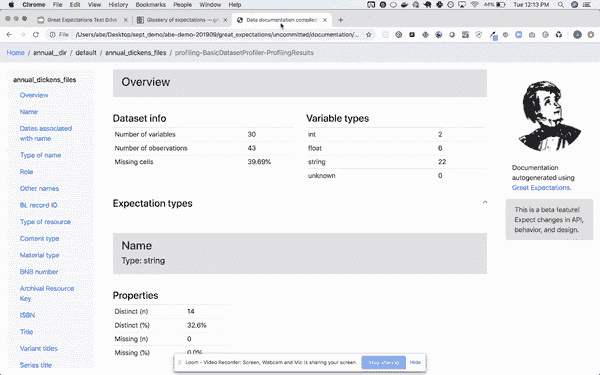
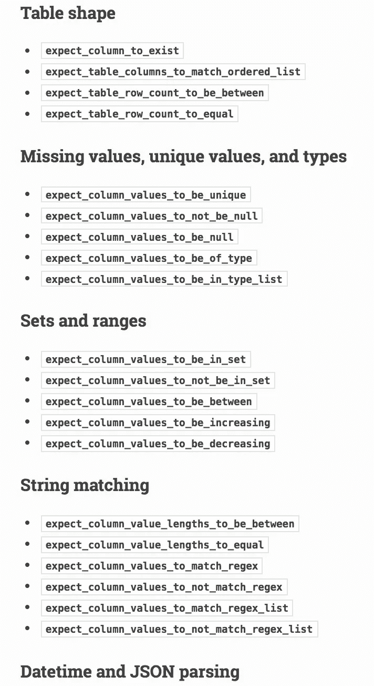

# 大数据质量保证

> 原文：<https://itnext.io/big-data-quality-assurance-635c368a3e28?source=collection_archive---------3----------------------->


米卡·鲍梅斯特在 [Unsplash](https://unsplash.com?utm_source=medium&utm_medium=referral) 上的照片

# 介绍

本文摘自我的文章 [**大数据管道秘方**](/big-data-pipeline-recipe-c416c1782908) 。在这篇短文中，我将尝试总结适用于您的数据管道的数据质量工具。

*您会在没有测试或代码审查的情况下将代码提交给产品吗？那么，为什么公司不测试他们的数据资产就建立管道呢？*

# 数据质量

大数据中一个经常被忽视的重要方面是**数据质量和保证**。由于数据质量问题，公司每年都会损失大量资金。问题是，这在数据科学中仍然是一个不成熟的领域，开发人员已经在这个领域工作了几十年，他们有很好的测试框架和方法，如 [BDD](https://en.wikipedia.org/wiki/Behavior-driven_development) 或 [TDD](https://en.wikipedia.org/wiki/Test-driven_development) ，但是你如何测试你的管道呢？

这一领域有两个常见问题:

*   **被误解的需求**:转换和编排逻辑经常会变得非常复杂。业务分析师可能使用他们的领域语言编写需求，这些需求需要由经常犯错的开发人员进行解释，并计划、开发、测试和部署技术上正确但需求错误的解决方案。这类错误代价很高。
*   **数据验证**:流水线测试与代码大不相同。当开发软件时，你测试功能，这是黑盒测试，确定性的。对于给定的输入，你总是得到相同的输出。对于数据资产，测试更加复杂:您需要断言数据类型、值、约束等等。而且，您需要应用聚合来验证数据集，以确保行数或列数是正确的。例如，很难检测某一天数据量是否减少了 10%,或者某些值是否被正确填充。


维多利亚诺·伊斯基耶多在 [Unsplash](https://unsplash.com?utm_source=medium&utm_medium=referral) 上拍摄的照片

**公司在数据质量和测试方面仍处于起步阶段**，这造成了**巨大的技术债务**。我真的推荐查看这篇 [**文章**](https://medium.com/@expectgreatdata/down-with-pipeline-debt-introducing-great-expectations-862ddc46782a) 以获得更多关于管道债务的信息。

为了缓解这个问题，请尝试遵循 [**DDD**](https://en.wikipedia.org/wiki/Domain-driven_design) 原则，并确保设定界限和使用通用语言。使用支持数据**血统**的框架，如 **NiFi** 或 **Dagster** 。

# 工具

一些专注于数据质量的工具有:

## [**阿帕奇格里芬**](https://griffin.apache.org/)

作为 **Hadoop** 生态系统的一部分，该工具提供了一个统一的流程来从不同角度衡量您的数据质量，帮助您构建可信的数据资产。它提供了一个 **DSL** ，您可以使用它来为您的数据创建断言，并作为您的管道的一部分来验证它们。与**火花**为一体。您可以为您的数据集添加规则和断言，然后作为 Spark 作业运行验证。Griffin 的问题是，DSL 可能变得难以管理，非技术人员很难理解，这意味着它不能解决被误解的需求问题。


阿帕奇格里芬进程

然而，Griffin 是一个简单而强大的解决方案，可以整合到您当前的 Spark 数据管道中。很容易实现自动化并添加到您现有的工作中，而无需改变您的操作方式。

Griffin 中的示例规则:

```
"rules": [
      {
        "dsl.type": "griffin-dsl",
        "dq.type": "accuracy",
        "out.dataframe.name": "accu",
        "rule": "**src.id = tgt.id AND src.age = tgt.age AND src.desc = tgt.desc**",
        "details": {
          "source": "src",
          "target": "tgt",
          "miss": "miss_count",
          "total": "total_count",
          "matched": "matched_count"
        },
        "out": [
          {
            "type": "metric",
            "name": "accu"
          },
          {
            "type": "record",
            "name": "missRecords"
          }
        ]
      }
    ]
```

## [**远大前程**](https://greatexpectations.io/)

这是一个用 **Python** 编写的新工具，专注于数据质量、管道测试和质量保证。它可以轻松地与 Airflow 或其他编排工具集成，并提供自动化的数据验证。让这个工具与众不同的是，它是人类可读的，可以被数据分析师、BAs 和开发人员使用。

它提供了一个直观的 UI，而且是完全自动化的，因此您可以将验证作为生产流水线的一部分运行，并在一个漂亮的 **UI** 中查看结果。这些断言可以由非技术人员使用[笔记本](https://jupyter.org/try)编写，这些笔记本提供了开发人员易于理解、翻译成代码并用于测试的文档和正式需求。



远大前程 UI

BAs 或测试人员编写数据断言([期望](https://docs.greatexpectations.io/en/latest/reference/glossary_of_expectations.html))，这些断言在 UI 中被转换成人类可读的测试，这样每个人都可以看到并验证它们。它还可以进行数据分析，为您生成一些断言。这些是用 Python 写的期望的一些例子:

```
expect_table_row_count_to_equal(100)expect_column_values_to_be_between(
    column="percent_agree",
    min_value=10,
    max_value=90,
)
```

有许多期望可供选择，您可以创造自己的期望:



你可以设定的一些期望

它可以直接连接到本地或云中的数据库或文件系统。它非常易于使用和管理。

期望可以提交到源代码存储库中，然后集成到您的管道中。 **Great Expectations 为参与数据质量的所有各方创造了一个通用语言和框架**，使得自动化和测试您的管道变得非常容易**。**

如果您的团队已经熟悉 Python，这是一个很好的选择，并且很容易采用。这将给你的团队带来很多信心，并使测试和监控更加容易。

# 结论

**不要等到灾难发生后才认真对待数据质量**。了解您的数据，理解其流动方式、转换、审核更改并验证每一步。确保在产品负责人、BAs 和开发人员之间使用共同的语言，这样就不会在翻译中丢失任何东西。

如果你是一个严重依赖 Spark 的 Scala 团队，那么 **Griffin** 会更容易被采用。如果你已经在使用 [**气流**](https://airflow.apache.org/) 和/或**蟒蛇**，那么**远大前程**将是你工具带的一个合理补充。

尽可能使用自动化来避免手工测试，使用与软件开发相同的原则。

我希望你喜欢这篇文章。欢迎发表评论或分享这篇文章。跟随[***me***](https://twitter.com/JavierRamosRod)**进行未来岗位。**