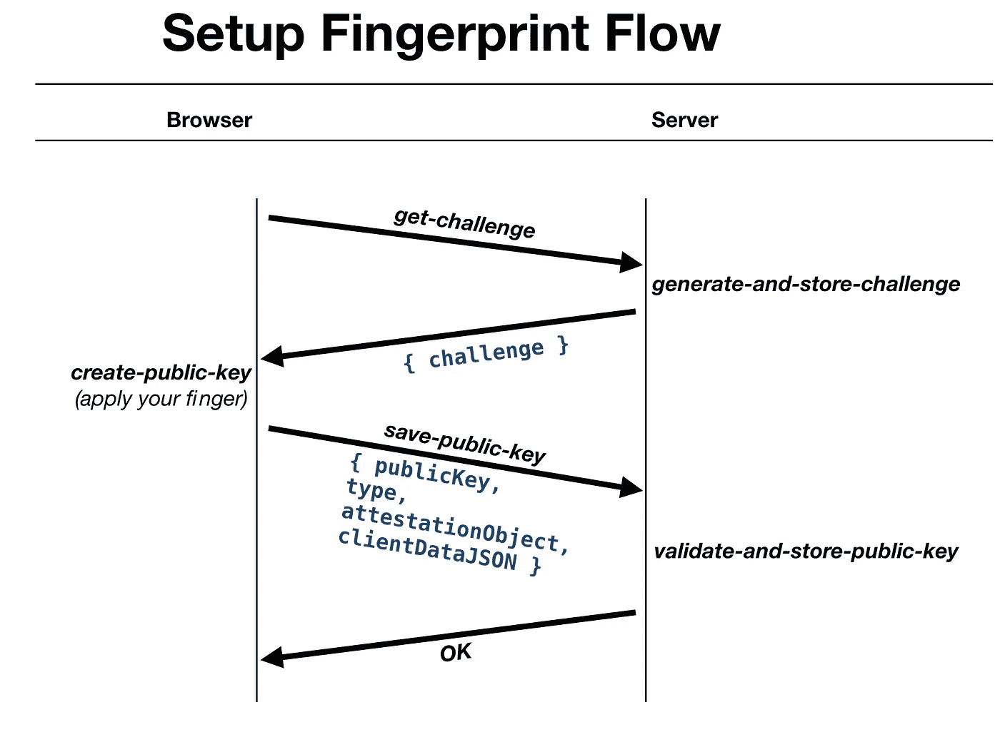
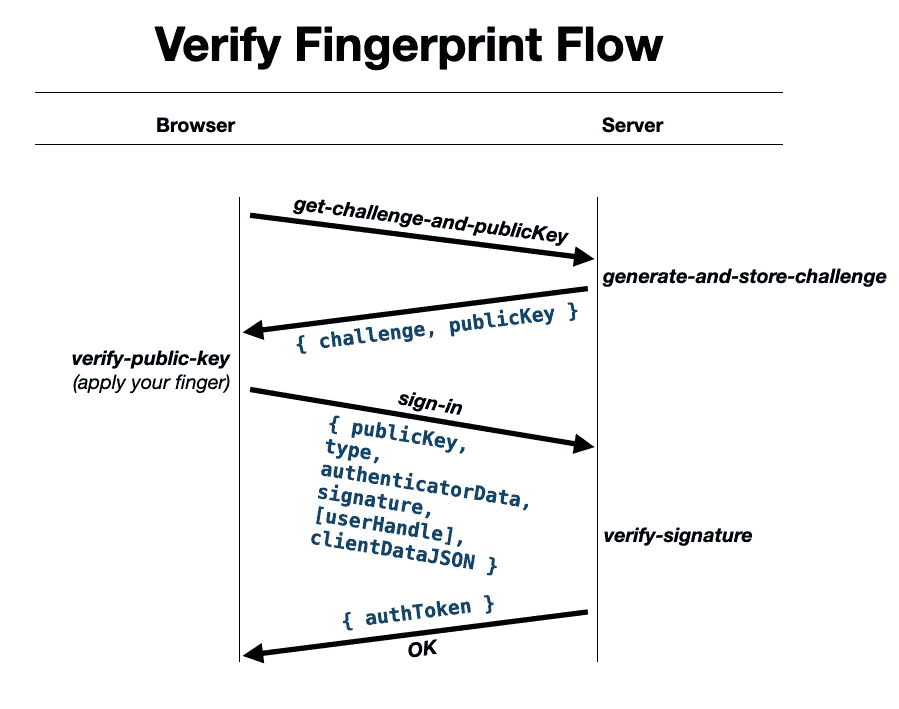

# web 应用中的生物识别(指纹)认证

> 原文：<https://itnext.io/biometrics-fingerprint-auth-in-your-web-apps-d5599522d0b3?source=collection_archive---------0----------------------->

以下是在您的 Web 应用程序(又名网站)中实现指纹(重新)登录、又名(重新)登录、又名(重新)身份验证功能所需的最基本信息和所有代码。

**UPD** :参见最底部的**更新**。最后更新**2020–08–02**。

在下面的视频中，您将看到生物识别登录体验。

以下所有内容都经过测试，并确认在 Chrome 浏览器中完全正常。

在深入研究代码之前，您需要学习一些理论知识。否则，您可能会将您的 web 应用程序暴露给黑客。

# 理论

## 每个设备设置

你需要跟踪用户的每一个设备(浏览器)。为了达到这个目标，我建议你的 web 应用程序拥有一个长期存在的 cookie(一个随机生成的字符串 ID，例如 UUID ),来唯一地识别用户拥有的每一个设备(和浏览器)。您的后端需要为登录用户使用的每个 cookie 创建一个数据库记录。

因此，单个用户在您的`devices`表中会有多个数据库记录(集合、名称空间等)。一个典型的用户会有 1 或 2 个设备记录。我建议将 cookie 字符串作为表中的惟一键或主键本身。

## WebAuthn

WebAuthn(又名 Web Authentication)是浏览器标准和 **API** **，用于** **使用公钥加密向基于 Web 的应用程序和服务认证** **用户**。

## 公钥密码学

公钥加密是指您可以使用之前发布的公钥(也是一个字符串)来验证由私钥(也是一个字符串)创建的签名(只是一个长字符串)。简而言之:私钥对数据进行编码，公钥验证其身份和一致性。

## 授权码

浏览器、操作系统或其他硬件设备(USB、蓝牙、NFC 等)充当私钥存储器。它们通过上述 API 发布公钥，并在设备/操作系统本身上安全地存储相应的私钥。这些存储器被称为**授权码**。

我们将忽略所谓的“漫游”认证器(通常是 USB、NFC、蓝牙可拆卸设备)，因为它们使代码变得非常复杂，并且不是本文的主题。我们将只使用所谓的“平台”认证器，它通常是内置在您的手机/笔记本电脑中的生物扫描仪。

## 安全性如何？

我不是专家，但据我所知，这种指纹重新登录与您最喜欢的银行本地应用指纹重新登录一样安全。

它肯定比标准的登录+密码方法更安全，此外，它对用户更友好(不需要每次都重新输入登录+密码)。

如果与登录+密码+2FA 令牌方法相比，那么指纹重新登录同样安全(甚至更安全)。

## 硬件和软件支持

如果浏览器有这个功能`[PublicKeyCredential.isUserVerifyingPlatformAuthenticatorAvailable](https://developer.mozilla.org/en-US/docs/Web/API/PublicKeyCredential/isUserVerifyingPlatformAuthenticatorAvailable)`并且它解析为`true`，那么你的浏览器、操作系统和设备可以进行生物特征认证。在撰写本文时，只有 Chrome 和 Edge 浏览器拥有该功能。

您可以在这里监控功能可用性:[https://can use . com/# search = isuseserverifyingplatformauthenticatoravailable](https://caniuse.com/#search=isUserVerifyingPlatformAuthenticatorAvailable)

# 数据流

整个业务逻辑由两个主要部分组成:

*   设置指纹
*   验证指纹

下图解释了如何组织浏览器和服务器之间的授权数据流。实际上还有更多细节。但是这些流程让您对代码需要执行的操作以及需要来回传递的数据有了大致的了解。

## 设置指纹

这个流程假设你的用户已经*登录*到你的网络系统、网络平台、网络应用、网站等。



设置指纹重新登录功能时浏览器和服务器之间的数据流。

1.  `GET get-challenge` —浏览器发送包含长期 cookie(设备 ID)的空请求。
2.  `generate-and-store-challenge` —服务器为该 cookie(设备 ID)生成一个新的`challenge`字符串，并将其保存到`devices`表中。
3.  `create-public-key` —浏览器调用 WebAuth API 创建新的公钥。用户用手指。
4.  `POST save-public-key` —新的公钥数据被发送到服务器进行验证和存储。注意`attestationObject`，这很重要。
5.  `validate-and-store-public-key` —在同一`devices`记录中验证并存储公钥数据。

## 验证指纹

该流程假设您的用户*没有登录*。这就是我们迫切需要的惟一的长时间 cookie(设备 ID)以及与之相关的`challenge`和`publicKey`值。



验证指纹和用户登录时浏览器和服务器之间的数据流。

1.  `GET get-challenge-and-publicKey` —浏览器发送包含长期 cookie(设备 ID)的空请求。
2.  服务器为该 cookie(设备 ID)生成一个新的**字符串** `challenge`并保存它，而不是现有的对`devices`表的挑战。返回新的`challenge`和`publicKey`。
3.  `verify-public-key` —浏览器调用 WebAuth API 创建公钥验证数据。用户用手指。
4.  `POST sign-in` —断言数据被发送到服务器进行验证。
5.  `verify-signature` —服务器使用先前存储的`attestationObject`验证签名，并发放授权令牌。

让我们深入研究每一个步骤。

# 设置指纹流

## 获得挑战

首先，您的服务器需要一个 API 端点(GraphQL query、gRPC method 等)来返回一个随机生成的名为“challenge”的字符串。服务器必须将数据库中的挑战值存储到相应的`devices`记录中。假设该记录是在用户第一次登录时创建的。

下面是一段服务器端伪代码:

```
**const** deviceId = req.cookies["my-long-live-cookie"];
**const** device = **await** devices.findById(deviceId);
**if** (!device) **return** {};
device.challenge = require("crypto").randomBytes(16).toString("hex")
**await** device.save();
**return** { challenge: device.challenge };
```

`devices`表的最小模式如下所示:

```
_id: **String**, *// long lived cookie* challenge: **String**, *// server side random generated string* counter: **Number**, *// protects from the so called replay attacks* publicKey: **String**, *// public key created by the fingerprint scanner* attestationObject: **String**, *// low level device data (BASE64 binary)* clientDataJSON: **String**, *// BASE64 encoded JSON info of the website* userAgent: **String**, *// last seen user-agent HTTP header* user: **ObjectId**, *// the link back to the user, aka the foreign key*
```

## 创建公钥

这是你的浏览器第一次调用 WebAuthn API 扫描用户手指的时候。(参见下面的解释。)

```
**import** { decode: base64urlDecode *}* **from** *"base64url"*;**const** attestation = **await** *navigator.credentials.create*({
    **publicKey**: {
        **authenticatorSelection**: {
            **authenticatorAttachment**: *"platform"*,
            **userVerification**: *"required"*},
        **challenge**: base64urlDecode(challenge),
        **rp**: { **id**: *document.domain*, **name**: *"My Acme Inc"*},
        **user**: {
            **id**: base64urlDecode(user.id),
            **name**: user.email,
            **displayName**: user.fullName
        },
        **pubKeyCredParams**: [
            { **type**: *"public-key"*, **alg**: -7 },
            { **type**: *"public-key"*, **alg**: -257 }
        ]
    }
});*navigator.credentials.preventSilentAccess*();**import** { encode: base64urlEncode *}* **from** *"base64url"*;**function** publicKeyCredentialToJSON(pubKeyCred) {
    **if** (pubKeyCred **instanceof** *ArrayBuffer*) {
        **return** *base64urlEncode*(pubKeyCred);
    } **else if** (pubKeyCred **instanceof** *Array*) {
        **return** pubKeyCred.map(publicKeyCredentialToJSON);
    } **else if** (pubKeyCred **instanceof** *Object*) {
        **const** obj = {};
        **for** (**let** key **in** pubKeyCred) {
            obj[key] = publicKeyCredentialToJSON(pubKeyCred[key]);
        }
        **return** obj;
    } **else return** pubKeyCred;
}**const** webAuthnAttestation = publicKeyCredentialToJSON(attestation);fetch(*"example.com/save-public-key"*, {
    **method:** *"POST"*,
    **headers:** { *"Content-Type"*: *"application/json"* },
    **body:** webAuthnAttestation
});
```

`*navigator.credentials.create*`可以接受更多不同的选项。尽管如此，我还是向您展示了我认为最适合指纹重新登录的列表。

`**authenticatorAttachment:** *“platform”*`意味着你不希望人们使用他们所谓的*漫游*授权码。这些不是内置在您的设备中，而是连接到它的独立设备(USB、NFC 等)。“平台”意味着您只想使用内置在您的计算机/手机中的授权码。这些大多是各种生物扫描仪，如指纹，FaceID 等。

需要`**userVerification**: *“required”*`来确保当你调用 API 时指纹扫描仪总是弹出。否则，在某些情况下，浏览器可能会跳过扫描。虽然，我不知道它被跳过的真实生活场景是什么。

`**challenge**: *base64urlDecode*(challenge)`是您刚刚从服务器读取的`challenge`值。

`**rp**: { **id**: *document.domain*, **name**: *“My Acme Inc”*}`代表**艺术。长话短说——这是你的网站。`name`可以在指纹验证阶段显示给用户。顺便说一句，提供除了`document.domain`之外的任何东西都会抛出异常。**

我相信`**user:**`是自我描述的。这些大多是可选值。但是为了更好的 UX 和安全性，我建议通过它们。

`**pubKeyCredParams:**`总是一样的。我不知道这些影响有多大。

`*navigator.credentials.preventSilentAccess*()`确保自动登录永远不会发生。然而，我不知道这一呼吁是否有必要。参见 [MDN](https://developer.mozilla.org/en-US/docs/Web/API/CredentialsContainer/preventSilentAccess) 文档。

返回的`webAuthnAttestation`如下所示:

```
{
    id: *"a_very_very_log_string"*,
    type: *"public-key"*,
    response: {
        attestationObject: *"even_longer_string"*,
        clientDataJSON: *"another_very_long_string"*
    }
}
```

其中`id`是公钥。

`attestationObject`需要在服务器端以特殊的方式解码。它包含一个重要的身份验证数据，将在指纹验证过程中使用。我们以后再讨论。

`clientDataJSON`只是一个 base64 编码的 JSON(在下面找到解码源代码)。至少包含 3 样东西:

*   服务器生成的`challenge`你已经熟悉了。
*   `origin` —你的网站主机名。
*   `type` —必须是以下字符串:“webauthn.create”。

## 验证并存储公钥

这是服务器端代码。首先，您需要验证传入的数据。

`type`必须是“公钥”字符串。

```
assert(type === *"public-key"*);
```

解码`clientDataJSON`字符串。

```
**const** base64url = *require*(***"base64url"***);
clientDataJSON = ***JSON***.parse(base64url.decode(clientDataJSON));
```

`clientDataJSON`检查:`challenge`必须与我们发送给浏览器的相同。`origin`必须是我们网站的主机名。`type`必须是“webauthn.create”。

```
assert(clientDataJSON.challenge === device.challenge)assert(clientDataJSON.origin === *"example.com"*);assert(clientDataJSON.type === *"webauthn.create"*);
```

然而`attestationObject`有点复杂。

首先，您需要解析它。

```
**const** base64url = *require*(***"base64url"***);
**const** cbor = *require*(***"cbor"***);**function** parseAttestationObject(attestationObject) {
    **const** buffer = base64url.toBuffer(attestationObject);
    **return** cbor.decodeAllSync(buffer)[0];
}**const** makeCredsReponse = parseAttestationObject(attestationObject);
```

对象包含很少的属性，但是我们只对其中的两个感兴趣:`fmt`和`authData`。我不会深入探讨这个问题，但是你可以在阿克曼·塞维多夫的这篇优秀文章中了解更多。

`makeCredsReponse.fmt`必须是`"none"`。

```
assert(makeCredsReponse.fmt === *"none"*);
```

长话短说，这意味着你不想跟踪你的用户的硬件。此外，这大大简化了公钥验证码。另外，我发现如果你试图在这里使用不同的东西，浏览器会问一些令人害怕的问题。比如:

> *您想让此网站访问您手机的私钥吗？*

我的直觉告诉我点击“否”,当我第一次看到它时，我就这样做了。

`makeCredsReponse.authData`将用于指纹验证阶段。确保它存在就行了。

```
assert(makeCredsReponse.authData);
```

当然，**您需要将** `publicKey`、`type`、`attestationObject`和`clientDataJSON`保存到您最安全的数据库中相应的`devices`记录中。

伪代码:

```
device.counter = 0; *// we must reset the counter*device.publicKey = publicKey;
device.type = type;
device.attestationObject = attestationObject;device.clientDataJSON = clientDataJSON;device.userAgent = req.headers["user-agent"];**await** device.save();
```

仅此而已。您的用户刚刚设置了指纹扫描仪，请重新登录。

# 验证指纹流

## 获取挑战公开密钥

这是一个服务器端端点(GraphQL 查询、gRPC 方法等)。类似于上面的`get-challenge`请求，您的 web 应用程序需要执行一个空的`get-challenge-and-publicKey`请求。服务器将获取长期存在的 cookie，通过它查找数据库，生成并保存一个新的`challenge`，并返回`challenge`和`publicKey`。

伪代码:

```
**const** deviceId = req.cookies["my-long-live-cookie"];
**const** device = **await** devices.findById(deviceId);
**if** (!device) **return** {};
device.challenge = require("crypto").randomBytes(16).toString("hex")
**await** device.save();
**return** { challenge: device.challenge, publicKey: device.publicKey };
```

## 验证公钥

您的浏览器调用 WebAuthn API 来扫描用户的手指，以验证密钥和服务器质询。

```
**const** assertionObj = **await** *navigator.credentials.get*({
    **publicKey**: {
        **challenge**: *base64urlDecode*(challenge),
        **rpId**: *document.domain*,
        **allowCredentials**: [
            {
                **type**: *"public-key"*,
                **id**: *base64urlDecode*(publicKey)
            }
        ],
        **userVerification**: *"required"*}
});**const** webAuthnAssertion = publicKeyCredentialToJSON(assertionObj);fetch(*"example.com/sign-in"*, {
    **method:** *"POST"*,
    **headers:** { *"Content-Type"*: *"application/json"* },
    **body:** webAuthnAssertion
});
```

`*navigator.credentials.get*`将要求我们的用户扫描他们的手指。

`**challenge**:`是我们刚刚从服务器收到的值。

`**rpId**:`必须与之前相同。同样，网站域名之外的值在我的测试中不起作用。

`**allowCredentials**:`是用户正在验证的公钥列表。是的，可以有很多。出于简单的原因，我不会在这里推荐一个以上的。

`**type**: *“public-key”*`是必须的。

`**id**: *base64urlDecode*(publicKey)`是我们刚刚从服务器收到的`publicKey`值。

`**userVerification**: *“required”*`与之前的相同。它确保用户总是参与其中(应用他们的手指)。

返回的`webAuthnAssertion`如下所示:

```
{
    id: *"same_very_very_log_string"*,
    type: *"public-key"*,
    response: {
        authenticatorData: *"long_string"*,
        clientDataJSON: *"similar_long_string",* signature: "*not_long_but_still_string*",
        userHandle: "*your_user_id*"    }
}
```

其中`id`是同一个公钥。

`authenticatorData`需要在服务器端以特殊的方式解码。它包含一个重要的身份验证数据，该数据将在服务器上的指纹验证过程中使用。

`clientDataJSON`与上面的`clientDataJSON`相同，是一个 base64 编码的 JSON:

*   好的旧服务器生成了`challenge`字符串。
*   `origin` —你的网站主机名。
*   `type` —必须是以下字符串:“webauthn.get”。

`signature`是我们的服务器将要验证的主要加密值。

`userHandle`应该是我们在设置阶段提供的`user.id`值。虽然，说明书上说`userHandle`是**可选**，可以省略。

## 验证签名

整件事最重要的部分来了。请在您的服务器端实现它，不要使用快捷方式。

下面是您的服务器需要逐一执行的检查列表。

1.  确保`sign-in`请求的`user-agent`(浏览器)与**验证并存储公钥**服务器调用(设置)期间的相同。确保你迎合了版本的变化。例如，Chrome 浏览器每 6 周更新一次版本。
2.  确保`id`(又名`publicKey`)和`type`与设置期间完全相同。这些应该存储在您的`devices`表中。
    `assert(publicKey === device.publicKey);`
3.  如果提供了`userHandle`，那么也进行比较。
    `**if** (userHandle) assert(userHandle === device.user);`
4.  解析`clientDataJSON`(与之前相同)并检查:
    * `challenge`是否与设置期间完全相同(存储在您的`devices`表中)。
    `assert(clientDataJSON.challenge === device.challenge);`
    * `origin`正好作为你网站的域名。
    `assert(clientDataJSON.origin === *"example.com"*);`
    * `type`正是这个字符串—“*web authn . get*”。
    `assert(clientDataJSON.type === *"webauthn.get"*);`
5.  加密签名验证。这是拼图中最难的部分。代码很长，可能会令人困惑。我从 Express.js 项目的 [webauthn 中复制(并修改)了逻辑。](https://github.com/strangerlabs/webauthn/blob/9959cb2b5f87692b8b1fecd799dd4029a3bf61b1/src/Webauthn.js#L501)

服务器端签名验证的完整源代码

`verifyAssertion`功能需要稍微解释一下。它使用接收到的签名和先前存储的公钥来验证接收到的数据。

这些论点是:

*   `counter` —存储在`device.counter`中的前一次重新登录期间断言的`counter`值(如果是第一次重新登录，则为`0`)。每次调用`*navigator.credentials.get*`时，浏览器都会增加一个随机值。**这个** `**counter**` **就是指纹重新登录功能和传统 2FA 方案一样安全的原因之一。** 它用来避免所谓的“重放攻击”。当身份验证数据(如使用密码登录，或者在我们的例子中是`assertionObject`)被坏人捕获，然后一遍又一遍地重新发送到我们的服务器，以便从任何设备随意重新登录时。多亏了这个`counter`，`signature`值永远不会相同！
*   `attestationObject` —先前提供的存储在`device.attestationObject`中的字符串。参见上面的**设置指纹流程**。(如果你仔细观察代码，你可能不需要存储整个字符串，可能只需要存储其中的`COSEPublicKey`部分。)
*   `clientDataJSON`、`authenticatorData`、`signature` —是从浏览器发送的值。

如果成功，`verifyAssertion`函数返回新的`counter`值。您必须将其保存到数据库中的`attestationObject`值旁边。然后您需要发出 new `authToken`(也就是为链接到这个设备的用户创建一个新的登录会话)并将其返回给浏览器。

如果出错，该函数将抛出。我建议发送安全警报(电子邮件？)每次这个函数抛出。这很可能意味着你被黑了。

服务器伪代码:

```
**const** base64url = require(*"base64url"*);**const** deviceId = req.cookies["*my-long-live-cookie"*];
**const** device = **await** devices.findById(deviceId);
**try** {
    **const** { publicKey, type, authenticatorData, clientDataJSON, signature, userHandle } = req.body; assert(type === "public-key");
    assert(publicKey === device.publicKey);
    **if** (userHandle) assert(userHandle === device.user); **const** clientData = **JSON**.parse(base64url.decode(clientDataJSON)); assert(clientData.challenge === device.challenge);
    assert(clientData.origin === *"example.com"*);
    assert(clientData.type === *"webauthn.get"*); **const** newCounter = verifyAssertion({
        counter: device.counter,
        attestationObject: device.attestationObject,
        clientDataJSON,
        authenticatorData,
        signature
    });
    device.counter = newCounter;
    **await** device.save(); res.status(200).send({ 
        authToken: ***CREATE_NEW_AUTH_TOKEN(device.user)*** });
} **catch** (err) {
    res.sendStatus(400);
    console.error(err);
 ***NOTIFY_SECURITY_OF_A_HACK_ATTEMPT();*** }
```

那都是乡亲们！

## 放弃

据我所知，即使有一天有人窃取了`devices`数据库表(它包含了`challenge`、`publicKey`和`attestationObject`安全值)，您的用户也会受到保护！因为私钥仍然存储在用户的设备上。换句话说，任何人都不能用窃取的数据登录。

> 请注意，我不是高级加密和安全专家。请你找出这篇文章的缺点。非常感谢。

我有意让这篇博文尽可能简洁。我不会深入研究 WebAuthn API 和密码学的太多细节。目的是为非专业开发人员提供足够的信息，以安全的方式快速实现指纹(或其他生物特征)重新登录功能。

展示的应用程序是[https://flash-fx.com](https://flash-fx.com)，我们是一家澳大利亚公司，使用区块链技术(Ripple)进行国际货币转移。

## 更新

2020–08–02:

> 1.每次浏览器请求时，都必须生成一个新的`*challenge*`。
> 之前，文章表明挑战永远不会重现。
> 
> 2.使用`*Buffer.randomBytes*`生成`*challenge*` s。
> 之前，本文使用 UUID 作为挑战生成器，这在信息安全领域被认为不够随机。