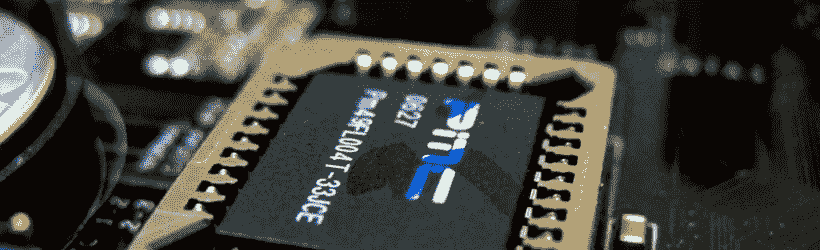

# BIOS 安全:一个特权软件

> 原文：<https://itnext.io/bios-security-a-privileged-piece-of-software-d747e20d9480?source=collection_archive---------0----------------------->

2 月 4 日，戴尔宣布推出新的[启动后 BIOS 验证](http://www.dell.com/learn/us/en/vn/press-releases/2016-02-04-dell-announces-availability-of-the-dell-data-protection)解决方案，作为其终端安全套件企业版的一部分。推出这种基于云的安全工具是一个很好的理由，可以看看企业用来保护 BIOS(一种特权软件)的不同方法。

由[加里·基尔代尔](http://www.computerhistory.org/atchm/gary-kildall-40th-anniversary-of-the-birth-of-the-pc-operating-system/)发明的基本输入输出系统(BIOS)于 1975 年出现在 IBM 兼容的个人电脑上。此后，在将控制权移交给引导加载程序之前，该低级软件最初负责引导过程中的硬件初始化。由于 BIOS 在操作系统和安全软件加载之前执行，检测针对它的攻击并不容易。感染 BIOS 的恶意软件通常在系统重新安装和重启后仍然存在。NSA、[方程组](http://www.kaspersky.com/about/news/virus/2015/equation-group-the-crown-creator-of-cyber-espionage)、[联想](http://www.zdnet.com/article/lenovo-rootkit-ensured-its-software-could-not-be-deleted/)和[黑客团队](http://www.pcworld.com/article/2948092/security/hacking-teams-malware-uses-uefi-rootkit-to-survive-os-reinstalls.html)都感染了 BIOS 固件，为他们不同的目的提取信息。

**带 BIOS 防护的英特尔平台保护技术&引导防护**

作为世界上最大的芯片制造商，英特尔在其第四代及以后的产品中实施了许多安全功能。第四代的[微架构中描述的这些特性包括:](http://www.intel.com/content/dam/www/public/us/en/documents/product-briefs/4th-gen-core-family-mobile-brief.pdf)

*   英特尔 BIOS Guard 保护 BIOS 免受未经平台制造商授权的修改，帮助保护平台免受低级 DOS(拒绝服务)攻击，并在攻击后将 BIOS 恢复到已知的良好状态。
*   英特尔启动保护是一种硬件辅助验证和保护，可抵御 BIOS 恢复攻击。

英特尔还在 2014 年发布了用于平台安全评估的开源框架 [CHIPSEC](http://www.intelsecurity.com/advanced-threat-research/chipsec.html) 。在 [github](https://github.com/chipsec/chipsec) 上有。

**UEFI 安全开机**

统一可扩展固件接口(UEFI)是一个标准固件接口，旨在成为 BIOS 的继任者。这个标准是由联合 EFI 论坛创建的，该论坛由几家领先的技术公司组成，旨在使引导过程现代化。

UEFI 安全引导是一种协议，当 PC 启动时，系统固件会检查每一个引导软件的签名。根据微软的说法，OEM 使用固件制造商的指令来创建安全的引导密钥，并将它们存储在 PC 固件中。如果签名与授权的加密密钥匹配，则 PC 启动，固件将控制权交给操作系统。

世界最大的软件制造商微软将[安全引导](https://technet.microsoft.com/en-us/library/hh824987.aspx)应用于 Windows 8 和 Windows Server 2012 及后续版本。安全引导是由 PC 行业成员开发的安全标准。

据 arstechnica 报道，“微软还要求每个系统都必须有一个用户可操作的开关来关闭安全启动，从而确保计算机与其他操作系统兼容。微软的规则还要求用户能够将自己的签名和加密证书添加到固件中，以便他们仍然可以获得安全启动提供的保护，同时仍然可以自由编译自己的软件。”

惠普和戴尔是在个人电脑中使用安全引导工具的制造商之一。

**谷歌病毒总量**

[VirusTotal](https://www.virustotal.com/) 是谷歌旗下的一项免费在线服务，它可以分析文件和 URL，从而识别病毒、蠕虫、特洛伊木马和防病毒引擎和网站扫描器检测到的其他类型的恶意内容。VirusTotal [聚合了](https://www.virustotal.com/en/about/credits/) 54 种防病毒产品和 61 种在线扫描引擎和数据集来提供其服务。

截至 2016 年 1 月，VirusTotal 推出了一种新的工具，用于描述固件映像的特征，旨在声明它们是合法的还是恶意的。除了标记固件映像之外，新工具还可以提取基于固件的证书及其可执行文件。它还提取在映像中找到的可移植的可执行文件。在一篇[博客文章](http://blog.virustotal.com/2016/01/putting-spotlight-on-firmware-malware_27.html)中，新工具可以执行的一些基本任务被描述为:

*   Apple Mac BIOS 检测和报告
*   提取 BIOS 可移植可执行文件并识别映像中包含的潜在 Windows 可执行文件
*   SMBIOS 特征报告
*   基于字符串的品牌启发式检测，以识别目标系统
*   从固件映像和其中包含的可执行文件中提取证书
*   PCI 类别代码枚举，允许设备类别识别
*   ACPI 表格标签提取
*   NVAR 变量名枚举。
*   选项 ROM 提取、入口点反编译和 PCI 功能列表

该公司建议用户在执行 BIOS 转储和上传到 VirusTotal 之前删除私人信息。该公司表示，某些供应商可能会将 Wi-Fi 密码等私人信息保存在 BIOS 变量中，以便在系统重新安装时记住某些设置。

**戴尔的 BIOS 验证**

2016 年 2 月，戴尔宣布通过购买戴尔数据保护|端点安全套件企业许可证，为戴尔商用电脑提供新的[开机后 BIOS 验证](http://www.dell.com/learn/us/en/vn/press-releases/2016-02-04-dell-announces-availability-of-the-dell-data-protection)解决方案。

戴尔的 BIOS 验证方法包括将 BIOS 映像与戴尔 BIOS 实验室中的官方测量值进行比较。通过在安全的云环境中(而不是在可能被感染的设备上)执行该测试，戴尔可以确保启动后映像不会受损。戴尔声称，该验证有助于扩展整个设备生命周期的安全性，并为想要阻止恶意 BIOS 攻击的管理员提供更大的可见性。

与安全引导不同，戴尔采用不同的方法从验证过程中完全删除本地主机，实际上不会阻止设备引导，甚至不会提醒最终用户。