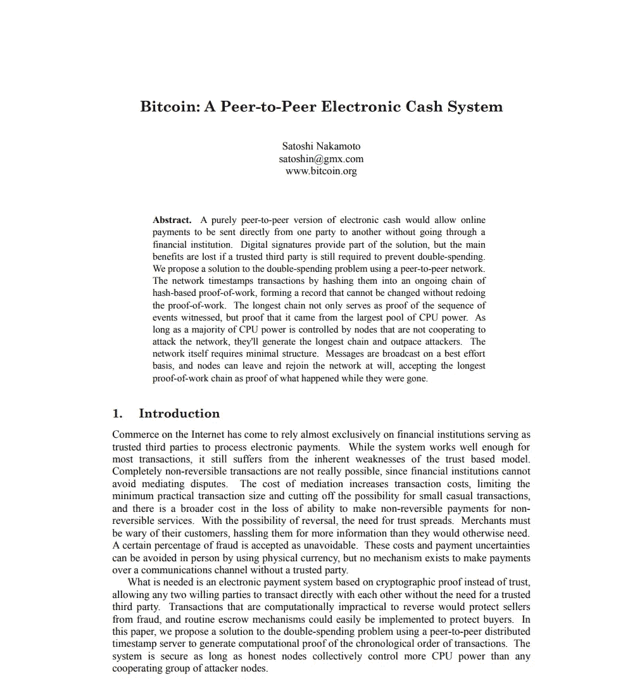
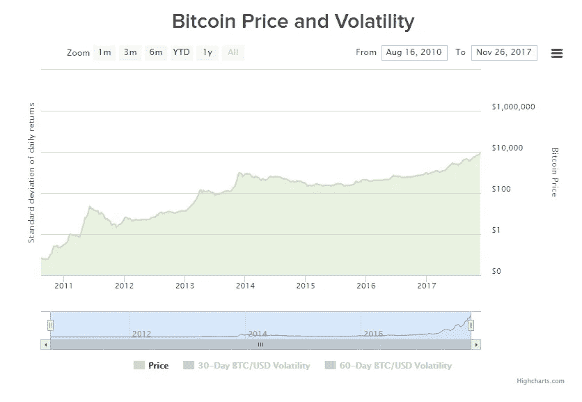
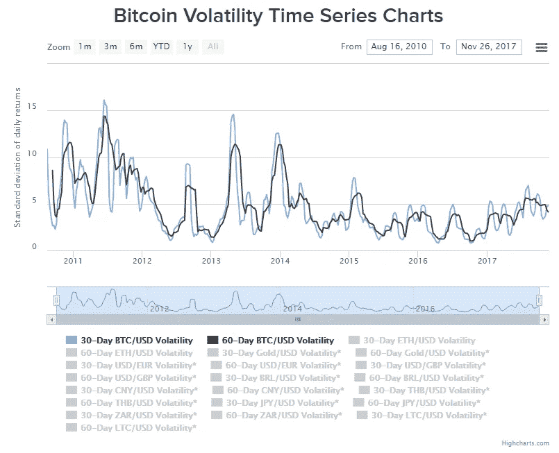

# 比特币 vs 美元

> 原文：<https://itnext.io/bitcoin-vs-the-us-dollar-fe8110e2f7cf?source=collection_archive---------0----------------------->

## 金钱的特征，比较——第 16 篇

2008 年，中本聪通过白皮书[和 2009 年的软件](https://bitcoin.org/bitcoin.pdf)首次阐述了比特币。一些人猜测他创造了比特币作为对部分储备银行( [Post 7](https://medium.com/mike-talks-about-bitcoin/the-other-way-dollars-are-made-ca1692db85d5) )的回应，但从未被明确指出。

图片来源:【https://bitcoin.org/bitcoin.pdf 

中本聪解决的关键问题是 [**双支出**](https://en.wikipedia.org/wiki/Double-spending) **，**不需要第三方。你不能**加倍花费**一个实体美元，因为你不能(轻易)复制它，但是有了数字资产，复制和拷贝就变得更容易了。这个问题可以通过使用第三方来验证交易来解决，比如银行或信用卡公司。比特币的目标是在不使用第三方的情况下，以数字方式复制现金交易。

中本聪使第三方不必要的区块链。( [Post 11](https://breathepublication.com/what-is-a-blockchain-bb3f27843129) )这使得货币可以数字化、点对点、分布式/去中心化( [Post 10](https://medium.com/mike-talks-about-bitcoin/the-network-bd8cbffe025) )，由此产生的货币被称为“比特币”。

*注:通常‘大写 B’比特币指的是协议或系统。小写 b”比特币是指货币单位。*

请随意重读我迄今为止关于金钱特征的文章。这篇文章的其余部分将概述比特币(BTC)作为货币的功能和特征，同时将其与美元(USD)进行比较。在这个时候，我不认为它是最好的货币形式，但它确实为当前法定货币的许多缺陷提供了解决方案。

# 货币的功能

## 价值储存——BTC

自从比特币诞生以来，没有比它更好的储存价值的地方了。只要硬币的主人没有恐慌抛售，这种说法就成立。它是否会在未来保持这一价值是猜测，但每一个预测都是如此。人们失去了比特币的价值，但随着时间的推移，比特币又重新获得了价值。你可以在下图中看到相对于美元的价格(*该图是对数的，不是线性的)。*

。图片来源:[https://www.buybitcoinworldwide.com/volatility-index/](https://www.buybitcoinworldwide.com/volatility-index/)

关于比特币的一个主要论点是，对于一种储存价值的货币来说，它太不稳定(价格波动)了(T2)。这是绝对正确的。使用波动性很大的货币的风险是，虽然它可能会升值，但你也有贬值的风险。尽管这有问题，但比特币正趋向于波动性更小的*，如下图所示。*

**

*图片来源:[https://www.buybitcoinworldwide.com/volatility-index/](https://www.buybitcoinworldwide.com/volatility-index/)*

*美元也在通货膨胀。这意味着随着时间的推移，美元会贬值，因为更多的美元进入流通(见[后 7](https://medium.com/mike-talks-about-bitcoin/the-other-way-dollars-are-made-ca1692db85d5) 和[后 8](https://medium.com/mike-talks-about-bitcoin/the-other-way-dollars-are-made-ca1692db85d5) )。比特币有一个递减的通货膨胀时间表，这意味着随着时间的推移，流通中的比特币会越来越少。这意味着(如果继续采用)1 BTC 在未来将更有价值。反对任何通缩货币的观点是，它会促进储蓄而非支出，这可能会阻碍经济增长。*

## *记算单位*

1.  ***可分性**—BTC——比特币是数字的，可以根据需要分成任意多的小数位数。目前 1 比特币可以分成 8 个小数位。最小的单位叫做一个聪，1 聪= 0.000，000，01 BTC。这优于目前的货币，因为创造小于一便士的单位将是一项昂贵的事业，并且对于通货膨胀的货币来说是不现实的。*
2.  ***可替代的** — TIE—可替代性是一种货币的可互换性。(5)1 美元的钞票和(1)5 美元的钞票价值相同。比特币也是如此。*
3.  ***统一**—BTC——同一个区块链上的所有比特币都是统一的，但是区块链却不一样。我将在以后的文章中详述。然而，在同一个区块链上，所有的比特币都是平等的。*

## *交易媒介*

1.  ***共同资产的估价** —美元—唾手可得。由于比特币价格的波动性，没有任何东西与比特币“挂钩”(除了其他加密货币)。*
2.  ***保存成本低** —TIE—比特币使用**大量**电力。这是[野兽的本性，也是一个正在酝酿的问题](https://digiconomist.net/bitcoin-energy-consumption) ( [更多信息在此](https://powercompare.co.uk/bitcoin/))。我不知道是否有可能量化为保护美元已经投入了多少资金。黄金将是这一类别中的理想赢家，因为除了保持其远离海底之外，不涉及任何维护。*
3.  ***可运输/可携带**——BTC——除了最终需要通过电脑转移资金之外，比特币具有高度的便携性。花费比特币所需的私钥可以是 12 个容易记住的单词。它们是数字或字母，所以只要你能拿到一系列数字或字母，你就能拿到比特币。如果是记忆的，USB 的，纸上的，纹身的，都是可以运输的。*
4.  ***可识别的****/可接受的** —美元—手到擒来。没有多少人会拒绝 100 美元的钞票。比特币网络正在增长，但远不及美元的数量。*
5.  ***可验证/防伪造**——有争议——除了猜测私钥，伪造比特币实际上是不可能的。参见([岗位 13](https://breathepublication.com/a-dance-with-infinity-980bd8e9a781) )。另一方面，美元有许多安全特征。*
6.  *耐久性——BTC——你如何摧毁一个数字？比特币像主人制造的钥匙一样耐用。如果密钥的唯一副本在一台电脑上，而你扔掉了这台电脑，比特币就会随着硬盘一起消失。如果采取了适当的预防措施，密钥和介质一样耐用。为了破坏网络，你需要清除所有运行该软件的计算机。这包括在太空运行的计算机[。有可能，但可能性不大。](https://www.coindesk.com/blockstream-using-satellites-beam-bitcoin-earth/)*

## ***通配符***

1.  ***监管**——有争议——比特币受编程监管，编程不能改变，除非所有用户(矿工)同意。如果用户不同意，则区块链会分裂并创建一个额外的区块链。这被称为“硬分叉”。美元是极其复杂的监管体系的产物，这既是一件好事，也是一件坏事。*
2.  *信任——有争议——我在之前的文章中已经阐述了信任的重要性，但是所有金钱的根本特征是信任。有理由相信美元，也有理由相信 BTC。*

*有许多因素会影响金钱的理想品质和特征。再加上深刻的哲学和政治货币政策，决定哪种货币更好是一个永恒的投机性辩论。在我看来，由于用户的集体信任度，美元目前是最好的货币，但比特币正在迅速赢得信任。*

> *这是 16 号岗位。其他的位于[这里](https://medium.com/me/stories/public)。*
> 
> *想通过电子邮件收到这些帖子(或每周/每月总结)吗？[在这里报名。](https://docs.google.com/forms/d/e/1FAIpQLScmlkLOC7bYt7WfLgBoW_bOvhTn8UIzj3TdHUQ0o7YghgzR7g/viewform?c=0&w=1)*

## ***来源:***

* [## 作为工具的金钱

### 货币的主要功能是作为交换媒介、记账单位和价值储存手段。描述功能…

courses.lumenlearning.com](https://courses.lumenlearning.com/boundless-business/chapter/money-as-a-tool/)  [## (4.60%)比特币波动指数-图表与美元及更多

### 比特币波动指数跟踪比特币相对于美元、欧元、英镑等其他货币的波动性。

www.buybitcoinworldwide.com](https://www.buybitcoinworldwide.com/volatility-index/)  [## 比特币能耗指数- Digiconomist

### 比特币目前估计的年耗电量* (TWh) 30.14 年化全球矿业收入 8，155，339 美元…

digiconomist.net](https://digiconomist.net/bitcoin-energy-consumption)*