# 被虫子咬了？= >说“拜拜！”用一个超级‘撬’！

> 原文：<https://itnext.io/bitten-by-a-bug-say-bye-bye-with-a-super-pry-765eb3d7ea4?source=collection_archive---------2----------------------->


想象一下，如果你可以:

1.  在不退出和重新启动的情况下，在你的代码中的任意位置添加任意数量的 binding.pry！
2.  从头到尾检查一遍你的代码，并且能够准确地遵循你所有方法的路径/流程？

给定以下示例代码:

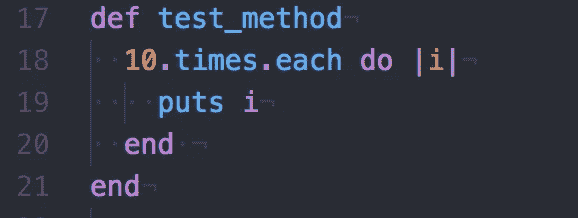

```
1:  def test_method
2:  10.times.each do |i|
3:   puts i 
4:  end 
```

3.如果 i == 5，能够给出一个条件窥探，例如只有**‘窥探’**。

# 有了……这一切都有可能实现。

“看！

在天上！

是一只鸟！

是一架飞机！

超级撬！"


# 让你的牧师用“撬拜虫”宝石获得超能力吧！

当我作为一名平头铁学校训练营的学生开始我的旅程时，我意识到我必须成为最好的朋友，这在我看来相当于看牙医，需要**【撬】**。在我准备这个项目的过程中，我被介绍给这个神奇的存在**【窥探】**，但它对我来说似乎很陌生，使用它似乎是如此的累赘……就像一个很长的拨号调制解调器，有点滞后。我大半辈子都在纽约长大，所以我习惯了一切都很快，A 型，你懂的。所以，当我开始使用**【pry】**的时候，它感觉就像是我编码的一个动力制动器。

不得不不断地停止编码，反复地到处放**【pry’s】**来查看我的代码是否工作，然后不得不退出并重新运行我的程序，这看起来是如此乏味。我对自己说，“一定有更好的方法来窥探。”我做了一些研究，果然，有人做了一个特殊的撬宝石，叫做“撬拜虫”，本质上是增压撬。先装吧。

要安装 gem:

添加:

```
gem ‘pry-byebug’
```

到您的 Gemfile 并运行:

```
'bundle install' or just 'bundle' (shortcut)
```

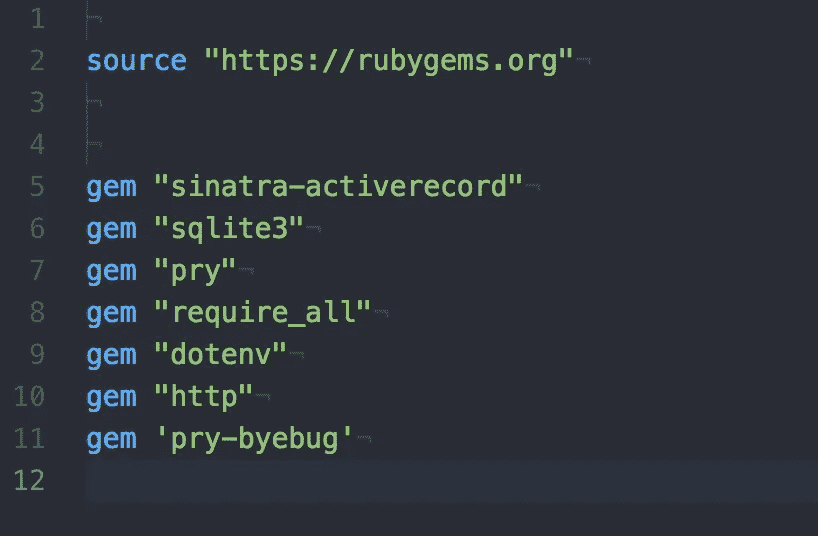

```
source "[https://rubygems.org](https://rubygems.org)"gem "sinatra-activerecord"
gem "sqlite3"
gem "pry"
gem "require_all"
gem "dotenv"
gem "http"
gem 'pry-byebug'
```

此外，您将需要使用原始的**‘撬’**方法，因此您需要保留所需的**‘撬’。**

要激活 pry-byebug 的超能力，你可以像平常一样使用 pry，它会在你的

```
binding.pry 
```

在使用 gem 之后，我发现将 binding.pry 放在我的“运行文件”中第一个方法/语句之前是最有效的。原因是这个 gem 允许我们逐字逐句或一个方法一个方法地检查我们的代码。因此，通过将 binding.pry 放在最开始，我们可以从头到尾检查我们的整个代码。我们将使用我们的一个 API 实验室作为一个很好的例子。

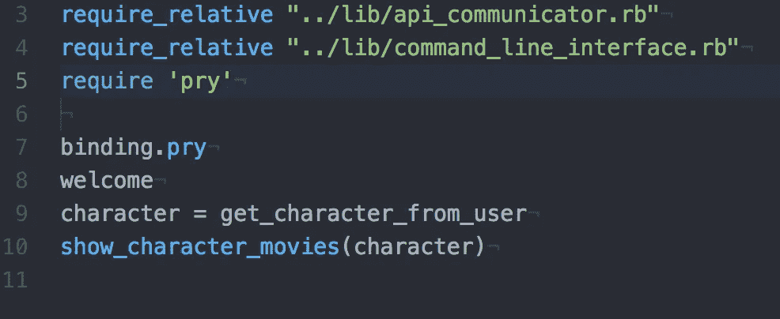

```
require_relative "../lib/api_communicator.rb"
require_relative "../lib/command_line_interface.rb"
require 'pry'binding.pry
welcome
character = get_character_from_user
show_character_movies(character)
```

这里是我的一些代码，这样你就可以有一些背景:

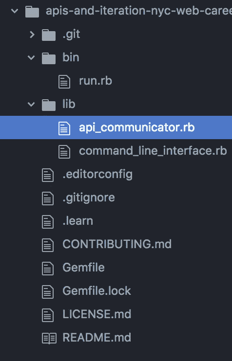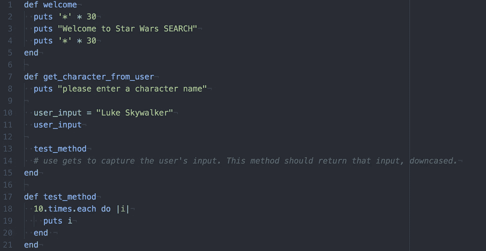

```
def welcome
 puts ‘*’ * 30
 puts “Welcome to Star Wars SEARCH”
 puts ‘*’ * 30
enddef get_character_from_user
 puts “please enter a character name”user_input = “Luke Skywalker”
user_inputtest_method
 # use gets to capture the user’s input. This method should return that input, downcased.
enddef test_method
 10.times.each do |i|
 puts i
 end 
end
```

通常在最后这张图片中，user_input 应该是 gets.chomp，但是为了看到我的程序运行，我在其中硬编码了一个可能的搜索词“Luke Skywalker ”,这样我就可以看到我的程序是如何运行的。* *另外，如果您注意到我放入了 test_method 方法，以便能够测试出我之前提到的条件窥探功能。

现在打开终端，让我们运行

```
ruby ./bin/run.rb
```

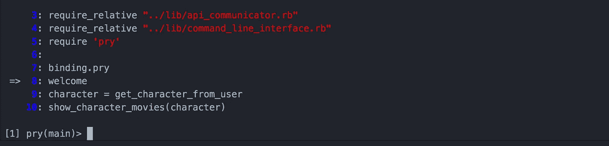

太好了！它停在了**‘撬’之后的第一个语句/方法上。**这里是 gem 自述文件中关于我们的命令选项的简单概述:(**我的注释后面跟有井号* *)

1.  中断:管理断点。#这基本上是有约束力的。稍后将详细介绍。
2.  单步执行:单步执行下一行或下一个方法。采用可选的数字参数进行多次单步执行。#这是为了如果你想进入本质，当在一个方法中执行时，每次你键入“step”就会进入该方法。
3.  下一步:跳到同一帧内的下一行。还采用可选的数字参数来单步执行多行。#将进入下一个方法。
4.  完成:执行直到当前堆栈帧返回。#完成当前方法/堆栈。
5.  继续:继续执行程序并结束窥探会话。#运行剩余的代码，就像你在普通的**‘撬’中键入‘退出’一样。**

步骤#1 目前无效，因为我们还没有任何断点。

如果你选择#2“步骤”,想从头到尾地跟踪你的代码流程，你只需要一直按“步骤”。或者做一次后，按向上箭头，然后循环进入。:)

如果您选择#3“下一步”,这将进入下一个方法。

我们将选择#3“下一步”

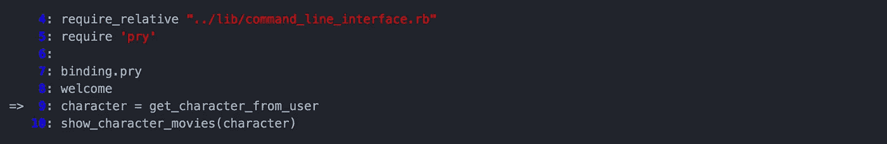

注意 welcome 方法是如何运行的，我们现在已经转移到下一个方法。让我们通过选择“步骤”来深入了解这一点。

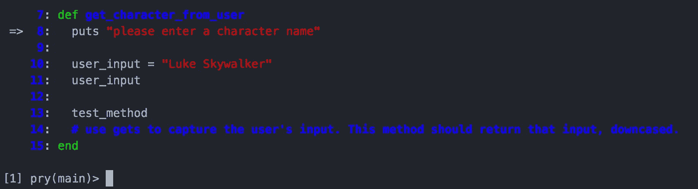

现在再次键入“step”以转到下一条语句

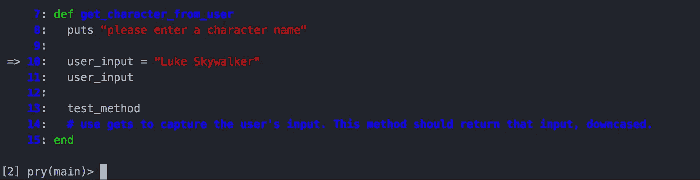

真正酷的是你可以在一个通常不会停止的地方，比如 11 号线。但是我们可以再“走”一次，我们可以测试，就好像我们停在一个撬杆上一样！

因此，让我们找点乐子，在第 18 行和第 19 行的 test_method 方法中尝试一个条件探测并设置另一个探测。

首先要设置 binding.pry 的等价物，在其他地方我们将使用“break”函数。

以下是来自 gem 帖子的官方自述:

# # # # # # # # # # # # # # # # # # # # # # # # # # # # # # # #
"您可以使用`break`命令直接从探测会话设置和调整断点:

break:从当前文件中的行号、文件和行号或方法设置新断点。传递可选表达式以创建条件断点。通过各种标志编辑现有断点。

示例:

```
break SomeClass#run            # Break at the start of `SomeClass#run`.
break Foo#bar if baz?          # Break at `Foo#bar` only if `baz?`.
break app/models/user.rb:15    # Break at line 15 in user.rb.
break 14                       # Break at line 14 in the current file.

break --condition 4 x > 2      # Change condition on breakpoint #4 to 'x > 2'.
break --condition 3            # Remove the condition on breakpoint #3.

break --delete 5               # Delete breakpoint #5.
break --disable-all            # Disable all breakpoints.

break                          # List all breakpoints.
break --show 2                 # Show details about breakpoint #2.
```

在一个窥探会话中键入`break --help`以查看所有可用选项。"

############################################


我将通过“break 18”使用 break 函数，这意味着在第 17 行和第 18 行之间创建一个断点或绑定。我们应该会收到确认信息。

让我们试试看。

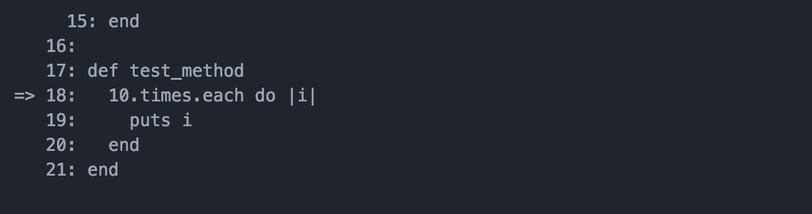

它应该告诉你现在有一个断点 1: /Users/…

现在让我们在第 19 行输入

```
break line 19 if i == 5
```

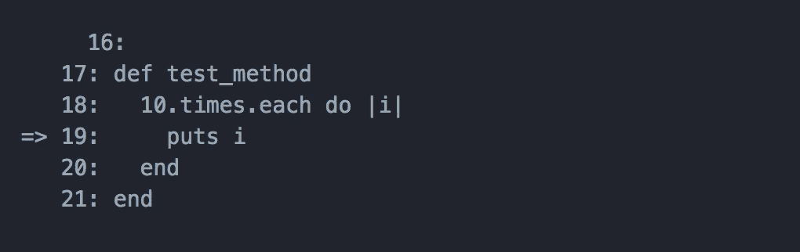

我们应该得到一个断点 2:确认创建的消息。

现在让我们键入“continue ”,作为提醒，

"继续:继续程序执行并结束窥探会话。#运行代码的其余部分，就像您在普通的**“窥探”中键入“退出”一样。”**

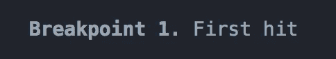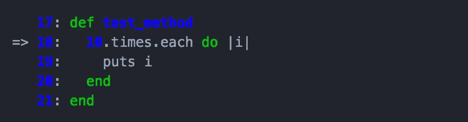

耶！我们在 18 楼撞到了我们神父。让我们通过再次“继续”来尝试继续看它是否停在 19。

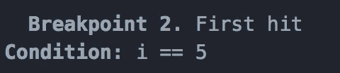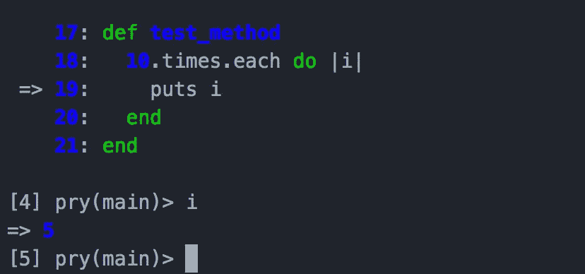

看啊！它停了！如果我们检查“I”是什么，它是 5！太好了！因此，正如你所看到的，pry-byebug gem 非常强大，对任何程序员来说都是一个很好的伙伴。

请随意使用这个伟大的工具。我在每张图片后添加了代码片段，这样你就可以自己尝试一下这个窥探 bug 了。

以下是 gem 帖子的官方网址:

https://github.com/deivid-rodriguez/pry-byebug

谢谢你的来访！

# 退出！