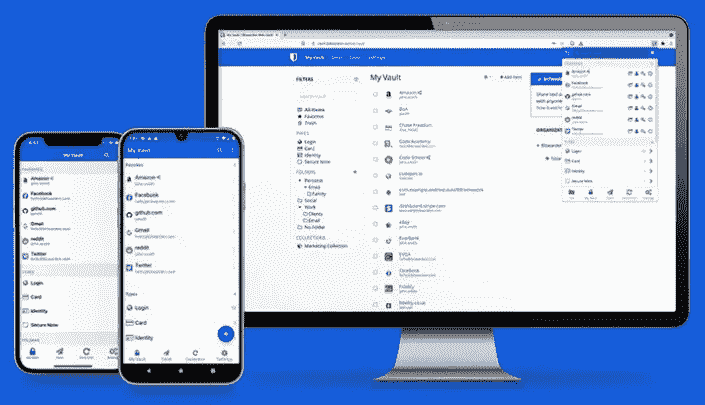
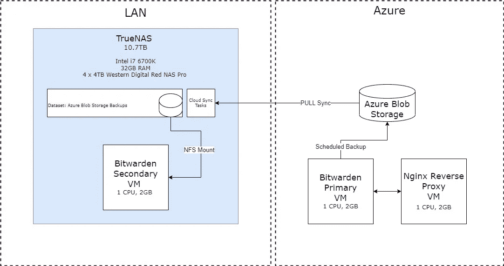

# Bitwarden 自托管- 12 个月后

> 原文：<https://itnext.io/bitwarden-self-hosting-12-months-later-b2c0e0d9d62d?source=collection_archive---------1----------------------->



在很长一段时间里，我使用 LastPass 作为我的密码管理器。它很容易使用，我不需要托管任何东西，因此我不必担心监控服务器、安排备份或设置 SSL 证书。然而，2021 年初 [LastPass 宣布](https://blog.lastpass.com/2021/02/changes-to-lastpass-free/)从 2021 年 3 月 16 日起，它将不再支持完全免费层。LastPass 的一个奇怪举动是，只有一种类型的设备可以免费使用，对于任何其他类型的设备，你都需要支付订阅费，每个用户每月大约 3 美元。无论如何，对我来说，通过设备类型来限制免费计划违背了设置密码管理器的目的。

我对此想了很多，并决定开始寻找替代方案。我不再想使用 SaaS 服务，那里的服务条款可以在短时间内改变，我想要一些开源的东西。由于像 LastPass 这样的平台不是开源的，使用这样的服务需要一定程度的信任，即他们网站上的声明确实是真实的——但最终，根本没有办法知道。

这篇文章不会详细介绍 Bitwarden 的所有功能，因为这些功能在 Bitwarden 网站上很容易找到。

# 比特监狱长

在做了我的研究后，我选定了 [Bitwarden 的](https://bitwarden.com/)自主托管选项，它完全没有许可费。该软件是开源的，对我来说是一个重要的选择，可以安装在一个相对较小的 VPS 上。稍后将详细介绍。还有一个基于 Rust 的 Bitwarden 版本，可以在[这里](https://github.com/dani-garcia/vaultwarden)找到。我选择不走这条路，因为它不是一个官方的 Bitwarden 项目。

官方的 Bitwarden 提供了一个个人选项，每月多花几欧元，你就可以启用一些企业功能，允许一个组织内的用户之间共享密码或秘密。这个额外的选择性加入还允许您上传文件附件，但是，这在个人版中是功能锁定的。我选择放弃这些功能，因为我从未在 LastPass 上使用过它们，也不需要在 Bitwarden 上使用它们，但是，您的用例可能会不同。

## 选择 VPS

最初，我在具有 2GB 内存和 1 个 VCPU 的 DigitalOcean droplet 上运行 Bitwarden，但是，我最近将我的所有工作负载迁移到了 Microsoft Azure。我现在在 Azure 的 1 VCPU、2GB B 系列虚拟机上运行 Bitwarden。b 系列虚拟机是 Azure 的可爆发系列虚拟机。当 CPU 利用率低于某个阈值时，这些虚拟机会累积 CPU 信用。然后，当 CPU 因执行某项任务(备份、升级等)所需的 CPU 峰值超过阈值时，这些配额就会被消耗掉。

当您的应用程序长时间空闲时，b 系列虚拟机是一个不错的选择，例如 Bitwarden，这样可以节省资金。此外，我选择了 3 年保留价格，这大大降低了每月成本。

***更新*** *:我遇到了一个问题，虚拟机随机停止响应——可能是由于 SQL Server 内存不足。我仍在排除故障，但现在，每夜重启似乎做的工作*

## 装置

Bitwarden 要求在服务器上安装 docker 和 docker-compose，以便部署其容器。安装相当容易，并且[有很好的文档记录](https://bitwarden.com/help/install-on-premise-linux/)。一个简单的 shell 脚本启动安装程序并下载一组 docker 容器，其中一个是 SQL Server。由于它的内存需求，我不是这个数据库的最大粉丝，但是，这不是一个大问题，它工作得很好。

在安装过程中，请确保在自签名证书生成或 LetsEncrypt 证书 SSL 加密之间进行选择。当然，这取决于您如何运行 Bitwarden，在我的例子中，我在 Nginx 反向代理后面运行 Bitwarden 服务器，所以我选择由安装程序生成自签名 SSL 证书。如果您希望让 Bitwarden 在您自己的域上直接暴露于互联网，您也可以选择使用直接内置于 Bitwarden 核心的 LetsEncrypt 特性。这省去了很多额外的努力。

## 系统管理

Bitwarden 将其所有数据文件存储在一个名为 *bwdata 的文件夹中。日志、证书、SQL 数据库、配置文件等都可以在这个文件夹中找到。这使得系统管理变得非常简单，因为人们可以简单地备份该文件夹，以确保备份整个安装。*

# 保护 Bitwarden

我有很多方法来保护我的 Bitwarden 安装。我建议 Bitwarden 的任何新用户都这样做:

*   在反向代理后面运行 Bitwarden，该代理只接受来自反向代理服务器的流量，从不直接接受来自 internet 的流量。在 Azure 中，这可以通过网络策略轻松实现。
*   登录 Bitwarden 时启用双因素身份验证。
*   在 Bitwarden 设置中禁用新帐户创建。你不希望随机的人在你的服务器上创建帐户，所以把它关掉。
*   只有在面向互联网的安装中，才考虑限制对家庭路由器 IP 的访问。由于 Bitwarden 的移动应用程序和浏览器插件会缓存你的所有密码，所以当你外出时，很少需要访问实际的实时服务器。限制对您家庭 IP 的访问意味着 Bitwarden 只能在您连接到家庭网络时进行同步。如果您准备好迎接挑战，这需要一点额外的脚本，但是要确保除了您之外没有人可以访问您的安装。

# 备份本地实例

为了确保我永远不会远离我的密码，我在家里的 TrueNAS 服务器上的虚拟机上运行了我的主 Bitwarden 安装的第二个实例。我在这里写了一篇关于这个设置的帖子[。](/3-2-1-backups-f62305159bdb)



Bitwarden 辅助实例架构

在此设置中，计划作业每晚运行 Bitwarden 服务器的备份，并将备份文件上传到 Azure Blob 存储，保留期为 7 天。从这里，TrueNAS 上的每周云同步作业将备份文件同步到我的家庭服务器。由于我不经常更新或添加 Bitwarden 的密码，每周一次的工作有助于减少 Azure Blob 存储上的一点支出，这是数据传输的账单。

在我的家庭服务器上的虚拟机上手动设置了 Bitwarden 的辅助实例。通过从 TrueNAS 进行 NFS 装载，虚拟机可以访问备份。我编写了一个自定义脚本，通过用主服务器上的文件夹覆盖 *bwdata* 文件夹，来停止正在运行的 Bitwarden 实例，并将备份应用到我的本地服务器上。一旦文件夹被覆盖，我将在以下文件中更新服务器主机名:

```
bwdata/config.yml
bwdata/env/global.override.env
bwdata/web/assetlinks.json
```

最后，Bitwarden 再次启动。在我的辅助服务器上，我还使用了一个反向代理，所以我再次简单地使用自签名证书。

# 最后的想法

Bitwarden 满足了我对密码管理平台的需求，可以在我的所有设备上同步。作为一个开源项目，它给了我一种安慰，许多人正在研究并致力于使 Bitwarden 足够安全，以存储您最有价值的秘密。一年过去了，我和 Bitwarden 没有什么大问题，并强烈推荐它。

*注意:这篇文章不是由 Bitwarden* 赞助的