# 用 Kotlin 和 Arrow 库实现极快的斐波那契运算

> 原文：<https://itnext.io/blazing-fast-fibonacci-with-kotlin-and-arrow-library-33c1d7eca0bb?source=collection_archive---------3----------------------->


# TLDR；

在本文中，我将向您展示如何通过利用 Kotlin 的[箭头](https://arrow-kt.io/)函数库和‘平方取幂算法’以极快的速度计算斐波那契数。

这种方法很大程度上受到了 All article 的这个 [Haskell 的启发。你可以在这里](http://www.haskellforall.com/2020/04/blazing-fast-fibonacci-numbers-using.html)找到代码[。](https://github.com/cesartl/arrow-fibonacci)

# **斐波那契数列**

如果你是一名程序员，你可能不止一次遇到过斐波那契数列，但这里还是有一个快速的提醒。

该序列定义如下:

```
F(0) = 0
F(1) = 1
F(n) = F(n-1) + F(n-2), n > 1
```

## 双重递归实现

实现这个序列的最简单的方法是使用双重递归函数。例如，在科特林:

这是一种简单的方法，但效率极低；时间复杂度为`O(2^n)`。

这可以通过记忆前两个值来提高到`O(n)`。让我们看看我们是否能做得更好。

## 封闭式的

原来有一个数学公式可以计算任何斐波纳契数在`O(1)`时间和记忆的复杂性:

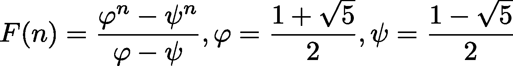

> (你可以在这里看到为什么斐波那契数和黄金分割率𝝋:之间存在联系。如果你将 *f(n+1)/f(n)* 除以，它收敛于𝝋.)

尽管这在理论上确实很快，但由于浮点精度运算，它在实践中并不起作用。

## 矩阵形式

> 不要被那些看起来很花哨的数学所迷惑，当我们找到代码时，它会变得简单得多。

你也可以用矩阵来表达递归序列，比如斐波那契数列。

例如:

```
f(n) = a.f(n-1) + b.f(n-2)
```

你可以写:

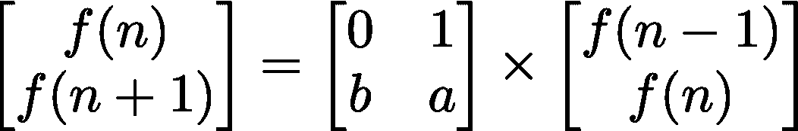

条件:

```
f(0) = ⍺
f(1) = β
```

变成:

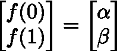

所以最终你会得到:

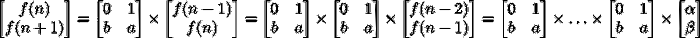

或者:


> *注意，这适用于任何线性递归序列，其中 f(n)依赖于 f(n-1)，f(n-2)，…，f(n-m)。然后你得到一个矩阵。*

所以我们的斐波那契表达式变成了:

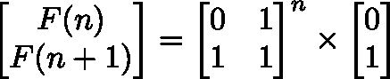

如果你没有完全理解这些矩阵运算，也不要担心，它实际上很容易转化为代码。

# 平方取幂

上面公式的美妙之处在于，所有的工作都是通过矩阵乘法来完成的。如果你有一个形式为 *x⊗ y* 的二进制运算，并且你想计算 *x⊗ x⊗…⊗ x，n* 次，你可以使用[乘方求幂](https://en.wikipedia.org/wiki/Exponentiation_by_squaring):

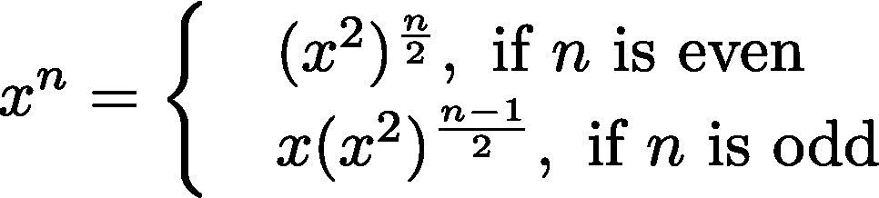

直观地说，您可以递归地定义操作`pow(x,n)`:

```
pow(x,n) = 
   if(n == 0)      empty()
   else if(n even) pow(x*⊗*x, n/2)
   else            x*⊗*pow(x*⊗*x, (n-1)/2)
```

这里我们还需要一个中性元素叫做`empty()`。对于自然数，这只是`1`。

该算法不断将`n`除以 *2* ，因此时间复杂度为`O(log₂(n)).`

# 输入箭头

平方取幂不仅适用于整数乘法，还适用于任何具有二进制运算和该运算的中性值(自然数为 1)的类型。所以在 Java 世界里，我们可以有这样一个接口:

在函数世界里，有一种东西叫做[类型类](https://en.wikipedia.org/wiki/Type_class)。有一组标准类型类和[它们随 Arrow](https://arrow-kt.io/docs/0.10/typeclasses/intro/) 一起提供，这是 Kotlin 的函数库。

## 半群

为类型定义二元运算的类型类称为[半群](https://arrow-kt.io/docs/0.10/arrow/typeclasses/semigroup/)。在科特林，它看起来像这样:

Kotlin 中的半群类型类

关于 Kotlin 实现有趣的一点是，它使用了 Kotlin 中的[扩展函数。在 Java 世界中，如果我们有一个`Foo`类，它将会像这样扩展一个`Semigroup`接口:](https://kotlinlang.org/docs/reference/extensions.html)

在 Kotlin 中，我们不会让`Foo`扩展一个接口，我们会创建一个名为`FooSemigroup,`的新的单例类，它为`Foo`提供一个扩展函数:

因此，如果我们有两个 foo 实例:

```
val foo1 = Foo()
val foo2 = Foo()val foo3 = foo1.combine(foo2)    //this does not compileval foo3 = FooSemigroup().run {
   foo1.combine(foo2)            //this compiles
}
```

您可以看到，我们必须在`FooSemigroup`的上下文中运行代码，让`Foo`类拥有`combine`方法。

接下来，我们需要 type 类返回一个“空”值的能力，该值是`combine`方法的标识。幸运的是，已经有了一个类型类。

## 幺半群

幺半群扩展了`Semigroup`并增加了一个`empty`元素:

## 科特林中的平方幂运算

现在，我们可以通过对任何幺半群求平方来实现幂运算，因为我们只需要`empty`和`combine`。这里我使用非递归实现，因为它比“安全”(即尾递归)递归实现更容易理解:

# 快速斐波那契

我们即将实现我们的快速斐波那契算法。但是首先我们需要实现一个`Matrix22`类:

这只是一个包含 4 个字段的类，每个字段对应一个 2 x2 矩阵的元素:

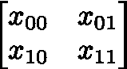

然后我们需要为`Matrix`实现一个幺半群。为此，我们需要知道如何将两个 2x2 矩阵相乘。如果你不熟悉这种类型的数学不要担心，这只是一个你可以在网上不同地方找到的公式(像[这里](https://www.mathsisfun.com/algebra/matrix-multiplying.html))。

结尾的最后一点只是一个 Kotlin 技巧，所以我们可以很容易地访问这个幺半群类。

然后，我们最终可以使用我之前提到的公式实现斐波那契:


为了得到`F(n)`,我们只需要用乘幂乘平方将斐波那契矩阵乘以 n 次。比方说

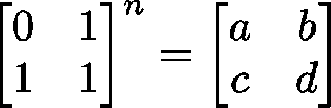

然后我们有:

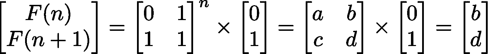

简而言之，`F(n) = b`其中`b`是乘方幂运算结果的`x01`元素:

## 结果

我做了一个快速基准测试:第一列是`n`，第二列是以毫秒为单位计算`F(n)`所用的时间，最后一列是存储结果所用的位数:

```
n,       time, bits
100000,  53,   69424
200000,  39,   138848
400000,  118,  277696
800000,  263,  555393
1600000, 516,  1110786
```

您可以看到，该算法计算非常大的 n 数，并且计算斐波那契数比在控制台中打印它花费的时间要少！

# 复杂性

现在我们可以看看时间复杂度。

## “线性”实施

在文章的开头，我提到过只要记住最后两个值，就可以为 Fibonacci 写一个线性实现。可以这样做:

我说这是“线性”的，因为循环有`n`个步骤，然而，我们需要看看每个步骤做了多少工作。这里的工作是通过加法和减法完成的，对于`BigInteger`，具有线性复杂度。因此，“线性”实现的最终复杂度是`O(n²)`。这与我为这个实现做的快速基准测试是一致的:当我加倍`n`时，总时间乘以`3.9`

## “对数”实现

平方取幂将执行`log₂(n)`步骤，所以我们可以称之为*对数*实现。然而，和前面的例子一样，我们需要看看每一步实际完成了多少工作。

每一步都包括一系列的乘法和加法。加法具有线性时间复杂度，然而乘法，取决于它是如何实现的，可以高达`O(n²)`。我从 Heinz Kabutz 那里找到了这篇文章，声称在 Java 8 之前乘法是在 T1 中完成的，但是现在乘法是通过 T2 和 T3 中两种更快的算法实现的。

为了便于讨论，我们假设乘法运算在`O(n^k)`中进行了一段时间`1.4 < k < 1.6`。我们可以假设在平方乘幂算法的每一步，数字的大小都翻倍。这意味着在`i-th` 步骤，所需的工作量是`(2^i)^k`。形式上，所有`log(n)`步骤的总工作量是:

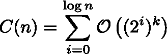

在上面的求和中，我们只关心最占优势的项(最后一项)，所以我们有:

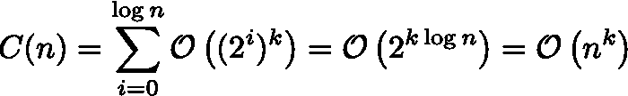

我做了同样的快速基准测试，我在每一轮都将`n`翻倍，我测量平均起来，总时间乘以 *2.79* (x2 是`O(n)`，x4 是`O(n²)`)。这对应的是`k=1.48`，和亨氏的文章一致。

下面是我做的一个比较“线性”(实际上是`O(n²)`)和“对数”(实际上是~ `O(n^1.48)`)的快速基准:

```
n,linear(ms),logarithmic(ms)
40000,40,1
80000,146,2
160000,565,7
320000,2325,20
640000,8811,69
```

# 平方取幂——其他应用

当你需要多次调用一个二元函数时，你可以通过平方来重用取幂。

我很好奇`BigInteger`是如何实现它的`pow`方法的，但是看到它使用平方取幂，我并不感到惊讶。不信我查查出处；)

我第一次不得不使用平方取幂，是为了代码 2019 第 22 天的[到来。如果你不知道 AOC，我强烈鼓励你尽可能多地做拼图，它教会了我很多有趣的算法和其他编程技巧。关于 2019 年第 22 天的警告，这对我来说是写作时所有 250 个谜题中最具挑战性的谜题。这是因为我对](https://adventofcode.com/2019/day/22)[模运算](https://en.wikipedia.org/wiki/Modular_arithmetic)不太了解，但现在我知道基本知识了，所以我强烈建议你试一试:)

如果你遇到了平方取幂的有趣用例，请在评论中告诉我:)

我希望你喜欢这篇文章。你可以在这里找到代码。如果你喜欢这个，考虑在推特上关注我

[](https://twitter.com/@cesarTronLozai) [## 塞萨尔·特龙-洛扎伊

### 塞萨尔·特隆-洛扎伊的最新推文(@塞萨尔·特隆洛扎伊)。人类居住在地球上，对科学、物理充满好奇…

twitter.com](https://twitter.com/@cesarTronLozai)