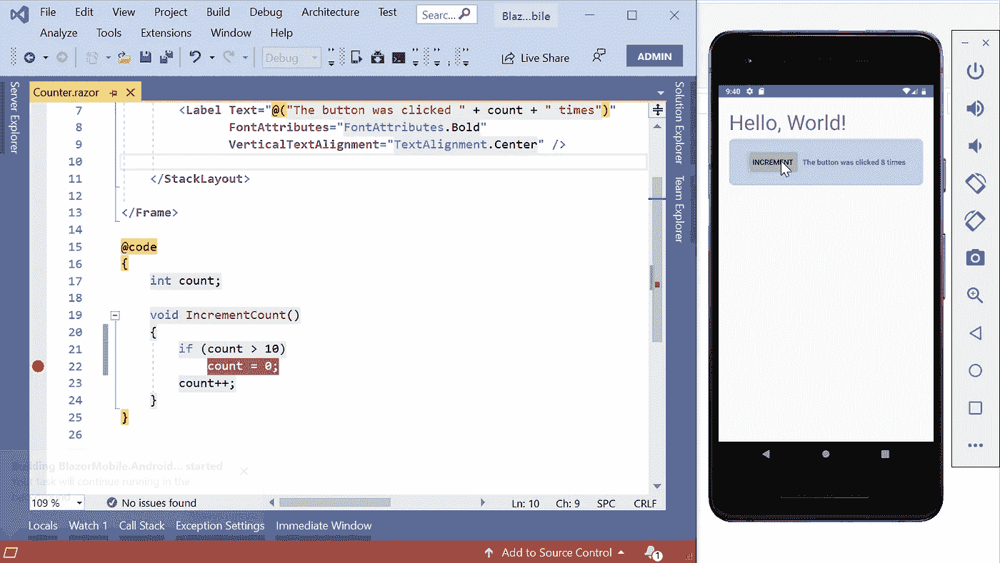
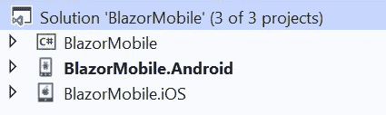
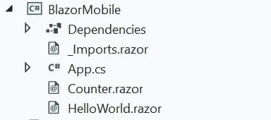
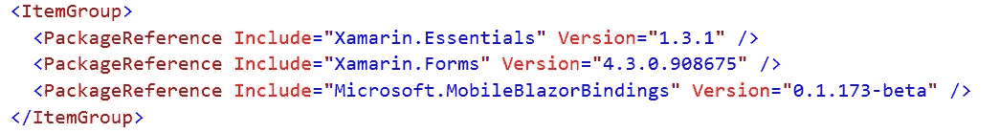
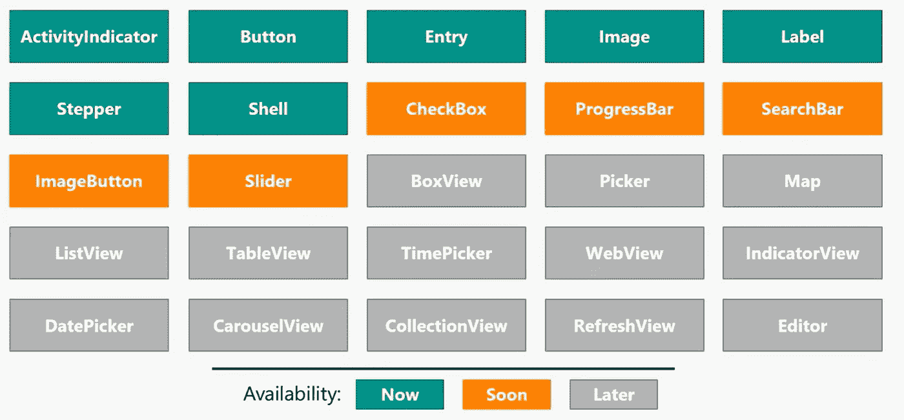
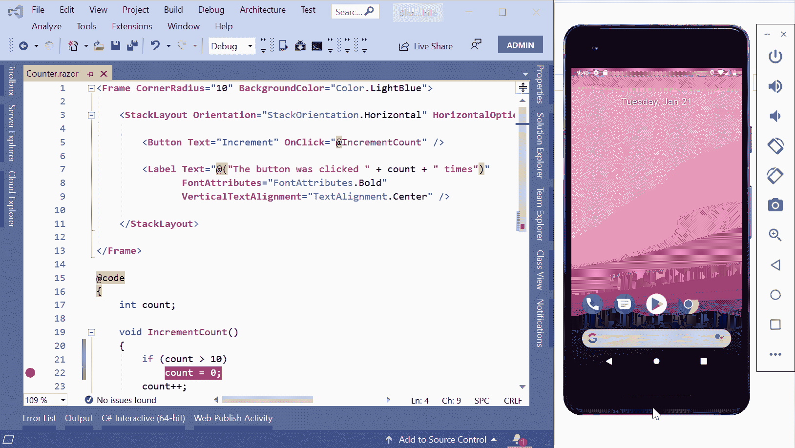
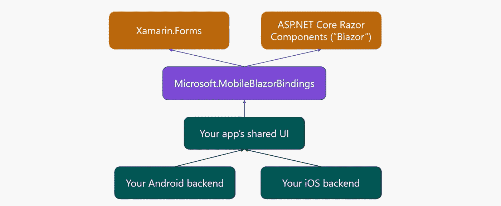

# Blazor 和原生移动应用

> 原文：<https://itnext.io/blazor-and-native-mobile-apps-9177c5a6488b?source=collection_archive---------2----------------------->

## 实验性移动 Blazor 绑定



[开。NET Conf 2020](https://devblogs.microsoft.com/aspnet/mobile-blazor-bindings-experiment/) ，微软宣布了一个名为 Mobile Blazor Bindings 的实验项目，让**开发者用** [**Blazor**](https://docs.microsoft.com/en-us/aspnet/core/blazor/?view=aspnetcore-3.1) **和** [**Xamarin**](https://dotnet.microsoft.com/apps/xamarin) 创建原生移动应用。

## 什么是 MobileBlazorBinding，什么不是？

Blazor 是一个用于构建交互式客户端 web UI 的框架。NET 和， **Xamarin** 是一个应用平台，用于构建 Android 和 iOS 应用。NET 和 C#。

你可能会想，有了 Razor、HTML 和 C#你就能构建原生的移动应用，**但事实是:不，你不能。**

Mobile Blazor 绑定是用 [Razor](https://docs.microsoft.com/en-us/aspnet/web-pages/overview/getting-started/introducing-razor-syntax-c) 而不是 [XAM](https://docs.microsoft.com/en-us/dotnet/desktop-wpf/fundamentals/xaml) L 语法创建 [Xamarin 表单](https://dotnet.microsoft.com/apps/xamarin/xamarin-forms) UI 的另一种方式。他们为具有 web 开发背景的开发人员和不熟悉 XAML 的人创建了这个实验项目。

这是否意味着你可以与 Blazor 和 Xamarin 共享-UI？**不！**

当你用 BlazorMobileBindings 创建一个应用程序时，你实际上是在你的 UI 中使用了非 HTML 的原生 UI 组件！

以下是 Blazor 移动绑定的一个简单示例:

这个例子是关于 Blazor Web 组件的:

如果你只是比较这两个源代码，它们在某种程度上是相同的。唯一的区别是一个是使用 HTML，另一个是使用 Xamarin UI 组件。

## 如何在 MobileBlazorBindings 中使用设备传感器？

说到传感器，开发人员可能会说在不同的平台上使用传感器是不同的。例如，在 Android 中访问加速度计或地理位置的方式在 iOS 中完全不同。

Xamarin 是一个成熟的平台，它提供了许多库和工具来构建真正的原生跨平台应用程序。其中一个库叫做 [**Xamarin。**](https://docs.microsoft.com/en-us/xamarin/essentials/) **要领。**它为开发者的移动应用提供跨平台的 API。您可以使用独立于平台(Android、iOS、Windows)的 API 来处理加速度计、电池状态等。

**Xamarin。Essentials** 可以通过 [NuGet](https://www.nuget.org/packages/Xamarin.Essentials) 安装。在您的移动应用程序中使用 it 非常简单，如下所示:

## 项目结构

当您创建一个新的 MobileBlazorBindings 项目时，解决方案结构如下所示:



大部分时间你不需要去改变 **Android** 或 **iOS** 中的任何东西；这些是您可能的应用程序的本机部分。整个魔术发生在共享 UI Blazor 类型的项目中。



这和你已经知道的 Blazor 项目是一样的；唯一的区别是 Xamarin 形式。在 **csproj** 文件中，已经包含了 **Xamarin。表单**和**微软。MobileBlazorBindings** 套餐。



项目 csproj 文件的一部分

## 成分

目前，这些内置组件可用于 MobileBlazorBindings:

**页面组件:** ContentPage，MasterDetailPage，Page，TabbedPage，TemplatedPage

**布局组件:** ContentView，Frame，Grid，ScrollView，StackLayout，

**视图组件:**按钮，活动指示器，图像，条目，标签，步进器，开关

**专门化组件:** Application、BaseMenuItem、FormattedString、GestureElement、MenuItem、Shell(包括 ShellContent、ShellGroupItem、ShellItem、FlyoutItem、TabBar、ShellSection、Tab)、Span

将会有更多的组件，这是一个控制图表:



除了组件之外，您还可以创建自己的视图和组件，就像您在 Blazor 中所做的那样:

这是一个名为 **Battery.razor** 的剃须刀文件:

您可以像这样轻松地使用视图中的组件:

```
<ContentPage>
    <StackLayout Margin="new Thickness(20)">
        <Battery />
    </StackLayout>
</ContentPage>
```

## 依赖注入

Blazor 是 ASP.Net 核心的一部分，它提供了内置的依赖注入。就像任何其他 ASP.Net 核心项目一样，您可以在 **ConfigureServices** 方法中定义您的服务。该方法位于 **App.cs** 文件中。

```
public App()
{
 var host = Host.CreateDefaultBuilder()
  .ConfigureServices((hostContext, services) =>
  {
   // Register app-specific services
   //services.AddSingleton<AppState>();
  })
  .Build();host.AddComponent<HelloWorld>(parent: this);
}
```

## **调试**

您可以在 Android 设备/模拟器或 iOS 模拟器中运行您的应用程序，并在 Visual Studio 或 Visual Studio for Mac 中调试它。



实际运行和调试

## 体系结构



Eilon Lipton 的 Mobile Blazor 绑定库架构

MobileBlazorBindings 这只是一个与 **Xamarin 之间的绑定。表单** API 和 **Blazor。**你用 Xamarin Forms 组件在 Blazor 中创建你的共享 UI，结果就是一个跨平台的原生应用。

## 结论

微软移动 Blazor Bindings 刚刚宣布，它仍然是一个实验项目。尚不清楚它是否会得到官方支持和发布，但它有很大的潜力在短短几分钟内创建具有 Blazor 和 Xamarin 表单的 UI 移动应用程序。我可以在 2 分钟内轻松创建和运行一些项目(没有任何 Xamarin 表单的经验)！

底线是像热重装，更多的原生组件，WinUI，UWP，内联文本等功能目前还不被支持。然而，微软(也许还有社区)的人们正在努力尽快实现这些功能。

## 先决条件、文档、链接等

您可以在 docs.microsoft.com 上访问指南和文档[。如果你愿意为这个项目做贡献(比如错误报告、想法、代码贡献等等)。)查看](https://docs.microsoft.com/en-us/mobile-blazor-bindings/get-started) [Xamarin Github](https://github.com/xamarin/MobileBlazorBindings) 上的回购项目。

要使用 Mobile Blazor 绑定进行黑客攻击，您需要以下软件:

1.  [。NET Core 3.0 或 3.1 SDK](https://dotnet.microsoft.com/download)
2.  安装了以下工作负载的 Visual Studio 或 Visual Studio for Mac:

*   移动开发。NET (Xamarin。表单)
*   ASP。NET 和 web 开发