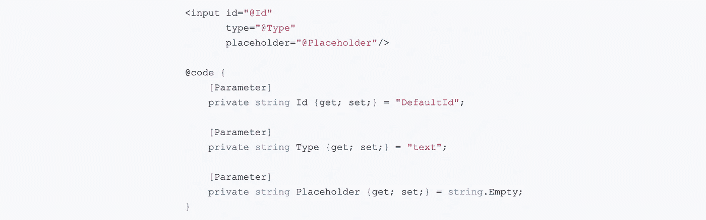

# Blazor 组件属性

> 原文：<https://itnext.io/blazor-component-attributes-b70e65fada52?source=collection_archive---------6----------------------->

> 这篇文章将介绍一些新的方法，比如 ASP.NET 核心预览版 7，让处理有很多属性的组件变得更容易。我们将要使用的例子是一个输入控件，因为它们提供了许多内置属性。



## 初始组件

下面是一个名为 **InputComponent** 的基本组件。它包含一个具有 ID、类型和占位符文本属性的 HTLM input 元素。

```
<input id="@Id"
       type="@Type"
       placeholder="@Placeholder"/>

@code {
    [Parameter]
    private string Id {get; set;} = "DefaultId";

    [Parameter]
    private string Type {get; set;} = "text";

    [Parameter]
    private string Placeholder {get; set;} = string.Empty;
}
```

下面是使用上述组件显示电子邮件输入元素的示例。

```
<InputComponent Id="InputTest" Placeholder="Email Address" Type="email" />
```

## 输入属性字典

下面的代码是同一个组件，它被转换为从字典中提取属性。

```
<input @attributes="InputAttributes" />

@code {
    [Parameter(CaptureUnmatchedValues = true)]
    private Dictionary<string, object> InputAttributes { get; set; } =
        new Dictionary<string, object>() 
            {
               { "id", "DefaultId" },
               { "type", "text" },
               { "placeholder", "" }
            };
}
```

两者的结果是相同的，但是在这个版本中，您不必预定义您可能期望的所有属性，它仍然允许您通过用您想要使用的默认值预填充字典来提供默认值。

如果没有**[Parameter(CaptureUnmatchedValues = true)]**看起来您仍然需要组件上的参数来匹配传入的属性值，所以我不确定在不捕获不匹配值的情况下使用字典有多大用处，除了让您不必在 HTML 元素中指定每个值。我希望不需要定义参数，它根据字典中的值捕获。

## 包扎

这个功能是一个很好的补充，可以节省你一些击键。查看[官方文件](https://docs.microsoft.com/en-us/aspnet/core/blazor/components?view=aspnetcore-3.0#attribute-splatting-and-arbitrary-parameters)了解全部细节。

*原载于* [*埃里克·安德森*](https://elanderson.net/2019/09/blazor-component-attributes/) *。*