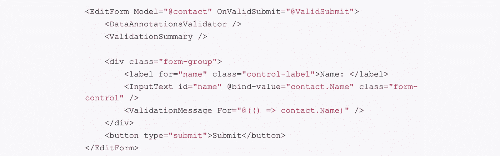

# Blazor 表单和验证

> 原文：<https://itnext.io/blazor-forms-and-validation-418173350435?source=collection_archive---------4----------------------->



本周我将探索在服务器端 Blazor 中使用表单和验证的基础知识。这是一个 Blazor 团队仍然在做很多改变的领域，所以如果这篇文章中的一些东西需要调整，不要感到惊讶。如果你需要帮助创建 Blazor 应用程序，请查看我的[ASP.NET 核心服务器端带认证的 Blazor](https://elanderson.net/2019/08/asp-net-core-server-side-blazor-with-authentication/)帖子，这是我用来写这篇帖子的应用程序。

## 模型

对于这个例子，我将创建一个用于编辑联系人的表单。Blazor 将利用数据注释，并自动确保条件有效。下面是我作为模型使用的类，其中加入了一些数据注释。项目结构方面，我添加了一个模型目录，并在那里添加了我的模型类。

```
public class Contact
{
    public int Id { get; set; }
    [Required]
    public string Name { get; set; }
    public string Address { get; set; }
    public string City { get; set; }
    public string State { get; set; }
    [StringLength(5, 
                  MinimumLength = 5, 
                  ErrorMessage = "Postal Code must be 5 characters")]
    public string PostalCode { get; set; }
    public string Phone { get; set; }
    [Required]
    [EmailAddress]
    public string Email { get; set; }
}
```

正如您在课程中看到的,**姓名**和**电子邮件**都是必填字段。**电子邮件**也需要是有效的电子邮件地址。 **PostalCode** 不是必填项，但如果输入必须是 5 个字符。如果输入了邮政编码，但不是 5 个字符，则指定的错误消息将显示在 UI 中。

## 成分

接下来，我添加了一个新的 **ContactEdit** 组件。有关如何添加新组件的详细信息，请查看 Blazor 中的 [Razor Components，它将指导您使用 Visual Studio 添加新组件。它还将显示您必须将组件添加到现有页面。](https://elanderson.net/2019/08/razor-components-in-blazor/)

以下是完整的组件。大部分组件是普通的 HTML 表单元素。在代码之后，我将指出几件事情。

```
@using Models
@using System.Diagnostics

<h3>Contact Edit</h3>

<div class="row">
    <div class="col-md-4">
        <EditForm Model="@contact" OnValidSubmit="@ValidSubmit">
            <DataAnnotationsValidator />
            <ValidationSummary />

            <div class="form-group">
                <label for="name" class="control-label">Name: </label>
                <InputText id="name" @bind-value="contact.Name" class="form-control" />
                <ValidationMessage For="@(() => contact.Name)" />
            </div>
            <div class="form-group">
                <label for="address" class="control-label">Address: </label>
                <InputText id="address" @bind-value="contact.Address" class="form-control" />
                <ValidationMessage For="@(() => contact.Address)" />
            </div>
            <div class="form-group">
                <label for="city" class="control-label">City: </label>
                <InputText id="city" @bind-value="contact.City" class="form-control" />
                <ValidationMessage For="@(() => contact.City)" />
            </div>
            <div class="form-group">
                <label for="state" class="control-label">State: </label>
                <InputText id="state" @bind-value="contact.State" class="form-control" />
                <ValidationMessage For="@(() => contact.State)" />
            </div>
            <div class="form-group">
                <label for="postalCode" class="control-label">Postal Code: </label>
                <InputText id="postalCode" @bind-value="contact.PostalCode" class="form-control" />
                <ValidationMessage For="@(() => contact.PostalCode)" />
            </div>
            <div class="form-group">
                <label for="phone" class="control-label">Phone: </label>
                <InputText id="phone" @bind-value="contact.Phone" class="form-control" />
                <ValidationMessage For="@(() => contact.Phone)" />
            </div>
            <div class="form-group">
                <label for="email" class="control-label">Email: </label>
                <InputText id="email" @bind-value="contact.Email" class="form-control" />
                <ValidationMessage For="@(() => contact.Email)" />
            </div>
            <button type="submit">Submit</button>
        </EditForm>
    </div>
</div>

@code {
    private Contact contact = new Contact
    {
        Id = 1,
        Name = "Eric",
        Address = "578 Main St.",
        City = "Nashville",
        State = "TN",
        Phone = "615-555-5555",
        Email = "ericeric.com"
    };

    private void ValidSubmit()
    {
        Debug.WriteLine("ValidSubmit");
    }
}
```

下面是上面代码的一个小节，它不同于标准的 HTML 表单。

```
<EditForm Model="@contact" OnValidSubmit="@ValidSubmit">
    <DataAnnotationsValidator />
    <ValidationSummary />

    <div class="form-group">
        <label for="name" class="control-label">Name: </label>
        <InputText id="name" @bind-value="contact.Name" class="form-control" />
        <ValidationMessage For="@(() => contact.Name)" />
    </div>
    <button type="submit">Submit</button>
</EditForm>
```

**EditForm** 是微软创建的一个组件，它将绑定到您的模型，并允许您指定提交时将调用什么函数。在这个例子中，我们使用 **OnValidSubmit** 来调用 **ValidSubmit** 函数，前提是模型有效。记下**dataannotationvalidator**的用法，它是一个组件，支持基于我们放在模型类上的数据注释进行验证。

另一件需要注意的事情是 **ValidationSummary** 组件的使用，它显示了模型上所有验证问题的摘要。这个例子也使用 **ValidationMessage** 来显示与相关字段一致的错误。在实际的应用程序中，我怀疑这两种方法是否都会用到，但是我想展示如何使用这两种方法。

## 包扎

希望这是对 Blazor 中表单和验证的有益介绍。我可能会在其他提交选项上写一篇后续文章。

确保并查看[官方文件](https://docs.microsoft.com/en-us/aspnet/core/blazor/forms-validation?view=aspnetcore-3.0)以获取更多信息。雷米·布尔加雷尔在 T2 也有一个关于这个话题的帖子。

*原载于*[](https://elanderson.net/2019/09/blazor-forms-and-validation/)**。**